# Condividere i dati di xDrip+ con Tidepool

Nel gruppo preferiamo Nightscout, ma non tutti i centri diabetologici lo accettano per condividere le statistiche del paziente.

Tidepool è un'organizzazione no profit che offre software open source e servizi gratuiti per la gestione del diabete. Il ramo Tidepool Loop è attivamente coinvolto nell'ottenere l'approvazione FDA per il circuito chiuso (sistema ibrido di erogazione automatica dell'insulina) in collaborazione con la comunità open source Loop.

## 1. Creare un'utenza Tidepool

1. Vai su `https://www.tidepool.org/` e clicca **Sign Up**.
2. Seleziona un'utenza privata e clicca **Continue**.
3. Compila il nome completo, l'email e la password (annotala: servirà dopo per xDrip+).
4. Clicca **Create Personal Account** per proseguire.

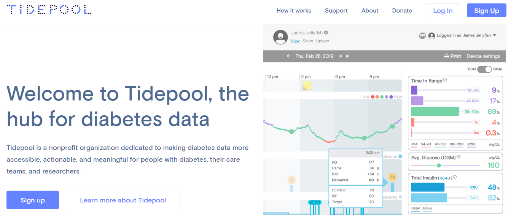

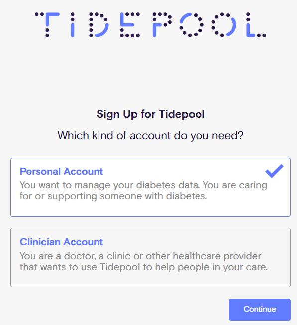

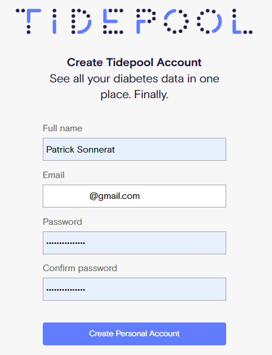

Tidepool invierà una mail di verifica. Se non arriva, controlla la cartella Spam.

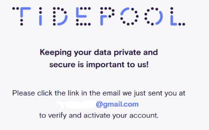

5. Nella mail, clicca **Verify Your Account**: si aprirà il browser alla finestra di login. Inserisci email e password per accedere.
6. Nella schermata successiva, rispondi che sei maggiorenne.

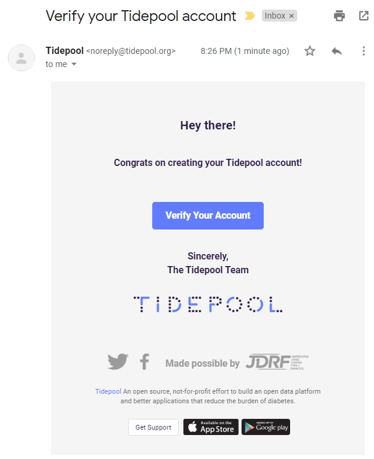

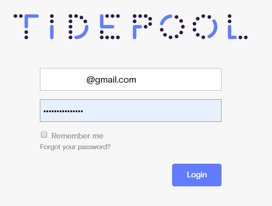

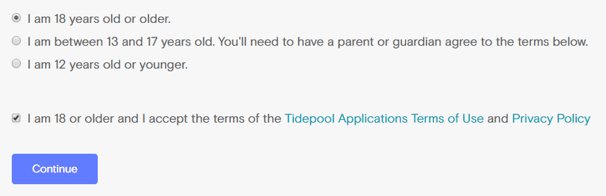

Ora crea una base dati per il paziente:

- **Per me:** sono diabetico
- **Per una persona diabetica assistita da me:** inserisci un identificativo (il diabetologo deve sapere di chi si tratta), data di nascita, tipo di diabete, data di diagnosi.
- (Opzionale) Puoi scegliere di donare i dati in modo anonimo al progetto Big Data di Tidepool.

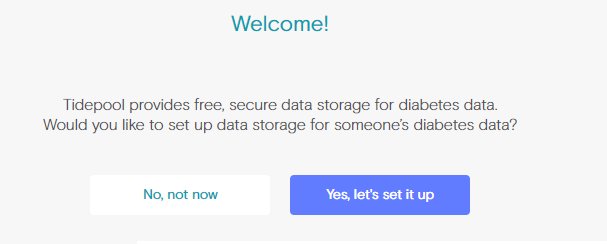

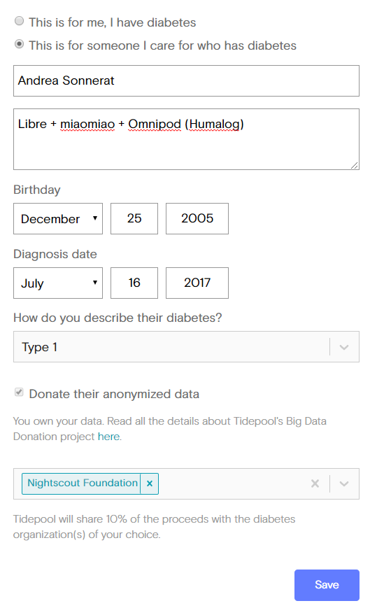

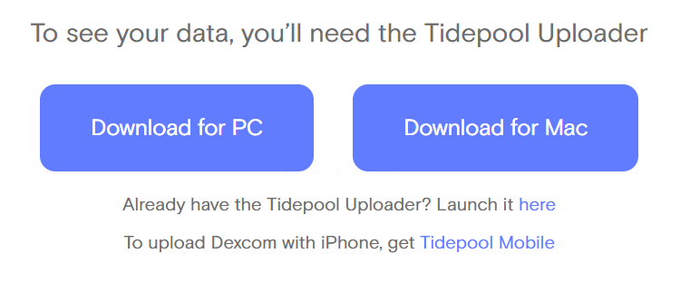

## 2. Configurare xDrip+

Per inviare glicemia e trattamenti a Tidepool, abilita l'integrazione in xDrip+. Puoi farlo dal master o da un xDrip+ Sync Follower, ma conviene abilitarlo su un solo dispositivo.

1. Vai in **Menu principale** → **Impostazioni** → **Cloud Upload** → **Tidepool**.

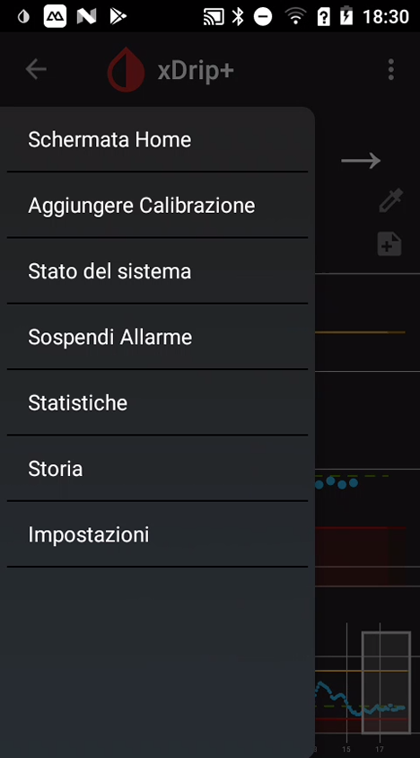

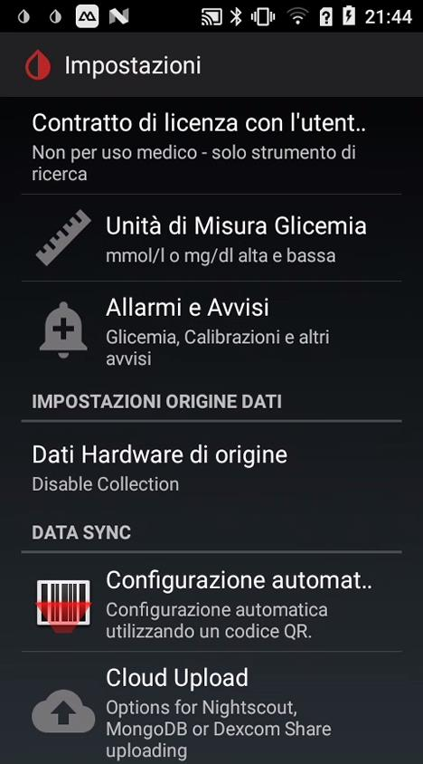

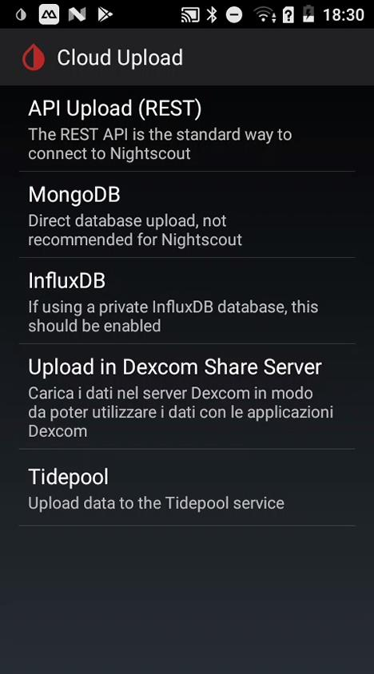

2. Abilita la sincronizzazione a Tidepool.
3. Inserisci la tua email e la password usate per creare l'utenza Tidepool.

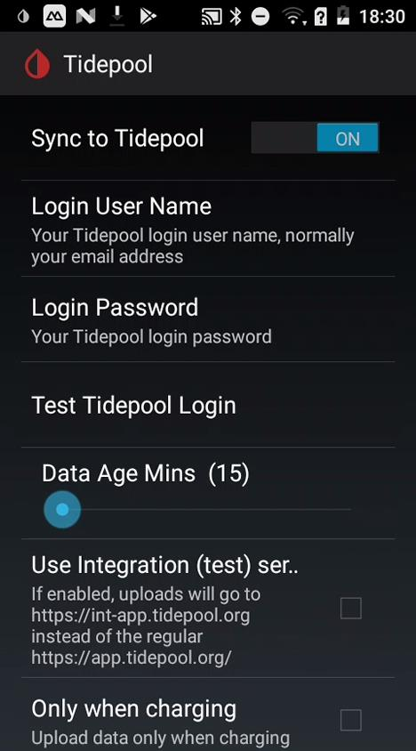

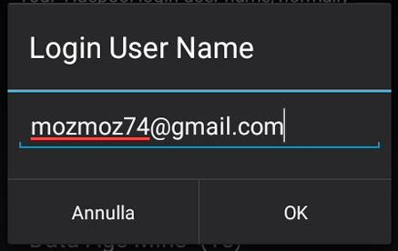

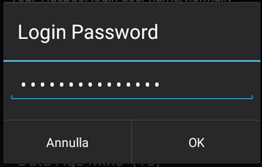

4. Verifica il funzionamento con **Test Tidepool Login**.

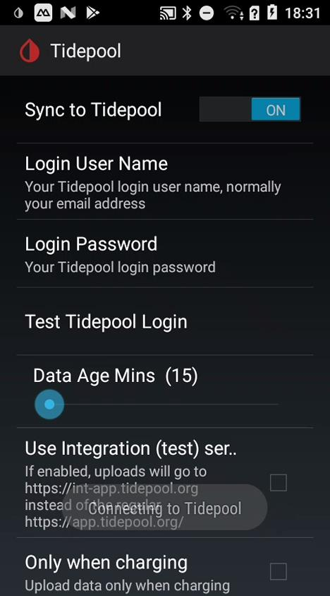

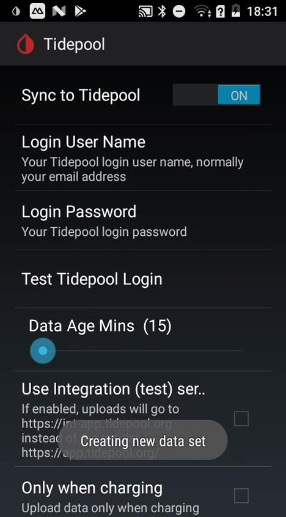

## 3. Condividere con il diabetologo

1. Torna in Tidepool dal tuo browser.
2. Clicca su **Share**.

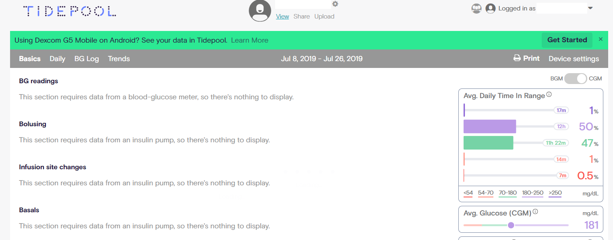

3. Clicca **Invite new member**.

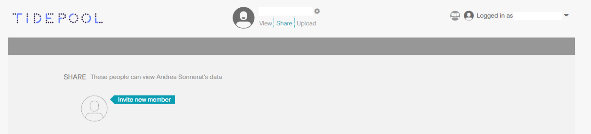

4. Inserisci l'indirizzo email di chi avrà diritto a vedere i dati.
5. Se vuoi anche che possano aggiungere altri dati (durante la visita diabetologica), seleziona anche **Allow uploading**.

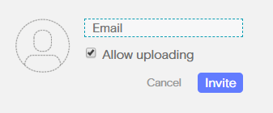

## 4. Caricare altri dati in Tidepool

Tidepool si interfaccia con moltissimi microinfusori e sensori. Puoi aggiungere dati dal tuo computer usando il **Tidepool Uploader**. Se il tuo diabetologo conosce Tidepool, lo farà probabilmente durante la visita diabetologica.

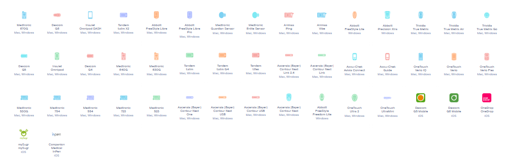

> ⚠️ **Attenzione**: Con versioni di xDrip+ precedenti al 7 febbraio 2020: se inserisci boli e CHO (carboidrati) sia in xDrip+ sia tramite il microinfusore, il risultato verrà raddoppiato in Tidepool. Con le versioni successive, abilita l'apposita opzione per non inviare i dati doppi a Tidepool.

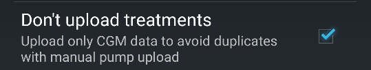

## Contatti

Patrick Sonnerat — glicemiadistanza@gmail.com
