# App Dexcom modificata – Installazione e funzionalità (G6, G7)

Questa guida spiega come creare e installare la versione modificata dell'app Dexcom sul telefono collegato al sensore G6 o G7 (master). Incluso anche come collegarla a xDrip per usare diversi smartwatch.

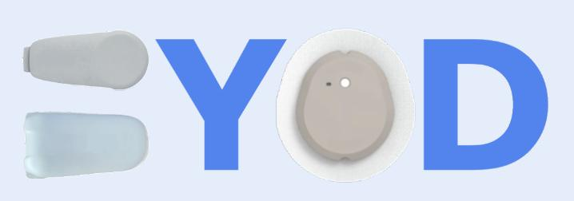

## 1. Che cos'è l'app Dexcom modificata?

È l'app Dexcom ufficiale con due piccole modifiche:
- Non controlla se il telefono è nella lista dei dispositivi compatibili ufficiali.
- Invia (broadcast) la glicemia internamente al telefono, in modo che xDrip possa riceverla.

> ⚠️ **Attenzione**: L'app modificata non è autorizzata da Dexcom. Usandola, potresti perdere il diritto al supporto e alla garanzia per problemi di trasmettitore e sensore. Se disponibile, basa sempre le segnalazioni di problemi sul ricevitore Dexcom ufficiale. L'utilizzo è a esclusiva responsabilità personale.

## 2. Perché installarla?

- Il telefono non è compatibile con l'app ufficiale (ricorda che la compatibilità non è garantita neanche con l'app modificata).
- Per ricevere la glicemia sullo smartwatch senza dipendere da internet o dai server Dexcom.
- Per continuare a ricevere letture su xDrip quando i server Dexcom non funzionano.

---

## 3. Disinstalla l'app Dexcom ufficiale

> ⚠️ **Attenzione**: **NON fare Stop sensore** se non vuoi cambiare il sensore adesso.

Prima di disinstallare, annota il **codice del trasmettitore**: lo trovi in **Impostazioni → Trasmettitore** nell'app Dexcom (voce **NS**).

Tocca l'icona a ingranaggio delle impostazioni:

Nella pagina **Trasmettitore**, il codice è alla voce **NS**:

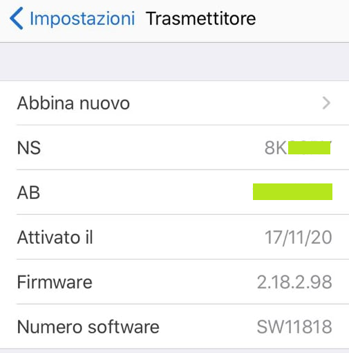

Per disinstallare senza interagire con il sensore, apri le **Impostazioni Android**:

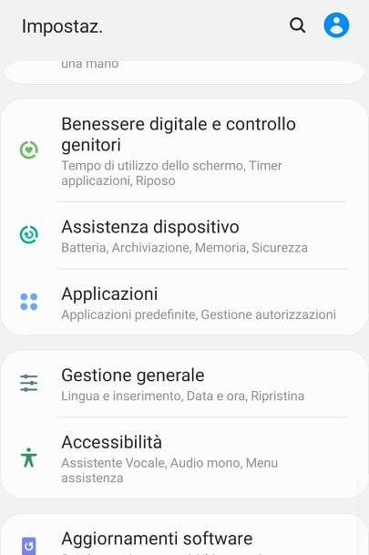

1. Vai in **Applicazioni** e cerca **Dexcom G6** (o G7):

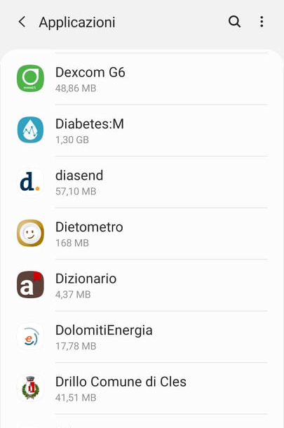

2. Entra nella pagina dell'app e tocca **Memoria archiviazione**:

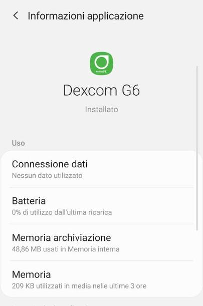

3. Premi **Svuota cache**, poi **Cancella dati**:

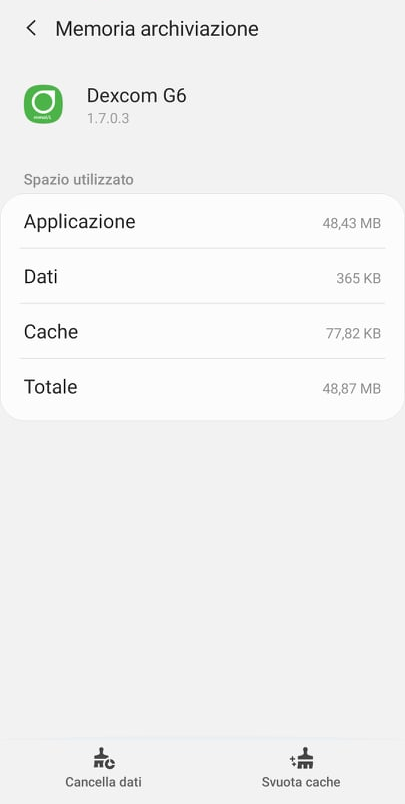

4. Torna alla pagina precedente e premi **Disinstalla**:

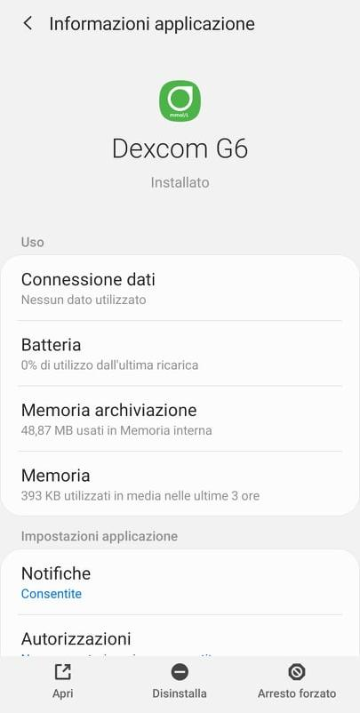

---

## 4. Crea la tua app Dexcom modificata

1. Vai sul modulo di richiesta:
   [`https://docs.google.com/forms/d/e/1FAIpQLScD76G0Y-BlL4tZljaFkjlwuqhT83QlFM5v6ZEfO7gCU98iJQ/viewform`](https://docs.google.com/forms/d/e/1FAIpQLScD76G0Y-BlL4tZljaFkjlwuqhT83QlFM5v6ZEfO7gCU98iJQ/viewform)

Inserisci il tuo indirizzo email (riceverai il link per scaricare l'app personalizzata) e conferma l'avvertimento d'uso (usi l'app a tuo rischio):

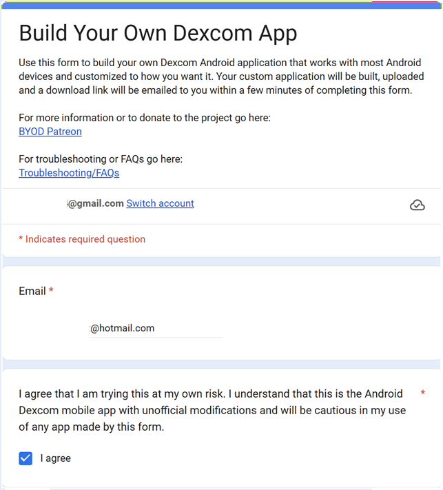

2. Indica quale prodotto usi:

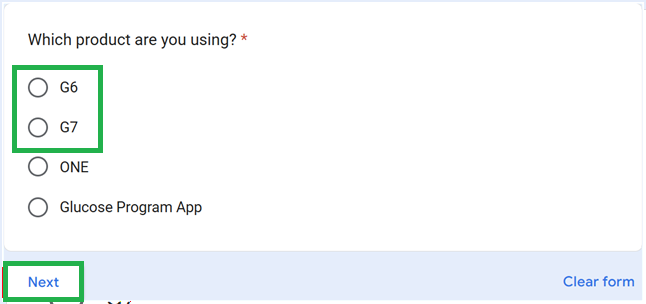

> ℹ️ **Nota**: Il modulo si adatta in base al prodotto scelto. Ad esempio, per **G6** ti verrà chiesta anche la versione di Android installata sul telefono (la trovi in **Impostazioni → Info telefono → Versione Android**):

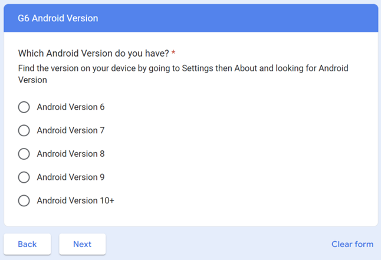

3. In base alle risposte precedenti, scegli la **versione dell'app** e l'**unità di misura** (mg/dL o mmol/L):

Per G6 su Android 10 o superiore, scegli tra versione International e US:

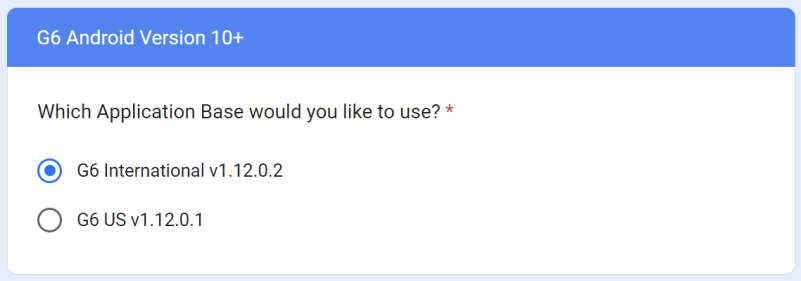

La domanda sul broadcast verso altre app — scegli l'ultima opzione (**both xDrip and Android APS**):

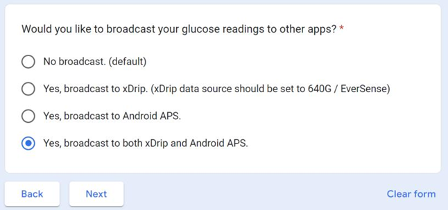

Se hai scelto la versione International, ti viene chiesta l'unità di misura preferita:

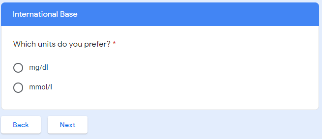

> ℹ️ **Nota**: Il modulo propone opzioni analoghe anche per **G7** — scegli il prodotto corretto al passo 2 e segui le domande che il modulo propone di conseguenza.

4. Configura le opzioni aggiuntive:

| Opzione | Valore consigliato |
|---|---|
| Durata vibrazione allarme | 1,5 secondi (default) |
| Consenti all'app di disattivare la modalità silenziosa | **Yes** (default) |
| Scorrimento della notifica come azione OK | **No** (default) |
| Riduci tempo di avviamento | **No** (sconsigliato) |
| Broadcast a xDrip / Android APS | **Yes, broadcast to both xDrip and Android APS** |

Le domande su vibrazione, modalità silenziosa e notifiche:

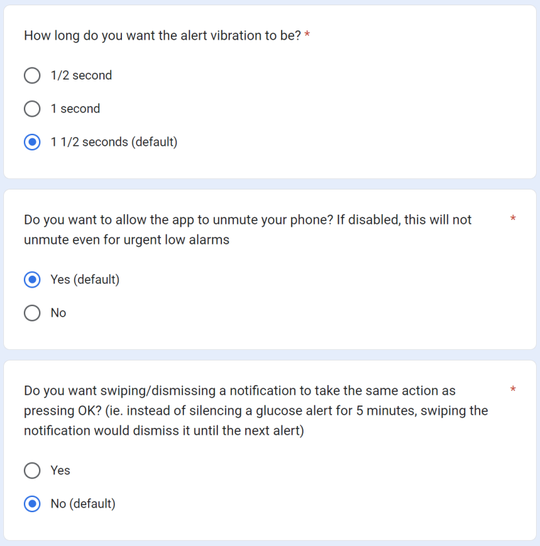

La domanda sulla riduzione del tempo di avviamento — lascia **No**:

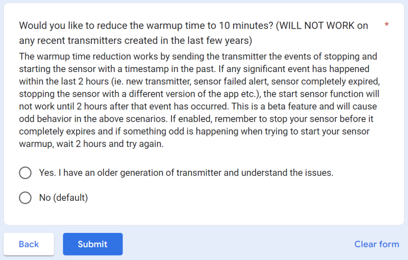

5. Premi **Submit** e aspetta la mail. Se non arriva entro 10 minuti, controlla la cartella Spam:

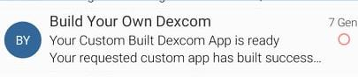

---

## 5. Installa l'app Dexcom modificata

1. Apri la mail ricevuta e leggi le istruzioni per l'installazione:

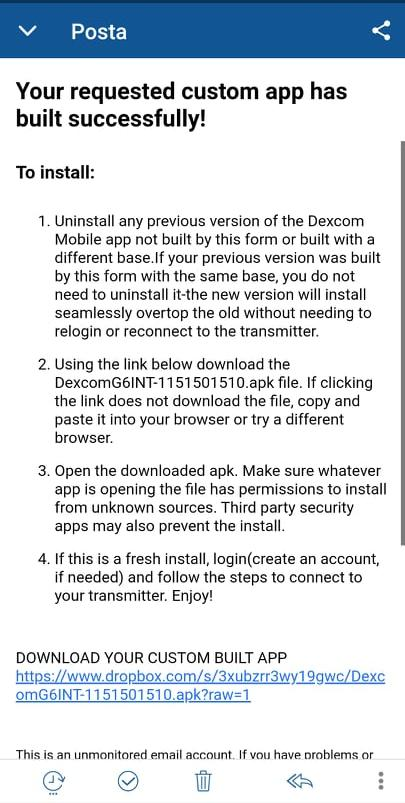

2. Tocca il link di download: se richiesto, apri il link con il **browser** (non con Dropbox):

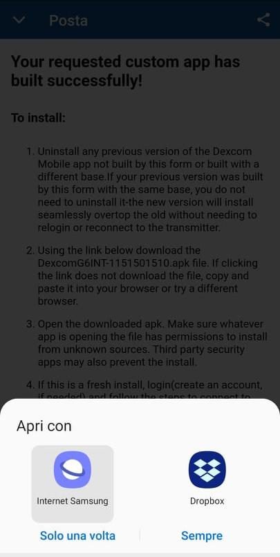

Nella pagina di Dropbox, premi **Scarica**:

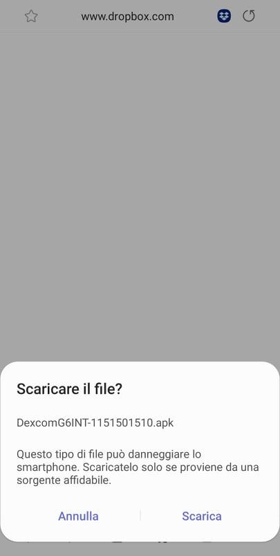

Il download comparirà nelle notifiche del telefono:

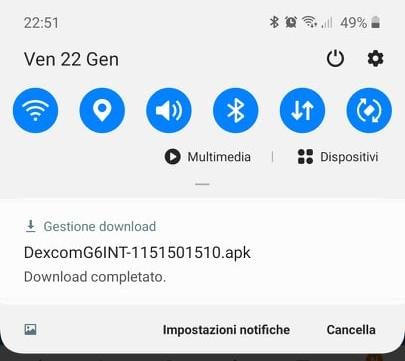

3. Vai nella cartella **Download** o controlla i **File recenti** e apri il file `.apk`:

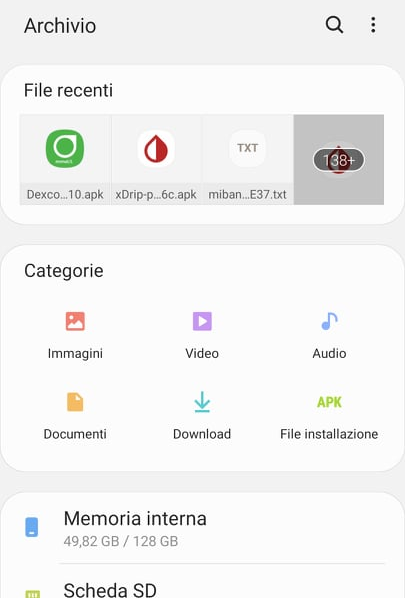

Lo trovi anche cercandolo direttamente per nome nel gestore file:

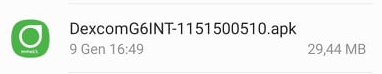

4. Autorizza l'installazione da sorgenti sconosciute se richiesto.
5. Conferma l'installazione: è identica all'app ufficiale.

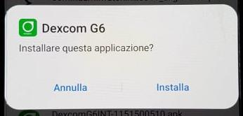

Attendi il messaggio di conferma:

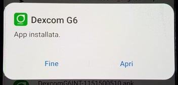

6. Apri l'app appena installata:

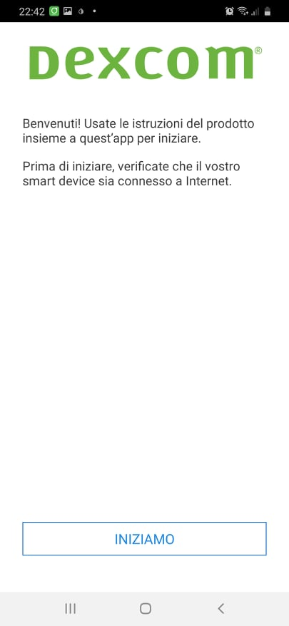

Accedi a **Clarity** con il tuo nome utente e password abituali.
   > ⚠️ **Attenzione**: Se ti registri per la prima volta, usa solo **lettere minuscole** nel nome utente.

La pagina di accesso all'account Dexcom:

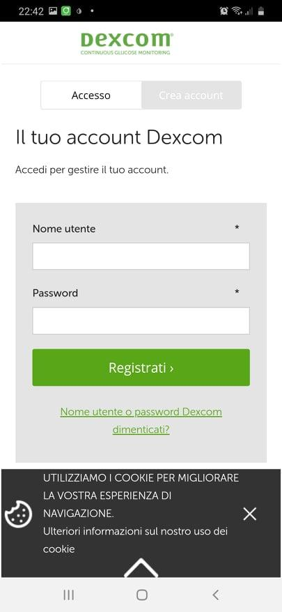

Inserisci nome utente e password e premi **Registrati**:

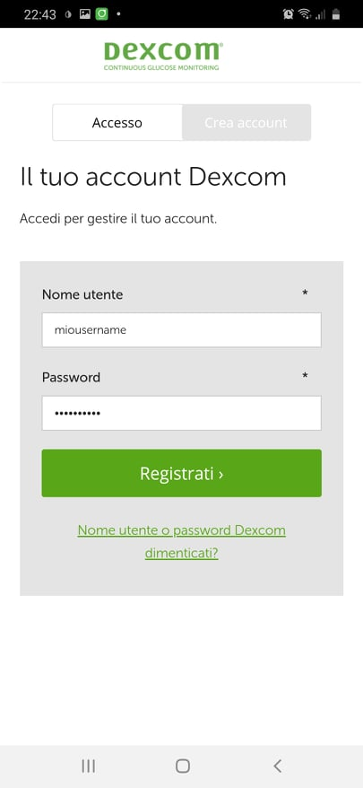

7. Segui la procedura guidata iniziale: un video di benvenuto...

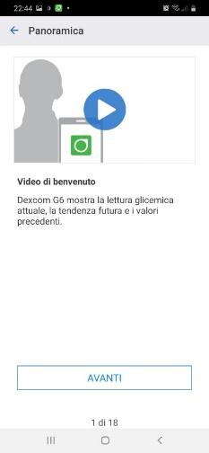

...informazioni sulle decisioni terapeutiche basate sul CGM...

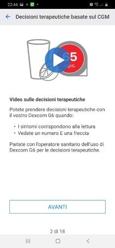

...e l'avviso di sicurezza sulla risonanza magnetica:

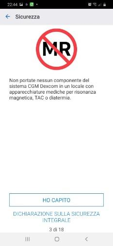

Se avevi un account con impostazioni salvate, l'app te le propone da importare (avvisi, condivisione, altezza del grafico)...

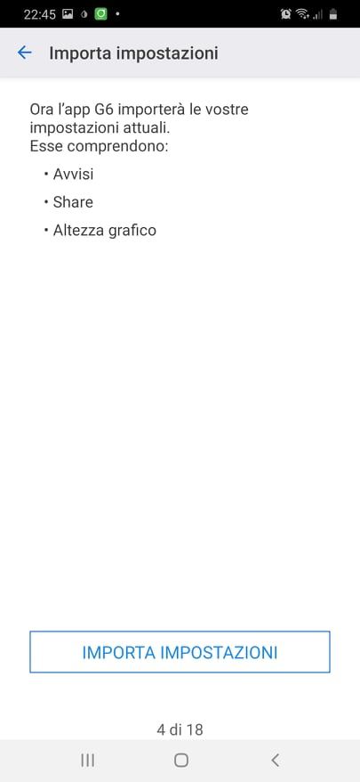

...e conferma l'importazione completata:

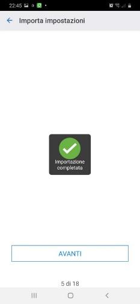

Seguono alcune schermate informative sulle novità di G6...

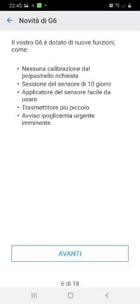

...sull'avviso di ipoglicemia urgente imminente...

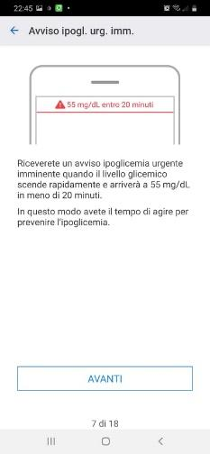

...sui suoni degli avvisi che non possono essere silenziati...

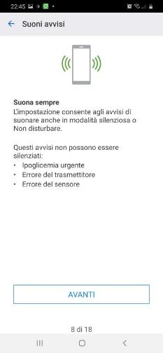

...e sulla modalità **Non disturbare** (per Android 7 e superiori):

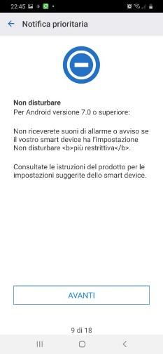

8. Se hai già un sensore avviato, seleziona **Codice assente** (per un sensore già in corso, non inserire un nuovo codice):

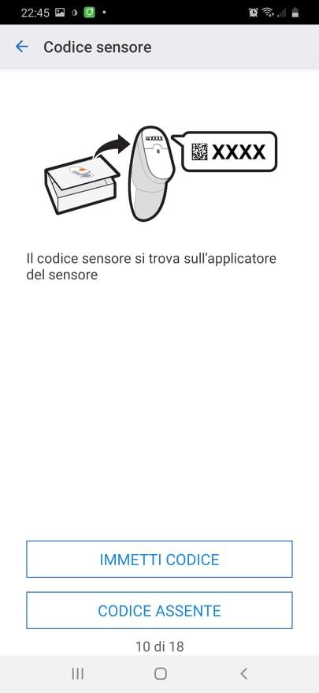

L'app spiega poi come funziona il trasmettitore...

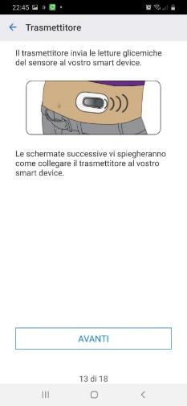

...e come si collega via Bluetooth allo smart device:

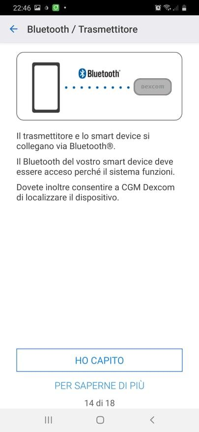

Segui le istruzioni per accendere il Bluetooth e concedere la geolocalizzazione **sempre**...

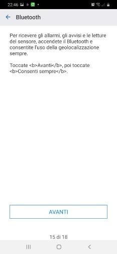

...fino a vedere la conferma **"Bluetooth acceso"**:

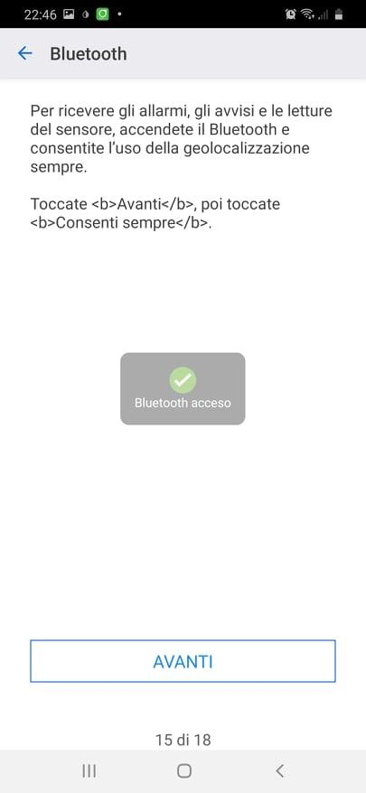

9. Inserisci il numero **NS del trasmettitore** annotato al passo 3 (fotografando la confezione oppure manualmente):

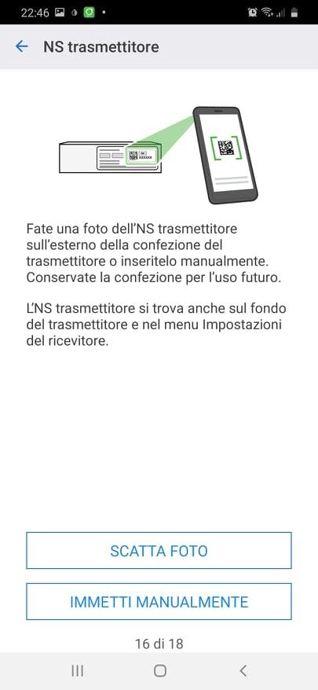

Se scegli l'inserimento manuale, compare questo campo:

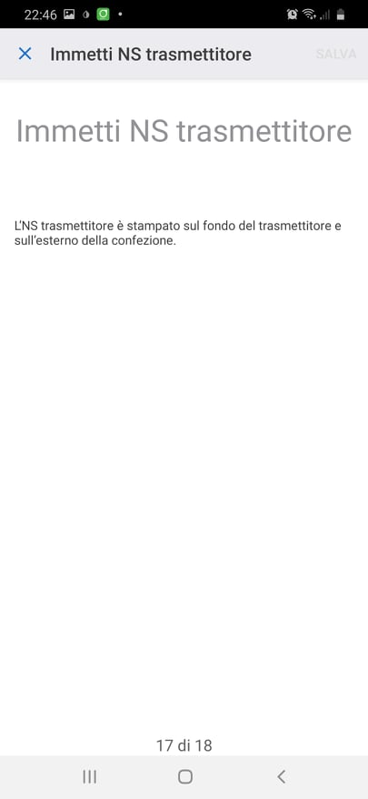

10. Se stai avviando un nuovo sensore, l'app ti guida nel posizionamento...

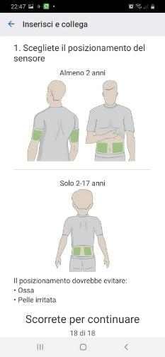

...e nell'inserimento del trasmettitore, con l'ultimo passaggio (strofinare il cerotto per farlo aderire):

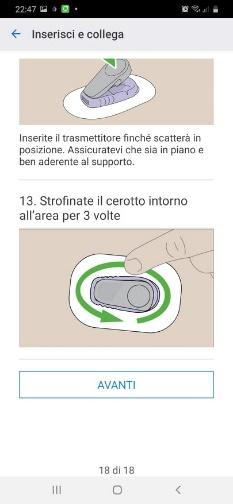

L'app chiede conferma prima di proseguire con la configurazione:

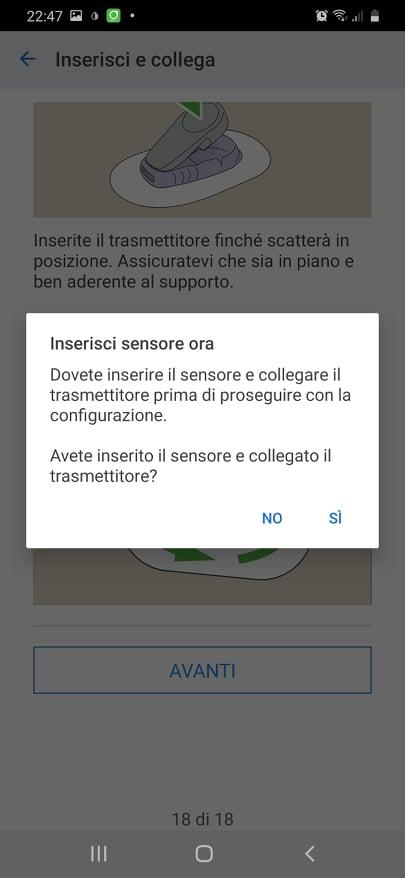

11. Entro qualche minuto la glicemia apparirà sullo schermo:

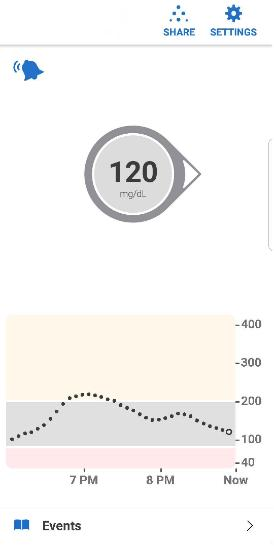

> ⚠️ **Attenzione**: Solo **un telefono alla volta** può essere collegato al sensore. Se un altro telefono è già collegato, spegnilo e aspetta 15 minuti prima di avviare quello nuovo.

---

## 6. Collega xDrip (opzionale)

Se vuoi ricevere la glicemia anche in xDrip (ad esempio per un smartwatch):

1. Segui la [guida base di installazione di xDrip](./installare-xdrip-android).
2. Come sorgente dati, scegli **640G / Eversense** — questo fa ricevere i dati direttamente dall'app modificata senza passare dal server Dexcom Share. Puoi farlo dalla configurazione guidata, oppure dal menu di xDrip, **Impostazioni**

...toccando **Dati Hardware di origine**...

... **640G / Eversense**...

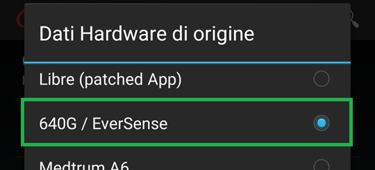

3. Quando xDrip chiede di inizializzare il sensore...

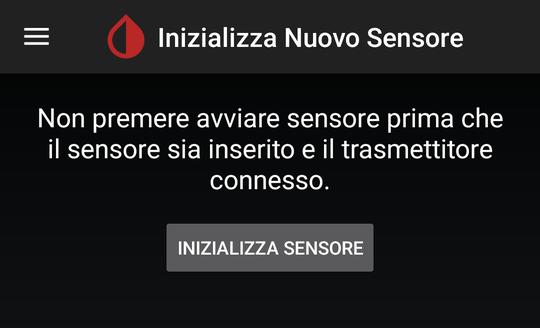

...scegli **Non oggi** (non è necessaria una vera inizializzazione con questa sorgente):

4. In xDrip, imposta questo telefono come **master** — così potrai usare un altro telefono come follower senza dipendere dai server Dexcom. Apri di nuovo il menu di xDrip...

...vai in **Impostazioni** e cerca **Impostazioni xDrip+ Sync**...

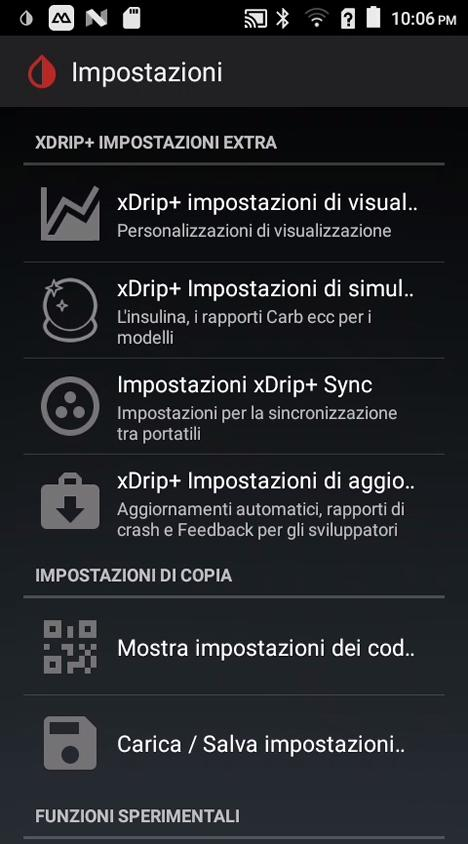

...e abilita **Imposta come Telefono Principale**:

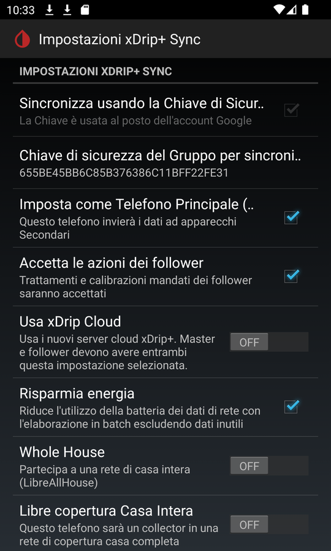

Per impostare un altro telefonino come follower, vedi la guida [xDrip Follower](./masterfollower.md).
