# Glicemia al polso con smartwatch Android Wear OS

Questa guida spiega come configurare uno smartwatch **Android Wear OS** (versioni 2 e 3) per visualizzare la glicemia ricevuta dall'app Dexcom (ufficiale o modificata), da xDrip+ o da Glimp.

La guida è stata realizzata con un Huawei Watch 2 LTE, ma i passaggi sono simili per qualsiasi smartwatch Wear OS (i nomi dei menu possono variare leggermente).

**Prerequisito:** sul telefono deve essere già installata e funzionante una di queste app: app Dexcom master (ufficiale o modificata), xDrip+, o Glimp.

---

## 1. Avvia lo smartwatch

Accendi lo smartwatch e aspetta la schermata **"Tap to begin"**. Tocca lo schermo, scegli la lingua italiana e accetta la licenza.

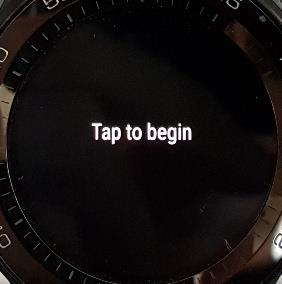

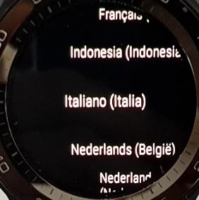

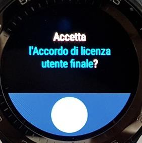

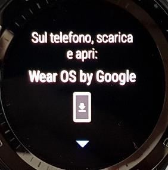

## 2. Abbina lo smartwatch al telefono

1. Installa l'app **Wear OS** dal Google Play Store del telefono.
2. Sul telefono, apri Wear OS e segui la procedura: **Avvia configurazione** → accetta i termini di servizio → eventualmente accetta il feedback per Google.

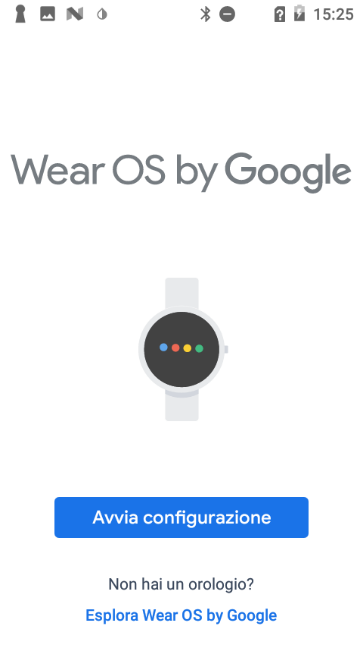

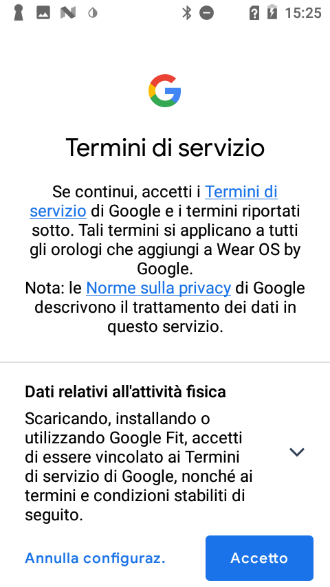

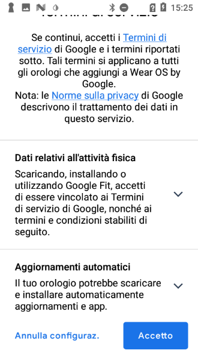

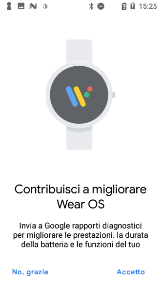

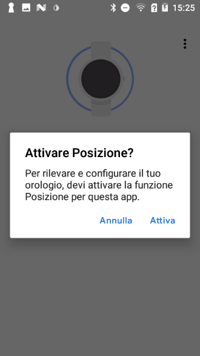

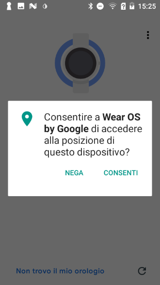

> ℹ️ La **posizione** è necessaria per xDrip+ e Glimp se vuoi usare lo smartwatch in modalità standalone (senza telefono) con MiaoMiao, Bubble o Blucon.

3. Wear OS cerca lo smartwatch: selezionalo quando viene trovato e autorizza l'abbinamento.

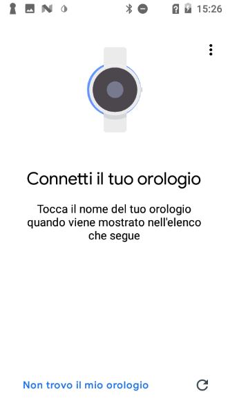

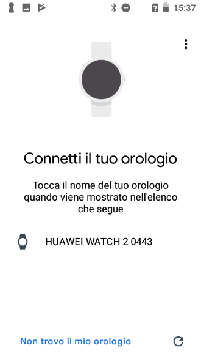

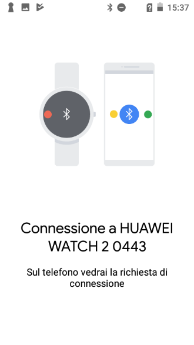

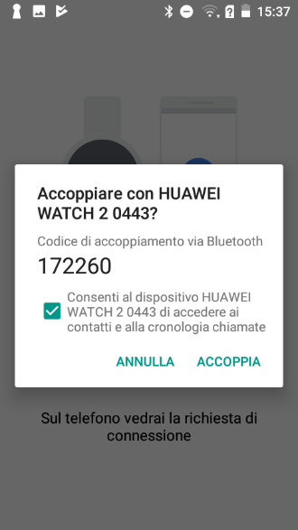

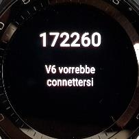

4. Wear OS sincronizza i dati: può richiedere qualche minuto.
5. Sincronizza l'account Google quando richiesto.

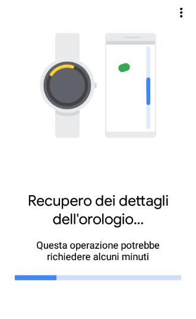

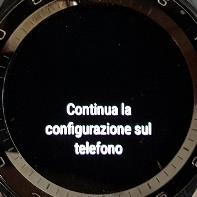

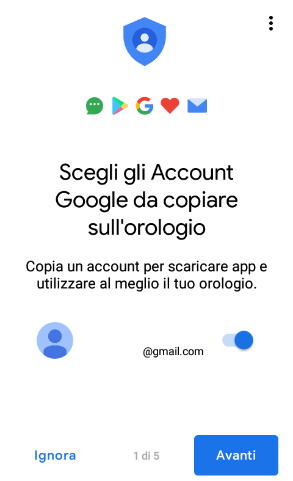

6. Nelle schermate successive, accetta i permessi per le app che intendi usare (o scegli **Ignora** per saltare).

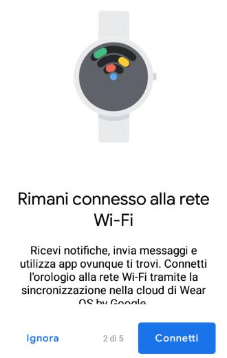

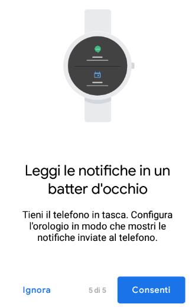

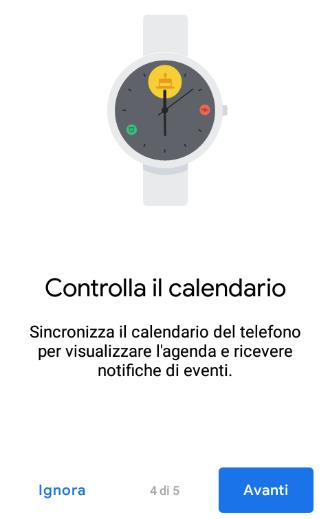

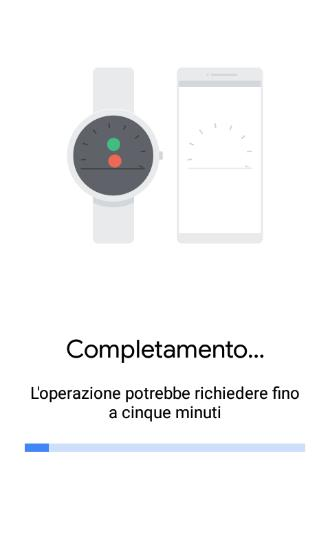

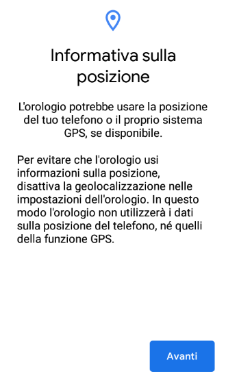

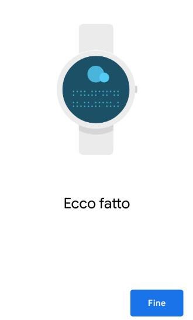

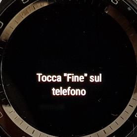

7. Seleziona **Non ottimizzare la batteria** se vuoi usare lo smartwatch per leggere direttamente un sensore, poi scegli **Resta connesso** e conferma.

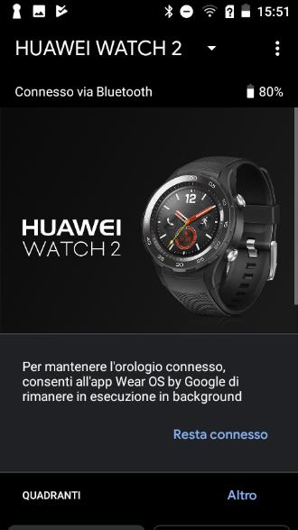

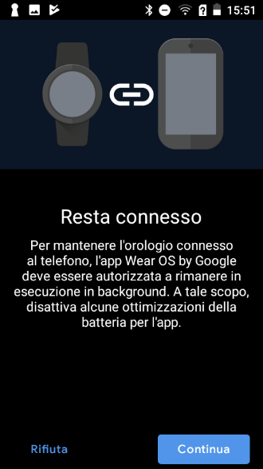

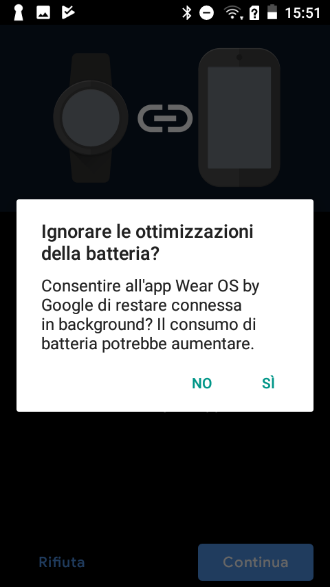

---

## 3. Installa l'app sullo smartwatch

### Metodo 1: Play Store dello smartwatch (il più semplice)

1. Apri il **Play Store** sullo smartwatch.

2. Scorri verso il basso fino a **App sul telefono**.

3. Se la vedi, cerca l'app che ti interessa (xDrip+, Dexcom, Glimp) e premi l'icona di download.

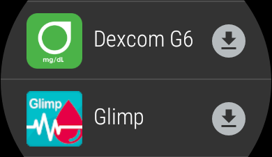

4. Aspetta l'installazione: l'app apparirà nella lista dei quadranti disponibili (vedi passo 4).

**Se non vedi "App sul telefono":**
1. Disabilita l'aggiornamento automatico delle app nel Google Play Store del telefono.

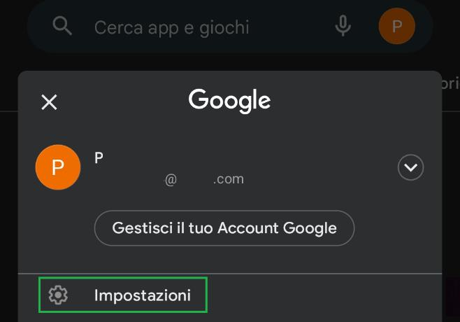

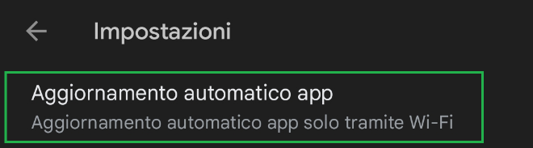

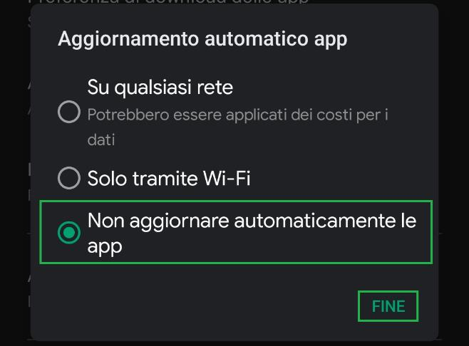

2. Riporta il Play Store dello smartwatch alla versione di fabbrica (Impostazioni → App → Play Store → Disinstalla aggiornamenti). Se non c'è questa opzione, passa al Metodo 2.

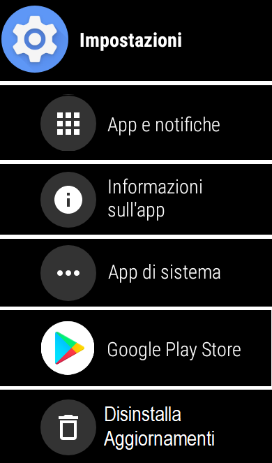

3. Disaccoppia e riaccoppia lo smartwatch in Wear OS, poi riprova dal punto 1.

Se preferisci non seguire questa procedura, usa il Metodo 2.

### Metodo 2: Wear Installer 2

1. Nel Play Store del telefono, installa **Wear Installer 2** (di Malcolm Bryant). Apri l'app e concedi l'accesso alla memoria.

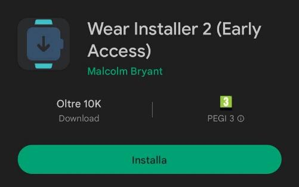

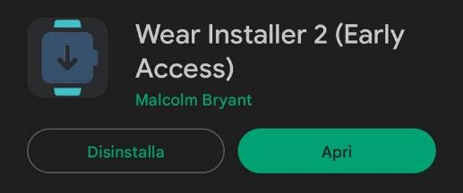

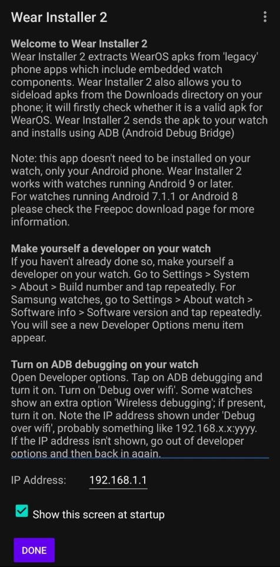

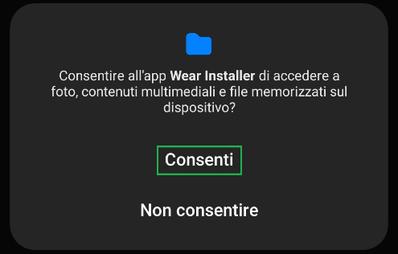

2. **Metti lo smartwatch in modalità sviluppatore:**
   - Vai in **Impostazioni → Sistema → Informazioni**.
   - Tocca ripetutamente il **numero di build** finché non compare il messaggio "Sei sviluppatore".

3. **Abilita il debug Android** nelle **Opzioni sviluppatore** dello smartwatch.

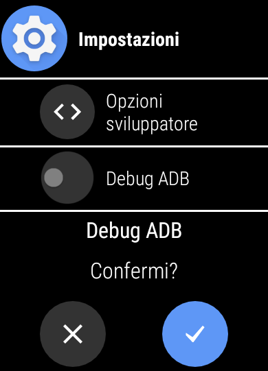

4. **Abilita il debug tramite Wi-Fi**: nelle stesse Opzioni sviluppatore, attiva il debug wireless. Aspetta che compaia un **indirizzo IP** (del tipo `192.168.x.x`) e annotalo (solo i numeri, senza i due punti e il numero dopo).

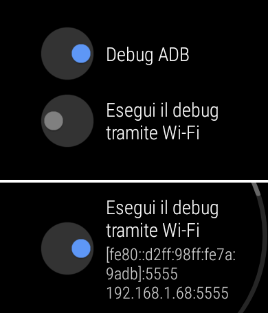

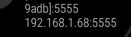

5. In **Wear Installer** sul telefono, inserisci l'indirizzo IP dello smartwatch e premi **Done**.

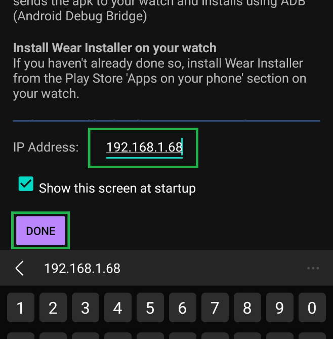

6. Seleziona l'app da installare sullo smartwatch. L'app deve avere un componente Wear OS: se non ce l'ha, non comparirà o non funzionerà (ad esempio, l'app Dexcom follower non ha un componente Wear).

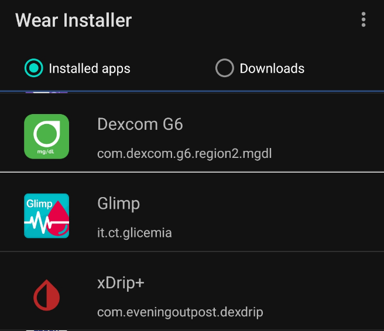

7. Wear Installer estrae il componente Wear e avvia l'installazione. Quando sullo smartwatch compare la richiesta di **autorizzare il debug**, confermala. Se non riesci a vederla, chiudi Wear Installer sul telefono e riprova.

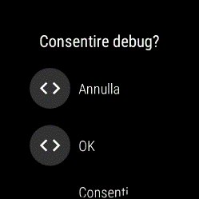

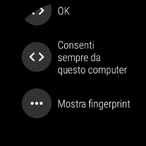

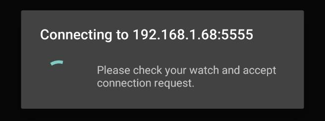

8. Aspetta il completamento (massimo qualche minuto) e premi **Finish**.

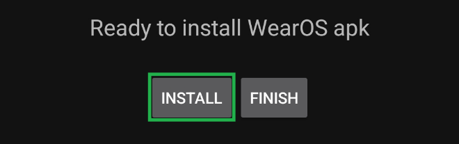

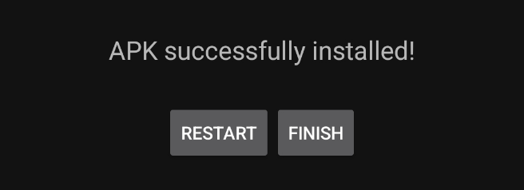

9. L'app comparirà nella lista delle app dello smartwatch e nella lista dei quadranti.

---

## 4. Scegli il quadrante con la glicemia

- Tieni premuto il quadrante attuale dello smartwatch.
- Scorri in fondo alla lista e scegli **Scopri altri quadranti** (oppure imposta il quadrante dall'app Wear OS sul telefono).
- Seleziona il quadrante dell'app installata (Dexcom, xDrip+, Glimp, AAPS).

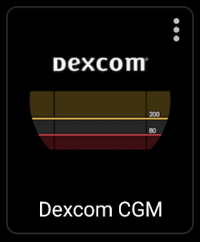

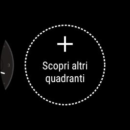

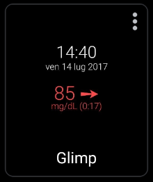

**Personalizzare con complicazione:**
Se il tuo smartwatch lo supporta, puoi aggiungere la glicemia come complicazione su un quadrante personalizzabile:
1. Scegli un quadrante con elementi personalizzabili.
2. Premi a lungo il quadrante → **Personalizza**.
3. Tocca l'elemento da cambiare e seleziona l'app sorgente (Dexcom, xDrip+, …).

> ℹ️ Non tutte le app supportano le complicazioni Wear OS.
