# Glicemia al polso con smartwatch Android Wear OS

Questa guida spiega come configurare uno smartwatch **Android Wear OS** (versioni 2 e 3) per visualizzare la glicemia ricevuta dall'app Dexcom (ufficiale o modificata) o da xDrip.

ℹ️ **Nota**: Non è possibile usare quadranti attivi con Wear OS 5 e superiore. Vedi [GlucoDataHandler](../glucodatahandler/glucodatahandler.md).

La guida è stata realizzata con un Huawei Watch 2 LTE, ma i passaggi sono simili per qualsiasi smartwatch Wear OS 2 o 3 (i nomi dei menu possono variare leggermente).

**Prerequisito:** sul telefono deve essere già installata e funzionante una di queste app: app Dexcom master (ufficiale o modificata) o xDrip.

---

## 1. Avvia lo smartwatch

Accendi lo smartwatch e aspetta la schermata **"Tap to begin"**: tocca lo schermo per iniziare.

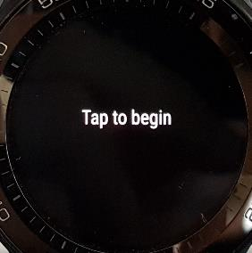

Scegli la lingua italiana:

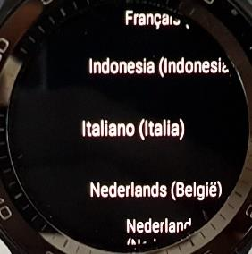

Accetta l'accordo di licenza con l'utente finale:

Lo smartwatch ti chiederà di scaricare e aprire **Wear OS by Google** sul telefono:

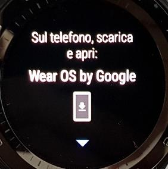

## 2. Abbina lo smartwatch al telefono

1. Installa l'app **Wear OS** dal Google Play Store del telefono.
2. Sul telefono, apri Wear OS e tocca **Avvia configurazione**:

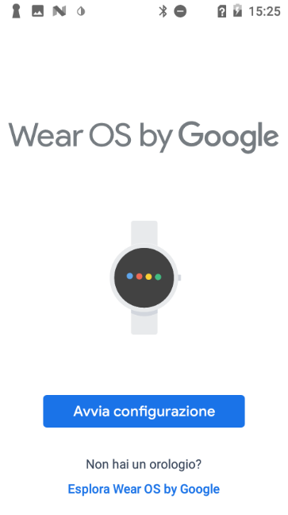

Accetta i **Termini di servizio**:

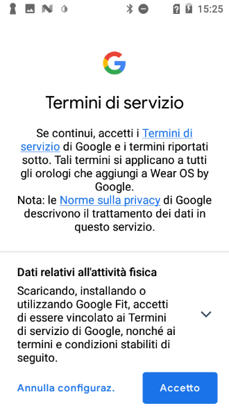

Scorri per leggere anche la sezione sugli aggiornamenti automatici:

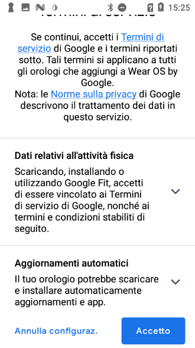

Scegli se contribuire al miglioramento di Wear OS:

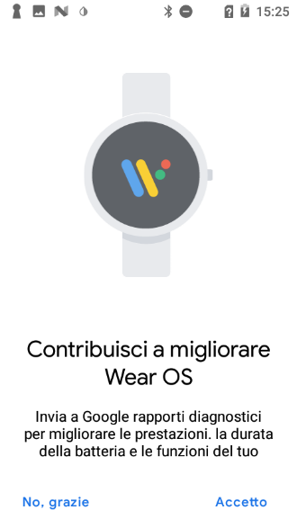

Attiva la posizione quando richiesto:

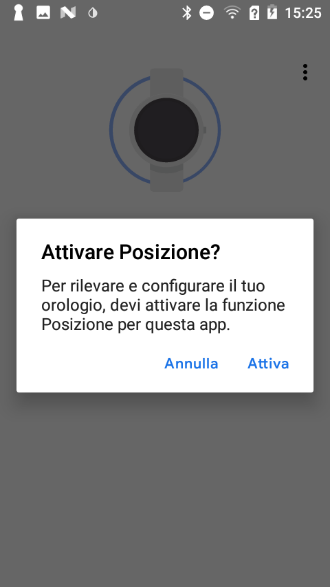

Consenti a Wear OS di accedere alla posizione:

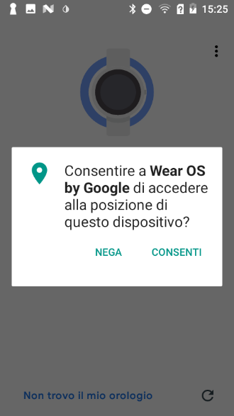

> ℹ️ **Nota**: La **posizione** è necessaria per xDrip se vuoi usare lo smartwatch in modalità standalone (senza telefono) con MiaoMiao, Bubble o Blucon.

3. Wear OS cerca lo smartwatch nelle vicinanze:

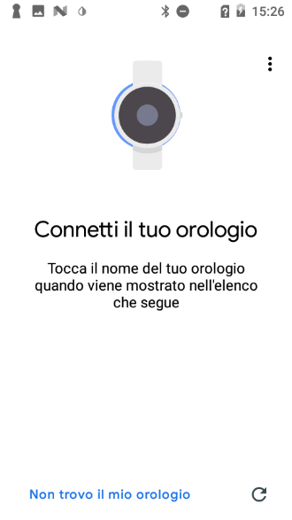

Quando lo trova, lo smartwatch compare nell'elenco (in questo esempio "HUAWEI WATCH 2 0443"): selezionalo:

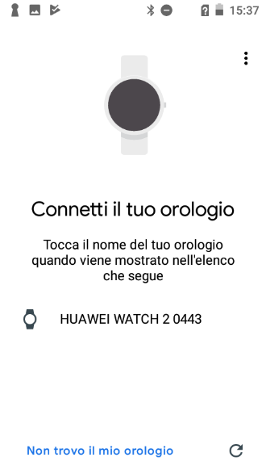

Il telefono si connette allo smartwatch via Bluetooth:

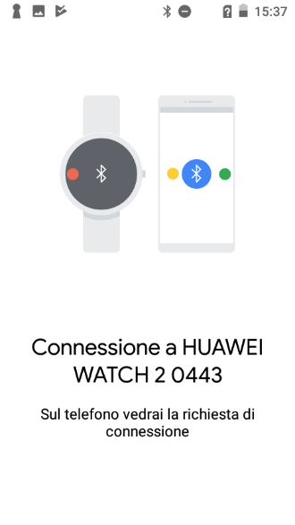

Conferma l'abbinamento verificando che il codice mostrato sia lo stesso su entrambi i dispositivi:

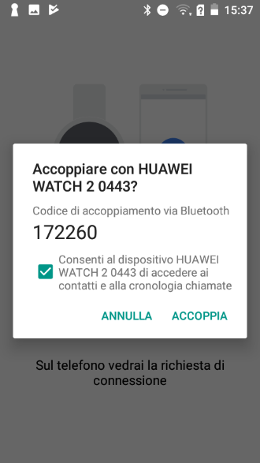

Sullo smartwatch comparirà la stessa richiesta di connessione:

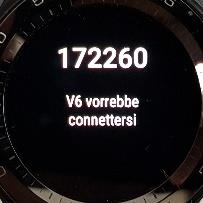

4. Wear OS recupera i dettagli dell'orologio: può richiedere qualche minuto.

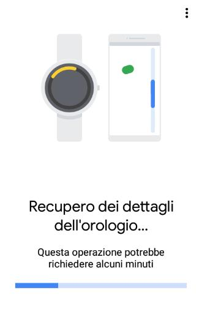

Nel frattempo lo smartwatch ti chiede di continuare la configurazione dal telefono:

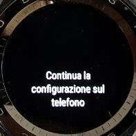

5. Scegli quali account Google copiare sull'orologio:

6. Nelle schermate successive, accetta i permessi per le app che intendi usare (o scegli **Ignora** per saltare). Il telefono mostra una serie di schermate informative numerate.

Schermata 2 di 5 — connessione alla rete Wi-Fi:

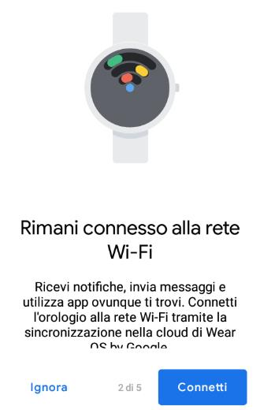

Schermata 3 di 5 — chiamate, contatti e messaggi:

Schermata 4 di 5 — sincronizzazione del calendario:

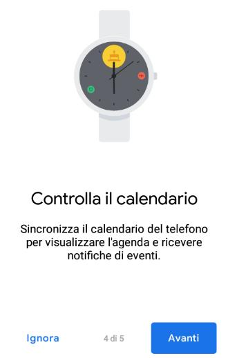

Schermata 5 di 5 — notifiche del telefono sull'orologio:

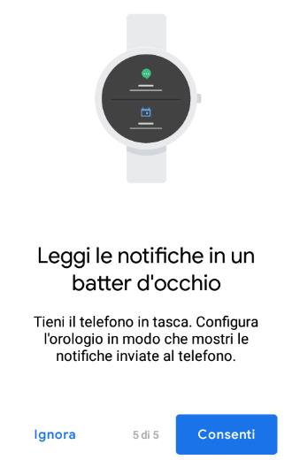

Al termine, il telefono completa la configurazione:

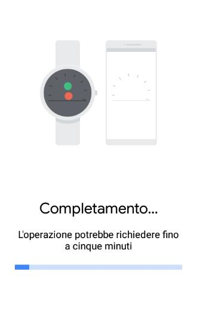

Leggi l'informativa sulla posizione e tocca **Avanti**:

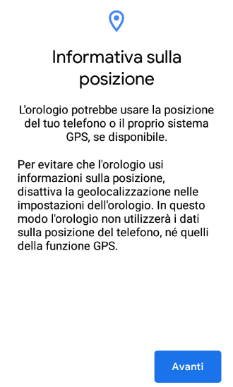

Tocca **Fine** per concludere l'abbinamento:

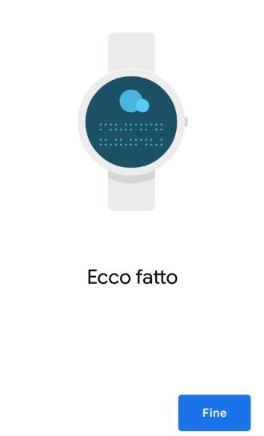

Sullo smartwatch comparirà la conferma di tornare al telefono:

7. Il telefono mostra la schermata principale dell'app Wear OS, con un promemoria per restare connessi allo smartwatch: tocca **Resta connesso**

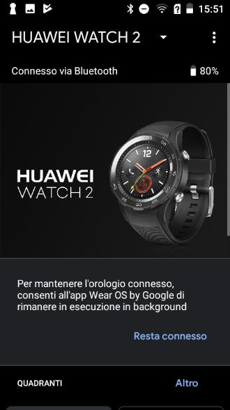

Tocca **Continua** per restare connesso:

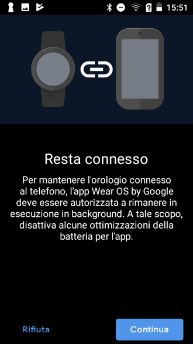

Se compare la richiesta di ignorare le ottimizzazioni della batteria, seleziona **SI** (non ottimizzare), così lo smartwatch resterà sempre connesso:

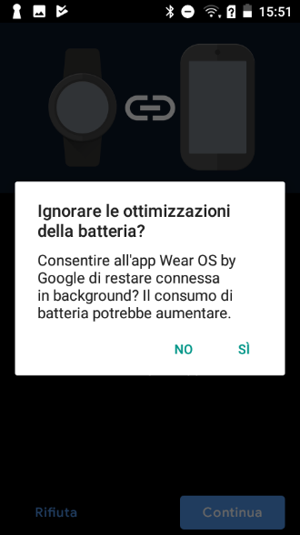

---

## 3. Installa l'app sullo smartwatch

### Metodo 1: Play Store dello smartwatch (il più semplice)

1. Apri il **Play Store** sullo smartwatch.

2. Scorri verso il basso fino a **App sul telefono**.

3. Se la vedi, cerca l'app che ti interessa (xDrip o Dexcom) e premi l'icona di download. In questo esempio compare Dexcom G6:

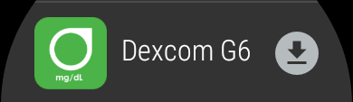

Oppure xDrip+:

4. Aspetta l'installazione: l'app apparirà nella lista dei quadranti disponibili (vedi passo 4).

**Se non vedi "App sul telefono":**
1. Disabilita l'aggiornamento automatico delle app nel Google Play Store del telefono: apri il pannello dell'account e tocca **Impostazioni**:

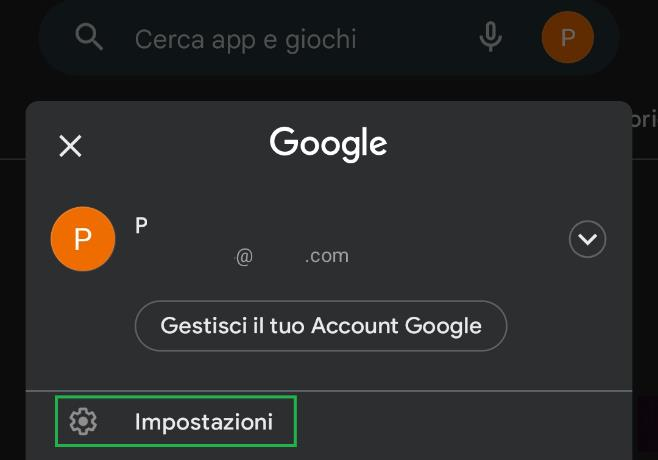

Vai su **Aggiornamento automatico app**:

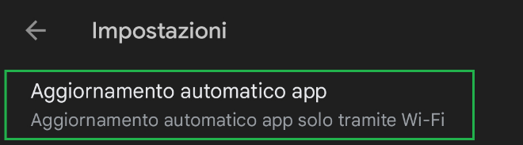

Seleziona **Non aggiornare automaticamente le app** e conferma con **FINE**:

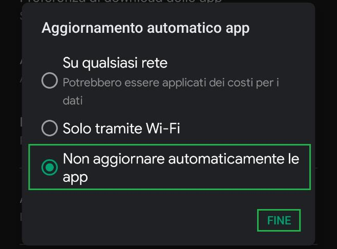

2. poi vai in **Impostazioni → App e notifiche → Informazioni sull'app → App di sistema → Google Play Store** e tocca **Disinstalla Aggiornamenti**. Se non c'è questa opzione, passa al Metodo 2.

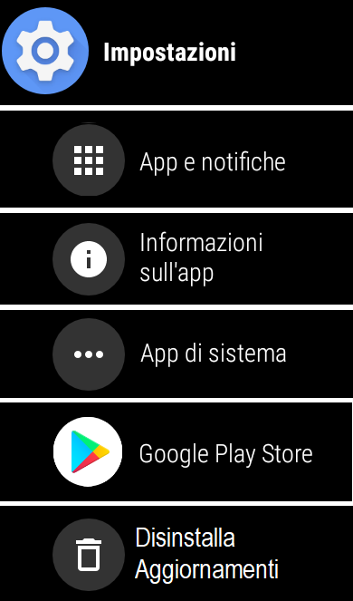

3. Disaccoppia e riaccoppia lo smartwatch in Wear OS, poi riprova dal punto 1.

Se preferisci non seguire questa procedura, usa il Metodo 2.

### Metodo 2: Wear Installer 2

1. Nel Play Store del telefono, installa **[Wear Installer 2](https://play.google.com/store/apps/details?id=org.freepoc.wearinstaller2)** (di Malcolm Bryant):

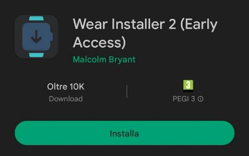

A installazione completata, apri l'app:

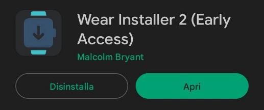

Leggi le istruzioni iniziali:

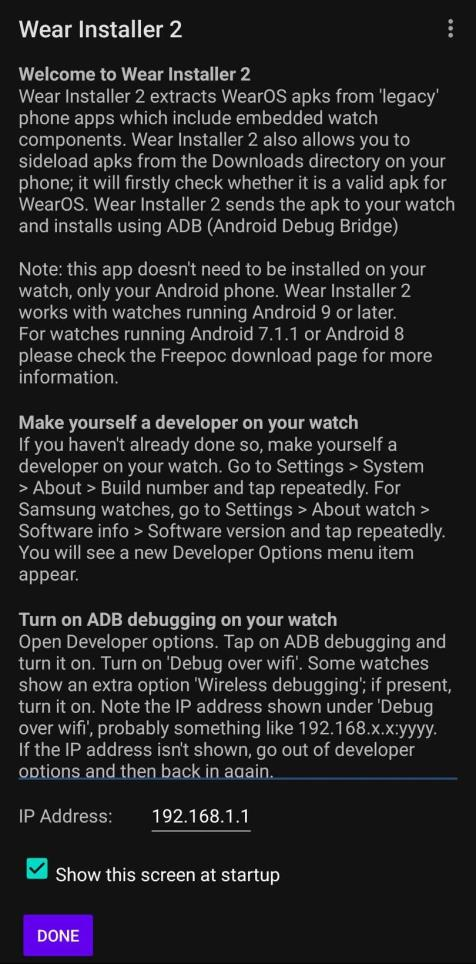

Concedi l'accesso a foto, contenuti multimediali e file quando richiesto:

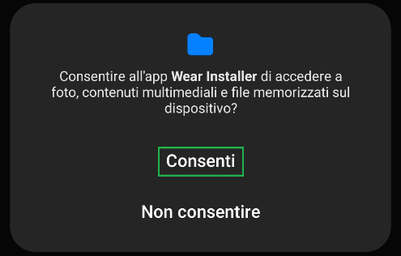

2. **Metti lo smartwatch in modalità sviluppatore:**
   - Vai in **Impostazioni → Sistema → Informazioni**.
   - Tocca ripetutamente il **numero di build** finché non compare il messaggio "Sei sviluppatore".

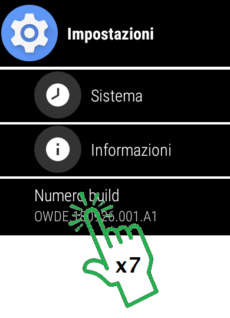

3. **Abilita il debug Android** nelle **Opzioni sviluppatore** dello smartwatch e conferma quando richiesto:

4. **Abilita il debug tramite Wi-Fi**: nelle stesse Opzioni sviluppatore, attiva sia **Debug ADB** sia **Esegui il debug tramite Wi-Fi**. Aspetta che compaia un **indirizzo IP** (del tipo `192.168.x.x:yyyy`) e annotalo (solo i numeri, senza i due punti e il numero dopo):

Questo indirizzo, per esempio 192.168.1.68:

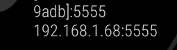

5. In **Wear Installer** sul telefono, inserisci l'indirizzo IP dello smartwatch e premi **DONE**:

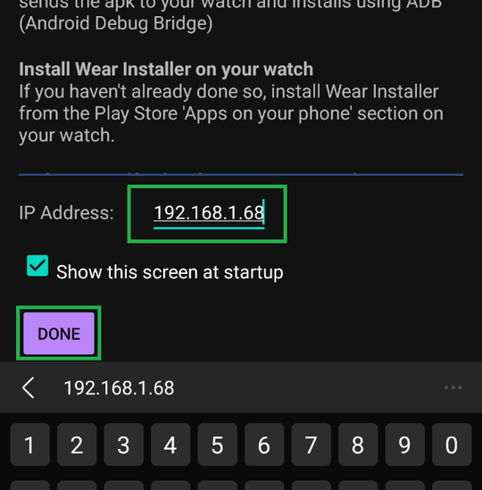

6. Seleziona l'app da installare sullo smartwatch. La scheda **Installed apps** di Wear Installer mostra le app già presenti sullo smartwatch (in questo esempio Dexcom G6 e xDrip+): l'app deve avere un componente Wear OS, altrimenti non comparirà o non funzionerà (ad esempio, l'app Dexcom follower non ha un componente Wear).

7. Wear Installer estrae il componente Wear e avvia l'installazione. Sul telefono comparirà un messaggio di connessione, con la richiesta di controllare lo smartwatch:

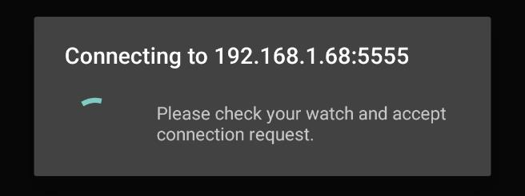

Quando sullo smartwatch compare la richiesta di **autorizzare il debug**, confermala con **OK**:

Se vuoi evitare di riconfermarla ogni volta, scegli **Consenti sempre da questo computer**. Se non riesci a vedere queste schermate, chiudi Wear Installer sul telefono e riprova.

8. Tocca **INSTALL** per avviare il trasferimento dell'app sullo smartwatch:

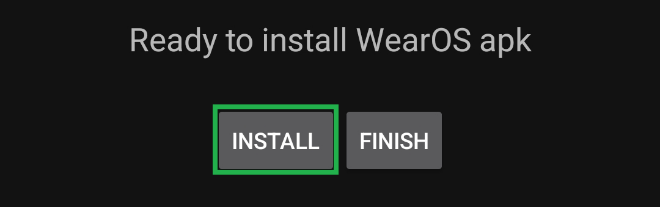

Aspetta il completamento (massimo qualche minuto): comparirà il messaggio **"APK successfully installed!"**. Premi **Finish**.

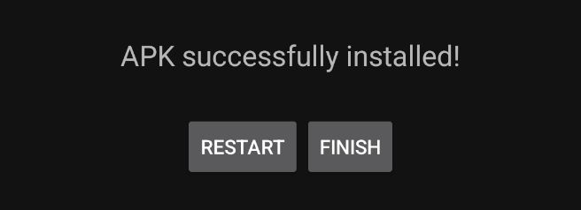

9. L'app comparirà nella lista delle app dello smartwatch e nella lista dei quadranti.

---

## 4. Scegli il quadrante con la glicemia

- Tieni premuto il quadrante attuale dello smartwatch.
- Scorri in fondo alla lista e scegli **Scopri altri quadranti** (oppure imposta il quadrante dall'app Wear OS sul telefono):

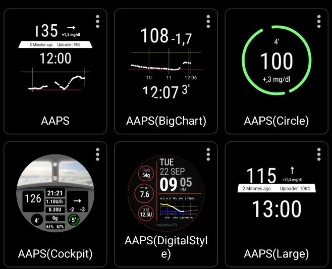

- Seleziona il quadrante dell'app installata. Tra i risultati trovi ad esempio il quadrante dedicato **Dexcom CGM**:

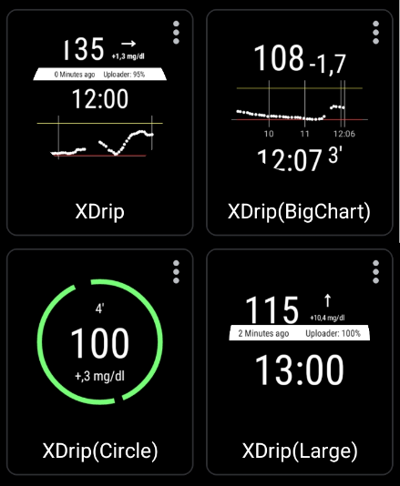

I quadranti di xDrip sono disponibili in più varianti grafiche (semplice, grafico esteso, cerchio, formato grande):

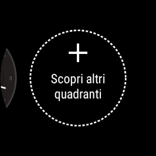

Anche AAPS offre più varianti di quadrante, incluse quelle con dettagli su carboidrati, IOB e cockpit completo (versioni fino a 3.3):

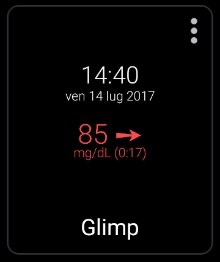

Una volta scelto e applicato, il quadrante mostrerà la glicemia direttamente al polso:

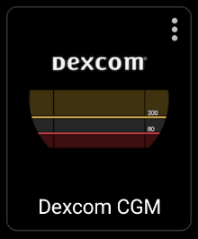

**Personalizzare con complicazione:**
Se il tuo smartwatch lo supporta, puoi aggiungere la glicemia come complicazione su un quadrante personalizzabile:
1. Scegli un quadrante con elementi personalizzabili e tocca l'icona a forma di ingranaggio.
2. Vai su **Dati**.
3. Tocca l'elemento da cambiare e seleziona l'app sorgente (Dexcom, xDrip, …).

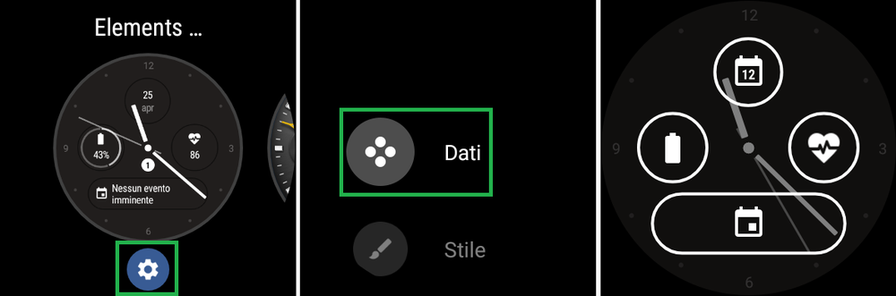

> ℹ️ **Nota**: Non tutte le app supportano le complicazioni Wear OS.
