# Dexcom G5 / G6 / ONE con xDrip+

Questa guida spiega come installare e configurare xDrip+ per leggere i dati da un sensore Dexcom G5 o G6 (o ONE) direttamente con Android, senza passare dall'app ufficiale.

> ⚠️ **Attenzione**: Usando xDrip+ con il sensore collegato direttamente non è possibile caricare i dati su Clarity. Se hai bisogno di Clarity, usa il lettore Dexcom fisico e carica i dati manualmente da computer, oppure usa Nightscout o Tidepool.

**Requisiti:** telefono Android 5 o successivo con Bluetooth 4.2 (BLE).

> ℹ️ **Nota**: Per usare **contemporaneamente** sia l'app Dexcom ufficiale che xDrip+ sullo stesso telefono, la soluzione più semplice è usare xDrip+ in modalità [compagno (Companion)](./dexcom-g6-compagna-di-xdrip), oppure collegarlo al secondo slot del trasmettitore (descritta in questa guida, ma non disponibile con microinfusori Tandem collegati).

---

## 1. Installa xDrip+

Segui la [guida base di installazione](./installare-xdrip-android).

### Selezione della sorgente dati

Quando xDrip+ chiede la sorgente dati, scegli **Dexcom G5/G6/G7** e poi il tuo sensore specifico. Conferma cliccando su **Yes**.

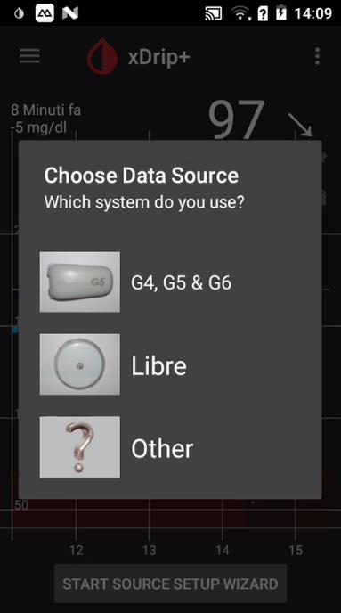

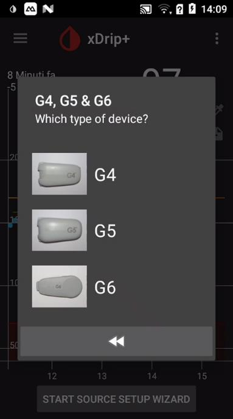

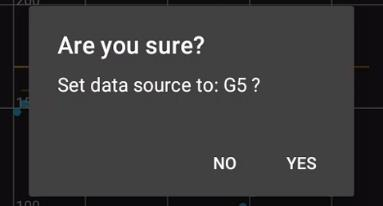

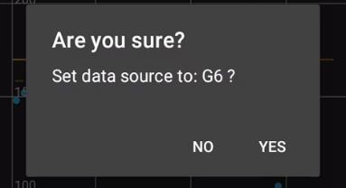

In alternativa: **Menu → Impostazioni → Dati hardware di origine → G5/G6 Transmitter**.


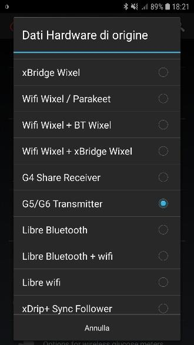

### Inserimento del numero di serie del trasmettitore

Inserisci il numero di serie del trasmettitore (lo trovi sulla confezione o sull'app Dexcom) verificandolo con attenzione, soprattutto per il G6.

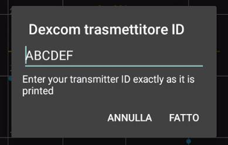

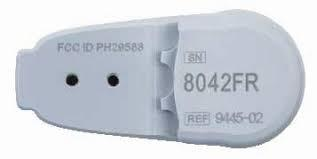

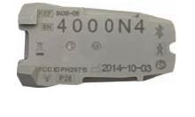

---

## 2. Configura i parametri Dexcom

> ⚠️ **Attenzione**: **Non avviare ancora il sensore.** Prima sistema i parametri.


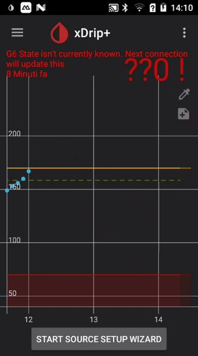

### Impostazioni per il G5

Le impostazioni evidenziate in arancione nell'app permettono di abilitare il riavvio automatico del sensore oltre i 7 giorni.

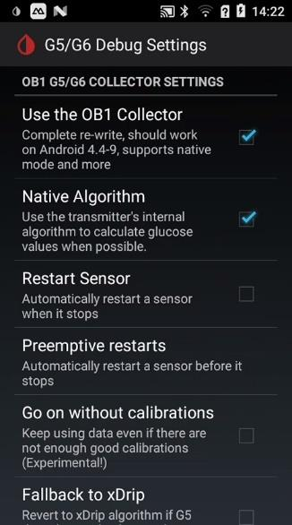

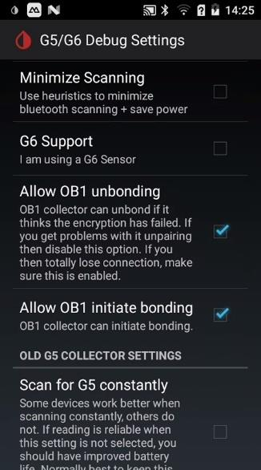

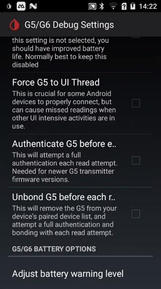

### Impostazioni per il G6

- Le impostazioni in rosso non devono essere **mai** abilitate per i trasmettitori Firefly (serie 8G e più recenti).
- Usa sempre l'**algoritmo nativo** (quello Dexcom): è l'unica opzione supportata dai trasmettitori Firefly. L'algoritmo grezzo ("raw data") non funziona con i trasmettitori moderni.
- Se xDrip+ chiede troppo spesso il riabbinamento al sensore, disabilita **Allow OB1 unbonding**.

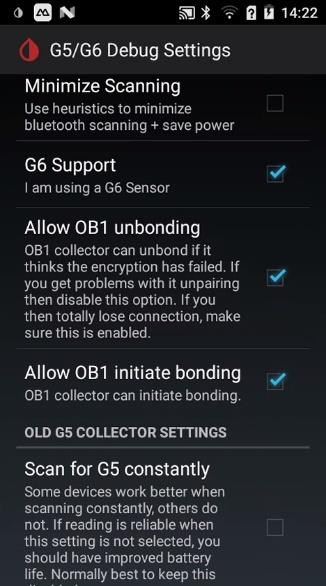

---

## 3. Modalità doppia connessione (opzionale)

Serve solo se vuoi collegare il sensore contemporaneamente a xDrip+ **e** all'app Dexcom ufficiale o a un secondo telefono.

> ℹ️ **Nota**: Non è possibile usare questa modalità con un microinfusore Tandem già collegato.

### Attivare la modalità Engineering

1. Nella schermata principale di xDrip+, tocca l'icona **Trattamento** (siringa, a destra).
2. Tieni premuto il **microfono** (in basso a destra).
3. Nel campo di testo, digita: `enable engineering mode`
4. Premi **Fine**: sullo schermo comparirà il testo digitato come conferma.

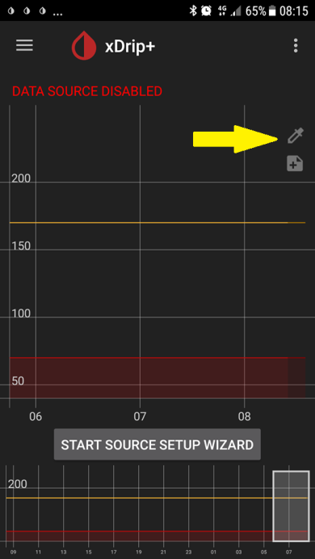

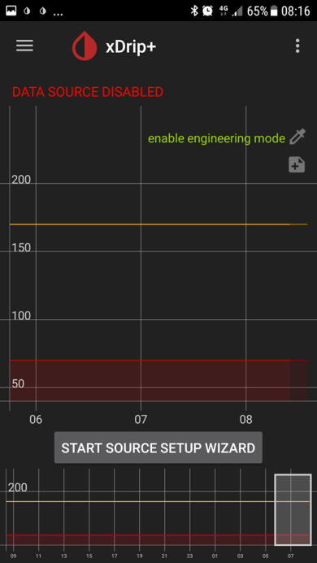

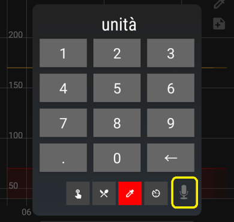

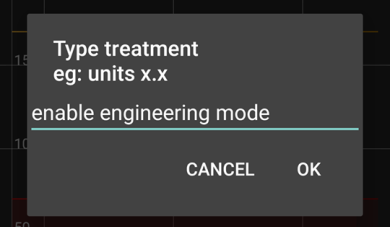

> ⚠️ **Attenzione**: La modalità Engineering si disattiva automaticamente a ogni riavvio del telefono.

### Cambiare lo slot del trasmettitore

Dopo aver abilitato la modalità Engineering:
1. Torna in **Impostazioni → Dati hardware di origine → Impostazioni debug G5/G6**.
2. Vedrai la nuova riga **Manual Slot Number**.
3. Inserisci `1` e tocca **OK**.

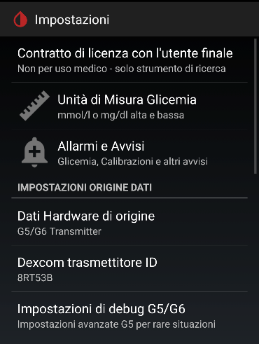

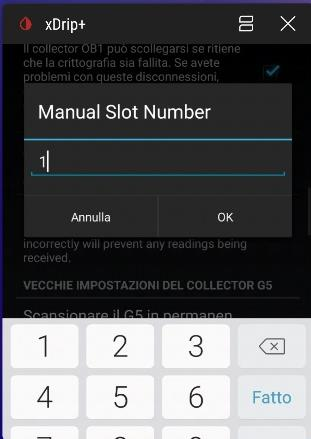

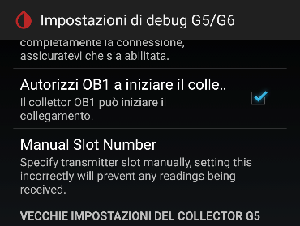

xDrip+ si collegherà al secondo slot del trasmettitore, lasciando libero quello dell'app Dexcom o del secondo telefono.

---

## 4. Collega il trasmettitore

Apri **Menu → Stato del sistema → G5/G6 Status** per monitorare il collegamento.

Se il trasmettitore non è ancora collegato, aspetta fino a 20 minuti: il trasmettitore si sveglia per pochi secondi ogni 5 minuti, poi torna in standby.

**Se non riesce a collegarsi:**
- Verifica che non ci sia un altro telefono già collegato al trasmettitore.
- Assicurati che l'app Dexcom ufficiale sia stata rimossa da questo telefono.

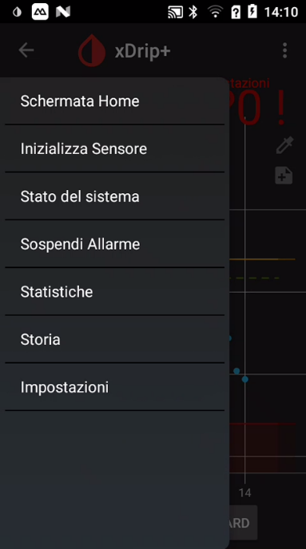

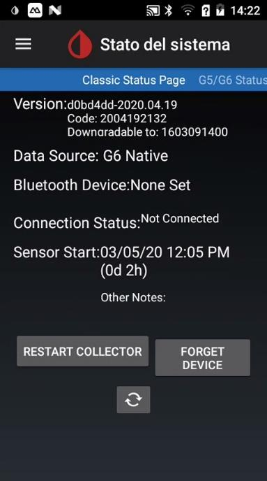

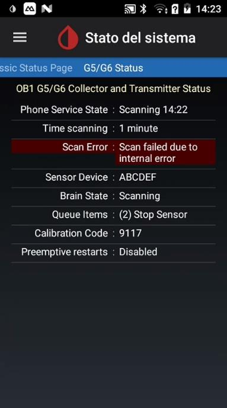

Quando il collegamento è stabilito, puoi procedere ad avviare il sensore.

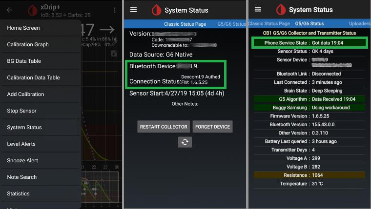

---

## 5. Avvia il sensore

> ℹ️ **Nota**: È sicuro avviare in xDrip+ un sensore già in uso con il ricevitore Dexcom o l'app ufficiale. Al contrario, **non fermare mai un sensore funzionante** a meno che tu non voglia davvero sostituirlo.

1. Dal menu principale, scegli **Inizializza Sensore** → **Inizializza sensor**.

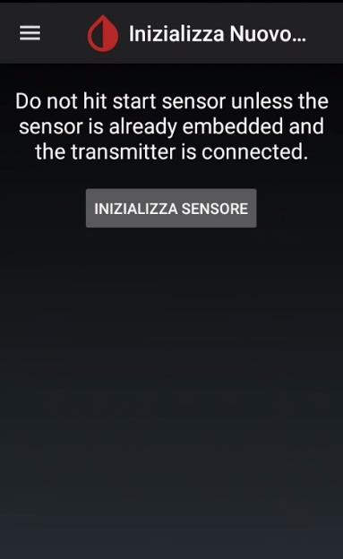

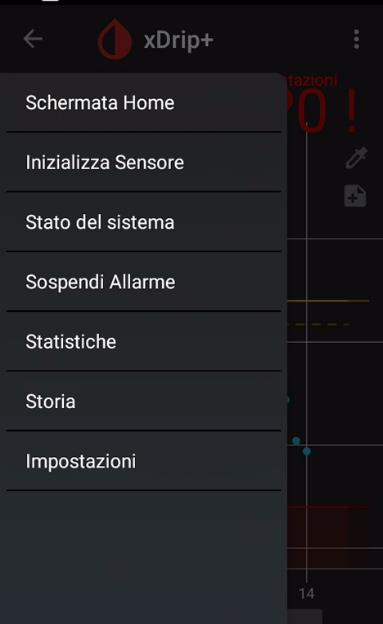

2. Indica quando hai inserito il sensore:
   - **Oggi:** seleziona **YES, TODAY**.
   - **Nei giorni precedenti:** seleziona **NOT TODAY** e inserisci l'orario esatto di avvio.

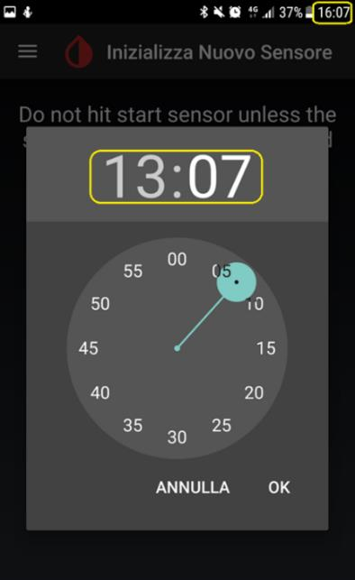

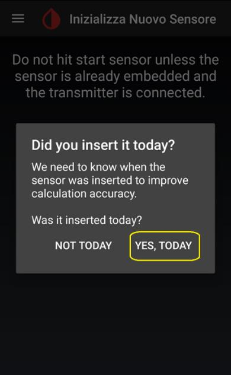

3. Se è un sensore **G6**, inserisci il codice del sensore (dalla confezione). Se non ce l'hai, lascia il campo vuoto: il sensore funzionerà come un G5 (richiede calibrazioni manuali).

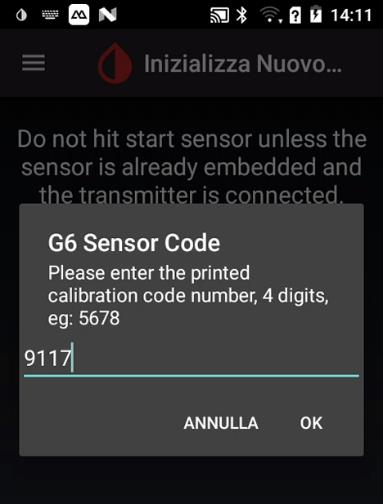

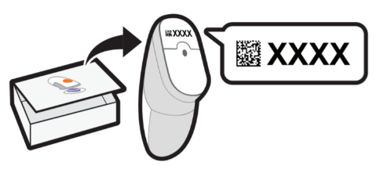

4. Se è un sensore **G5**, al termine dell'inizializzazione ti verranno chiesti due valori di glicemia da glucometro. Inserisci i valori e clicca **Fatto**.

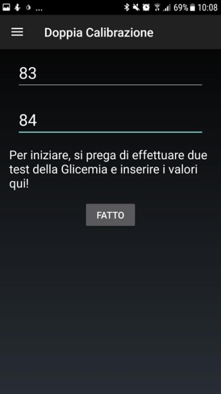

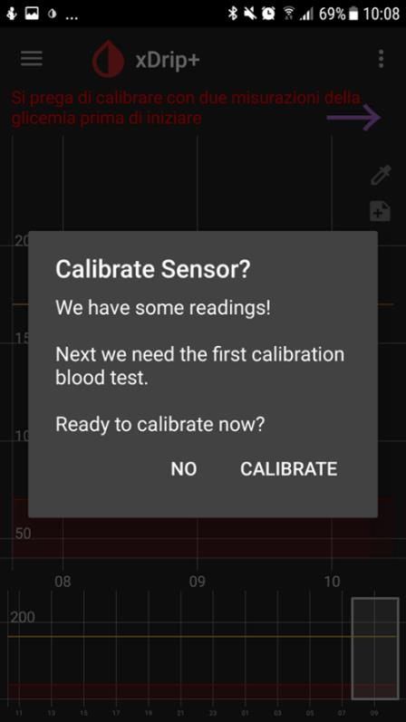

Se il sensore è stato avviato da meno di due ore, dovrai aspettare prima di ricevere le letture.

---

## 6. Invia le glicemie a distanza

Per condividere le letture con follower o altri dispositivi, hai tre opzioni:

### Opzione A – xDrip+ Sync (follower Android)

Sul **telefono master** (quello collegato al sensore):
1. Vai in **Impostazioni → xDrip+ Sync**.
2. Abilita le opzioni per il telefono primario e annota la chiave di sincronizzazione (**Handset Group Security Sync Key**).

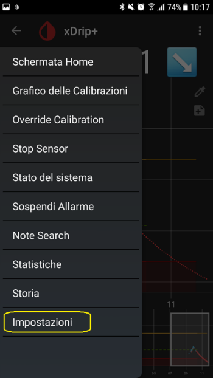

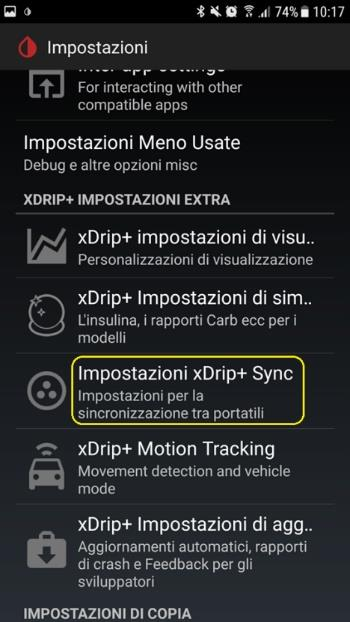

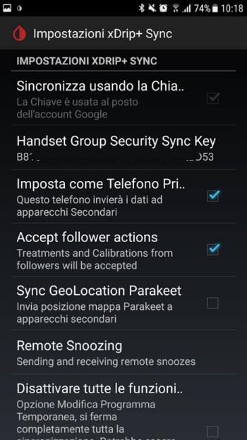

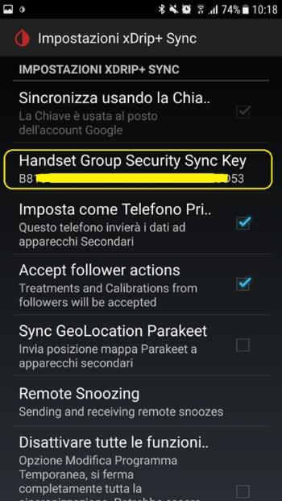

Sul **telefono follower** (quello che vuole ricevere la glicemia):
1. Installa xDrip+.
2. Come sorgente dati, scegli **xDrip+ Sync Follower**.

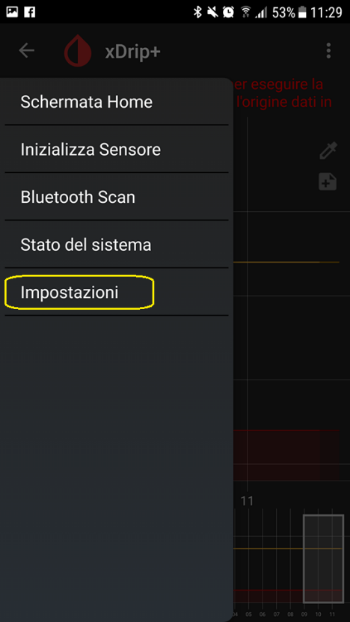

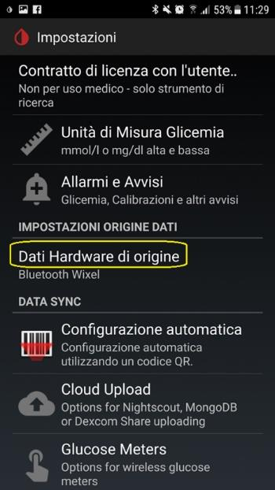

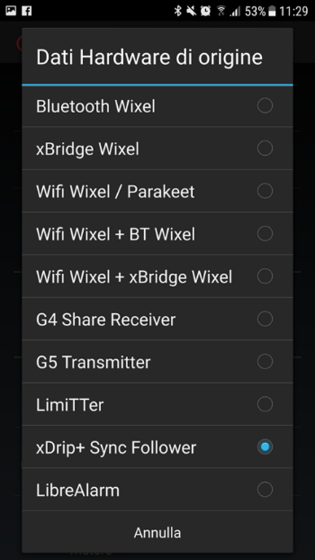

3. Vai in **Impostazioni → xDrip+ Sync → Handset Group Security Sync Key** e inserisci la stessa chiave del master.

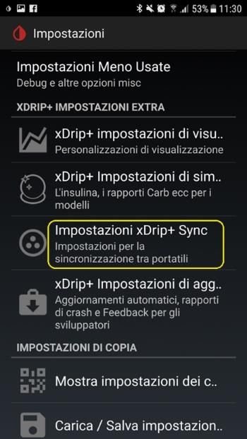

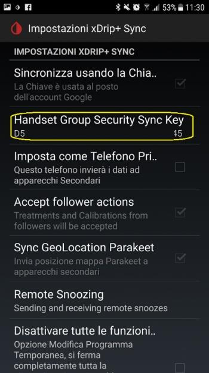

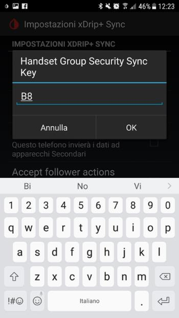

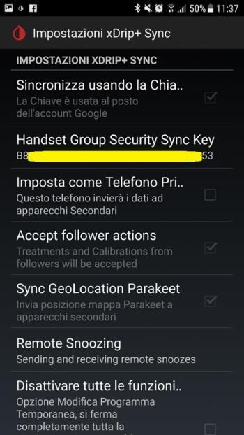

In alternativa, puoi eseguire la configurazione in automatico con il **codice QR** in xDrip+.

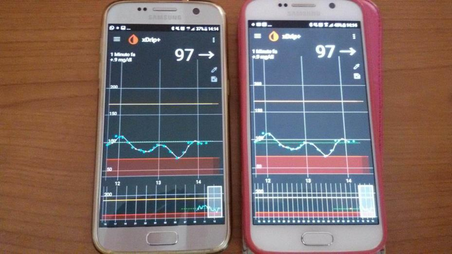

### Opzione B – Dexcom Share (follower con app Dexcom)

Permette di usare anche l'app **Dexcom Follow** su Android e iPhone:
1. In xDrip+, vai in **Impostazioni → Dexcom Share**.

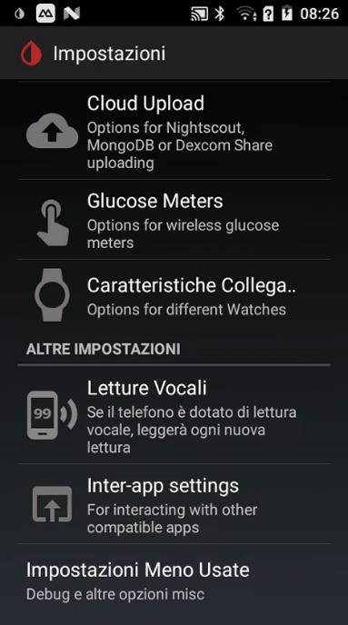

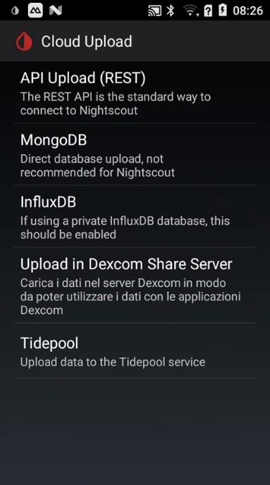

2. Abilita **Upload BG values** e disabilita il server americano (usa quello europeo).
3. Inserisci le tue credenziali Dexcom.
4. Aggiungi i follower tramite **Gestire follower** (nome, email): riceveranno un invito per email.

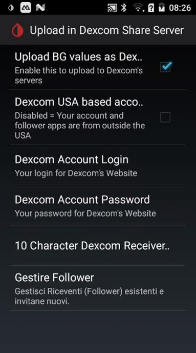

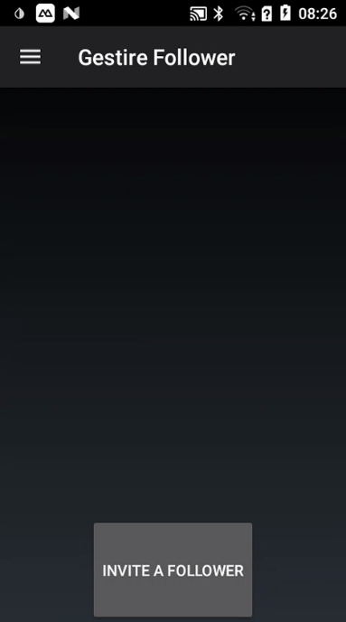

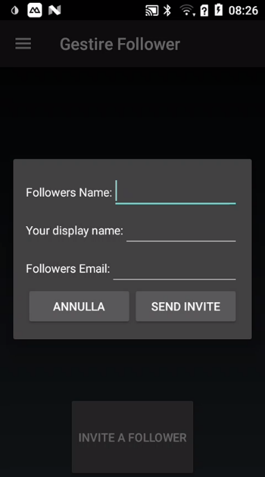


### Opzione C – Nightscout (tutti i dispositivi)

È la soluzione più completa: permette di vedere la glicemia su Android, iPhone, PC, smart TV.

1. Crea il tuo Nightscout seguendo la [guida Nightscout](../nightscout/nightscoutgooglecloud).
2. In xDrip+, vai in **Impostazioni → Cloud Upload → API Upload (REST)**.

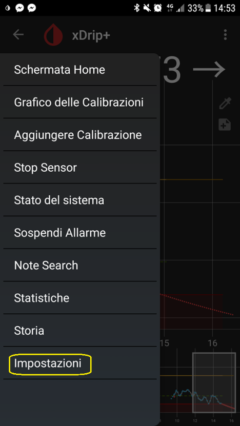

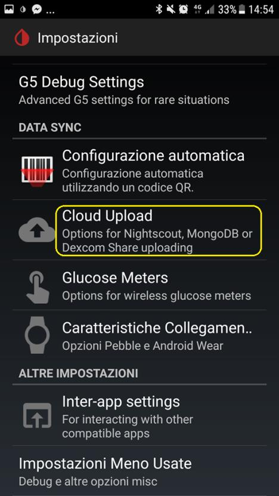

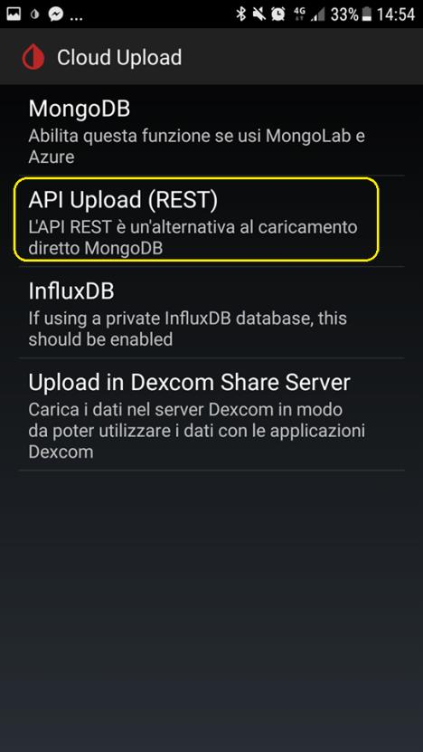

3. Abilita la voce e inserisci l'URL nel formato:
   ```
   https://TUOAPISECRET@NOMESITO.herokuapp.com/api/v1/
   ```
   sostituendo `TUOAPISECRET` e `NOMESITO` con i tuoi dati.

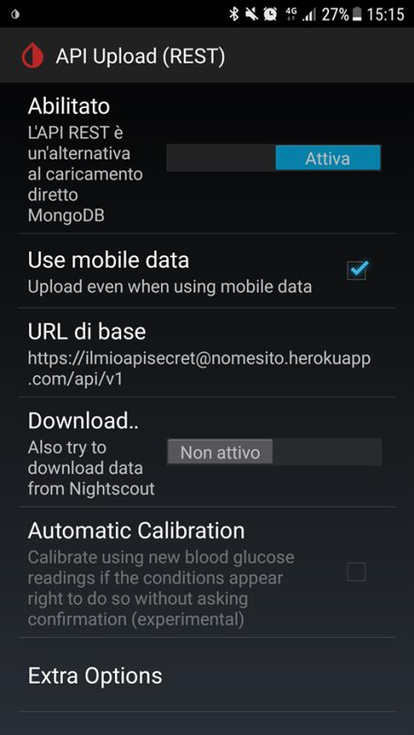

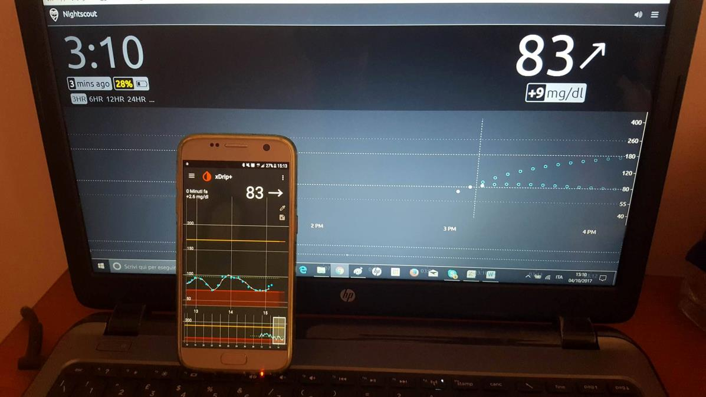

---

## 7. Smartwatch

Per visualizzare la glicemia sullo smartwatch senza Nightscout:

- **Amazfit e Xiaomi MiBand:** vedi la [guida WatchDrip+](./xdrip-e-watchdrip)
- **Android Wear OS 2/3:** vedi la [guida per Wear OS](./dexcom-xdrip-glimp-on-wear-watch)
- **Fitbit Versa / Ionic:** vedi la [guida Fitbit](../fitbit/fitbit-le-glicemie-di-dexcom-spike-xdrip-o-nightscout-su-smartwach-versa-e-ionic)

---

## 8. Allarmi e widget

xDrip+ offre:
- **Widget** per la schermata principale e la schermata di blocco del telefono.
- **Allarmi personalizzabili** per ipoglicemia e iperglicemia, con possibilità di impostare orari e giorni della settimana diversi.

Imposta gli allarmi da **Menu → Impostazioni → Allarmi e avvisi**.

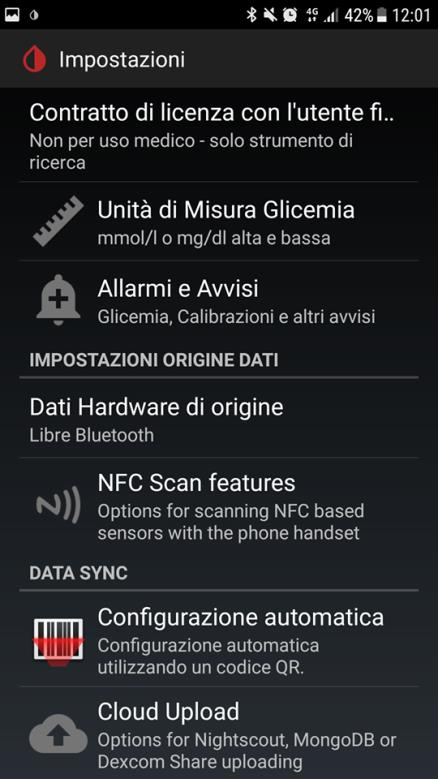

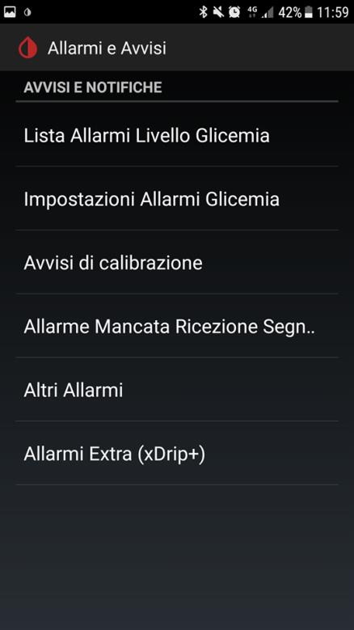

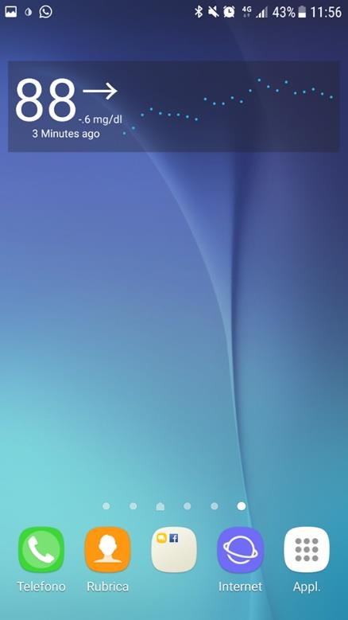

---

## 9. Cambio sensore

Per **prolungare** il sensore oltre i 10 giorni: segui la guida specifica sul riavvio sensore.

Per **sostituire** il sensore:
1. **Menu → Impostazioni → Stop Sensor** → conferma.

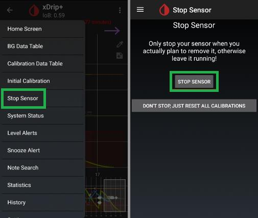

2. Monitora in **Menu → Stato del sistema → G5/G6 Status**: lo stato del sensore passerà a `Stopped` una volta ricevuta la conferma dal trasmettitore.

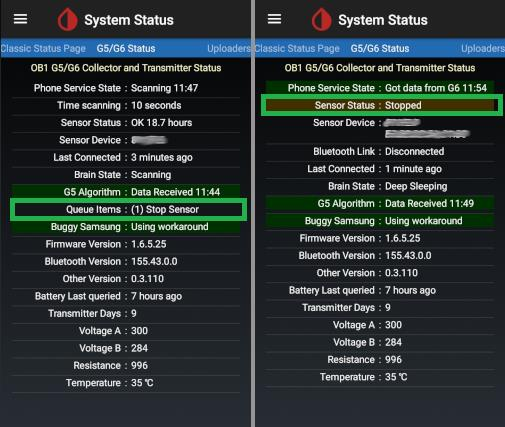

3. Togli il vecchio sensore e inserisci il nuovo.

---

## 10. Cambio trasmettitore

> ⚠️ **Attenzione**: Il sensore deve essere stato fermato prima di cambiare il trasmettitore.

1. In **Menu → Stato del sistema → G5/G6 Status**, premi **Forget Device**.


2. In **Menu → Impostazioni**, cambia il codice del trasmettitore in **Dexcom trasmettitore ID**.

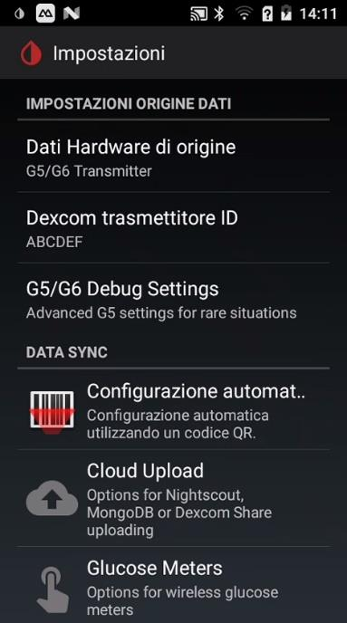
3. Inserisci il nuovo sensore e il nuovo trasmettitore, poi verifica il collegamento prima di avviare il sensore (come al passo 4).

---

## 11. Stato del sistema

La schermata **Stato del sistema** mostra:
- Stato del sensore e giorni di utilizzo
- Codice del trasmettitore
- Ultimo collegamento (di solito meno di 5 minuti fa)
- Ultima misura ricevuta
- Vita residua del trasmettitore
- Stato della batteria
- Codice del sensore G6

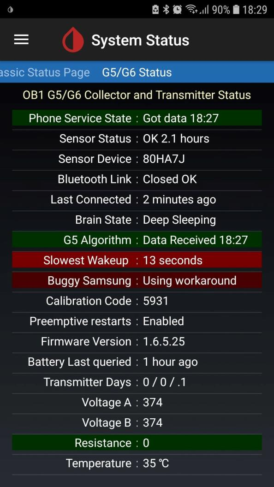

> ℹ️ **Nota**: Premi **Aggiorna** per ricaricare le informazioni.
