# Dexcom G6 / ONE con xDrip

Questa guida spiega come installare e configurare xDrip per leggere i dati da un sensore Dexcom G6 (o ONE) direttamente con Android, senza passare dall'app ufficiale.

> ⚠️ **Attenzione**: Usando xDrip con il sensore collegato direttamente non è possibile caricare i dati su Clarity. Se hai bisogno di Clarity, usa il lettore Dexcom fisico e carica i dati manualmente da computer, oppure usa Nightscout o Tidepool.

**Requisiti:** telefono Android 5 o successivo con Bluetooth 4.2 (BLE).

> ℹ️ **Nota**: Per usare **contemporaneamente** sia l'app Dexcom ufficiale che xDrip sullo stesso telefono, la soluzione più semplice è usare xDrip in modalità [compagno (Companion)](./xdrip-compagno), oppure collegarlo al secondo slot del trasmettitore (descritta in questa guida, ma non disponibile con microinfusori Tandem collegati).

---

## 1. Installa xDrip

Segui la [guida base di installazione](./installare-xdrip-android).

### Selezione della sorgente dati

Quando xDrip chiede la sorgente dati, scegli **G4, G5 & G6**:


Poi il tuo sensore specifico (G4 o G6):

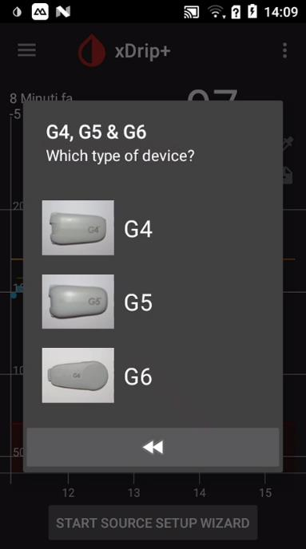

Conferma cliccando su **Yes**:

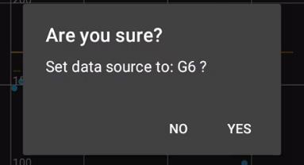

In alternativa, apri il menu di xDrip...


...vai in **Impostazioni**...


...tocca **Dati Hardware di origine**...


...e seleziona **G5/G6 Transmitter** dall'elenco:


### Inserimento del numero di serie del trasmettitore

Inserisci il numero di serie del trasmettitore (lo trovi sulla confezione o sull'app Dexcom) verificandolo con attenzione, soprattutto per il G6:


Il numero si trova stampato sul retro del trasmettitore stesso, accanto al codice FCC...


...come in questo secondo esempio:

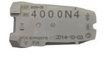

---

## 2. Configura i parametri Dexcom

> ⚠️ **Attenzione**: **Non avviare ancora il sensore.** Prima sistema i parametri.

Nella pagina **Impostazioni**, verifica che **Dati Hardware di origine** e **Dexcom trasmettitore ID** siano corretti, poi entra in **G5/G6 Debug Settings**:


Mentre configuri i parametri, il grafico mostrerà uno stato temporaneo simile a questo, in attesa del primo collegamento:


### Impostazioni per il G6

- Le impostazioni in rosso non devono essere **mai** abilitate per i trasmettitori Firefly (serie 8G e più recenti).
- Usa sempre l'**algoritmo nativo** (quello Dexcom): è l'unica opzione supportata dai trasmettitori Firefly. L'algoritmo grezzo ("raw data") non funziona con i trasmettitori moderni.
- Se xDrip chiede troppo spesso il riabbinamento al sensore, disabilita **Allow OB1 unbonding**.

Per il G6, abilita anche **G6 Support**:


---

## 3. Modalità doppia connessione (opzionale)

Serve solo se vuoi collegare il sensore contemporaneamente a xDrip **e** all'app Dexcom ufficiale o a un secondo telefono.

> ℹ️ **Nota**: Non è possibile usare questa modalità con un microinfusore Tandem già collegato.

### Attivare la modalità Engineering

1. Nella schermata principale di xDrip, tocca l'icona **Trattamento** (siringa, a destra):


Comparirà la scritta **enable engineering mode** vicino all'icona, a indicare che la funzione è disponibile:


2. Tieni premuto il **microfono** (in basso a destra) nella tastiera che si apre:


3. Nel campo di testo, digita: `enable engineering mode`


4. Premi **OK**: sullo schermo comparirà il testo digitato come conferma.

> ⚠️ **Attenzione**: La modalità Engineering si disattiva automaticamente a ogni riavvio del telefono.

### Cambiare lo slot del trasmettitore

Dopo aver abilitato la modalità Engineering:
1. Torna in **Impostazioni → G5/G6 Debug Settings**:

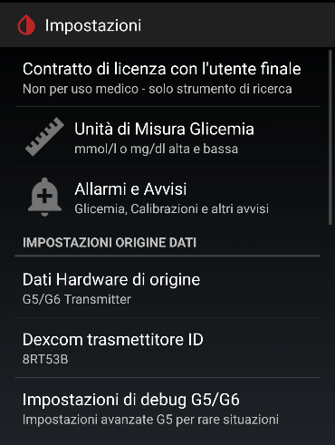

2. Scorri fino a vedere la nuova riga **Manual Slot Number**:


3. Inserisci `1` e tocca **OK**:


xDrip si collegherà al secondo slot del trasmettitore, lasciando libero quello dell'app Dexcom o del secondo telefono.

---

## 4. Collega il trasmettitore

Apri il menu e vai in **Stato del sistema** per monitorare il collegamento:

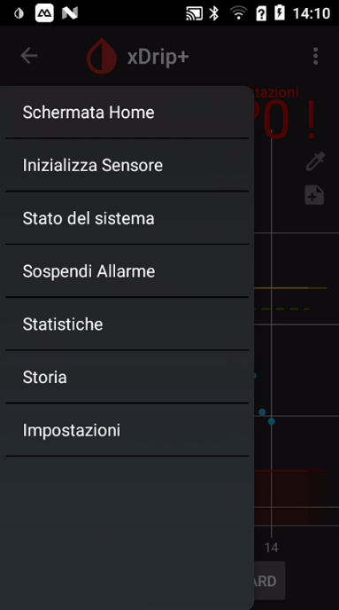

Nella scheda **Classic Status Page** puoi vedere lo stato generale (sorgente dati, dispositivo Bluetooth, stato della connessione):


Nella scheda **G5/G6 Status** trovi i dettagli tecnici del collegamento, utili in caso di problemi (ad esempio un errore di scansione come in questo esempio):


Se il trasmettitore non è ancora collegato, aspetta fino a 20 minuti: il trasmettitore si sveglia per pochi secondi ogni 5 minuti, poi torna in standby.

**Se non riesce a collegarsi:**
- Verifica che non ci sia un altro telefono già collegato al trasmettitore.
- Assicurati che l'app Dexcom ufficiale sia stata rimossa da questo telefono.

Quando il collegamento è stabilito, il menu principale e le due schede di stato mostreranno tutti i dati in verde (dispositivo Bluetooth associato, dati ricevuti, algoritmo attivo): puoi procedere ad avviare il sensore.


---

## 5. Avvia il sensore

> ℹ️ **Nota**: È sicuro avviare in xDrip un sensore già in uso con il ricevitore Dexcom o l'app ufficiale. Al contrario, **non fermare mai un sensore funzionante** a meno che tu non voglia davvero sostituirlo.

1. Dal menu principale, scegli **Inizializza Sensore**...


...poi tocca **INIZIALIZZA SENSORE**:


2. Indica quando hai inserito il sensore:
   - **Oggi:** seleziona **YES, TODAY**.


   - **Nei giorni precedenti:** seleziona **NOT TODAY** e inserisci l'orario esatto di avvio:


3. Se è un sensore **G6**, il codice si trova sull'applicatore, come mostrato in questo schema...


...inserisci il codice del sensore (dalla confezione). Se non ce l'hai, lascia il campo vuoto: il sensore richiederà calibrazioni manuali.


Se il sensore è stato avviato da meno di due ore, dovrai aspettare prima di ricevere le letture.

---

## 6. Invia le glicemie a distanza

Per condividere le letture con follower o altri dispositivi, hai tre opzioni:

### Opzione A – xDrip Sync (follower Android)

Sul **telefono master** (quello collegato al sensore):
1. Apri il menu e vai in **Impostazioni**:

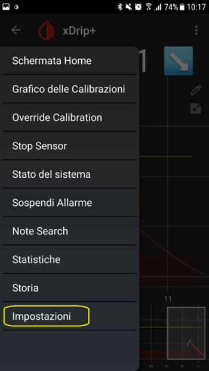

2. Cerca **Impostazioni xDrip+ Sync**:

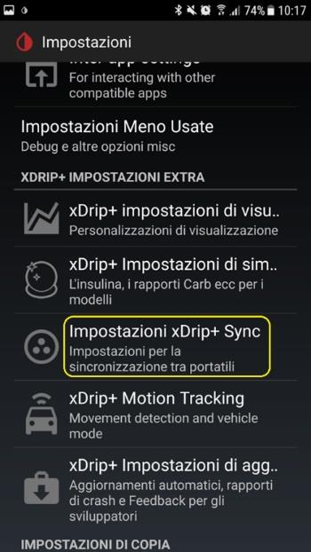

3. Abilita **Imposta come Telefono Principale** e annota la chiave di sincronizzazione (**Handset Group Security Sync Key**):

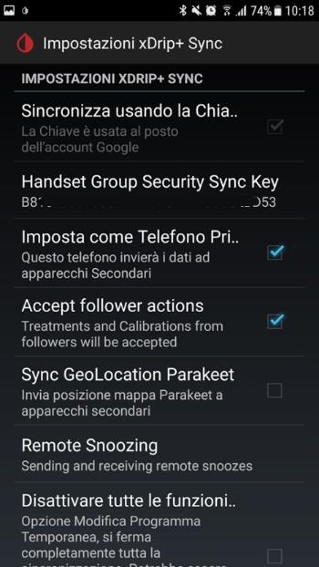

La chiave da annotare è quella evidenziata sotto **Handset Group Security Sync Key**:

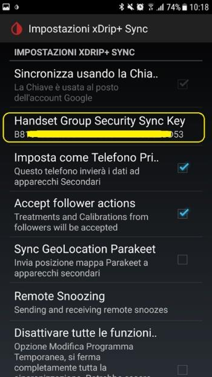

Sul **telefono follower** (quello che vuole ricevere la glicemia):
1. Installa xDrip e apri il menu...

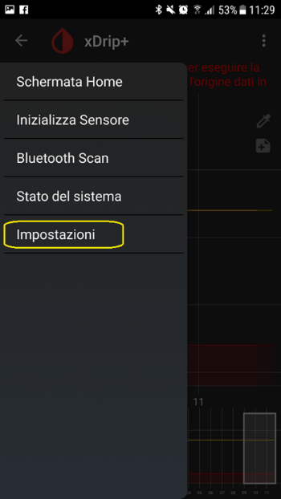

2. Vai in **Impostazioni → Dati Hardware di origine**...

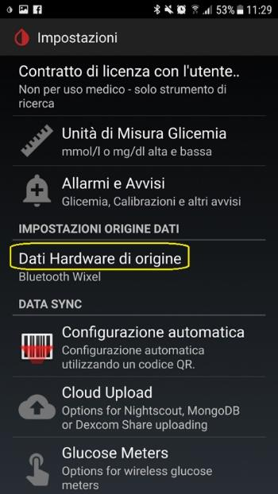

...e scegli **xDrip+ Sync Follower**:

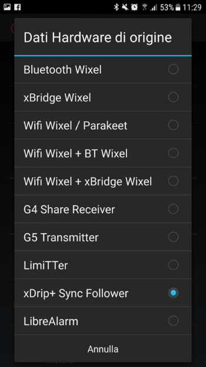

3. Vai in **Impostazioni → Impostazioni xDrip+ Sync**...

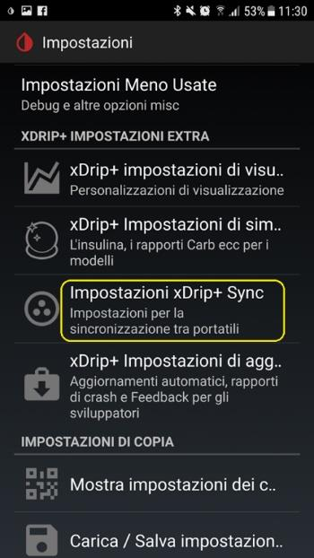

...e tocca **Handset Group Security Sync Key**:

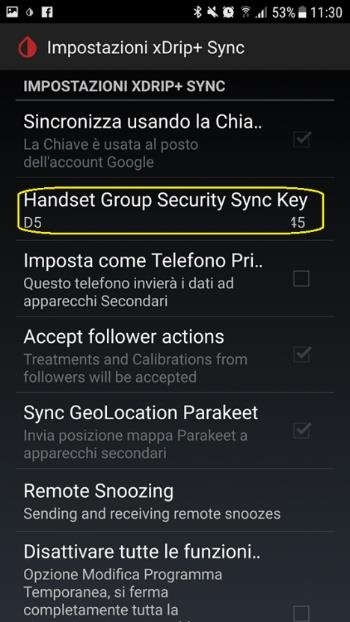

Inserisci la stessa chiave del master:

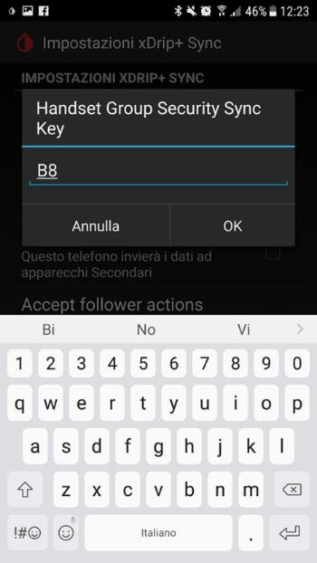

La chiave comparirà nel campo, a conferma:

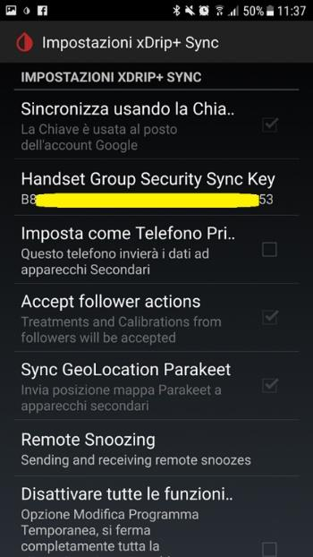

In alternativa, puoi eseguire la configurazione in automatico con il **codice QR** in xDrip. Una volta sincronizzati, i due telefoni mostreranno sempre lo stesso valore di glicemia:


### Opzione B – Dexcom Share (follower con app Dexcom)

Permette di usare anche l'app **Dexcom Follow** su Android e iPhone:
1. In xDrip, vai in **Impostazioni**...

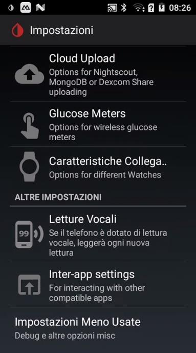

...**Cloud Upload**...

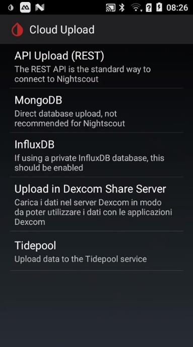

...e **Upload in Dexcom Share Server**:

2. Abilita **Upload BG values as Dex..** e disabilita **Dexcom USA based account** (usa quello europeo).
3. Inserisci le tue credenziali Dexcom.
4. Aggiungi i follower tramite **Gestire follower** (nome, email): riceveranno un invito per email.

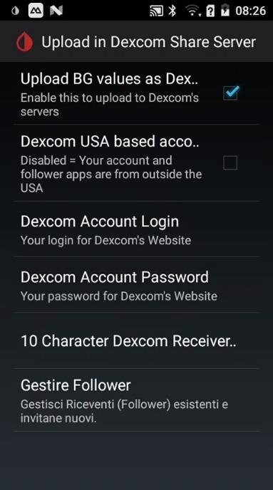

Nella pagina **Gestire Follower**, tocca **INVITE A FOLLOWER**:

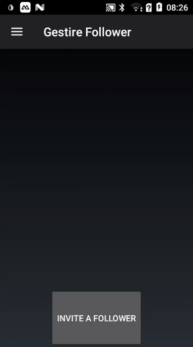

Compila nome, il tuo nome visualizzato ed email del follower, poi **SEND INVITE**:

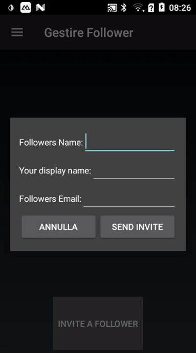

Riceverai la conferma dell'invio:


### Opzione C – Nightscout (tutti i dispositivi)

È la soluzione più completa: permette di vedere la glicemia su Android, iPhone, PC, smart TV.

1. Crea il tuo Nightscout seguendo la [guida Nightscout](../nightscout/nightscoutgooglecloud).
2. In xDrip, apri il menu...

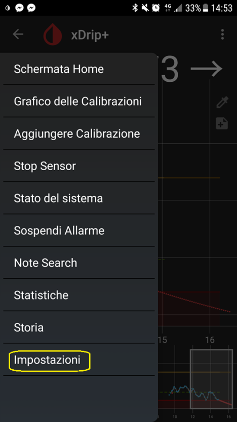

...vai in **Impostazioni → Cloud Upload**...

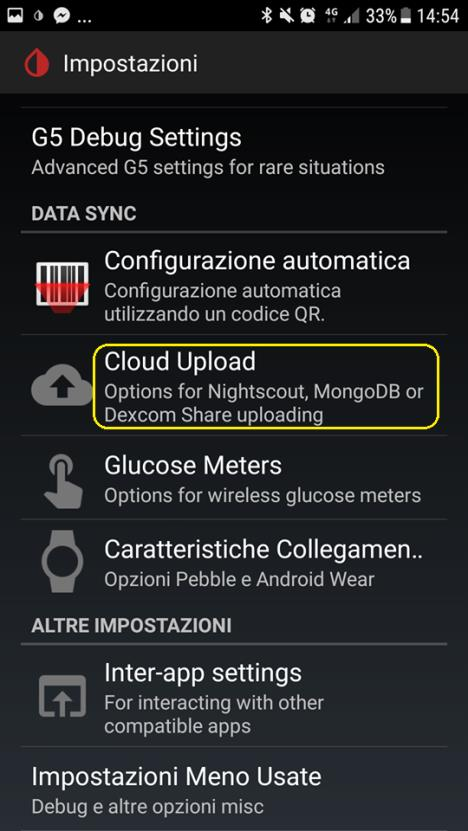

...e tocca **API Upload (REST)**:

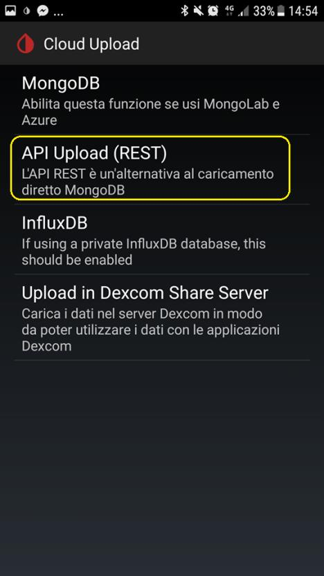

3. Abilita la voce (**Attiva**) e inserisci l'URL nel formato:
   ```
   https://TUOAPISECRET@NOMESITO.herokuapp.com/api/v1/
   ```
   sostituendo `TUOAPISECRET` e `NOMESITO` con i tuoi dati.

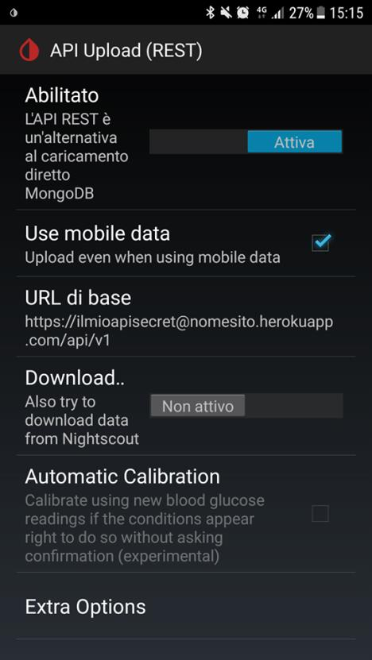

Una volta configurato, la glicemia comparirà sul tuo sito Nightscout con lo stesso valore mostrato da xDrip:


---

## 7. Smartwatch

Per visualizzare la glicemia sullo smartwatch senza Nightscout:

- **Amazfit e Xiaomi MiBand:** vedi la [guida WatchDrip+](./xdrip-e-watchdrip)
- **Android Wear OS 2/3:** vedi la [guida per Wear OS](./dexcom-xdrip-glimp-on-wear-watch)
- **Fitbit Versa / Ionic:** vedi la [guida Fitbit](../fitbit/fitbit-le-glicemie-di-dexcom-spike-xdrip-o-nightscout-su-smartwach-versa-e-ionic)

---

## 8. Allarmi e widget

xDrip offre:
- **Widget** per la schermata principale e la schermata di blocco del telefono.
- **Allarmi personalizzabili** per ipoglicemia e iperglicemia, con possibilità di impostare orari e giorni della settimana diversi.

Imposta gli allarmi da **Menu → Impostazioni → Allarmi e Avvisi**:

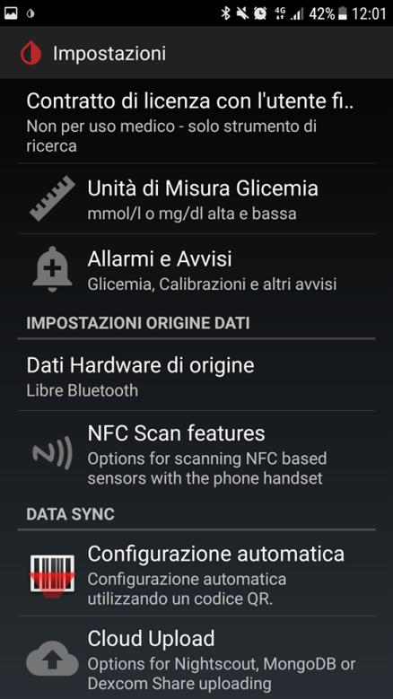

Nella pagina che si apre trovi tutte le opzioni di allarme (livelli di glicemia, calibrazione, mancata ricezione segnale, allarmi extra):

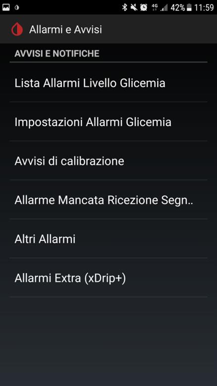

Il widget sulla schermata principale mostra il valore attuale, il trend e il grafico recente senza bisogno di aprire l'app:

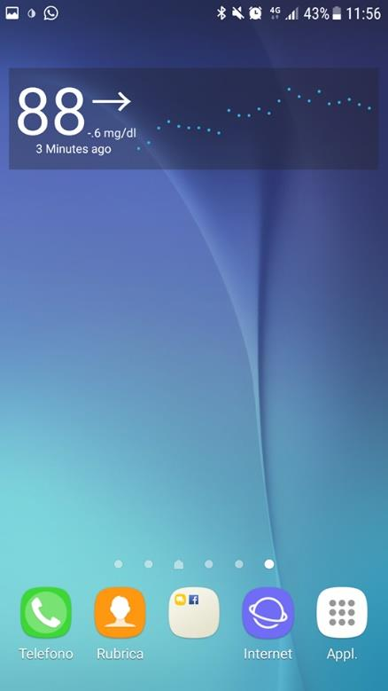

---

## 9. Cambio sensore

Per **prolungare** il sensore oltre i 10 giorni: segui la guida specifica sul riavvio sensore.

Per **sostituire** il sensore:
1. Apri il menu e tocca **Stop Sensor**, poi conferma:


2. Monitora in **Stato del sistema**: lo stato del sensore passerà a `Stopped` una volta ricevuta la conferma dal trasmettitore:


3. Togli il vecchio sensore e inserisci il nuovo.

---

## 10. Cambio trasmettitore

> ⚠️ **Attenzione**: Il sensore deve essere stato fermato prima di cambiare il trasmettitore.

1. Dal menu principale, apri **Stato del sistema**:


Nella pagina **Stato del sistema**, premi **FORGET DEVICE**:


2. In **Menu → Impostazioni**, cambia il codice del trasmettitore in **Dexcom trasmettitore ID**:

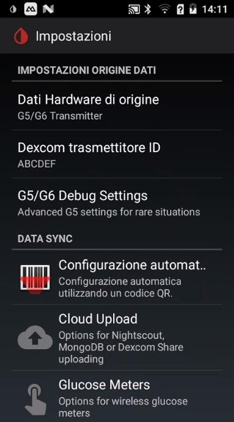

3. Inserisci il nuovo sensore e il nuovo trasmettitore, poi verifica il collegamento prima di avviare il sensore (come al passo 4).

---

## 11. Stato del sistema

La schermata **Stato del sistema** mostra:
- Stato del sensore e giorni di utilizzo
- Codice del trasmettitore
- Ultimo collegamento (di solito meno di 5 minuti fa)
- Ultima misura ricevuta
- Vita residua del trasmettitore
- Stato della batteria
- Codice del sensore G6


> ℹ️ **Nota**: Premi **Aggiorna** per ricaricare le informazioni.
