# Dexcom G6 / ONE con xDrip

Questa guida spiega come installare e configurare xDrip per leggere i dati da un sensore Dexcom G6 (o ONE) direttamente con Android, senza passare dall'app ufficiale.

> ⚠️ **Attenzione**: Usando xDrip con il sensore collegato direttamente non è possibile caricare i dati su Clarity. Se hai bisogno di Clarity, usa il lettore Dexcom fisico e carica i dati manualmente da computer, oppure usa Nightscout o Tidepool.

**Requisiti:** telefono Android 8 o successivo con Bluetooth 4.2 (BLE).

> ℹ️ **Nota**: Per usare **contemporaneamente** sia l'app Dexcom ufficiale che xDrip sullo stesso telefono, la soluzione più semplice è usare xDrip in modalità [compagno (Companion)](./xdrip-compagno), oppure collegarlo al secondo slot del trasmettitore (descritta in questa guida, ma non disponibile con microinfusori Tandem collegati).

---

## 1. Installa xDrip

Segui la [guida base di installazione](./installare-xdrip-android).

### Selezione della sorgente dati

Quando xDrip chiede la sorgente dati, scegli **Dex**:

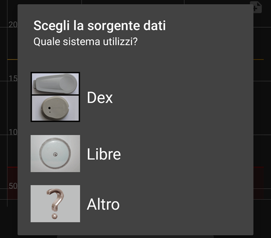

Conferma cliccando su **Yes**:

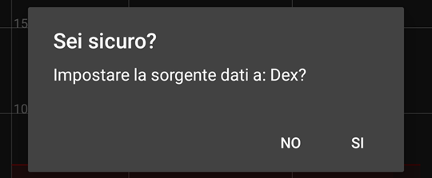

In alternativa, apri il menu di xDrip...

...vai in **Impostazioni**...

...tocca **Dati Hardware di origine**...

...e seleziona **Dex** dall'elenco:

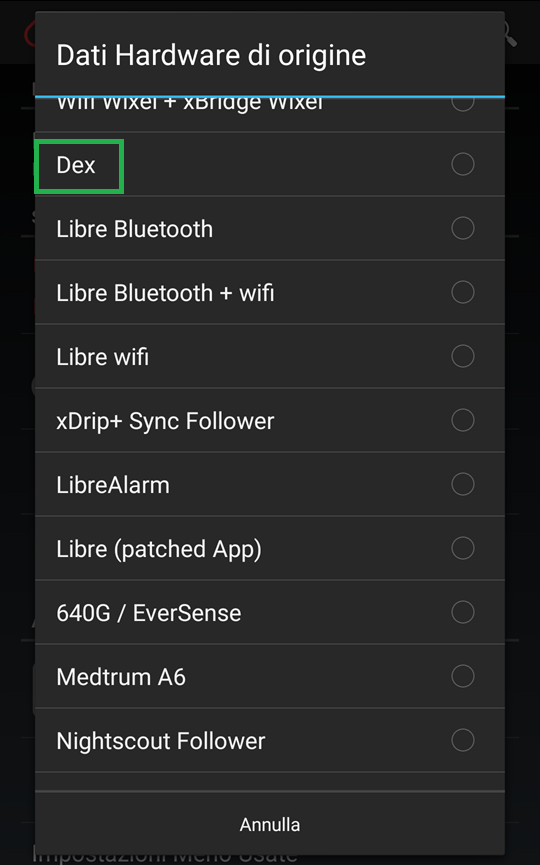

### Inserimento del numero di serie del trasmettitore

Inserisci il numero di serie del trasmettitore (lo trovi sulla confezione o sull'app Dexcom) verificandolo con attenzione, soprattutto per il G6:

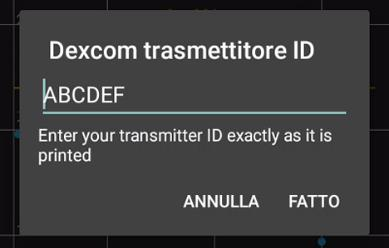

Il numero si trova stampato sul retro del trasmettitore stesso...

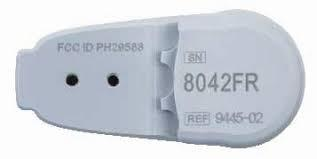

---

## 2. Configura i parametri Dexcom

> ⚠️ **Attenzione**: **Non avviare ancora il sensore.** Prima sistema i parametri.

Nella pagina **Impostazioni**, verifica che **Dati Hardware di origine** e **Dexcom trasmettitore ID** siano corretti, poi entra in **G5/G6 Debug Settings**:

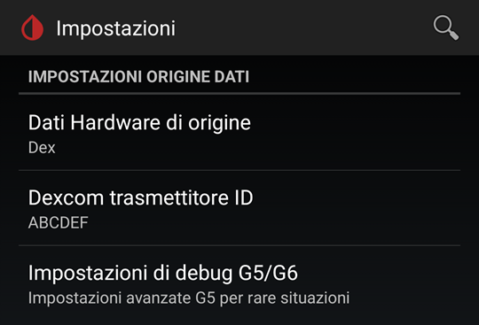

Mentre configuri i parametri, il grafico mostrerà uno stato temporaneo simile a questo, in attesa del primo collegamento:

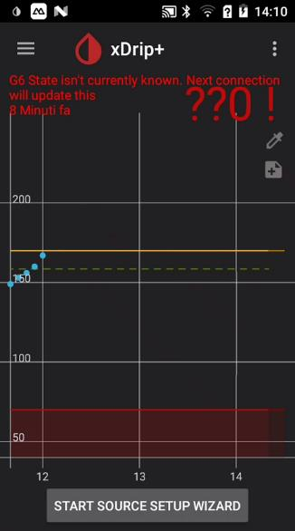

### Impostazioni per il G6

- Le impostazioni in rosso non devono essere **mai** abilitate.

- Usa sempre l'**algoritmo nativo** (quello Dexcom): l'algoritmo con i dati grezzi ("raw data") non funziona con i trasmettitori moderni.

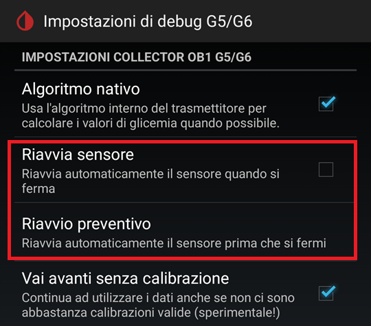

- Se perdi spesso il collegamento, prova ad abilitare Minimizza scansioni (funziona solo con Android 10 o superiore).
- Se xDrip chiede troppo spesso l'abbinamento al sensore, disabilita **Consenti scollegamento OB1**.
- Per i telefonini Samsung ed altri modelli Cinesi, prova ad abilitare l'**Abbinamento Speciale**.

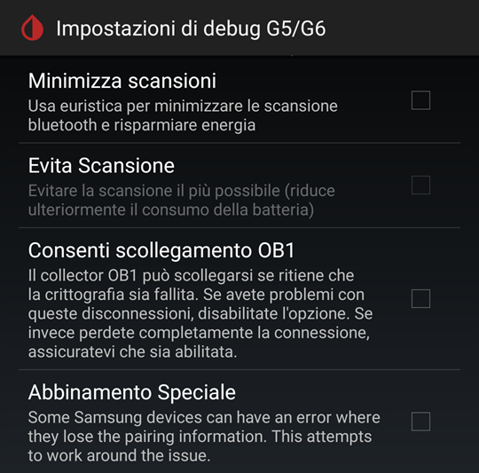

---

## 3. Modalità doppia connessione (non consigliato)

Serve solo se vuoi collegare il sensore contemporaneamente a xDrip **e** all'app Dexcom ufficiale o a un secondo telefono.

> ℹ️ **Nota**: Non è possibile usare questa modalità con un microinfusore Tandem già collegato.

### Attivare la modalità Engineering

1. Nella schermata principale di xDrip, tocca l'icona **Trattamenti** (siringa, a destra):

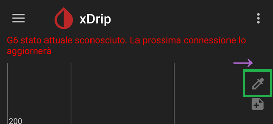

2. Tieni premuto il **microfono** (in basso a destra) nella tastiera che si apre:

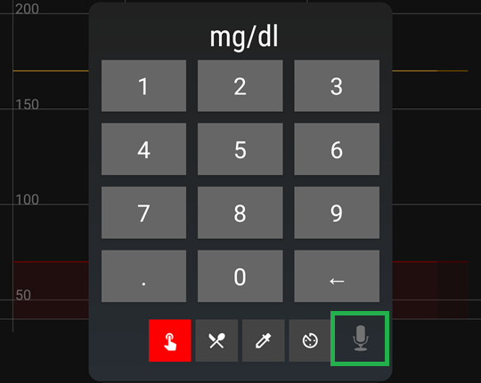

3. Nel campo di testo, digita: `enable engineering mode`

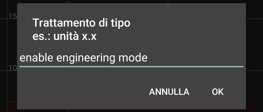

4. Premi **OK**: sullo schermo comparirà il testo digitato come conferma.

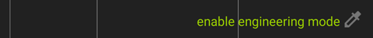

> ⚠️ **Attenzione**: La modalità Engineering si disattiva automaticamente a ogni riavvio del telefono.

### Cambiare lo slot del trasmettitore

Dopo aver abilitato la modalità Engineering:
1. Torna in **Impostazioni → Impostazioni di debug G5/G6**:

2. Scorri fino a vedere la nuova riga **Manual Slot Number**:

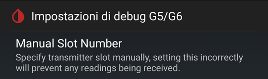

3. Inserisci `1` e tocca **OK**:

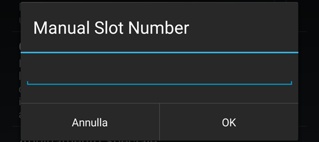

xDrip si collegherà al secondo slot del trasmettitore, lasciando libero quello dell'app Dexcom o del secondo telefono.

---

## 4. Collega il trasmettitore

Apri il menu e vai in **Stato del sistema** per monitorare il collegamento:

Nella scheda **Classic Status Page** puoi vedere lo stato generale (sorgente dati, dispositivo Bluetooth, stato della connessione):

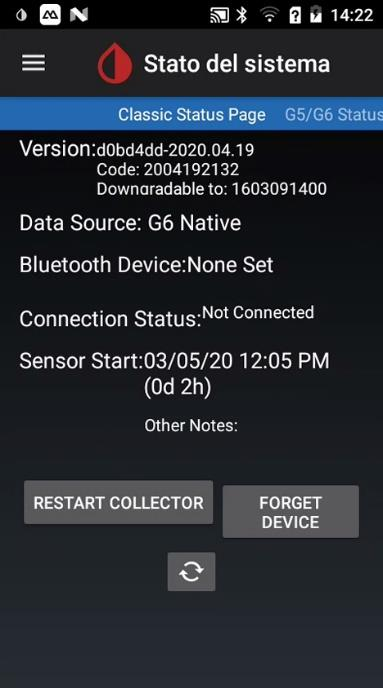

Nella scheda **G5/G6 Status** trovi i dettagli tecnici del collegamento, utili in caso di problemi (errore di scansione, e comandi bloccati in coda: Stop Sensor, come in questo esempio):

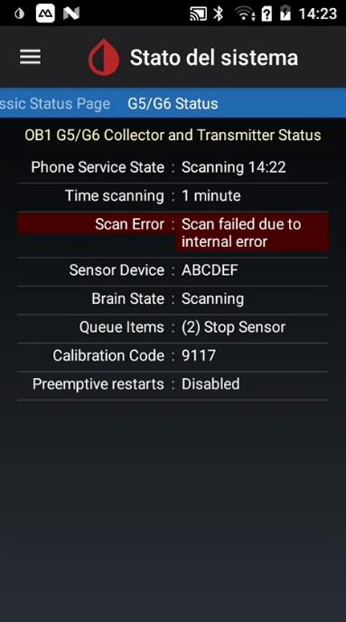

Se il trasmettitore non è ancora collegato, aspetta fino a 20 minuti: il trasmettitore si sveglia per pochi secondi ogni 5 minuti, poi torna in standby.

**Se non riesce a collegarsi:**

> ℹ️ **Nota**: Non mandare atri comandi di avvio o fermo sensore finché non hai sistemato il collegamento e non ci sono azioni in coda (Queue Items). Verifica o modifica i parametri di collegamento finché il trasmettitore non sia collegato.

- Verifica che non ci sia un altro telefono già collegato al trasmettitore.
- Assicurati che l'app Dexcom ufficiale sia stata rimossa da questo telefono.

Quando il collegamento è stabilito, il menu principale e le due schede di stato mostreranno tutti i dati in verde (dispositivo Bluetooth associato, dati ricevuti, algoritmo attivo): puoi procedere ad avviare il sensore.

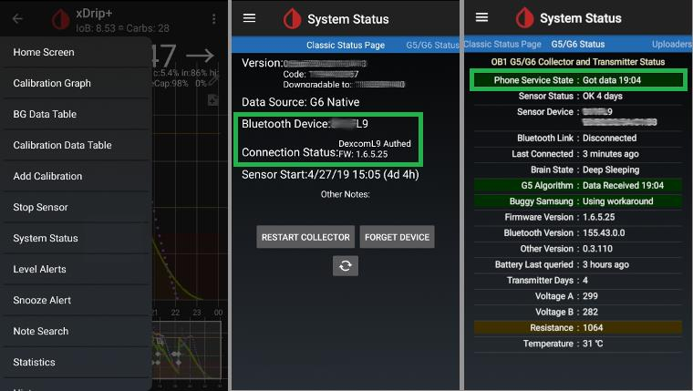

---

## 5. Avvia il sensore

> ℹ️ **Nota**: È sicuro avviare in xDrip un sensore già in uso con il ricevitore Dexcom o l'app ufficiale. Al contrario, **non fermare mai un sensore funzionante** a meno che tu non voglia davvero sostituirlo.

1. Dal menu principale, scegli **Inizializza Sensore**...

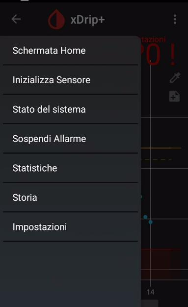

...poi tocca **INIZIALIZZA SENSORE**:

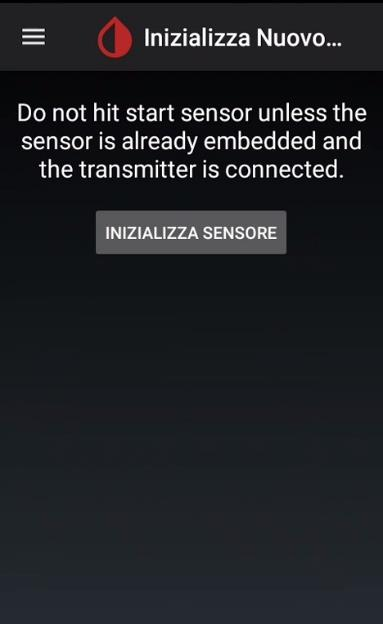

2. Indica quando hai inserito il sensore:
   - **Oggi:** seleziona **YES, TODAY**.

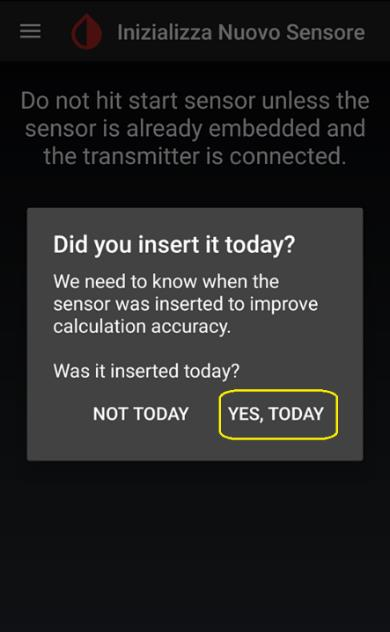

   - **Nei giorni precedenti:** seleziona **NOT TODAY** e inserisci l'orario esatto di avvio:

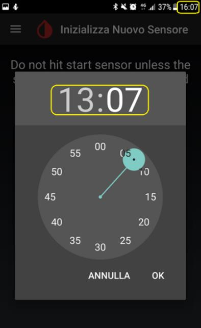

3. Se è un sensore **G6**, il codice si trova sull'applicatore, come mostrato in questo schema...

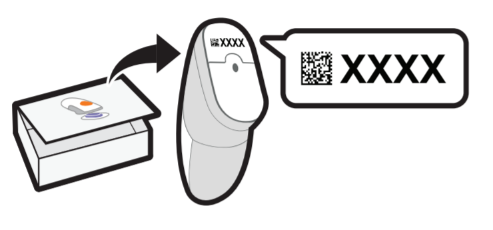

...inserisci il codice del sensore (dalla confezione). Se non ce l'hai, lascia il campo vuoto: il sensore richiederà calibrazioni manuali.

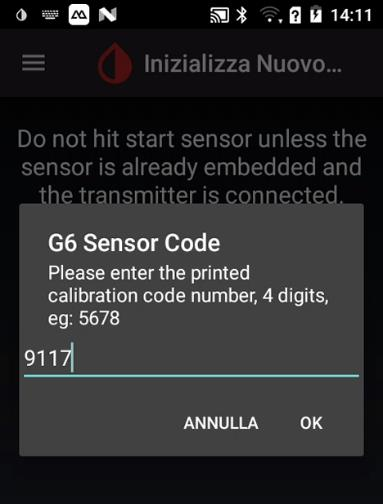

Se il sensore è stato avviato da meno di due ore, dovrai aspettare prima di ricevere le letture.

---

## 6. Invia le glicemie a distanza

Per condividere le letture con follower o altri dispositivi, hai tre opzioni:

### Opzione A – xDrip Sync (follower Android)

Vedi la guida [xDrip Sync follower](./masterfollower.md).

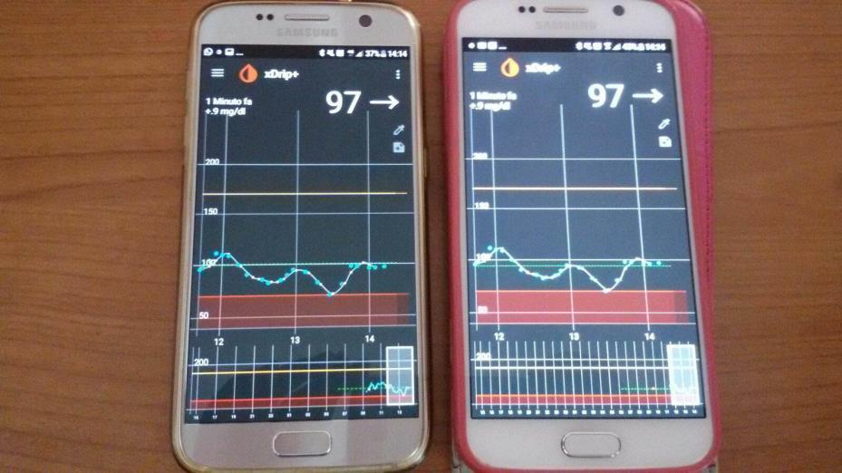

### Opzione B – Dexcom Share (follower con app Dexcom)

### Opzione C – Nightscout (tutti i dispositivi)

Crea un sito Nightscout oppure usa [Gluroo](../gluroo/gluroo.md).

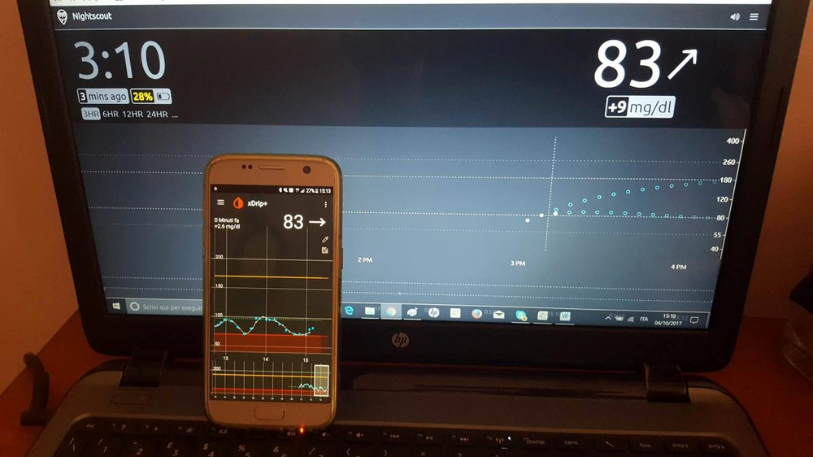

---

---

## 9. Cambio sensore

Per **prolungare** il sensore oltre i 10 giorni: segui la guida specifica sul riavvio sensore.

Per **sostituire** il sensore:
1. Apri il menu e tocca **Stop Sensor**, poi conferma:

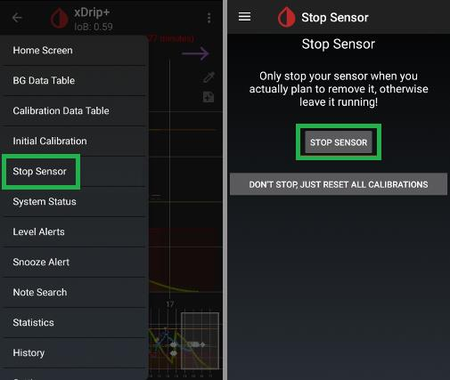

2. Monitora in **Stato del sistema**: lo stato del sensore passerà a `Stopped` una volta ricevuta la conferma dal trasmettitore:

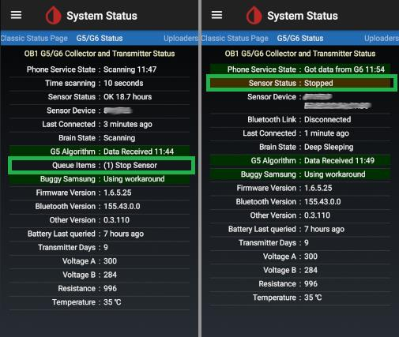

3. Togli il vecchio sensore e inserisci il nuovo.

---

## 10. Cambio trasmettitore

> ⚠️ **Attenzione**: Il sensore deve essere stato fermato prima di cambiare il trasmettitore.

1. Dal menu principale, apri **Stato del sistema**:

Nella pagina **Stato del sistema**, premi **FORGET DEVICE**:

2. In **Menu → Impostazioni**, cambia il codice del trasmettitore in **Dexcom trasmettitore ID**:

3. Inserisci il nuovo sensore e il nuovo trasmettitore, poi verifica il collegamento prima di avviare il sensore (come al passo 4).

---

## 11. Stato del sistema

La schermata **Stato del sistema** mostra:
- Stato del sensore e giorni di utilizzo
- Codice del trasmettitore
- Ultimo collegamento (di solito meno di 5 minuti fa)
- Ultima misura ricevuta
- Vita residua del trasmettitore
- Stato della batteria
- Codice del sensore G6

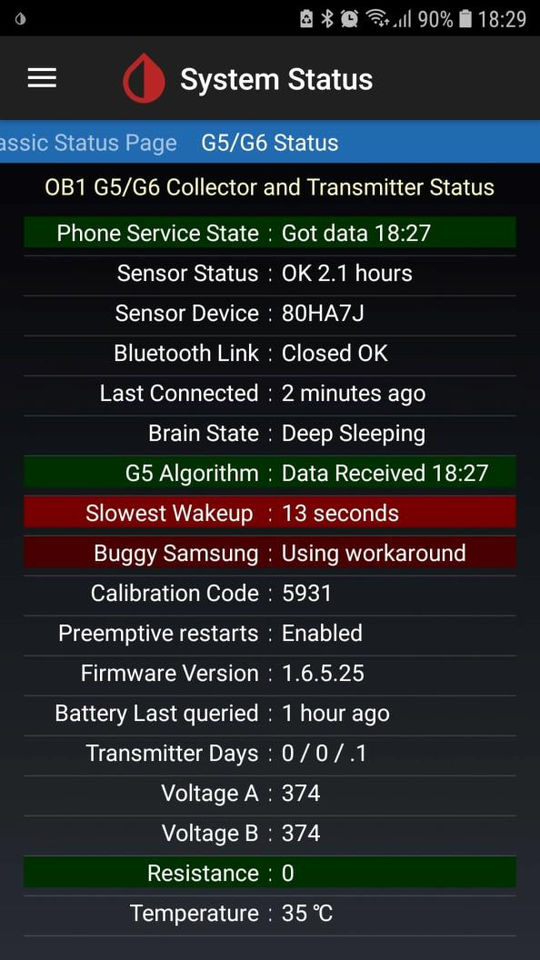
