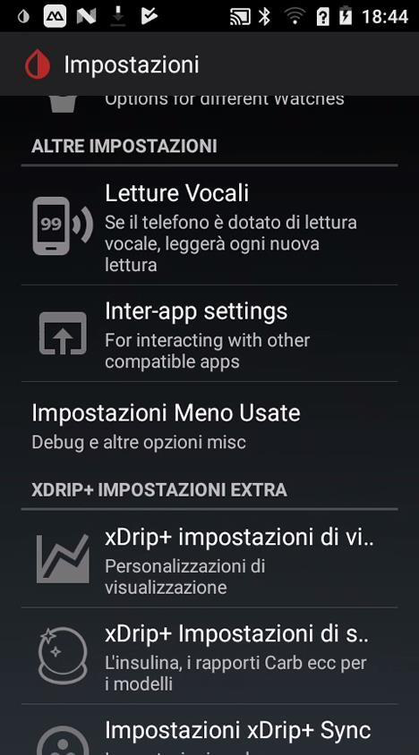
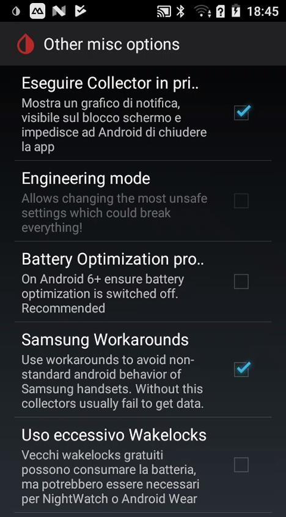
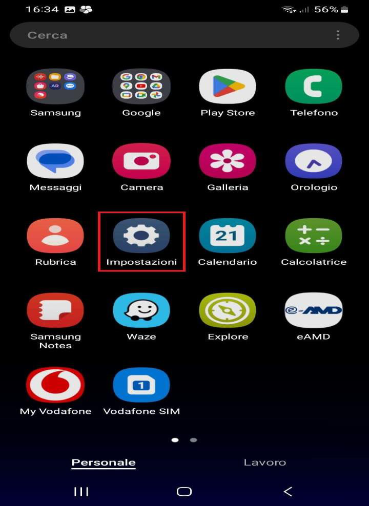
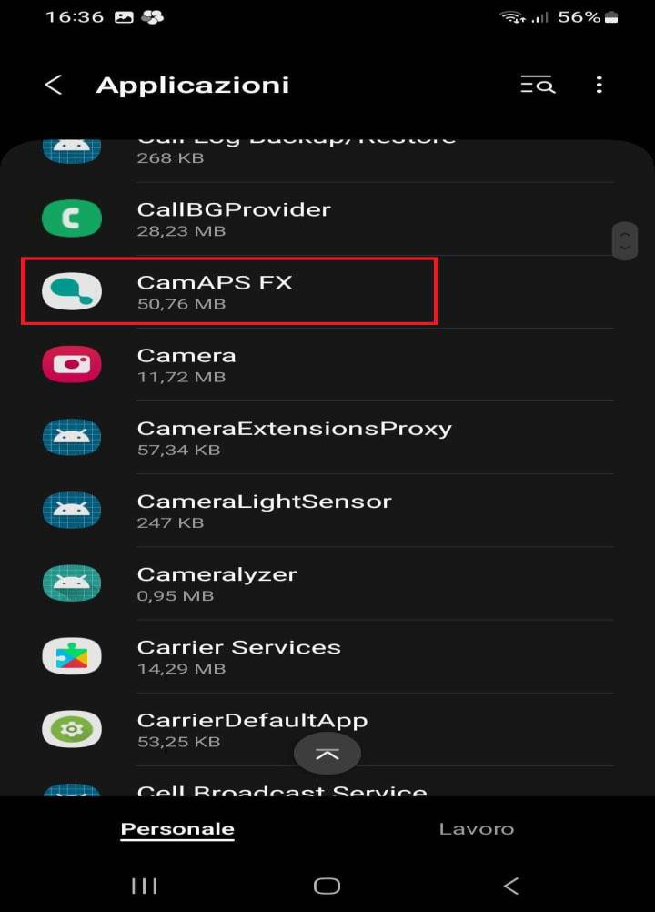
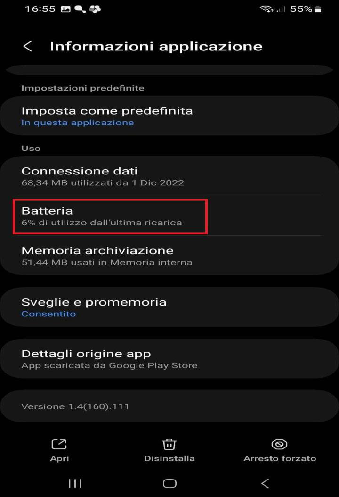
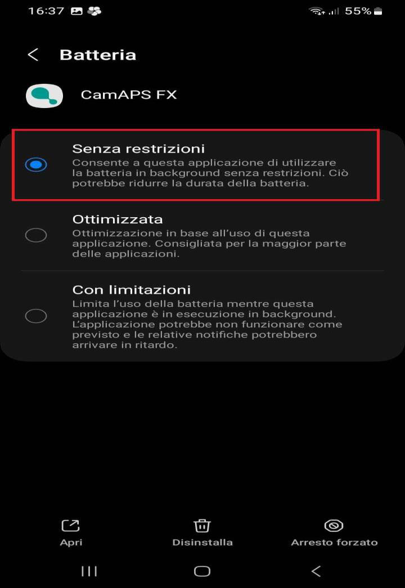

# Disabilitare il risparmio energetico per xDrip

Se xDrip smette di ricevere le letture del sensore o perde la connessione Bluetooth, la causa più comune è il risparmio energetico di Android. Segui questi due passi per risolverlo.

## 1. Verifica le impostazioni di xDrip

Apri il menù di xDrip e vai in **Impostazioni**:

Scorri in basso e apri **Impostazioni Meno Usate**, poi **Other misc options**:

Anche se le impostazioni sembrano già corrette, togli e rimetti ogni opzione per forzare l'aggiornamento:

- **Esegui sempre in background** → deve essere **abilitato**
- **Impedisci la sospensione** → deve essere **abilitato**
- **Ottimizzazione batteria** → deve essere **disabilitata**

Se usi uno smartwatch Android Wear, verifica le stesse impostazioni anche per l'app sull'orologio.

## 2. Impostazioni di Android

> ⚠️ **Attenzione**: I passaggi variano da telefono a telefono. Usa i nomi delle voci come riferimento.

xDrip **non deve essere ottimizzato** dalla batteria di Android. Stessa cosa vale per tutte le app collegate (ad esempio, l'app del follower).

**Procedura generale:**

1. Vai nelle **Impostazioni** del telefono → **Batteria** (o **Risparmio energetico**).
2. Cerca **Ottimizzazione batteria** o **App in background**.
3. Trova xDrip nell'elenco e imposta **Non ottimizzare** (o **Nessuna restrizione**).
4. Fai lo stesso per l'app follower, se ne usi una.

> ℹ️ **Nota**: Nelle schermate qui sotto è mostrata un'altra app come esempio: la procedura è identica per xDrip.

Apri le **Impostazioni** del telefono:

Vai in **Applicazioni** e seleziona l'app dall'elenco:

Nella schermata **Informazioni applicazione**, tocca **Batteria**:

Seleziona **Senza restrizioni**:

**Su Samsung:** vai in **Impostazioni** → **Cura del dispositivo** → **Batteria** → **Ottimizzazione utilizzo batteria** → cerca xDrip e seleziona **Non ottimizzare**.

Verifica anche le impostazioni **Bluetooth**: su alcuni telefoni l'ottimizzazione interrompe le scansioni Bluetooth in background.

> ℹ️ **Nota**: Se usi xDrip come follower (ricevi le letture da un altro telefono via internet), controlla anche le impostazioni di rete in background: assicurati che non vengano bloccate quando lo schermo è spento.
