# Passare da FSL 1 a FSL 2 con MiaoMiao o Bubble

Questa guida spiega come continuare a usare xDrip+ con un dispositivo ponte (MiaoMiao o Bubble) dopo aver cambiato sensore da FSL 1 a FSL 2.

Usare MiaoMiao o Bubble con il FSL 2 offre diversi vantaggi:
- Non interferisce con l'app ufficiale del fornitore.
- Il segnale Bluetooth è più stabile rispetto alla connessione diretta sensore-telefono.
- Puoi scegliere di non calibrare oppure di calibrare con diverse strategie.

> ℹ️ **Nota**: In alternativa, puoi collegare xDrip+ direttamente al FSL 2 (vedi la [guida al collegamento diretto](./l2-xdrip-collegamento-diretto)), ma potrebbe interferire con l'app ufficiale e non funziona su tutti i telefoni. Puoi anche usare Diabox o Juggluco per leggere il sensore e poi inviare la glicemia a xDrip+.

> ⚠️ **Attenzione**: **Il FSL 2 non può essere usato collegato direttamente a uno smartwatch Android Wear.**

> ⚠️ **Attenzione**: L'utilizzo è a esclusiva responsabilità personale.

---

## 1. Aggiorna xDrip+

> ⚠️ **Attenzione**: **Non disinstallare xDrip+:** aggiorna senza disinstallare per mantenere tutte le impostazioni e il collegamento con il dispositivo ponte.

1. Vai alla pagina delle release di xDrip+:
   `https://github.com/NightscoutFoundation/xDrip/releases`
2. Scarica l'ultima versione **Pre-release** espandendo la sezione **Assets**.
3. Se non riesci a scaricare toccando il link, tieni premuto e scegli **Apri in una nuova scheda** oppure **Scarica link**.

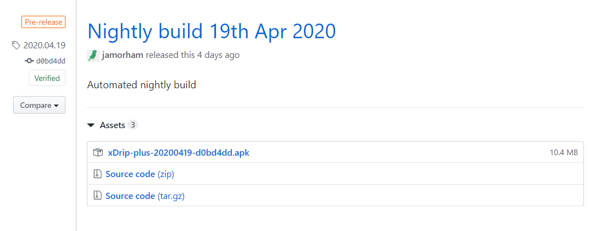

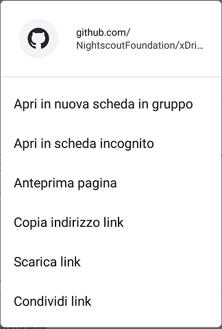

L'aggiornamento non cambia nessuna impostazione, non ferma il sensore in corso e non interrompe il collegamento con MiaoMiao o Bubble.

> ℹ️ **Nota**: Se non riesci ad aggiornare, probabilmente hai una versione non ufficiale: segui prima la [guida di installazione da zero](./installare-xdrip-android).

---

## 2. Verifica il firmware del dispositivo ponte

Dal **Menu di xDrip+ → Stato del sistema** scorri fino alla pagina **BT device** per controllare la versione firmware attuale.

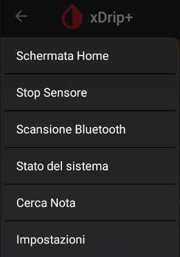

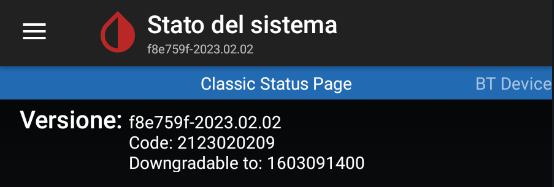

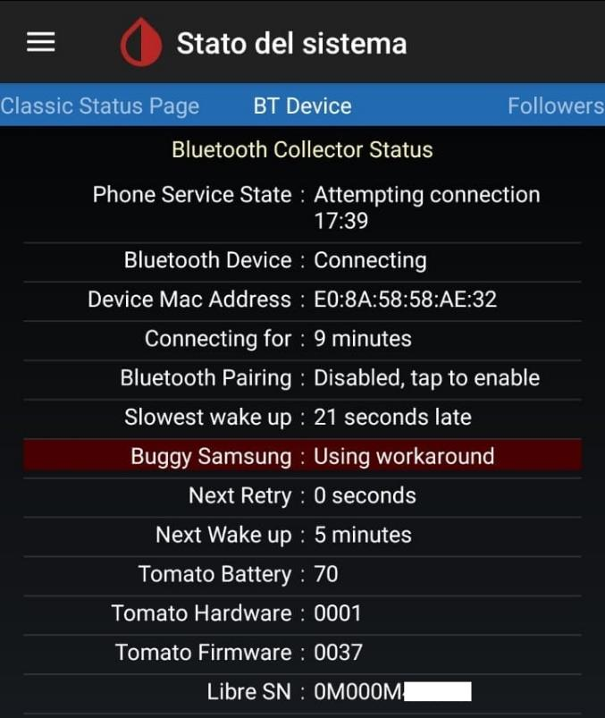

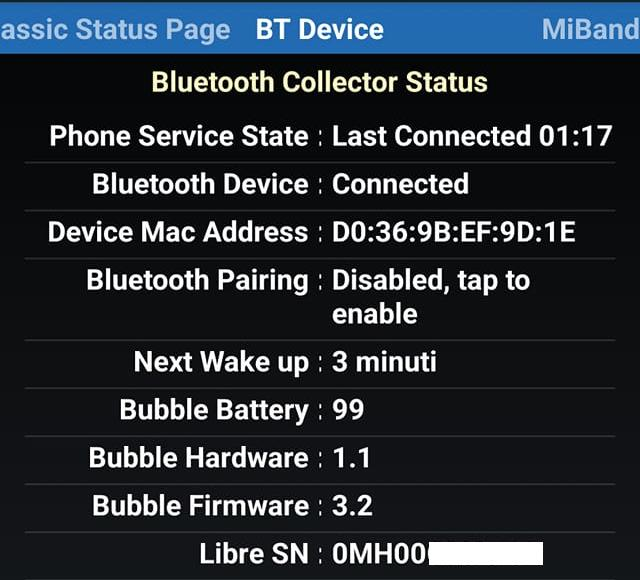

Verifica che la versione sia almeno quella minima per il FSL 2:

| Dispositivo | Firmware minimo |
|---|---|
| MiaoMiao | 39 |
| MiaoMiao 2 | 7 |
| MiaoMiao 3 | 3 |
| Bubble | 2.6 |
| Bubble Mini | 2.6 |
| Blucon | 4.2 |

> ⚠️ **Attenzione**: **Blucon:** non è possibile aggiornarne il firmware. I modelli Blucon più recenti non sono più compatibili con xDrip+.

Se il tuo firmware è già compatibile, salta direttamente al **passo 5**.

---

## 3. Aggiorna il firmware di MiaoMiao

> ℹ️ **Nota**: Se hai un Bubble, salta al passo 4.

> ℹ️ **Nota**: Se hai un MiaoMiao 3 (che è abbastanza recente), il firmware dovrebbe essere già compatibile. Verifica comunque al passo 2 prima di procedere.

1. Dal **Menu di xDrip+ → Stato del sistema**, scegli **Dimentica questo dispositivo** (lascia MiaoMiao attaccato al sensore).

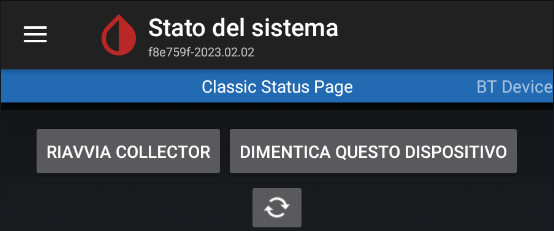

2. Scarica l'utilità di aggiornamento **usapp** da:
   `https://drive.google.com/open?id=1tZ6z1G7bjZ5qd1hEEOx79mt-kzLUbJwS`

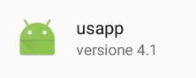

3. Avvia usapp e tocca **SEARCH MIAOMIAO**. Concedi l'accesso alla posizione (richiesto per il Bluetooth su Android).

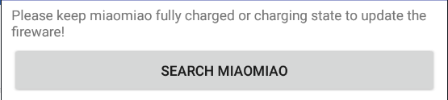

4. Quando MiaoMiao viene rilevato, tocca **UPDATE**.
   - Se non viene trovato, resettalo, mettilo in carica e riprova.

5. Scegli il firmware corretto:
   - `V39` per MiaoMiao
   - `V07` per MiaoMiao 2

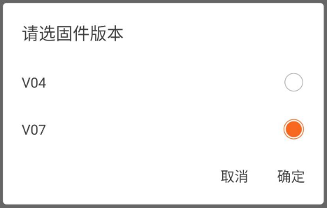

6. Conferma con **确定** (OK) e aspetta che il processo raggiunga il 100% senza interferire.

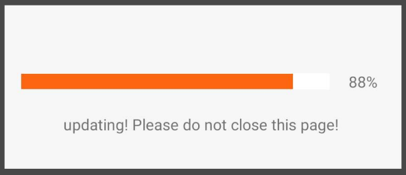

7. Al termine, disinstalla usapp. Dal **Menu principale di xDrip+**, fai **Scansione Bluetooth** per ripristinare il collegamento a MiaoMiao e verifica la versione nello stato del sistema.

**Problemi durante l'aggiornamento:**

Se usapp non funziona, prova questo metodo alternativo:
1. Installa temporaneamente l'app **Tomato** (richiede autenticazione Facebook o Google — usa Facebook e ricordati di revocare l'accesso dopo).
2. Resetta MiaoMiao: Tomato eseguirà l'aggiornamento firmware in automatico.
3. Disinstalla Tomato, resetta MiaoMiao e torna in xDrip+.
4. Esegui **Scansione Bluetooth** per riconnettere.

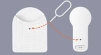

Poi procedi al **passo 5**.

---

## 4. Aggiorna il firmware di Bubble

> ℹ️ **Nota**: Lo strumento di aggiornamento disponibile su GitHub non funziona più. Per aggiornare il Bubble è necessario usare temporaneamente Diabox.

1. Dal **Menu di xDrip+ → Stato del sistema**, scegli **Dimentica questo dispositivo**.

2. Installa Diabox e segui la [guida specifica per il Bubble](https://www.glicemiadistanza.it/diabox-la-glicemia-con-e-senza-bubble/).
   - Durante la configurazione di Diabox, seleziona **Bubble** o **Bubble Mini** come dispositivo.
   - **Non selezionare FSL 2** come tipo sensore, altrimenti Diabox tenterà di leggere il sensore invece di aggiornare il Bubble.

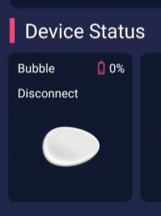

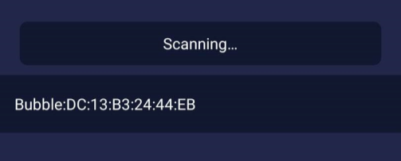

3. Lascia che Diabox aggiorni il firmware, poi disinstalla Diabox.

4. Torna in xDrip+ e fai **Scansione Bluetooth** dal menu principale. Verifica la versione firmware aggiornata in **Stato del sistema → BT device**.

---

## 5. Installa e configura OOP2

OOP2 (Out Of Process Algorithm 2) è il plugin che permette a xDrip+ di decodificare correttamente i dati del FSL 2. Senza OOP2, xDrip+ non riesce a calcolare la glicemia dal sensore.

Segui la [guida all'installazione di OOP2](./xdrip-algoritmo-esterno).

---

Una volta completata la configurazione, potrai usare il FSL 2 con xDrip+ esattamente come facevi con il FSL 1 — anzi, con risultati ancora migliori grazie all'algoritmo OOP2.
