# Installare xDrip+ per Android

Guida aggiornata al 17 settembre 2023.

xDrip+ è un'app Android gratuita e open source che permette di ricevere le letture del sensore CGM (monitor continuo della glicemia), abbinarsi a uno smartwatch e impostare allarmi personalizzati. Questa guida spiega come installarla passo dopo passo.

> ⚠️ **xDrip+ non è un dispositivo medico.** Non usarlo per prendere decisioni terapeutiche. L'utilizzo è a esclusiva responsabilità personale.

**Requisiti:** telefono Android versione 5 o superiore. Per collegare un sensore o uno smartwatch è necessario il Bluetooth 4.2 (BLE). Senza Google Play Store la funzione Sync Follower (senza Nightscout) non è disponibile.

## 1. Hai già xDrip+ installato?

**No** → vai direttamente al passo 3.

**Sì** → controlla prima la versione installata:
- Apri xDrip+, menu tre punti → **Stato del sistema**. La versione compare in alto.
- Le versioni ufficiali hanno un numero di build seguito dalla data (esempio: `2023.09.17`).
- Se vedi `dev`, `debug` o simili, non puoi aggiornare automaticamente: devi disinstallare e reinstallare.

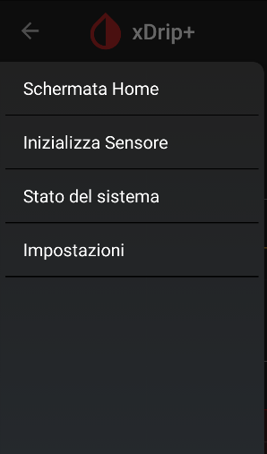

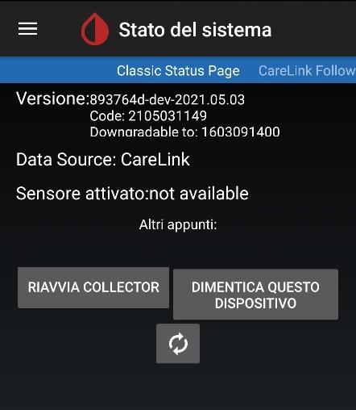

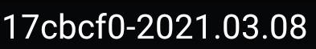

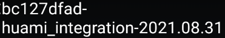

### Esegui un backup prima di disinstallare

1. Dal menu principale, vai in **Lista trattamenti** → **Esporta database** (autorizza l'accesso alla memoria se richiesto). Verifica che il file sia stato salvato con la data di oggi.

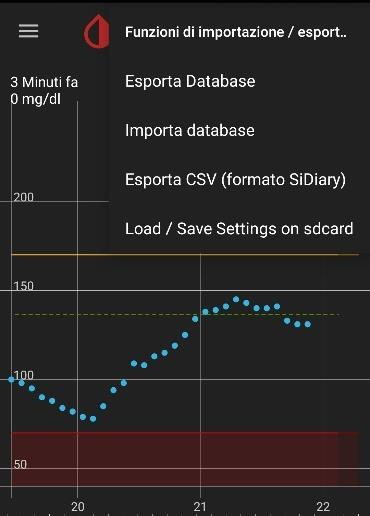

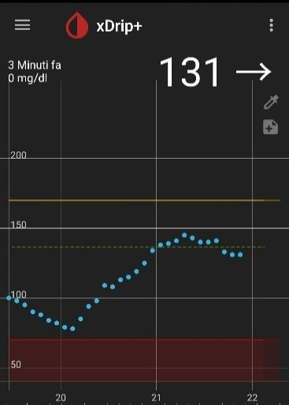

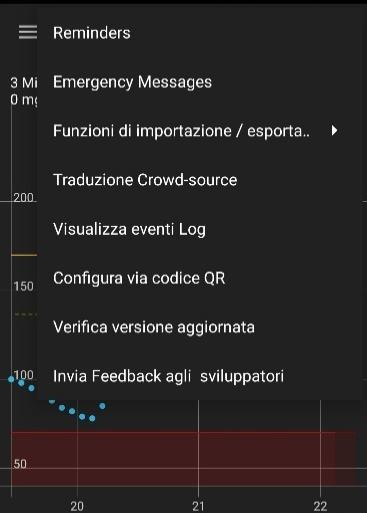

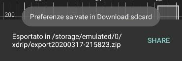

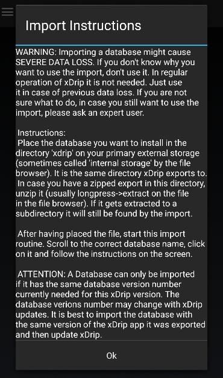

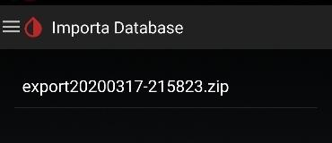

2. Per conservare anche le impostazioni, vai in **Impostazioni** → **Impostazioni xDrip+** → **Backup** → salva il codice QR (fai uno screenshot e mandalo a te stesso via WhatsApp o email).

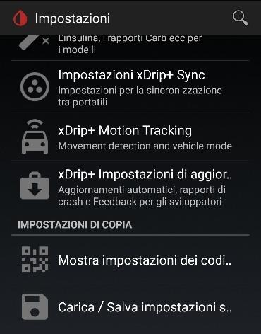

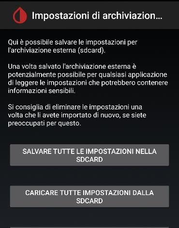

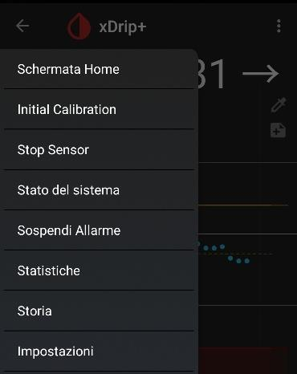

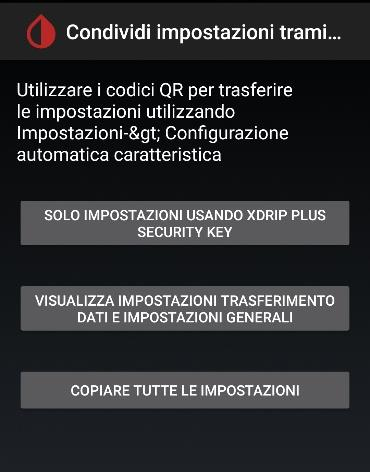

### Disinstalla xDrip+

> ⚠️ Disinstallare non significa solo rimuovere l'icona dalla schermata principale: deve apparire la pattumiera. Vai nelle **Impostazioni Android → App**, cerca xDrip+ e premi **Disinstalla**.

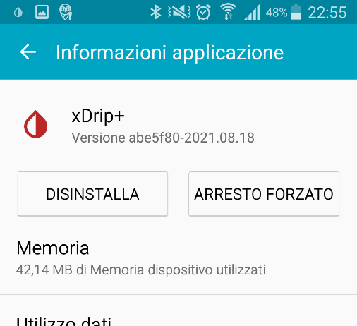

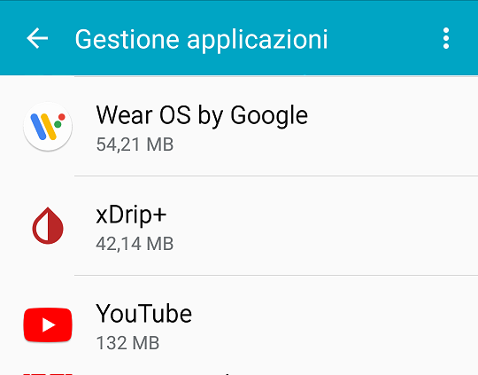

---

## 2. Quale versione installare?

Installa sempre l'ultima **Pre-release** dalla pagina ufficiale della Nightscout Foundation. Le Pre-release sono versioni testate e consigliate per l'uso quotidiano.

---

## 3. Scarica e installa xDrip+

1. Dal tuo telefono Android, vai su:
   `https://github.com/NightscoutFoundation/xDrip/releases`
2. Trova l'ultima **Pre-release** in cima alla lista.
3. Espandi la sezione **Assets** e tocca il file `.apk` per scaricarlo.
4. Se non riesci a scaricarlo, tieni premuto il link e scegli **Apri in un'altra scheda** o **Scarica link**.

**Il telefono dice che l'app non è sicura?**
xDrip+ non è sul Play Store ma è open source e sicuro se scaricato dalla pagina ufficiale. Scegli **Installa comunque** e autorizza l'installazione da sorgenti sconosciute.

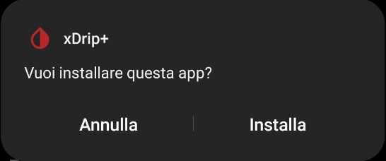

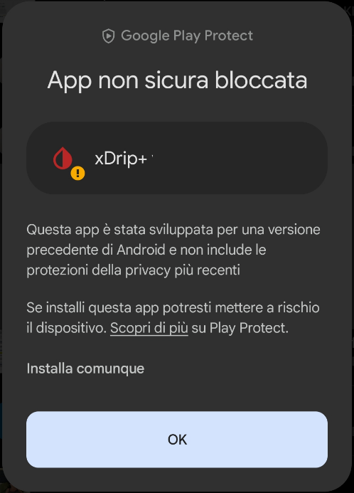

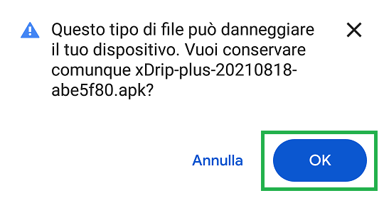

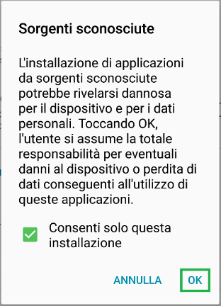

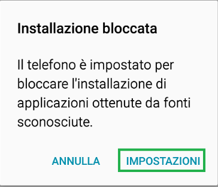

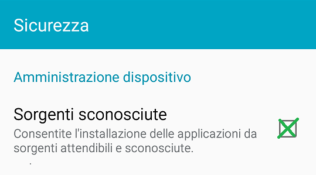

**L'ho scaricato ma non succede niente?**
Apri l'app **Archivio** o **File Manager** del telefono, vai nella cartella **Download** e tocca il file `.apk` per installarlo.

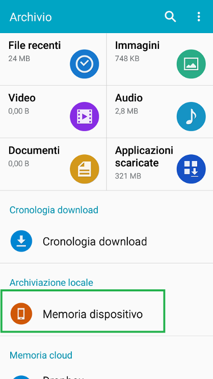

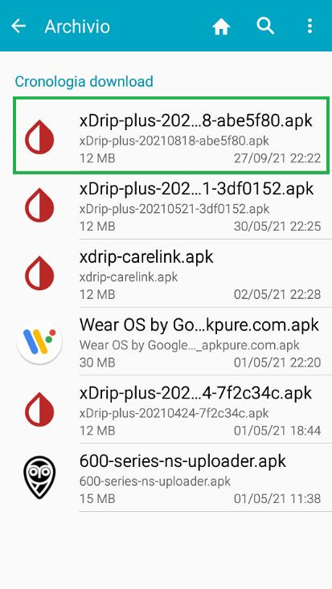

**Il file apre cartelle invece di installarsi?**
Il file deve avere estensione `.apk`. Se è stato scaricato come `.zip`, rinominalo in `.apk`.

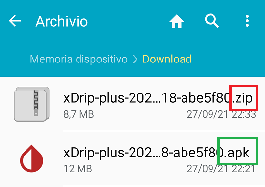

**Ancora niente?**
Scarica [APK Installer](https://play.google.com/store/apps/details?id=com.apkinstaller.ApkInstaller) dal Play Store, aprilo, vai in **Install APKs** e concedi l'accesso alla memoria. xDrip+ apparirà in **LOCAL APKS** → selezionalo e premi **INSTALL**.

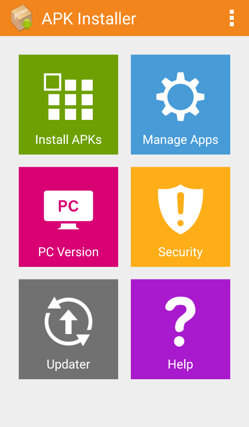

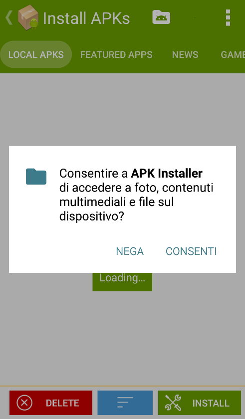

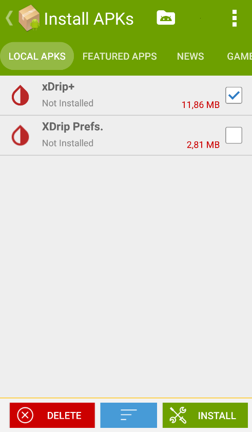

---

## 4. Prima apertura

Al primo avvio accetta le condizioni d'uso (obbligatorio per procedere). Concedi tutti i permessi che l'app richiede, inclusa la **posizione** (necessaria per il Bluetooth).

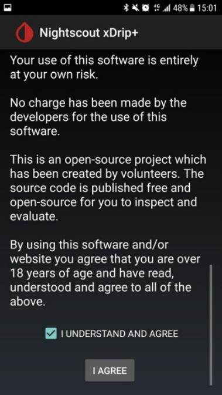

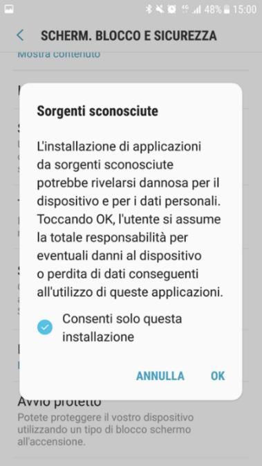

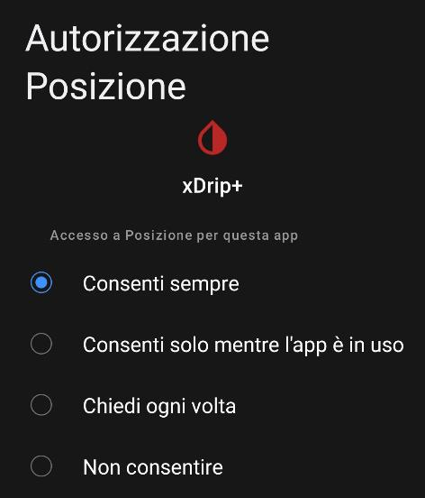

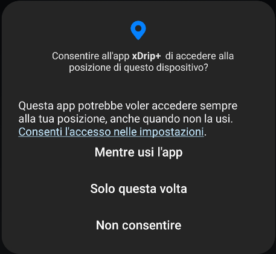

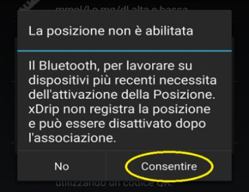

> ℹ️ Se ti viene chiesto di ignorare le ottimizzazioni della batteria, premi **Sì**. Se questa richiesta si ripresenta in futuro, vai in **Impostazioni Android → App → xDrip+** e disabilita l'ottimizzazione della batteria.

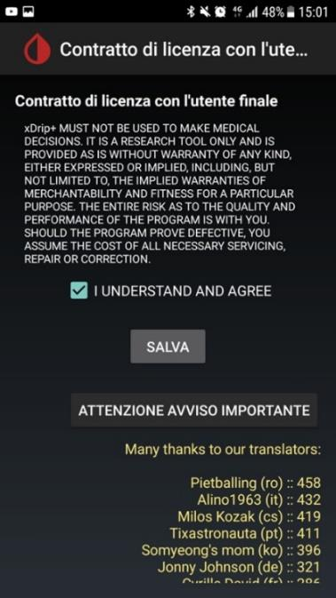

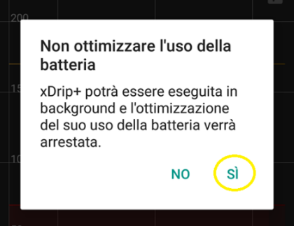

Se hai già xDrip+ installato e stai solo aggiornando, l'app si aprirà normalmente: hai finito.

---

## 5. Ripristina impostazioni e dati precedenti

> ℹ️ Se è la prima installazione, salta questo passo.

- Per ripristinare il **database** (storico glicemie): menu tre punti → **Importa database** → seleziona il file esportato al passo 1. Conferma e ripeti fino a 3 volte se necessario (alcune versioni hanno un bug noto).

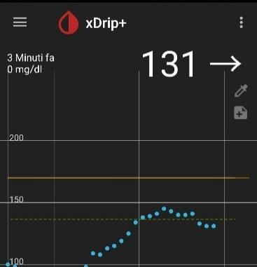

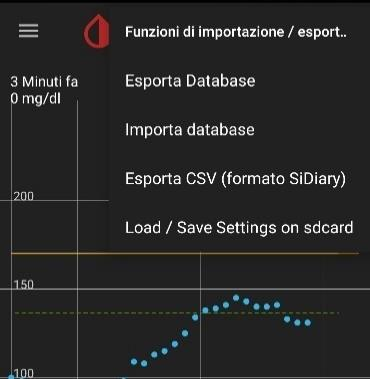

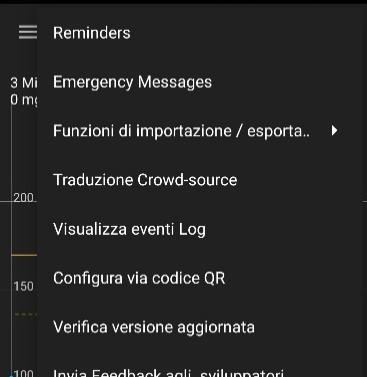

- Per ripristinare le **impostazioni**: menu tre punti → **Importa impostazioni** → scansiona il codice QR salvato in precedenza.

> ⚠️ Se questo è un telefono **master** (collegato direttamente al sensore), verifica o ricrea gli allarmi dopo il ripristino.

---

## 6. Scegli la sorgente dati

Una volta installato xDrip+, devi indicare da dove arriveranno i valori di glicemia. Tieni premuta la **goccia** nella schermata principale per aprire il menu della sorgente dati (abilita **Source Wizard Button** se non lo vedi).

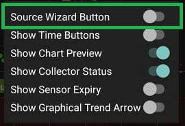

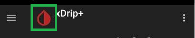

| Situazione | Sorgente da scegliere |
|---|---|
| FSL con MiaoMiao, Bubble o Blucon | **Bluetooth Bridge** |
| FSL2 collegamento diretto | **Bluetooth Bridge** |
| FSL2 app patchata / Juggluco | **640G** o come indicato nell'app |
| Dexcom G5/G6 diretto (solo esperti) | **G5/G6** |
| Follower Dexcom Share | **Dex Share Follower** |
| Follower Nightscout | **Nightscout Follower** + URL del sito |
| Follower CareLink (Medtronic) | **CareLink Follower** |
| Compagno di CamAPS / app Dexcom ufficiale | **Companion App** |
| Medtronic 640G/670G | **640G** |

> ⚠️ Se ti colleghi a Dexcom tramite Share o app ufficiale, **NON selezionare** G5 o G6 diretto.

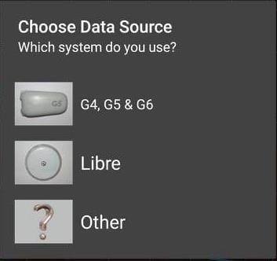

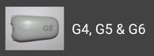

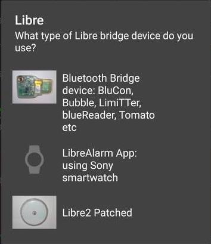

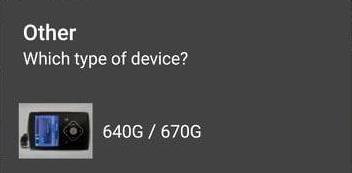

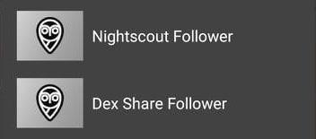

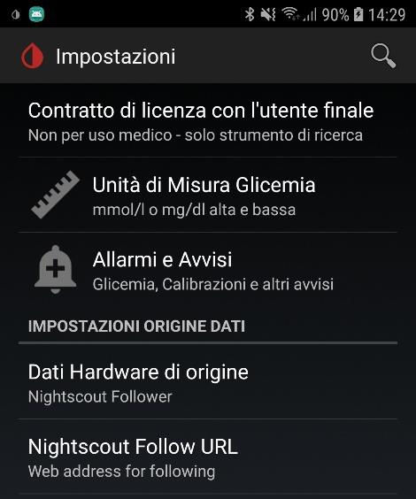

Se non trovi la sorgente che cerchi, vai in **Menu → Impostazioni → Dati hardware di origine** per la lista completa.

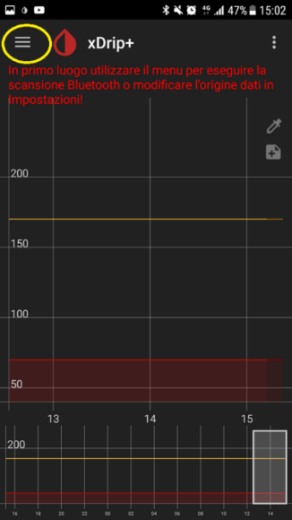

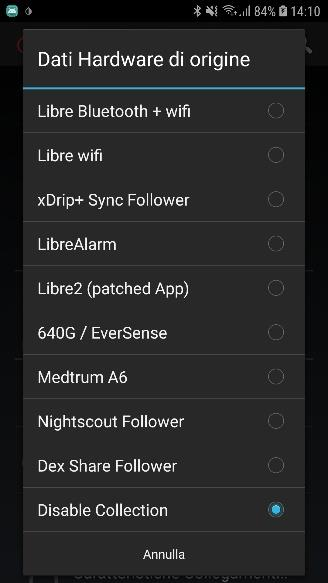

---

## Smartwatch supportati

xDrip+ invia la glicemia direttamente a questi dispositivi:
- **Android Wear OS** (quadrante dedicato)
- **Fitbit** Versa, Versa 2, Ionic
- **Samsung** Galaxy Watch, Gear S2/S3
- **Garmin** (verifica il quadrante su [apps.garmin.com](https://apps.garmin.com))
- **Xiaomi** Mi Band 4, 5, 6
- **Amazfit** Bip, GTR, GTS e altri modelli
