# Installare xDrip per Android

Guida aggiornata al 17 settembre 2023.

xDrip è un'app Android gratuita e open source che permette di ricevere le letture del sensore CGM (monitor continuo della glicemia), abbinarsi a uno smartwatch e impostare allarmi personalizzati. Questa guida spiega come installarla passo dopo passo.

> ⚠️ **xDrip non è un dispositivo medico.** Non usarlo per prendere decisioni terapeutiche. L'utilizzo è a esclusiva responsabilità personale.

**Requisiti:** telefono Android versione 8 o superiore. Per collegare un sensore o uno smartwatch è necessario il Bluetooth 4.2 (BLE). Senza Google Play Store la funzione Sync Follower (senza Nightscout) non è disponibile.

## 1. Hai già xDrip installato?

**No → vai direttamente al [passo 2](#step2).**

**Sì** → controlla prima la versione installata dal menu principale, voce **Stato del sistema**: la versione compare in alto.

- Le versioni ufficiali hanno un numero di build seguito dalla data, come in questo esempio (versione di sviluppo):

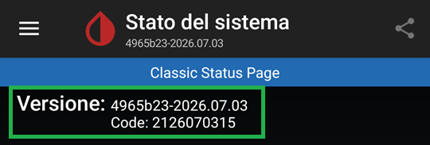

- Un numero di build "pulito" seguito solo dalla data è un buon segno:

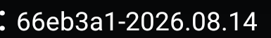

- Se vedi `dev`, `debug` o un nome di funzionalità sperimentale nel numero di build (come in questi esempi), non puoi aggiornare automaticamente: devi disinstallare e reinstallare.

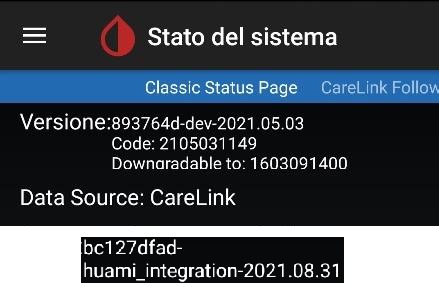

____

**Se hai una versione ufficiale, prosegui al [passo 6](#step6).**

____

### Esegui un backup prima di disinstallare

1. Dalla schermata principale, apri il menu a tre puntini in alto a destra:

Seleziona **Funzioni di importazione / esportazione**:

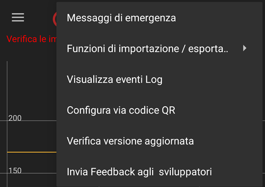

Tocca **Esporta Database** (autorizza l'accesso alla memoria se richiesto):

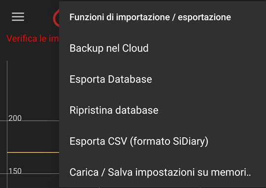

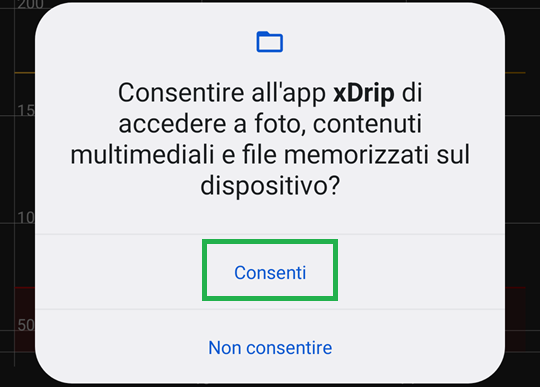

Verifica che il file sia stato salvato:

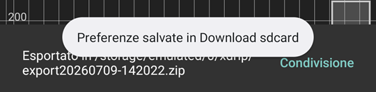

2. Per conservare anche le impostazioni, tocca **Carica/Salva impostazioni su memoria**::

   

   Tocca **Salvare tutte le impostazioni nella SDcard** (cioè direttamente sulla memoria del telefono):

   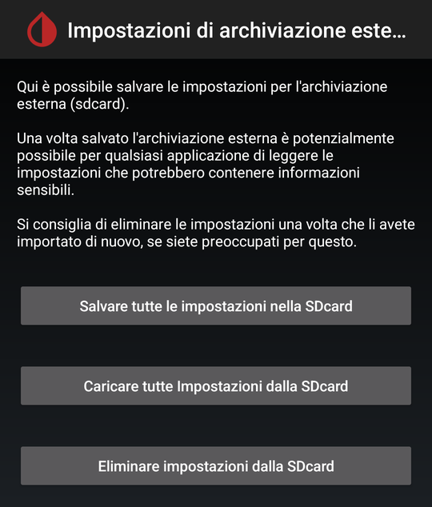

2. Se vuoi creare un altra copia di sicurezza per le impostazioni, apri il menu principale e vai in **Impostazioni**:

Scorri fino a **Impostazioni di copia** e tocca **Mostra impostazioni dei codici QR**:

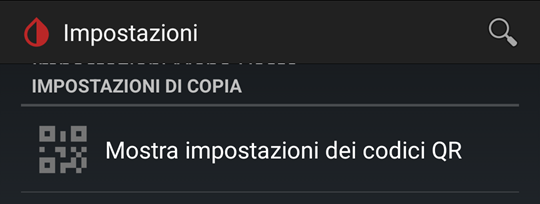

Seleziona **COPIARE TUTTE LE IMPOSTAZIONI**, salva il codice QR (fai uno screenshot e mandalo a te stesso via WhatsApp o email):

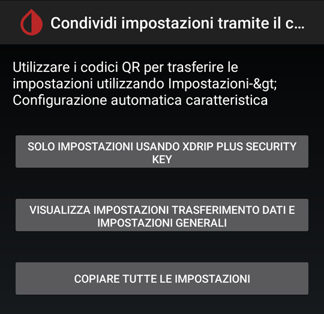

> 

### Disinstalla xDrip

> ⚠️ Disinstallare non significa solo rimuovere l'icona dalla schermata principale: deve apparire la pattumiera. Vai nelle **Impostazioni Android → App**, cerca xDrip...

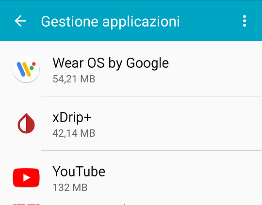

...ed entra nella sua pagina per premere **Disinstalla**:

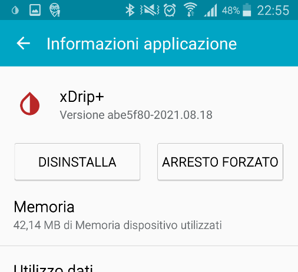

---

## 2. Quale versione installare? {#step2}

Installa sempre l'ultima **Pre-release** dalla pagina ufficiale della Nightscout Foundation. Le Pre-release sono versioni recenti con le ultime modifiche.

---

## 3. Scarica e installa xDrip

1. Dal tuo telefono Android, vai su:
   [`https://github.com/NightscoutFoundation/xDrip/releases`](https://github.com/NightscoutFoundation/xDrip/releases)
2. Trova l'ultima **Pre-release** in cima alla lista, riconoscibile dall'etichetta arancione:

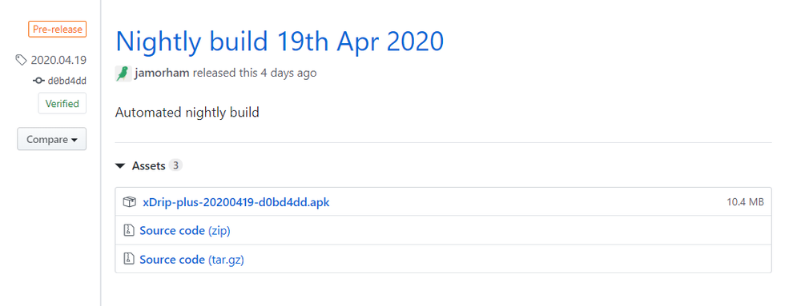

3. Espandi la sezione **Assets** e tocca il file `.apk` per scaricarlo.
4. Se non riesci a scaricarlo, tieni premuto il link e scegli **Apri in un'altra scheda** o **Scarica link**:

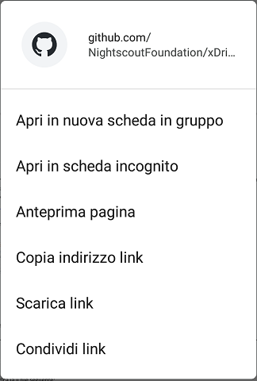

A download completato, il sistema potrebbe chiederti direttamente conferma di installazione:

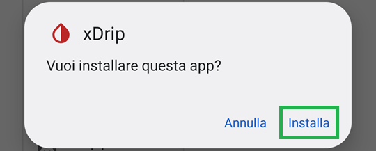

**Il telefono dice che l'app non è sicura?**
xDrip non è sul Play Store ma è open source e sicuro se scaricato dalla pagina ufficiale.

Se compare **Google Play Protect**, scegli **Altri dettagli**, quindi **Installa comunque**:

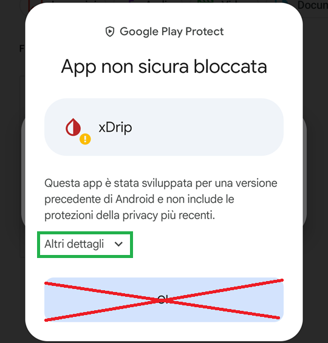

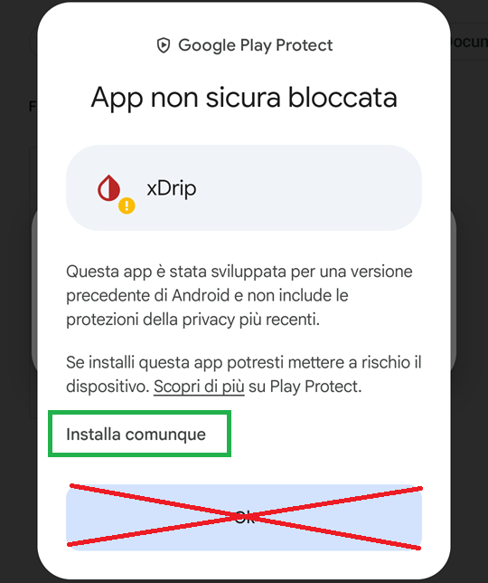

Poi autorizza l'installazione da sorgenti sconosciute:

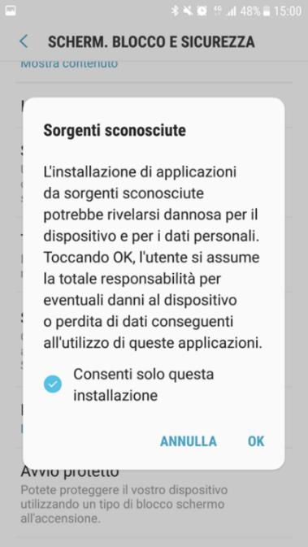

Se invece il download stesso viene segnalato come pericoloso dal browser, tocca **OK** per conservarlo comunque:

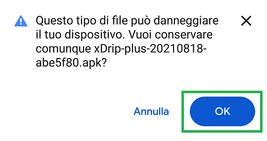

All'apertura del file, conferma di nuovo le sorgenti sconosciute:

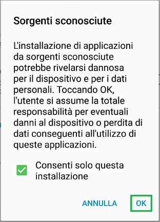

Se il telefono blocca comunque l'installazione, tocca **IMPOSTAZIONI**:

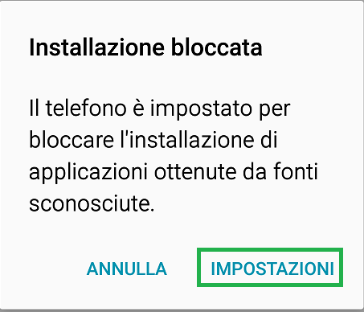

E abilita **Sorgenti sconosciute** nella sezione Sicurezza:

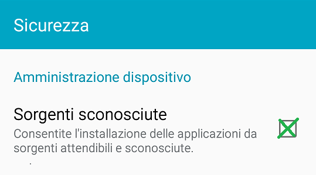

**L'ho scaricato ma non succede niente?**
Apri l'app **Archivio** o **File Manager** del telefono e vai in **Memoria dispositivo**:

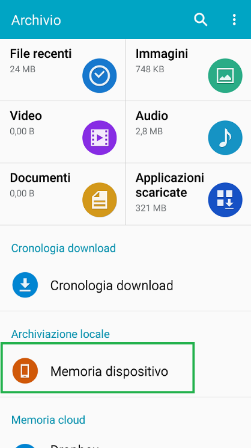

Poi entra nella cartella **Download** e tocca il file `.apk` di xDrip per installarlo:

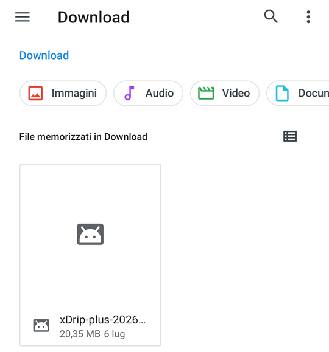

**Il file apre cartelle invece di installarsi?**
Il file deve avere estensione `.apk`.

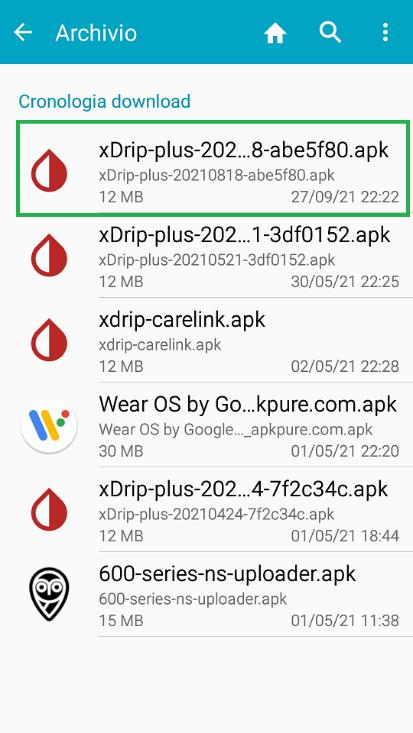

Se è stato scaricato come `.zip`, rinominalo in `.apk`:

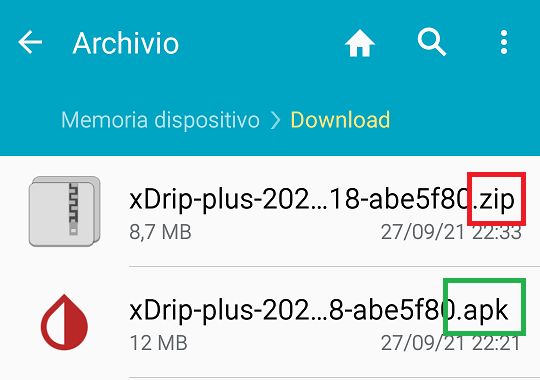

**Ancora niente?**
Cerca un'app **APK Installer** sul [Play Store](https://play.google.com/store/search?q=apk%20installer&c=apps) (ce ne sono diverse, tutte molto simili), installala, aprila e tocca **Install APKs**:

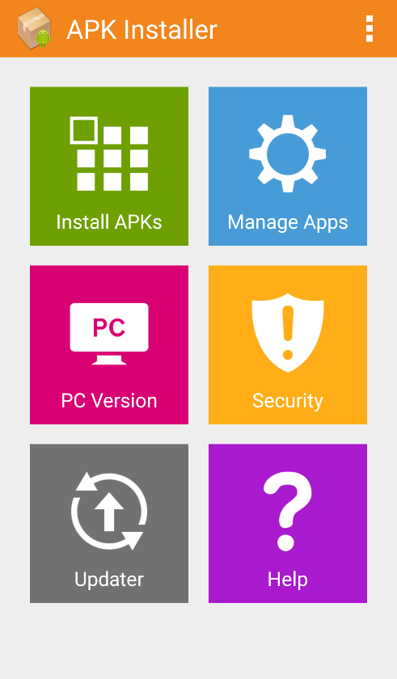

Concedi l'accesso alla memoria quando richiesto:

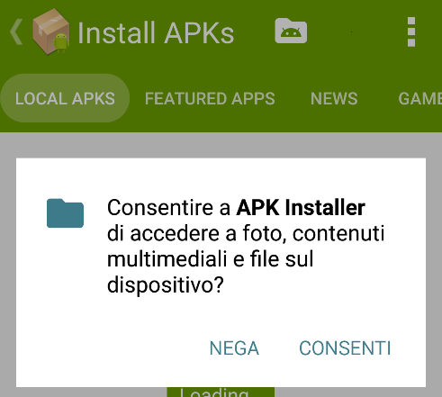

xDrip apparirà in **LOCAL APKS**: selezionalo e premi **INSTALL**:

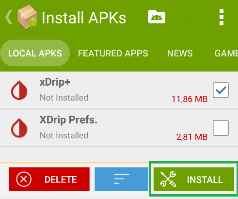

A installazione completata, tocca **Apri**:

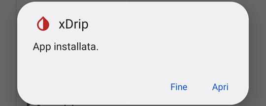

---

## 4. Prima apertura

Al primo avvio accetta le condizioni d'uso (obbligatorio per procedere):

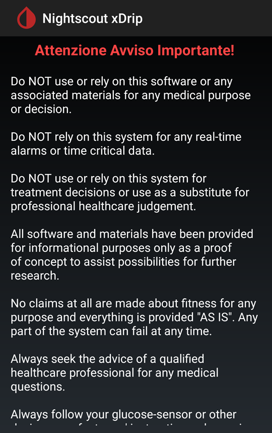

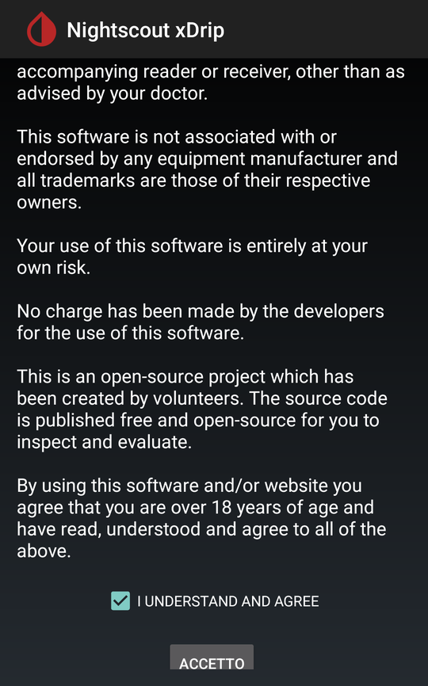

Poi il contratto di licenza con l'utente finale:

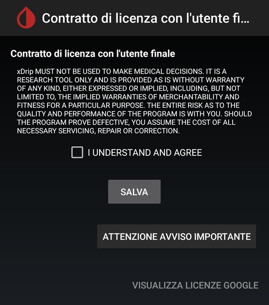

Concedi tutti i permessi che l'app richiede, inclusa la **posizione** (necessaria per il Bluetooth):

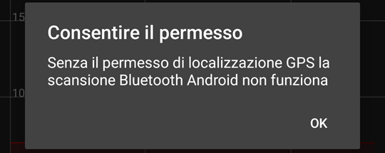

Seleziona **Consenti l'accesso nelle impostazioni**:

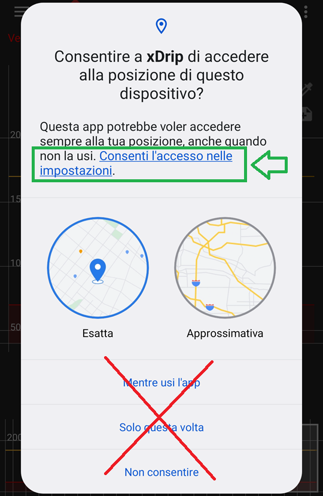

> ℹ️ **Nota**: In alcuni casi Android apre direttamente la pagina completa delle impostazioni di posizione invece del dialogo rapido:

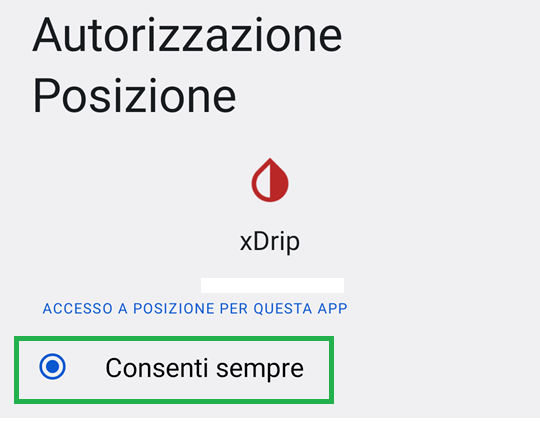

Se il Bluetooth segnala che la posizione non è abilitata, tocca **Consentire**:

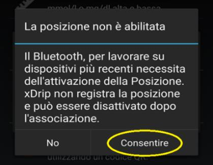

> ℹ️ Se ti viene chiesto di ignorare le ottimizzazioni della batteria, premi **Sì**. Se questa richiesta si ripresenta in futuro, vai in **Impostazioni Android → App → xDrip** e disabilita l'ottimizzazione della batteria.

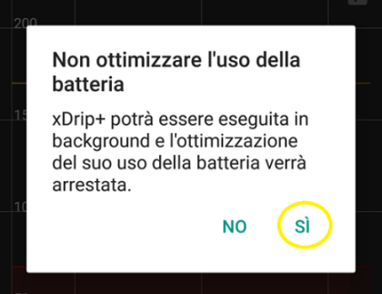

Se hai già xDrip installato e stai solo aggiornando, l'app si aprirà normalmente: hai finito.

---

## 5. Ripristina impostazioni e dati precedenti

> ℹ️ **Se è la prima installazione, salta questo passo e vai direttamente al [passo 6](#step6).**

- Per ripristinare il **database** (storico glicemie): dalla schermata principale, apri il menu a tre puntini in alto a destra...

...vai in **Funzioni di importazione / esportazione**:

e  **Ripristina database**:

Leggi l'avviso e conferma (non aggiunge i vecchi dati a quelli attuali: sostituisce l'intero database con quello che avevi salvato):

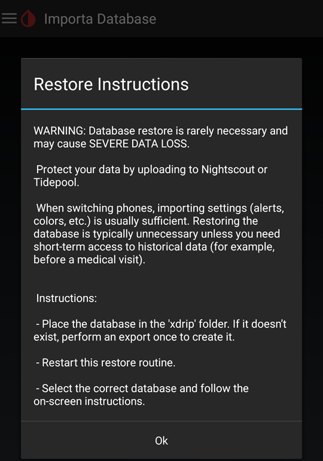

Seleziona il file esportato al passo 1.

Se non funziona, conferma e ripeti fino a 3 volte se necessario (alcune versioni hanno un bug noto):

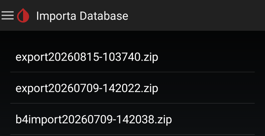

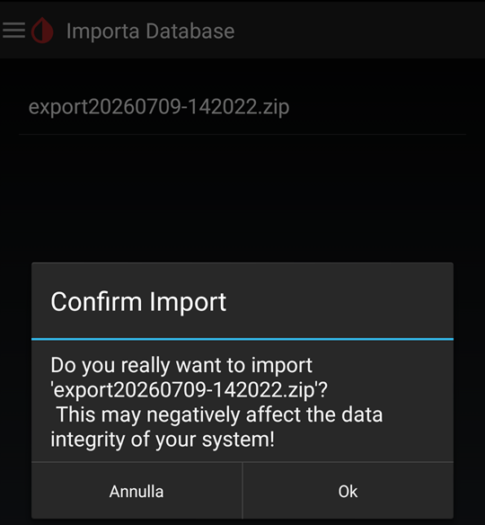

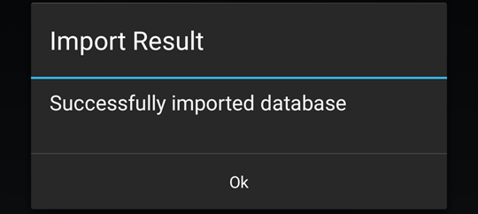

- Le impostazioni dovrebbero essere state ricaricate insieme al backup del database. Se hai già ricuperato la funzionailtà non è necessario ripristinarle.
- Per ripristinare le **impostazioni**: apri il menu 3 puntini in alto a sinistra e vai in **Carica/Salva impostazioni su memoria**::

Tocca **Caricare tutte le impostazioni dalla SDcard** :

> ⚠️ Se questo è un telefono **master** (collegato direttamente al sensore), verifica o ricrea gli allarmi dopo il ripristino.

Hai completato la reinstallazione di xDrip con la versione ufficiale, adesso potrai beneficiare degli aggiornamenti automatici e le nuove funzionalità dell'app.

Puoi proseguire la letture se vuoi modificare la configurazione che utilizzavi.

---

## 6. Scegli la sorgente dati {#step6}

Una volta installato xDrip, devi indicare da dove arriveranno i valori di glicemia, si apre la guida automatica per selezionare i sensori e servizi cloud più comuni:

| Sensore o servizio Cloud:                        | Sorgente da scegliere:                                |
| ------------------------------------------------ | ----------------------------------------------------- |
| FSL con MiaoMiao, Bubble o Blucon                | **Libre - Dispositivo Bluetooth**                     |
| FSL2 collegamento diretto                        | **Libre - Dispositivo Bluetooth**                     |
| FSL2 app patchata / Juggluco                     | **Libre - Libre2 app**                                |
| Dexcom G6/ONE/G7/ONE+ diretto **(solo esperti)** | **Dex**                                               |
| Follower Dexcom Share                            | **Altro - Dex Share Follower**                        |
| Follower LLink                                   | **Altro - Web Follower**                              |
| Follower Nightscout                              | **Altro - Nightscout Follower**                       |
| Follower CareLink (Medtronic)                    | Vedi nella [lista](#non-wizard) **Carelink Follower** |
| Compagno di CamAPS / app Dexcom ufficiale        | Vedi nella [lista](#non-wizard) **Companion App**     |
| App Dexcom BYODA / Medtronic con glucometro      | **Altro - 640G**                                      |

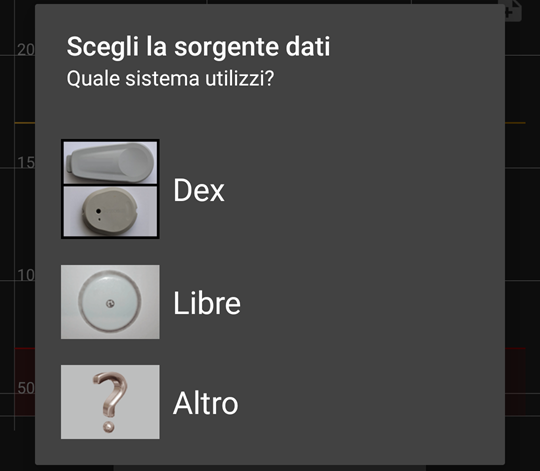

Se non si apre, tocca il pulsante AVVIA CONFIGURAZIONE GUIDATA

Se non lo vedi, tieni premuta la goccia di sangue nella schermata principale...

... e abilita il **Pulsante assistente sorgente** nelle impostazioni di visualizzazione:

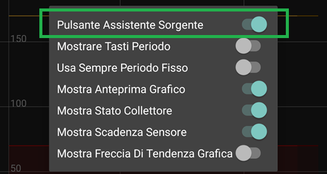

Se vuoi collegare xDrip direttamente a un sensore Dexcom, scegli **Dex**:

> ⚠️ Attenzione! Questa modalità impedisce l'uso dell'app Dexcom. Non è il metodo consigliato per iniziare a usare xDrip se hai l'app ufficiale installata. Prova prima con la modalità [Compagnon app](./xdrip-compagno.md) oppure come [follower Dexcom Share](./xdrip-follower-dexcom.md).

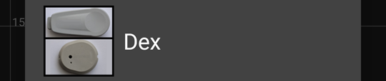

Per **Libre** con una zecca (miaomiao, Bubble, ...): seleziona Dispositivo Bluetooth.

Se vuoi usare xDrip che riceve i dati da Juggluco: seleziona Libre2 app.

Se vuoi sapere cos'era LibreAlarm: è un progetto ormai [archiviato](https://github.com/pimpimmi/LibreAlarm/wiki/).

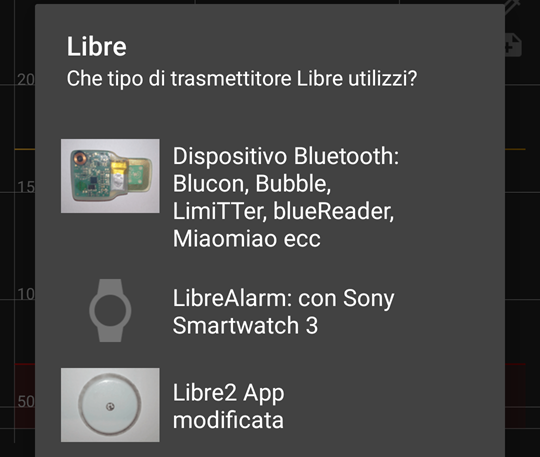

Se scegli **Other**, trovi altri sensori e soluzioni.

xDrip Sync Follower per seguire un telefonino xDrip master.

Medtrum è obsoleto: non funziona con i sensori moderni.

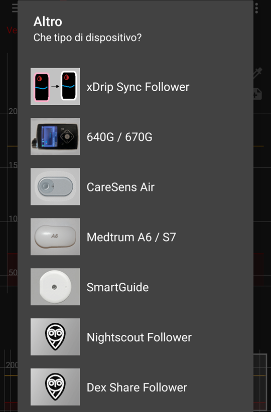

Eversense richiede l'app patchata.

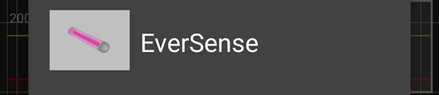

Se non vedi la sorgente che cerchi, devi selezionarla dalla lista completa:

Apri il menu e vai in **Impostazioni**:

Tocca **Dati Hardware di origine**:

Troverai l'elenco completo di tutte le sorgenti disponibili:

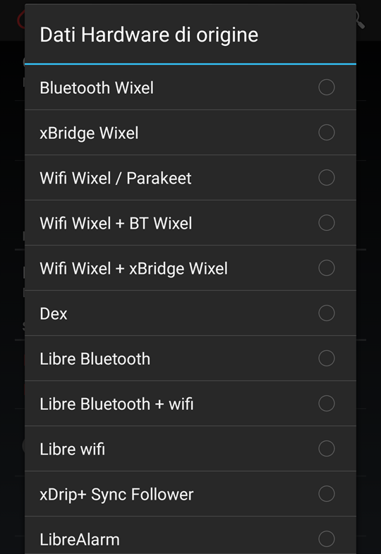

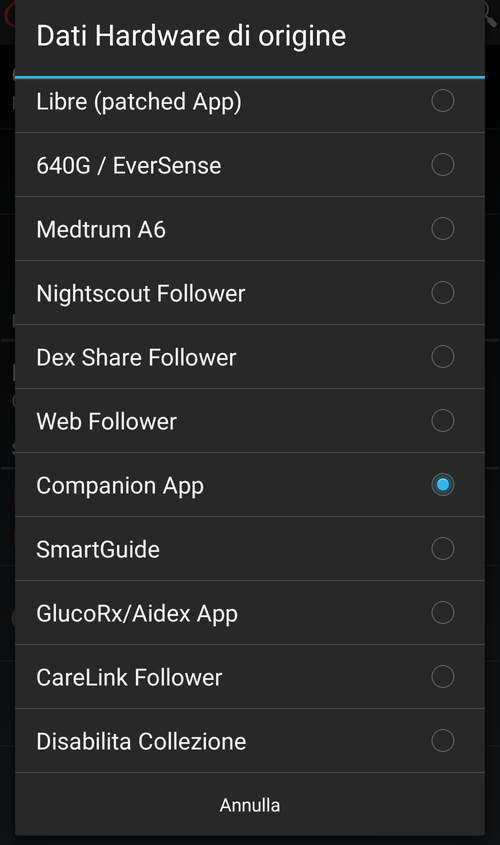

A configurazione completata, la schermata **Impostazioni** mostrerà la sorgente scelta.

