# Installare xDrip per Android

Guida aggiornata al 17 settembre 2023.

xDrip è un'app Android gratuita e open source che permette di ricevere le letture del sensore CGM (monitor continuo della glicemia), abbinarsi a uno smartwatch e impostare allarmi personalizzati. Questa guida spiega come installarla passo dopo passo.

> ⚠️ **xDrip non è un dispositivo medico.** Non usarlo per prendere decisioni terapeutiche. L'utilizzo è a esclusiva responsabilità personale.

**Requisiti:** telefono Android versione 5 o superiore. Per collegare un sensore o uno smartwatch è necessario il Bluetooth 4.2 (BLE). Senza Google Play Store la funzione Sync Follower (senza Nightscout) non è disponibile.

## 1. Hai già xDrip installato?

**No** → vai direttamente al passo 3.

**Sì** → controlla prima la versione installata dal menu principale, voce **Stato del sistema**: la versione compare in alto.

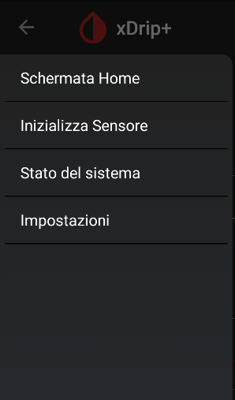

- Le versioni ufficiali hanno un numero di build seguito dalla data, come in questo esempio (versione di sviluppo):

- Un numero di build "pulito" seguito solo dalla data è un buon segno:

- Se vedi `dev`, `debug` o un nome di funzionalità sperimentale nel numero di build (come in questo esempio), non puoi aggiornare automaticamente: devi disinstallare e reinstallare.

### Esegui un backup prima di disinstallare

1. Dalla schermata principale, apri il menu a tre puntini in alto a destra:

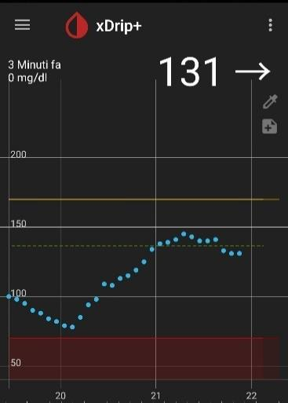

Seleziona **Funzioni di importazione / esportazione**:

Tocca **Esporta Database** (autorizza l'accesso alla memoria se richiesto):

Verifica che il file sia stato salvato con la data di oggi:

2. Per conservare anche le impostazioni, apri il menu principale e vai in **Impostazioni**:

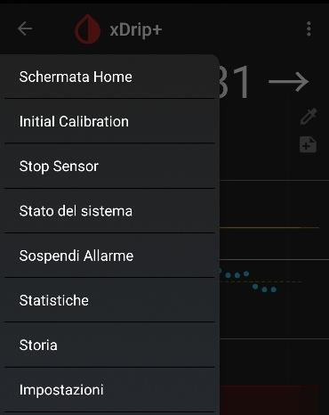

Scorri fino a **Impostazioni di copia** e tocca **Mostra impostazioni dei codici QR**:

Salva il codice QR (fai uno screenshot e mandalo a te stesso via WhatsApp o email):

> ℹ️ **Nota**: Nella stessa schermata trovi anche **Carica / Salva impostazioni sdcard**, un metodo alternativo che salva tutte le impostazioni direttamente sulla memoria del telefono invece che come codice QR:

### Disinstalla xDrip

> ⚠️ Disinstallare non significa solo rimuovere l'icona dalla schermata principale: deve apparire la pattumiera. Vai nelle **Impostazioni Android → App**, cerca xDrip...

...ed entra nella sua pagina per premere **Disinstalla**:

---

## 2. Quale versione installare?

Installa sempre l'ultima **Pre-release** dalla pagina ufficiale della Nightscout Foundation. Le Pre-release sono versioni testate e consigliate per l'uso quotidiano.

---

## 3. Scarica e installa xDrip

1. Dal tuo telefono Android, vai su:
   [`https://github.com/NightscoutFoundation/xDrip/releases`](https://github.com/NightscoutFoundation/xDrip/releases)
2. Trova l'ultima **Pre-release** in cima alla lista, riconoscibile dall'etichetta arancione:

3. Espandi la sezione **Assets** e tocca il file `.apk` per scaricarlo.
4. Se non riesci a scaricarlo, tieni premuto il link e scegli **Apri in un'altra scheda** o **Scarica link**:

A download completato, il sistema potrebbe chiederti direttamente conferma di installazione:

**Il telefono dice che l'app non è sicura?**
xDrip non è sul Play Store ma è open source e sicuro se scaricato dalla pagina ufficiale.

Se compare **Google Play Protect**, scegli **Installa comunque**:

Poi autorizza l'installazione da sorgenti sconosciute:

Se invece il download stesso viene segnalato come pericoloso dal browser, tocca **OK** per conservarlo comunque:

All'apertura del file, conferma di nuovo le sorgenti sconosciute:

Se il telefono blocca comunque l'installazione, tocca **IMPOSTAZIONI**:

E abilita **Sorgenti sconosciute** nella sezione Sicurezza:

**L'ho scaricato ma non succede niente?**
Apri l'app **Archivio** o **File Manager** del telefono e vai in **Memoria dispositivo**:

Poi entra nella cartella **Download** e tocca il file `.apk` per installarlo.

**Il file apre cartelle invece di installarsi?**
Il file deve avere estensione `.apk`. Se è stato scaricato come `.zip` (come nell'esempio a sinistra), rinominalo in `.apk` (come nell'esempio a destra):

**Ancora niente?**
Scarica [APK Installer](https://play.google.com/store/apps/details?id=com.apkinstaller.ApkInstaller) dal Play Store, aprilo e tocca **Install APKs**:

Concedi l'accesso alla memoria quando richiesto:

xDrip apparirà in **LOCAL APKS**: selezionalo...

...e premi **INSTALL**:

---

## 4. Prima apertura

Al primo avvio accetta le condizioni d'uso (obbligatorio per procedere):

Poi il contratto di licenza con l'utente finale:

Concedi tutti i permessi che l'app richiede, inclusa la **posizione** (necessaria per il Bluetooth):

Su alcune versioni di Android il dialogo si presenta in questa forma:

Se il Bluetooth segnala che la posizione non è abilitata, tocca **Consentire**:

> ℹ️ Se ti viene chiesto di ignorare le ottimizzazioni della batteria, premi **Sì**. Se questa richiesta si ripresenta in futuro, vai in **Impostazioni Android → App → xDrip** e disabilita l'ottimizzazione della batteria.

Se hai già xDrip installato e stai solo aggiornando, l'app si aprirà normalmente: hai finito.

---

## 5. Ripristina impostazioni e dati precedenti

> ℹ️ Se è la prima installazione, salta questo passo.

- Per ripristinare il **database** (storico glicemie): dalla schermata principale...

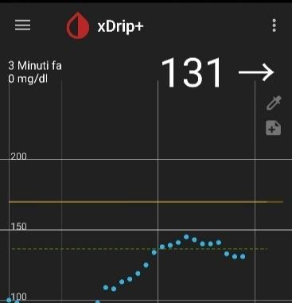

...apri il menu a tre puntini in alto a destra...

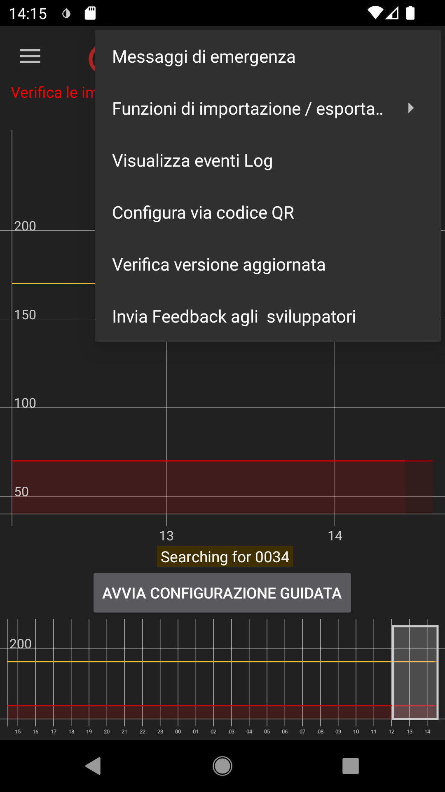

...vai in **Funzioni di importazione / esportazione** → **Importa database**:

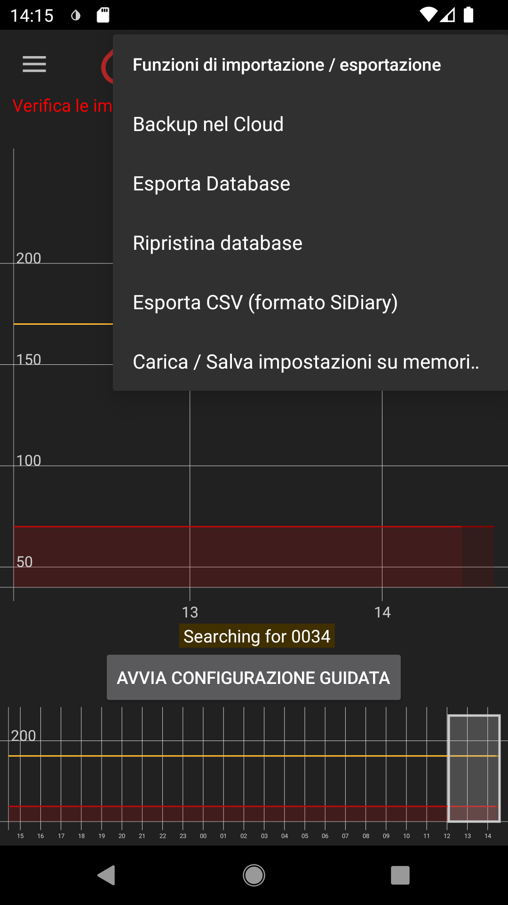

Leggi l'avviso e conferma:

Seleziona il file esportato al passo 1. Conferma e ripeti fino a 3 volte se necessario (alcune versioni hanno un bug noto):

- Per ripristinare le **impostazioni**: apri il menu principale e vai in **Impostazioni**:

Scorri fino a **Impostazioni di copia**:

Puoi usare **Mostra impostazioni dei codici QR** per scansionare il codice QR salvato in precedenza, oppure, se avevi usato il metodo sdcard, tocca **CARICARE TUTTE IMPOSTAZIONI DALLA SDCARD**:

> ⚠️ Se questo è un telefono **master** (collegato direttamente al sensore), verifica o ricrea gli allarmi dopo il ripristino.

---

## 6. Scegli la sorgente dati

Una volta installato xDrip, devi indicare da dove arriveranno i valori di glicemia. Se non vedi la goccia sulla schermata principale, abilita prima **Source Wizard Button** nelle impostazioni di visualizzazione:

Tieni premuta la **goccia di sangue** nella schermata principale...

...oppure, se la sorgente dati non è ancora configurata, tocca il pulsante **AVVIA CONFIGURAZIONE GUIDATA**:

Si apre la scelta rapida della sorgente, con le opzioni **G4, G5 & G6**, **Libre** e **Other**:

Se usi un Dexcom, scegli **G4, G5 & G6**:

Se scegli **Libre**, puoi indicare il tipo di dispositivo ponte:

Se scegli **Other**, trovi tra le altre l'opzione 640G/670G:

Sono disponibili anche i follower via cloud (Nightscout, Dexcom Share)...

...e il follower CareLink per i dispositivi Medtronic:

| Situazione | Sorgente da scegliere |
|---|---|
| FSL con MiaoMiao, Bubble o Blucon | **Bluetooth Bridge** |
| FSL2 collegamento diretto | **Bluetooth Bridge** |
| FSL2 app patchata / Juggluco | **640G** o come indicato nell'app |
| Dexcom G5/G6 diretto (solo esperti) | **G5/G6** |
| Follower Dexcom Share | **Dex Share Follower** |
| Follower Nightscout | **Nightscout Follower** + URL del sito |
| Follower CareLink (Medtronic) | **CareLink Follower** |
| Compagno di CamAPS / app Dexcom ufficiale | **Companion App** |
| Medtronic 640G/670G | **640G** |

> ⚠️ Se ti colleghi a Dexcom tramite Share o app ufficiale, **NON selezionare** G5 o G6 diretto.

Se non trovi la sorgente che cerchi, xDrip te lo ricorda direttamente sulla schermata principale:

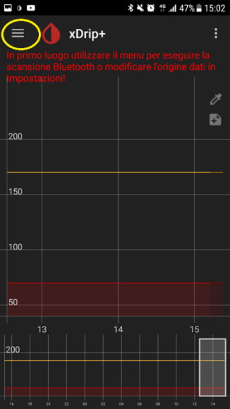

Apri il menu e vai in **Impostazioni**:

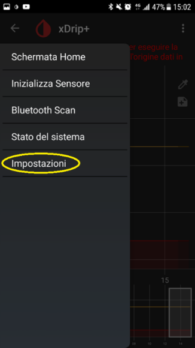

Tocca **Dati Hardware di origine**:

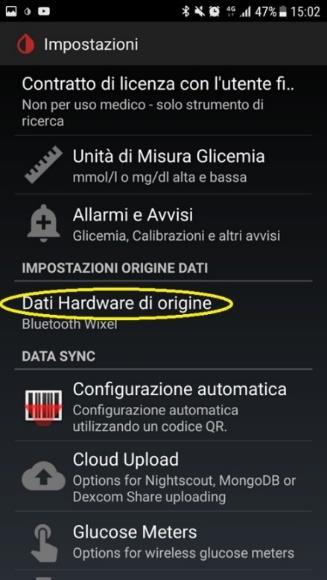

Troverai l'elenco completo di tutte le sorgenti disponibili:

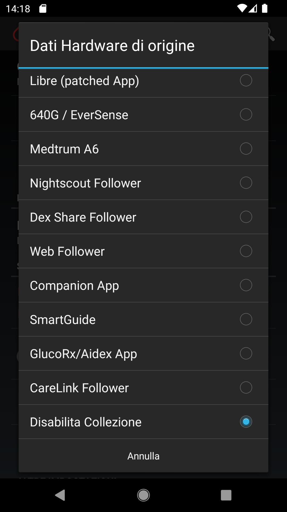

A configurazione completata, la schermata **Impostazioni** mostrerà la sorgente scelta (in questo esempio, **Nightscout Follower** con il relativo campo URL):

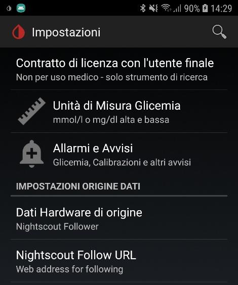

---

## Smartwatch supportati

xDrip invia la glicemia direttamente a questi dispositivi:
- **Android Wear OS** (quadrante dedicato)
- **Fitbit** Versa, Versa 2, Ionic
- **Samsung** Galaxy Watch, Gear S2/S3
- **Garmin** (verifica il quadrante su [apps.garmin.com](https://apps.garmin.com))
- **Xiaomi** Mi Band 4, 5, 6
- **Amazfit** Bip, GTR, GTS e altri modelli
