# Ricevere le letture dal FSL2 con xDrip+ (collegamento diretto)

Questa guida spiega come collegare il sensore FSL2 direttamente a xDrip+ tramite Bluetooth, senza usare MiaoMiao, Bubble o Blucon.

> ℹ️ L'app ufficiale del fornitore permette già la lettura continua senza scansionare. Usa xDrip+ con questa modalità solo se hai bisogno di funzioni aggiuntive (smartwatch, allarmi, Nightscout). xDrip+ non invia dati ai server del fornitore.

> ⚠️ Collegare il FSL2 direttamente a xDrip+ disabilita gli allarmi Bluetooth sull'app ufficiale e sul lettore 2. **Non richiedere la sostituzione di sensori che smettono di mandare allarmi Bluetooth dopo aver usato xDrip+ in collegamento diretto.** Puoi comunque continuare a scansionare il sensore con l'app del fornitore o con il lettore.

> ⚠️ L'utilizzo è a esclusiva responsabilità personale.

**Requisiti:** telefono Android con Bluetooth 4.2 (BLE) e **NFC**. Se il telefono perde frequentemente la connessione con l'app ufficiale, probabilmente avrà lo stesso problema con xDrip+.

## 1. Installa o aggiorna xDrip+

Segui la [guida base di installazione](./installare-xdrip-android).

Dopo l'installazione, imposta la **sorgente dati**:
1. Tieni premuta la goccia di sangue nella schermata principale (o vai in **Menu → Impostazioni → Dati hardware di origine**).
2. Seleziona **Libre Bluetooth**.
3. Conferma la scelta.

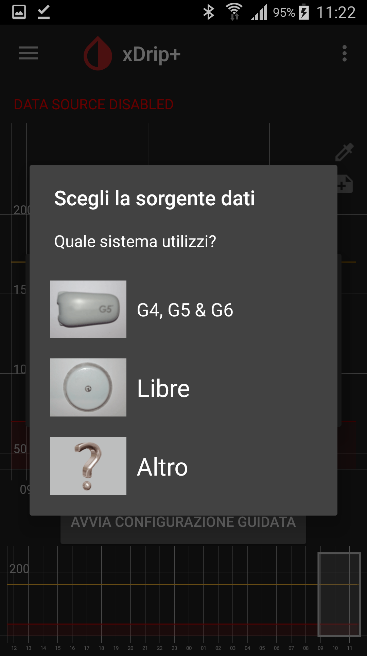

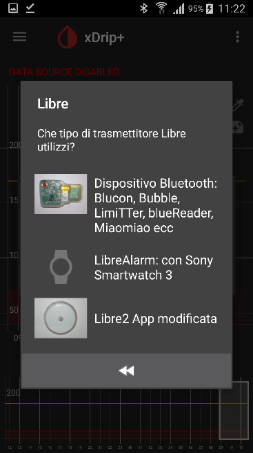

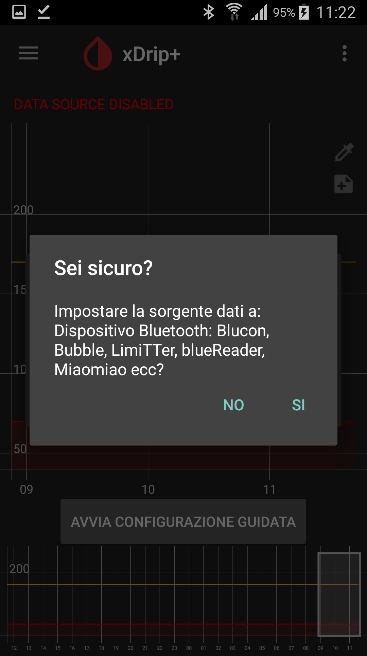

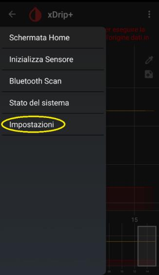

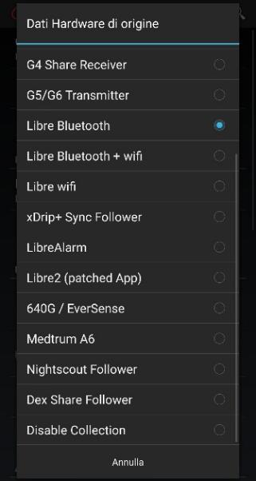

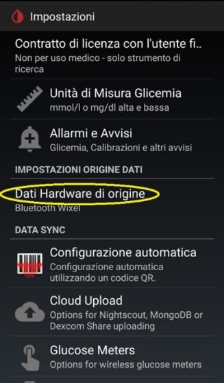

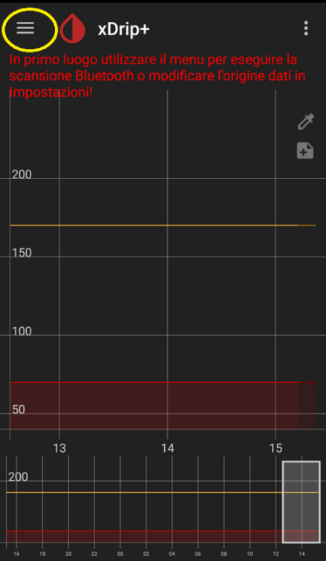

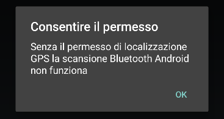

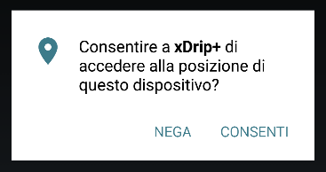

## 2. Installa l'app OOP2

OOP2 (Out Of Process Algorithm versione 2) decodifica i dati del FSL2. Senza questa app xDrip+ non riesce a leggere il sensore.

Segui la [guida per installare OOP2](./xdrip-algoritmo-esterno).

## 3. Configura NFC in xDrip+

1. Dal menu principale, vai in **Funzionalità Scansione NFC**.
2. Conferma l'avvertimento.
3. Abilita **Usa funzionalità NFC**.
4. Configura le altre opzioni esattamente come mostrato nelle impostazioni consigliate dell'app.

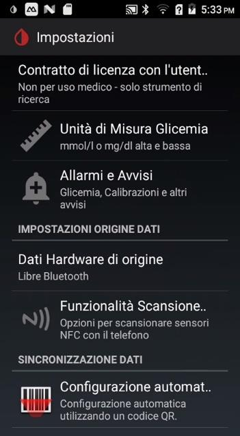

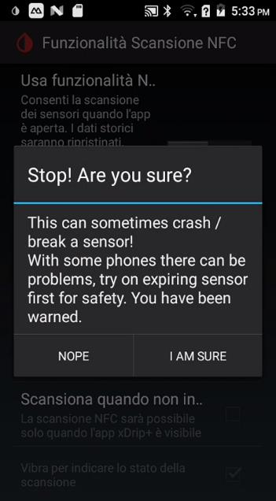

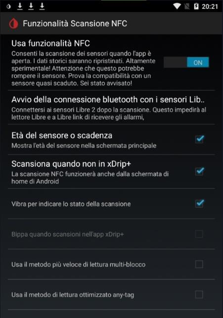

## 4. Configura Bluetooth in xDrip+

1. Vai in **Impostazioni → Impostazioni meno usate → Impostazioni Bluetooth**.
2. Imposta le opzioni esattamente come indicato nell'app (le impostazioni predefinite di solito vanno bene).

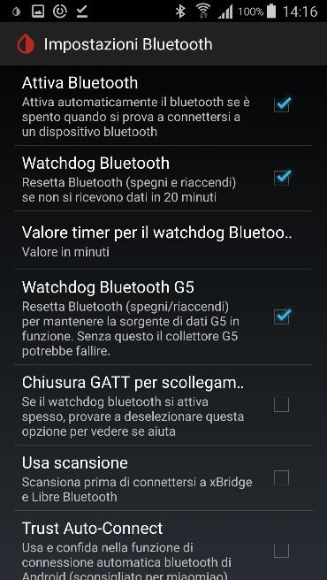

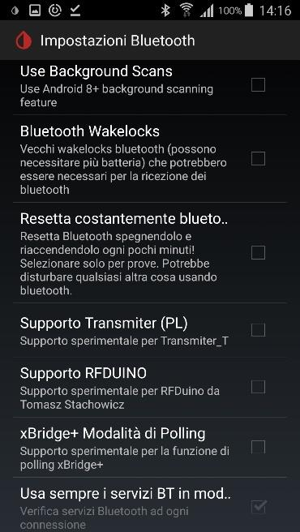

> ℹ️ In caso di problemi di connessione, prova a modificare le opzioni **Usa scansione** e **Usa Background Scans**. Se perdi la connessione, il modo più rapido per recuperarla è **Riavvia Collector** seguito da una scansione NFC del sensore.

## 5. Collega il sensore a xDrip+

> ⚠️ Il sensore deve essere stato avviato (con l'app del fornitore o con il lettore 2) da **almeno un'ora** prima di procedere.

1. Se hai l'app del fornitore installata, è consigliato disinstallarla per evitare conflitti NFC. Puoi comunque scansionare il sensore con il lettore fisico.
2. Esci da xDrip+ prima di scansionare (la scansione funziona meglio così).
3. Avvicina il telefono al sensore come faresti con l'app ufficiale. La scansione con xDrip+ dura più a lungo: non muovere il telefono e riprova se non riesce al primo tentativo.
4. Dopo la scansione, seleziona **Connettiti a questo sensore FSL2** e abilita **Non chiedermelo più**.

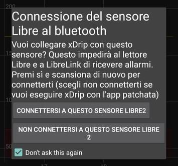

5. In **Funzionalità Scansione NFC**, verifica che il parametro Bluetooth sia impostato su **Connettiti sempre ai sensori FSL2**.

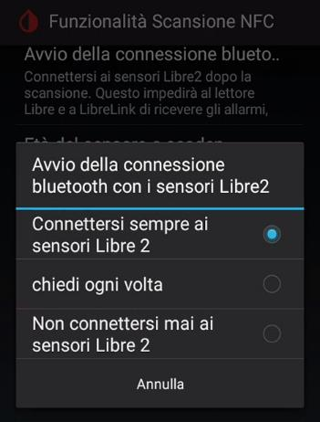

## 6. Avvia il sensore in xDrip+

> ⚠️ xDrip+ non può avviare fisicamente un nuovo sensore: usa sempre l'app del fornitore o il lettore per la prima attivazione. Questo passo serve solo a far sapere a xDrip+ quando il sensore è stato avviato.

1. Dal menu: **Inizializza Sensore** → **Start Sensor**.

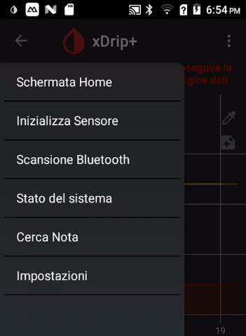

2. Indica quando è stato attivato:
   - **Oggi:** seleziona **Sì, oggi**
   - **Prima di oggi:** seleziona **Non oggi** e inserisci l'orario esatto di attivazione

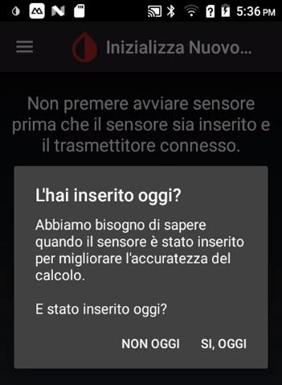

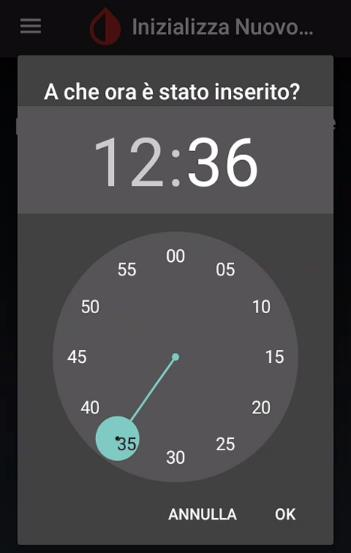

> ℹ️ Se il sensore è stato avviato da meno di un'ora, dovrai aspettare prima di ricevere le letture.

**Verifica il collegamento:**
In **Menu → Stato del sistema → BT Device**: il sensore appare come un dispositivo con il suo numero di serie. La sorgente dati "LimiTTer" è normale.

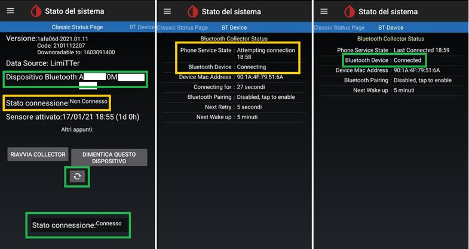

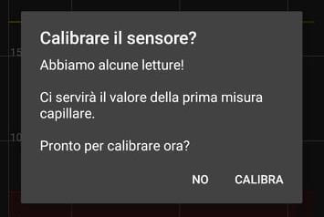

> ℹ️ La pagina "Classic Status Page" non si aggiorna in tempo reale: usa la scheda successiva (**BT Device**) per lo stato aggiornato.

Scansiona con NFC ogni 5 minuti se il collegamento non si stabilisce. Tieni il telefono vicino al sensore. Il primo collegamento può richiedere più di 20 minuti.

**In caso di problemi:**
1. Vai in **Stato del sistema → BT Device** → **Forget device**
2. Poi **Stop sensore**
3. Scansiona il sensore con NFC
4. Dopo la conferma di scansione, avvia nuovamente il sensore in xDrip+

---

## Passi successivi

- **Condividi la glicemia con altri telefoni Android:** vedi la guida sulla condivisione xDrip+ Sync
- **Condividi con iPhone o altri dispositivi:** usa [Nightscout](../nightscout/nightscoutgooglecloud)
- **Condividi i dati con il diabetologo:** usa [Tidepool](./condividere-i-dati-di-xdrip-con-tidepool)
