# Configurazione Master/Follower con xDrip+ e MiaoMiao

Questa guida spiega come trasferire il collegamento MiaoMiao (il lettore Bluetooth per il FSL) da un telefono all'altro, impostando un telefono come **master** (quello che legge il sensore) e l'altro come **follower** (quello che riceve le letture a distanza).

## 1. Prepara il telefono attualmente collegato a MiaoMiao

Metti questo telefono in **modalità aereo**. In questo modo, se qualcosa va storto, puoi ripristinare rapidamente la configurazione che funzionava.

## 2. Configura il secondo telefono

Sul telefono che non è ancora collegato a MiaoMiao, apri xDrip+ e scansiona il codice QR del primo telefono per copiare le impostazioni.

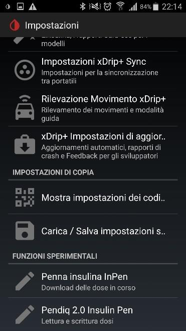

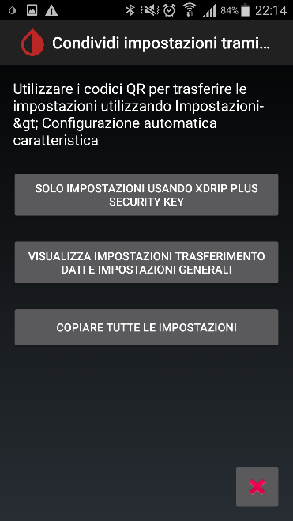

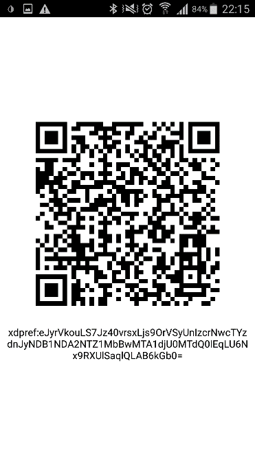

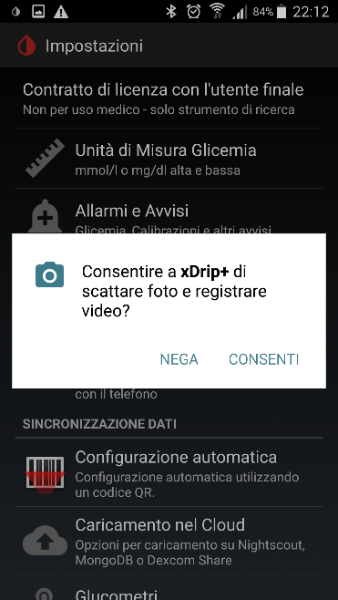

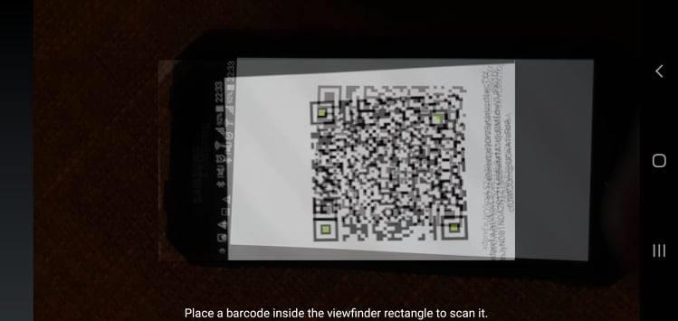

Ora hai due telefoni con xDrip+ identici. Scegli quale sarà il **master** (collegato a MiaoMiao) e quale sarà il **follower** (che riceve le letture).

## 3. Configura il master

Sul telefono scelto come master:

1. Ripristina il collegamento con MiaoMiao.
2. Riavvia il sensore se necessario.

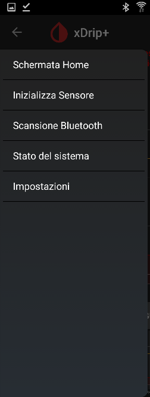

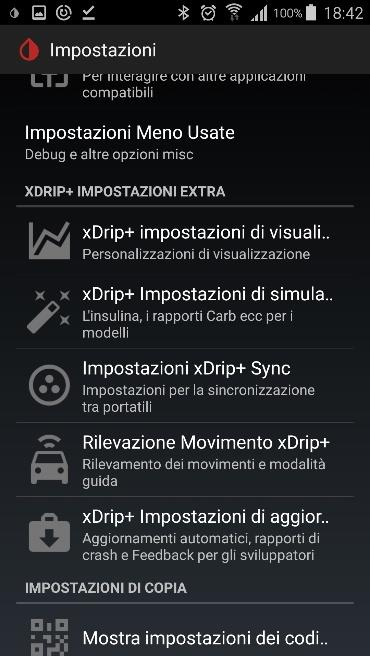

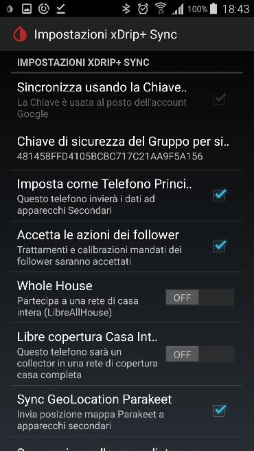

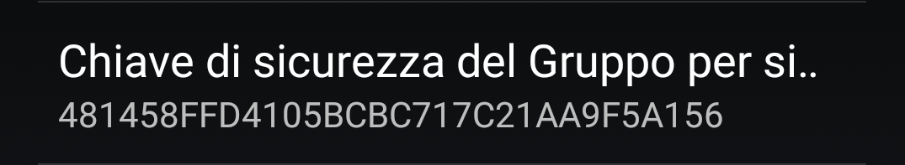

> ⚠️ Il nuovo telefono potrebbe richiedere una calibrazione all'avvio del sensore.

> ℹ️ Può esserci **un solo master** alla volta.

## 4. Configura il follower

Sul telefono scelto come follower:

1. Togli la modalità aereo.
2. Attendi qualche minuto: le letture dal master dovrebbero arrivare a breve.

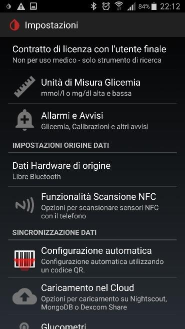

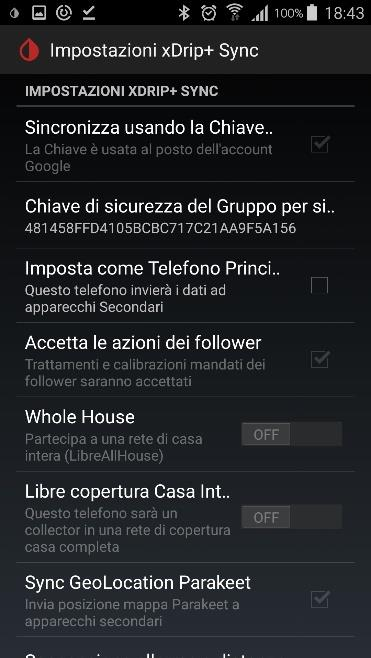

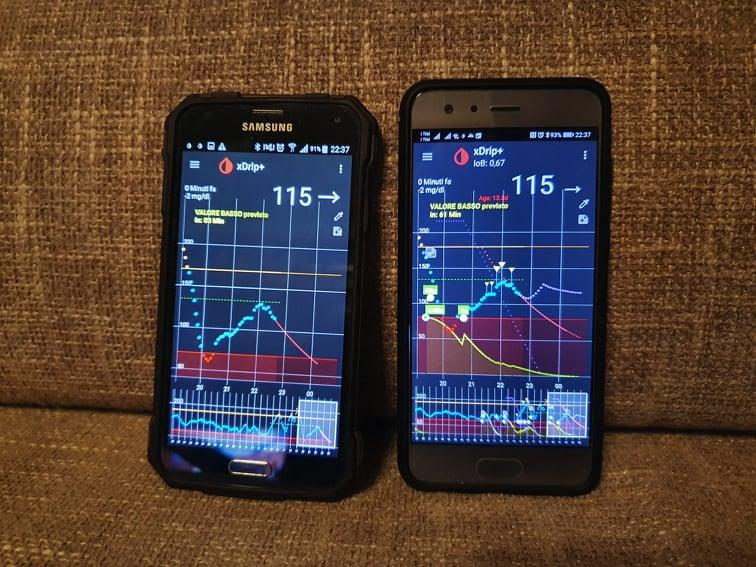
