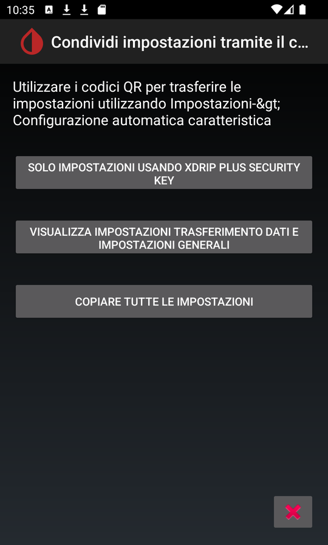
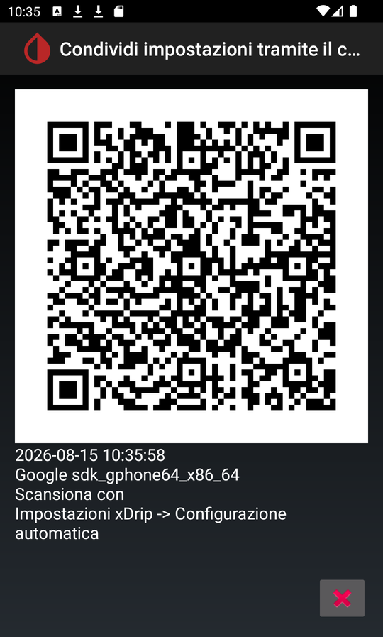
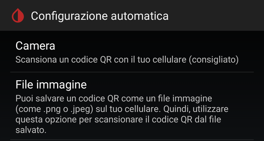
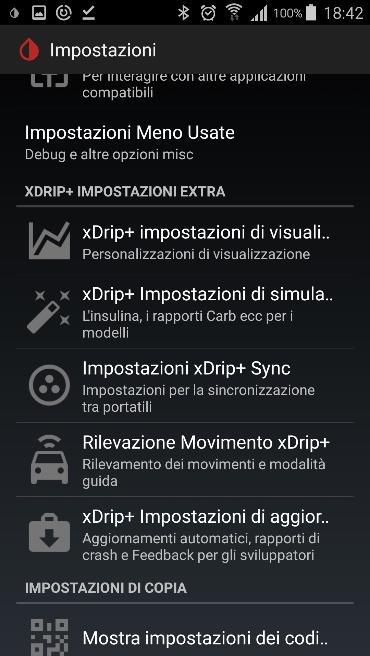
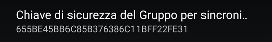
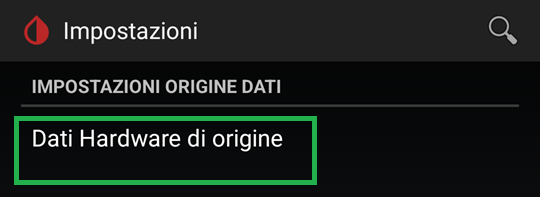
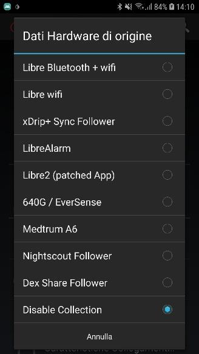
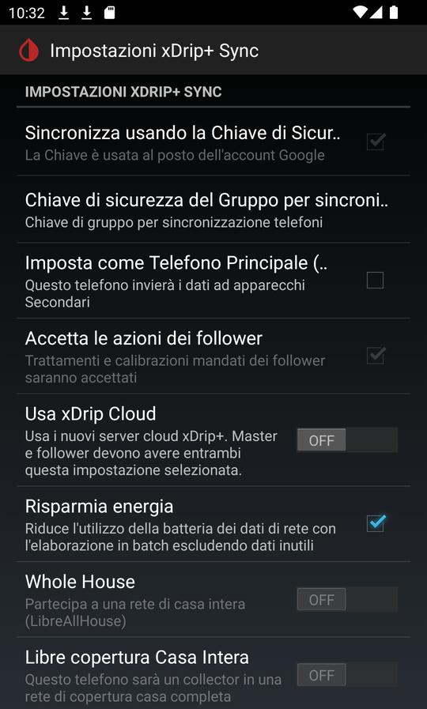
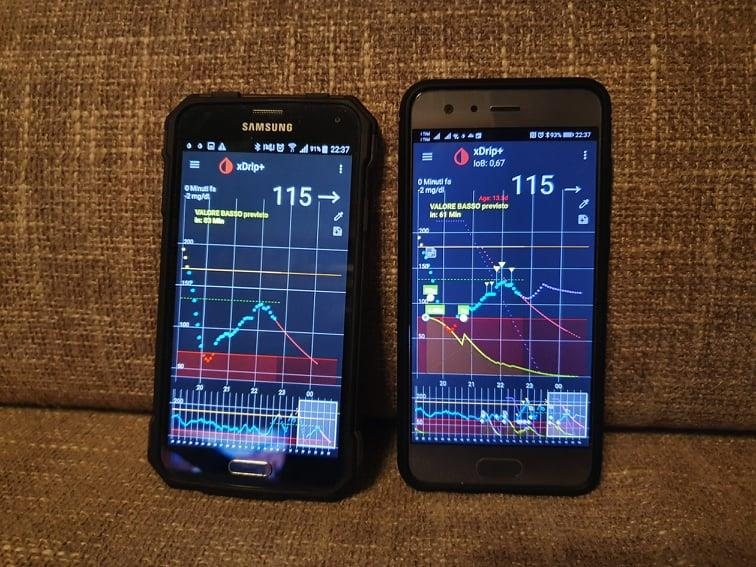

# Configurazione Master/Follower con xDrip e MiaoMiao

Questa guida spiega come trasferire il collegamento MiaoMiao (il lettore Bluetooth per il FSL) da un telefono all'altro, impostando un telefono come **master** (quello che legge il sensore) e l'altro come **follower** (quello che riceve le letture a distanza).

> ⚠️ **Attenzione**: a luglio 2024 Google ha dismesso il vecchio sistema di sincronizzazione (Firebase). Per usare xDrip Sync serve una versione di xDrip **`2024.07.23` o successiva** su tutti i telefoni, con i **Google Play Services** attivi ed esclusi dall'ottimizzazione della batteria.

## 1. Prepara il telefono attualmente collegato a MiaoMiao

Metti questo telefono in **modalità aereo**. In questo modo, se qualcosa va storto, puoi ripristinare rapidamente la configurazione che funzionava.

## 2. Configura il secondo telefono

Sul telefono che non è ancora collegato a MiaoMiao, apri xDrip e scansiona il codice QR del primo telefono per copiare le impostazioni.

Sul telefono già configurato (master), apri il menu ☰ → **Impostazioni**:

Scorri fino a **Impostazioni di copia** e tocca **Mostra impostazioni dei codici QR**, poi scegli **COPIARE TUTTE LE IMPOSTAZIONI**:

Verrà mostrato un codice QR a schermo intero:

Sul secondo telefono, apri xDrip, vai in **Impostazioni → Configurazione automatica** e tocca **Camera**:

Concedi il permesso di usare la fotocamera quando richiesto, poi inquadra il codice QR mostrato sul primo telefono per copiare le impostazioni.

Ora hai due telefoni con xDrip identici. Scegli quale sarà il **master** (collegato a MiaoMiao) e quale sarà il **follower** (che riceve le letture).

## 3. Configura il master

Sul telefono scelto come master:

1. Ripristina il collegamento con MiaoMiao.
2. Riavvia il sensore se necessario.

Apri il menu laterale di xDrip:

Vai in **Impostazioni** e scorri fino a **XDRIP+ IMPOSTAZIONI EXTRA**:

Apri **Impostazioni xDrip+ Sync** e attiva **Imposta come Telefono Principale**:

Annota la **Chiave di sicurezza del Gruppo**: deve essere identica su entrambi i telefoni per la sincronizzazione:

Nella stessa schermata controlla l'opzione **Usa xDrip Cloud**: è il nuovo sistema di trasporto dei dati e deve essere impostata **allo stesso modo (attiva o disattivata) su tutti i telefoni** del gruppo.

> ⚠️ Il nuovo telefono potrebbe richiedere una calibrazione all'avvio del sensore.

> ℹ️ Può esserci **un solo master** alla volta per ogni chiave di gruppo.

## 4. Configura il follower

Sul telefono scelto come follower:

1. Togli la modalità aereo.
2. Attendi qualche minuto: le letture dal master dovrebbero arrivare a breve.

Apri **Impostazioni** e tocca **Dati Hardware di origine**:

Nell'elenco delle sorgenti, seleziona **xDrip+ Sync Follower**:

Apri di nuovo **Impostazioni xDrip+ Sync** e verifica che **Imposta come Telefono Principale** sia **disattivato** su questo telefono e che **Usa xDrip Cloud** sia impostata come sul master:

Dopo qualche minuto, i due telefoni mostreranno la stessa lettura:

> ℹ️ **Nota**: se ti serve la sincronizzazione senza internet (per esempio in vacanza senza copertura), le versioni recenti di xDrip offrono **Desert Sync**, che condivide i dati sulla rete Wi-Fi locale (hotspot del master). Vedi la documentazione xDrip (traduzione automatica): [`https://psonnera-github-io.translate.goog/xdrip_docs/use/sync/?_x_tr_sl=auto&_x_tr_tl=it`](https://psonnera-github-io.translate.goog/xdrip_docs/use/sync/?_x_tr_sl=auto&_x_tr_tl=it)
