# Utilizzo di un algoritmo esterno con xDrip+

Questa guida spiega come installare e configurare l'app **OOPAlgorithm** (Out Of Process Algorithm), un'applicazione supplementare che lavora con xDrip+ per migliorare la lettura del sensore FSL.

## Quando usarlo

Usa l'algoritmo esterno solo se:
- Usi **OOP1** e funziona bene sul tuo telefono (utile per FSL 1)
- Usi un **FSL 2 con MiaoMiao o Bubble** e vuoi usare **OOP2**

| Versione | Compatibilità | Uso consigliato |
|---|---|---|
| **OOP1** | Android 9 e inferiori | FSL 1 con calibrazione automatica |
| **OOP2** | Android 10 e superiori | FSL 2 con MiaoMiao/Bubble |

> ⚠️ OOP1 e OOP2 non possono essere usati contemporaneamente. Disinstalla quello che non serve.

## Come funziona

Senza algoritmo esterno, xDrip+ calcola internamente il valore di glicemia dal valore grezzo del sensore tramite calibrazioni manuali.

Con OOP1/OOP2, un'app separata riceve il valore grezzo dal sensore e lo converte prima di passarlo a xDrip+. Questo permette di ottenere valori senza calibrazione manuale (simili a quelli del lettore FSL ufficiale).

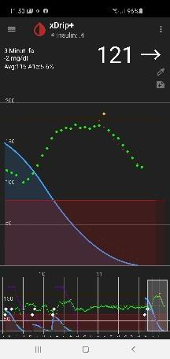


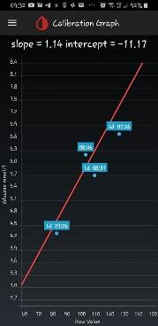


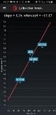


## Versioni firmware richieste

Prima di procedere, verifica che il firmware del tuo trasmettitore sia aggiornato:

| Trasmettitore | Firmware minimo |
|---|---|
| MiaoMiao 1 | 39 |
| MiaoMiao 2 | 7 |
| Bubble | 1.38 |
| Blucon | 4.2 |

Controlla la versione del firmware in xDrip+: **Menu → Stato del sistema**.

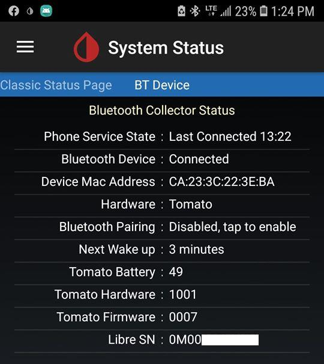

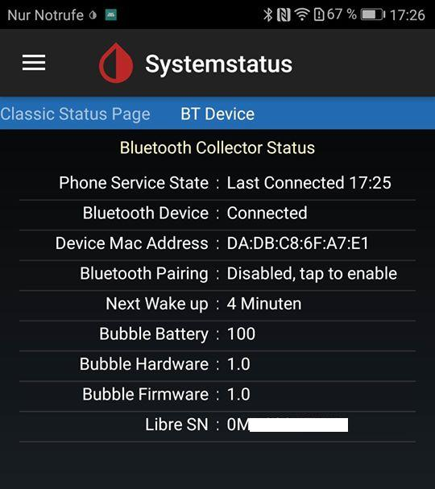

## 1. Scarica l'algoritmo

- **OOP1** (FSL 1, Android 9 e inferiori):
  `https://drive.google.com/open?id=13ERWcSVSFMLy9rhpbv5rArFrnDuAzriM`
- **OOP2** (FSL 2, Android 10 e superiori):
  `https://drive.google.com/file/d/1f1VHW2I8w7Xe3kSQqdaY3kihPLs47ILS/view`

## 2. Installa l'algoritmo

1. Scarica il file `.apk` e installalo (autorizza l'installazione da sorgenti sconosciute se richiesto).

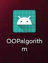

2. Apri OOPAlgorithm e abilita:
   - **Use service**
   - **Use foreground service**

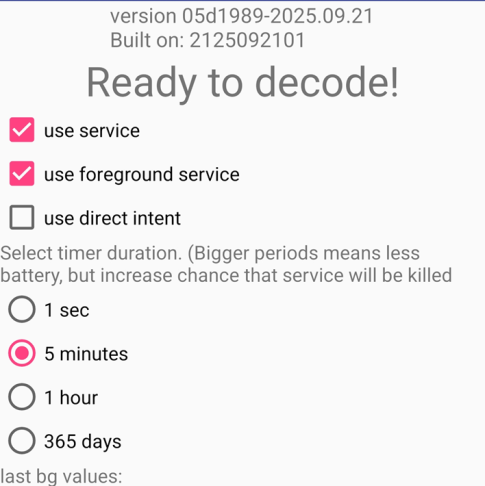

3. In caso di problemi di connessione, aumenta la frequenza di aggiornamento a **1 secondo**.

> ⚠️ Vai in **Impostazioni Android → App → Out Of Process Algorithm** e assicurati che l'app **non sia ottimizzata** dalla batteria e abbia il diritto di funzionare in background.

Quando l'algoritmo è attivo, compare un'icona supplementare nella barra delle notifiche.

## 3. Configura xDrip+

xDrip+ potrebbe rilevare automaticamente l'algoritmo e chiederti di abilitarlo. **Non accettare il prompt automatico.** Segui invece questi passi manuali:

1. In xDrip+: **Menu → Impostazioni → Impostazioni meno usate**.

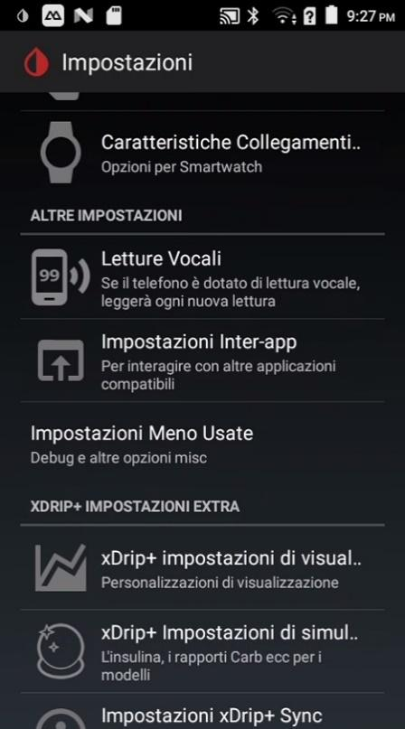

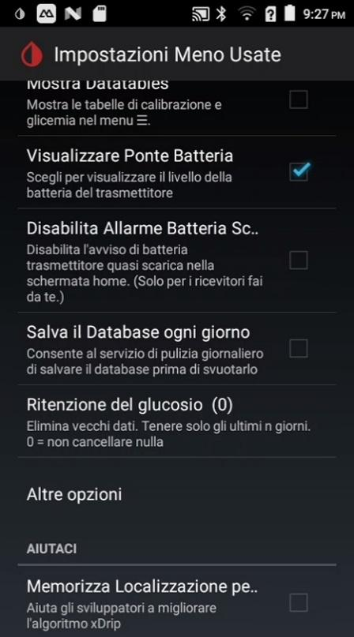

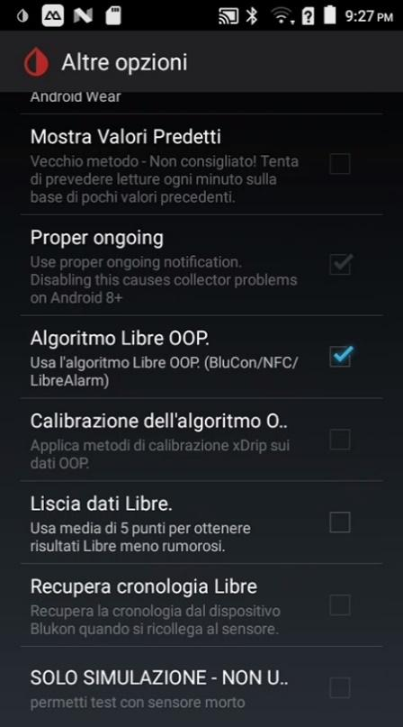

2. Cerca la sezione OOP:
   - **OOP1:** imposta su **Abilitato**
   - **OOP2:** imposta su **Disabilitato** (OOP2 funziona senza questa opzione)

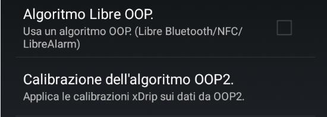

## 4. Funzionamento

### Con OOP1 (FSL 1)

Le calibrazioni manuali non sono più necessarie né possibili. Il valore visualizzato sarà comparabile a quello del lettore FSL ufficiale. Devi comunque fare **Stop sensore** e **Avvia nuovo sensore** a ogni cambio.

### Con OOP2 (FSL 2)

Hai tre opzioni di calibrazione (sceglile in **Impostazioni meno usate**):

1. **Nessuna calibrazione** — usa OOP2 per ottenere risultati simili al lettore FSL 2 (consigliato per le prime prove)
2. **Calibra i dati grezzi** — come con FSL 1 e MiaoMiao/Bubble/Blucon
3. **Aggiusta senza calibrazione** — aggiungi una calibrazione solo se necessario

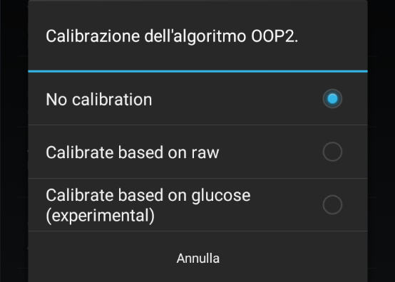

Devi comunque fare **Stop sensore** e **Avvia nuovo sensore** a ogni cambio.

---

## Sezione avanzata: installare OOP sullo smartwatch Android Wear

> ℹ️ Questa sezione è per chi usa uno smartwatch Android Wear **senza telefono** come collettore standalone. Richiede un PC Windows con ADB installato.

### Prerequisiti

- PC Windows con [ADB installato](../../android/installare-adb-debug)
- Cavo USB per collegare lo smartwatch al PC

### Abilitare la modalità sviluppatore sullo smartwatch

1. Nello smartwatch, vai in **Impostazioni → Informazioni**.
2. Tocca il **numero di build** 7 volte di fila (abbastanza velocemente) finché non compare il messaggio "Sei uno sviluppatore". Questo non annulla la garanzia né danneggia lo smartwatch.

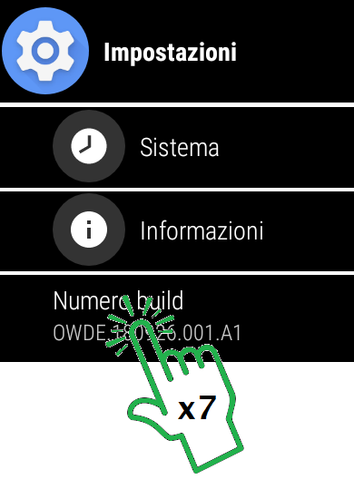

3. Vai in **Impostazioni → Opzioni sviluppatore** e abilita **Debug ADB**.


4. Premi **Indietro** due volte per uscire.

### Installare OOP sullo smartwatch

1. Scarica il file di installazione assistita per Windows:
   `https://drive.google.com/file/d/1XZIdBfUpTpJxjUK19e9BQkeGGGvWiW3R/view`
2. Esegui il file scaricato. Rispondi `Y` e premi **Invio** alle tre domande che compaiono, poi segui l'installazione guidata.
3. Copia il file `OOP2.apk` nella cartella `C:\adb\`.
4. Collega lo smartwatch al PC tramite cavo USB.
5. Apri il **Prompt dei comandi** (cerca "prompt dei comandi" nella barra di ricerca Windows).
6. Naviga nella cartella ADB:
   ```
   cd..   (ripeti finché arrivi a C:\>)
   cd adb
   ```
7. Lancia il comando:
   ```
   adb install -r OOP2.apk
   ```
8. Sullo smartwatch, autorizza il debug dal PC scegliendo **Consenti sempre**.
9. Aspetta il messaggio `Success` nel prompt.

Una volta completata l'installazione, avvia OOPAlgorithm nelle app dello smartwatch e ignora l'eventuale messaggio di errore. Lo smartwatch può ora leggere il sensore in autonomia, senza bisogno del telefono.

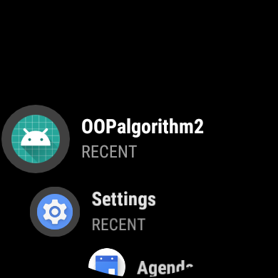

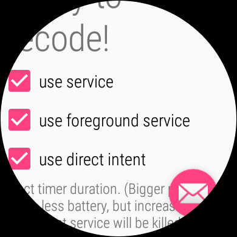

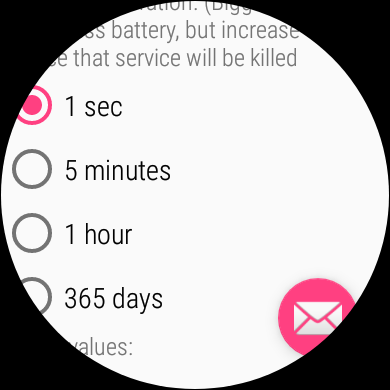

Per rimuoverlo, disinstallalo dal Play Store sullo smartwatch.
