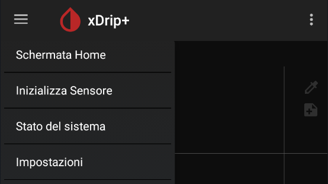
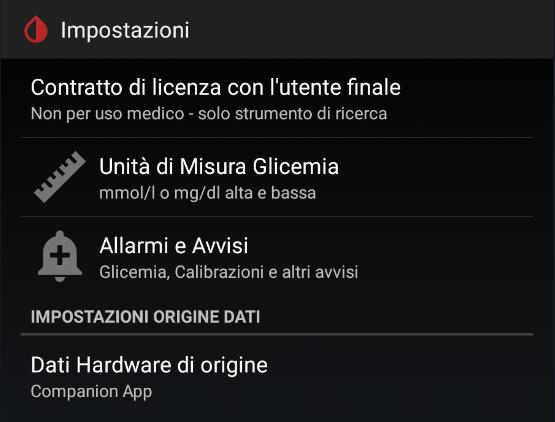
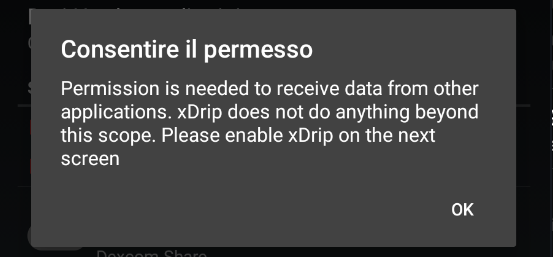
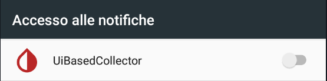
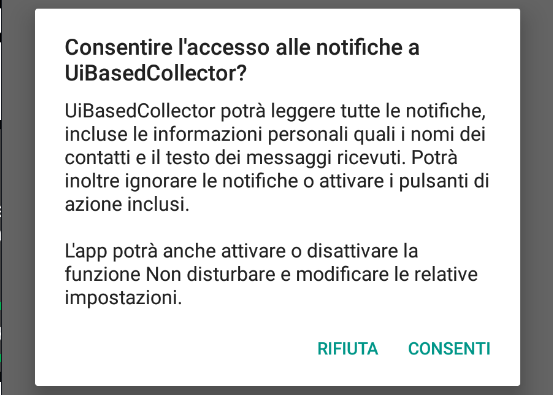
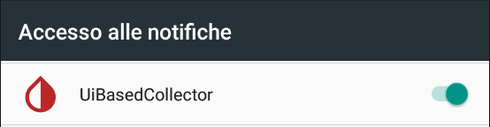
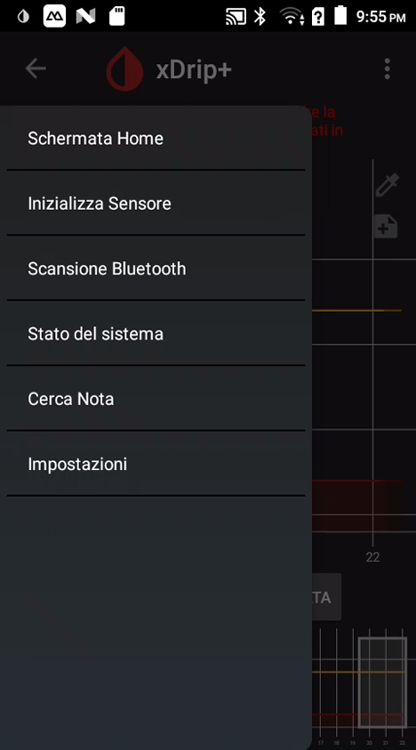

# xDrip+ come compagno dell'app MASTER

Questa guida spiega come usare xDrip+ insieme all'app ufficiale del tuo sensore CGM, senza interferire con il sensore né con il microinfusore. xDrip+ riceve le letture di glicemia intercettando le notifiche dell'app master e aggiunge funzioni che l'app ufficiale non ha: allarmi personalizzabili, smartwatch, widget e follower aggiuntivi.

**App compatibili:**
- Dexcom G6, G7, ONE
- Medtronic Guardian / MiniMed
- CamAPS

**Requisiti:** telefono Android versione 6 o superiore. xDrip+ deve essere installato **sullo stesso telefono** dell'app master.

> ⚠️ Senza Google Play Store la funzione Sync Follower (senza Nightscout) non è disponibile.

## 1. Installa xDrip+

Segui la [guida base di installazione](./installare-xdrip-android) e installa l'ultimo pre-release.

## 2. Seleziona la sorgente dati "Companion App"

1. Dal menu di xDrip+: **Impostazioni → Dati hardware di origine**.
2. Seleziona **Companion App**.

3. xDrip+ richiede l'autorizzazione per accedere a tutte le notifiche del telefono. Concedila: xDrip+ usa questa autorizzazione **solo** per leggere le notifiche delle app CGM elencate sopra. Il codice sorgente è aperto e verificabile.

## 3. Verifica il funzionamento

Torna nella schermata principale di xDrip+. Entro 5 minuti le letture di glicemia dovrebbero comparire automaticamente.

## 4. Collega lo smartwatch (opzionale)

Con xDrip+ attivo puoi inviare la glicemia direttamente a diversi smartwatch:

- **Xiaomi Mi Band / Amazfit:** vedi la [guida WatchDrip+](xdrip-e-watchdrip)
- **Android Wear OS:** vedi la guida specifica per il tuo orologio
- **Fitbit** Versa / Ionic: vedi la [guida Fitbit](../fitbit/fitbit-le-glicemie-di-dexcom-spike-xdrip-o-nightscout-su-smartwach-versa-e-ionic)
- **Samsung Watch:** cerca la guida "G-Watch per Samsung"

## 5. Condividi le letture con altri dispositivi (opzionale)

Puoi condividere la glicemia con altri telefoni senza passare dai server del fornitore:
- **xDrip+ Sync:** condivisione diretta tra telefoni Android
- **Nightscout:** piattaforma cloud per il monitoraggio a distanza

