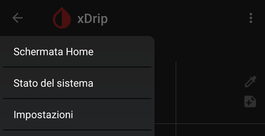
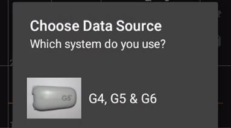
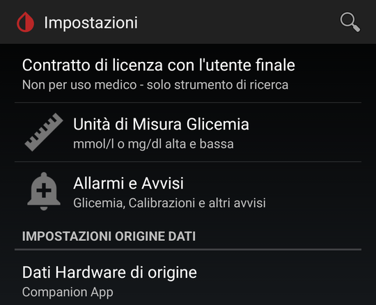
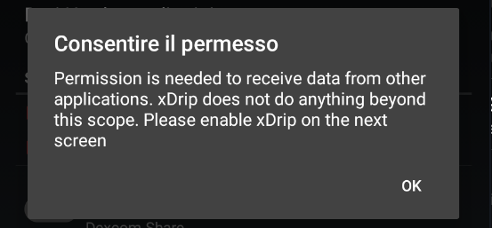
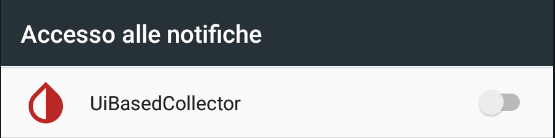
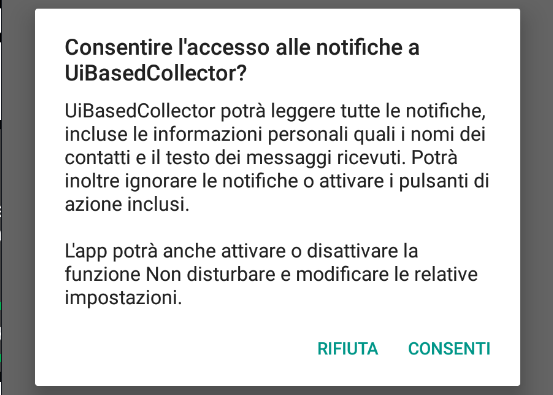
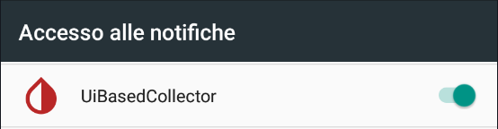
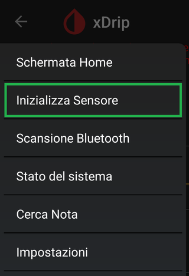
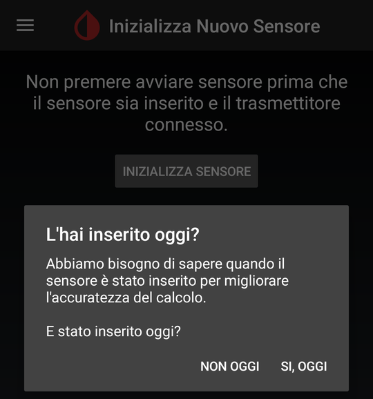
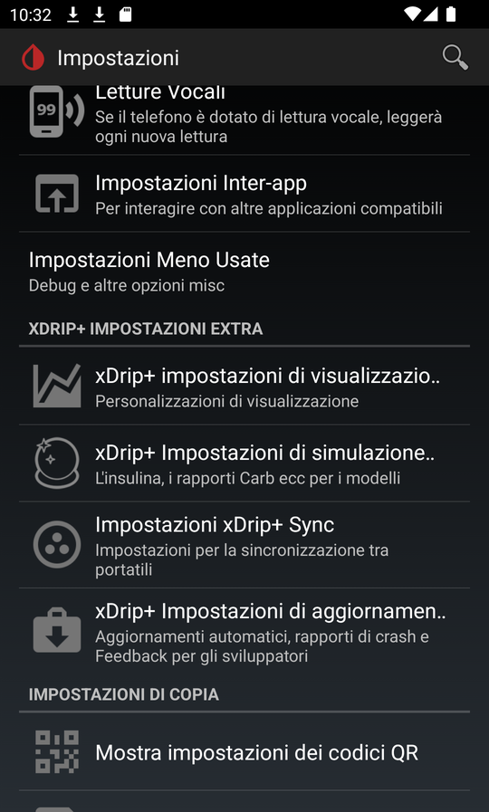

# xDrip come compagno dell'app MASTER

Questa guida spiega come usare xDrip insieme all'app ufficiale del tuo sensore CGM, senza interferire con il sensore né con il microinfusore. xDrip riceve le letture di glicemia intercettando le notifiche dell'app master e aggiunge funzioni che l'app ufficiale non ha: allarmi personalizzabili, smartwatch, widget e follower aggiuntivi.

**App compatibili:**
- Dexcom G6, G7, ONE
- Medtronic Guardian / MiniMed
- CamAPS

**Requisiti:** telefono Android versione 6 o superiore. xDrip deve essere installato **sullo stesso telefono** dell'app master.

> ⚠️ Senza Google Play Store la funzione Sync Follower (senza Nightscout) non è disponibile.

> ⚠️ **Attenzione**: Con **Dexcom ONE** funziona soltanto se ricevi le notifiche di glicemia ogni 5 minuti sul telefono.

## 1. Installa xDrip

Segui la [guida base di installazione](./installare-xdrip-android) e installa l'ultimo pre-release.

## 2. Seleziona la sorgente dati "Companion App"

1. Dal menu di xDrip: **Impostazioni → Dati hardware di origine**.

2. Seleziona **Companion App**, poi il sistema che usi (ad esempio **G4, G5 & G6**):

La schermata **Impostazioni** confermerà **Dati Hardware di origine: Companion App**:

3. xDrip richiede l'autorizzazione per accedere a tutte le notifiche del telefono. Concedila: xDrip usa questa autorizzazione **solo** per leggere le notifiche delle app CGM elencate sopra. Il codice sorgente è aperto e verificabile. Conferma il messaggio informativo:

Nella schermata **Accesso alle notifiche**, trova **UiBasedCollector** (inizialmente disattivato) e toccalo:

Conferma cliccando **CONSENTI**:

Il toggle diventerà verde, a conferma che l'accesso è stato concesso:

## 3. Inizializza il sensore in xDrip (se richiesto)

Anche in modalità Companion App, xDrip potrebbe chiederti di indicare quando il sensore è stato inserito, per calcolare correttamente la durata e mostrare gli avvisi di scadenza.

1. Dal menu di xDrip: **Inizializza Sensore**:

2. Tocca **INIZIALIZZA SENSORE**:

3. Indica se il sensore è stato inserito oggi:
   - **Oggi:** seleziona **Sì, oggi**
   - **Prima di oggi:** seleziona **Non oggi** e inserisci l'orario esatto

## 4. Verifica il funzionamento

Torna nella schermata principale di xDrip. Entro 5 minuti le letture di glicemia dovrebbero comparire automaticamente.

## 5. Collega lo smartwatch (opzionale)

Con xDrip attivo puoi inviare la glicemia direttamente a diversi smartwatch:

- **Xiaomi Mi Band / Amazfit:** vedi la [guida WatchDrip+](xdrip-e-watchdrip)
- **Android Wear OS:** vedi la guida specifica per il tuo orologio
- **Fitbit** Versa / Ionic: vedi la [guida Fitbit](../fitbit/fitbit-le-glicemie-di-dexcom-spike-xdrip-o-nightscout-su-smartwach-versa-e-ionic)
- **Samsung Watch:** cerca la guida "G-Watch per Samsung"

## 6. Imposta come master (opzionale ma consigliato)

In xDrip vai in **Impostazioni → xDrip Sync → Imposta come master**. Così, se i server del fornitore (Dexcom, CareLink, ecc.) hanno problemi, potrai usare un altro telefono o un xDrip come follower locale senza dipendere da internet.

## 7. Condividi le letture con altri dispositivi (opzionale)

Puoi condividere la glicemia con altri telefoni senza passare dai server del fornitore:
- **xDrip Sync:** condivisione diretta tra telefoni Android
- **Nightscout:** piattaforma cloud per il monitoraggio a distanza

Apri il menu di xDrip:

Vai in **Impostazioni** e scorri fino a **XDRIP+ IMPOSTAZIONI EXTRA**:

Apri **Impostazioni xDrip+ Sync** per attivare **Imposta come Telefono Principale** e vedere la **Chiave di sicurezza del Gruppo** da usare per collegare eventuali telefoni follower:

