# Smartband Xiaomi e smartwatch Amazfit con xDrip+ tramite WatchDrip+

> ⚠️ Questa guida richiede una versione di xDrip+ rilasciata dopo l'11 luglio 2022.

Questa guida spiega come visualizzare la glicemia di xDrip+ su:
- **Xiaomi MiBand** 2, 3, 4, 5, 6 e Amazfit Band 5
- **Amazfit** GTR 42/47mm, GTR2/GTR2e, GTS2/GTS2e/GTS2 Mini, T-Rex Pro, Bip/Bip Lite/Bip S/Bip S Lite

La soluzione si chiama **WatchDrip+**, sviluppata da Artem (@bigdigital su GitHub).

**Requisiti:** telefono Android 5 o superiore con Bluetooth 4.2 (BLE). Prima di iniziare, carica completamente lo smartband/smartwatch.

## Panoramica dei passaggi

1. Installa e configura xDrip+ con la glicemia visibile
2. Disinstalla le app ufficiali MiFit / Zepp se presenti
3. Installa la versione modificata di MiFit o Zepp per ottenere la chiave di autenticazione
4. Configura xDrip+ per WatchDrip+
5. Installa e configura WatchDrip+
6. (Opzionale) Reinstalla le app ufficiali

---

## 1. Installa xDrip+

Segui la [guida base di installazione](./installare-xdrip-android). **Non proseguire fino a quando non vedi la glicemia in xDrip+.**

---

## 2. Rimuovi le app ufficiali

> ⚠️ Disinstallare non significa solo rimuovere l'icona: devi eliminare l'app completamente dalle impostazioni del telefono.

**Se hai MiFit installata (per Xiaomi MiBand):**
1. Nell'app MiFit, disaccoppia la smartband.
2. Vai in **Impostazioni Android → App → MiFit** e disinstalla completamente.

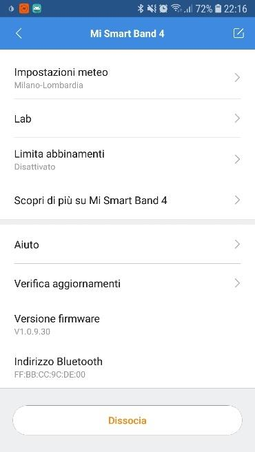

**Se hai Zepp installata (per Amazfit):**
1. Nell'app Zepp, disaccoppia lo smartwatch.
2. Vai in **Impostazioni Android → App → Zepp** e disinstalla completamente.

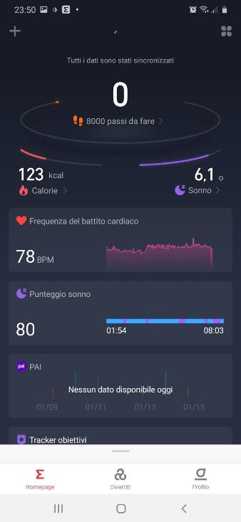

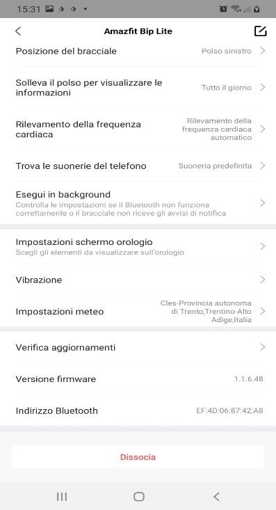

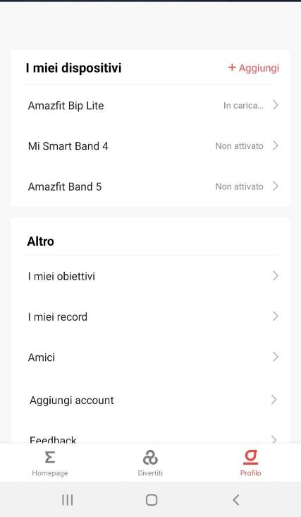

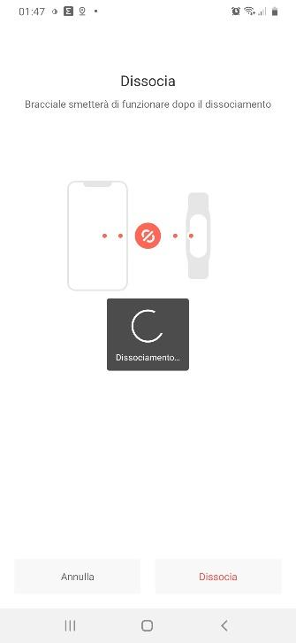

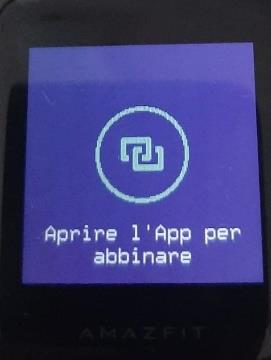

---

## 3. Ottieni la chiave di autenticazione

### Per Xiaomi MiBand 2/3/4/5/6

1. Dal sito [freemyband.com](https://www.freemyband.com/2019/08/mi-band-4-auth-key.html), scarica l'app MiFit modificata (versione 5.3.1 è quella testata; versioni più recenti potrebbero funzionare).

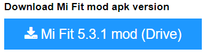

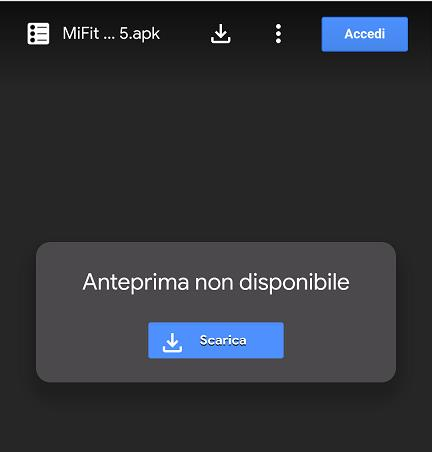

2. Installala autorizzando l'installazione da sorgente sconosciuta.

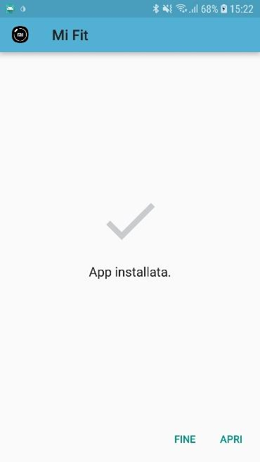

3. Apri l'app, crea un account con **email e password** (non usare Google), assicurati di dichiarare almeno 18 anni.
4. Abbina la smartband seguendo le istruzioni.

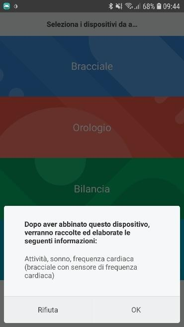

5. Una volta abbinata, abilita **Visibilità** (modalità rilevabile) se disponibile. Se non trovi l'opzione, prosegui comunque.

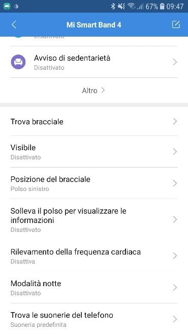

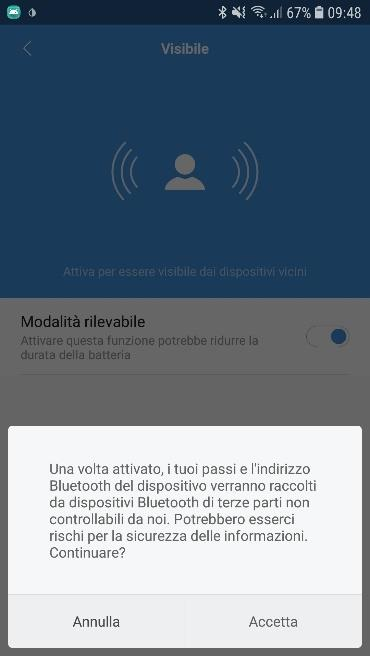

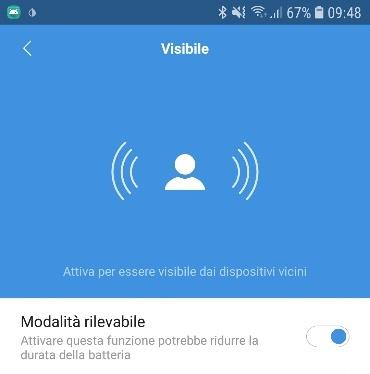

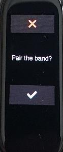

### Per smartwatch Amazfit

1. Dal sito [freemyband.com](https://www.freemyband.com/2019/08/amazfit-gtr-auth-key.html), scarica l'app Zepp modificata (versione 5.6.1 è quella testata; evita la 6.4.1 che ha dato problemi).

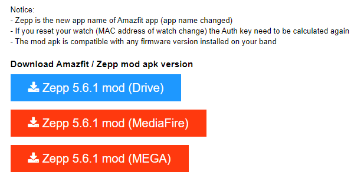

2. Installala autorizzando l'installazione da sorgente sconosciuta.
3. Apri l'app, crea un account con **email e password** (non usare Google), assicurati di dichiarare almeno 18 anni.
4. Nel profilo, aggiungi il tuo dispositivo: **Orologio** per GTR e GTS, **Bracciale** per Band 5.

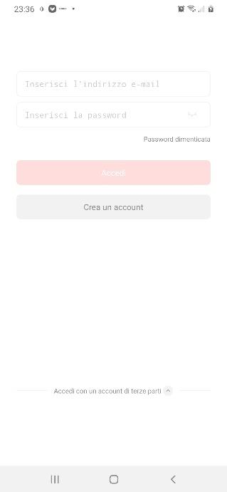

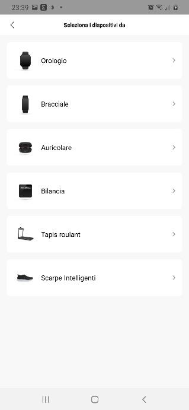

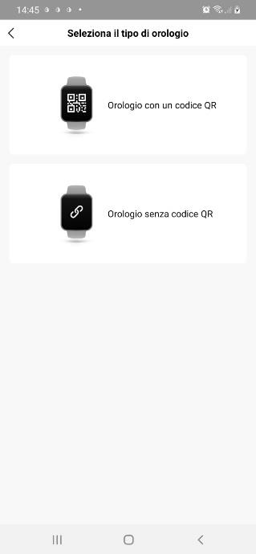
5. Abbina lo smartwatch e abilita **Visibilità** se disponibile.

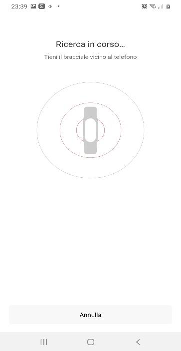

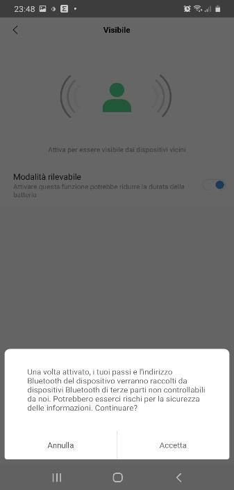

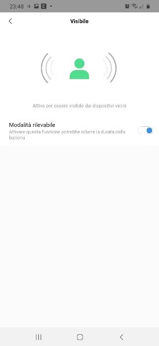

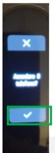

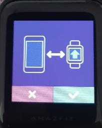

### Verifica la chiave generata

Dopo l'abbinamento, l'app modificata crea automaticamente un file di testo con la chiave di autenticazione. Cercalo in **Memoria interna** o **Scheda SD** nella cartella `freemyband`.

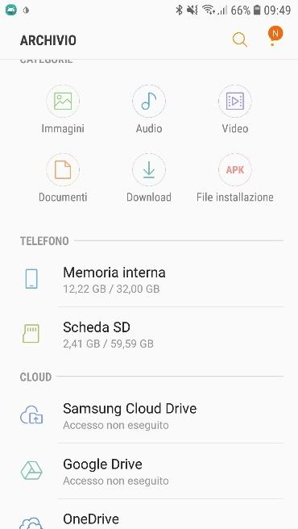

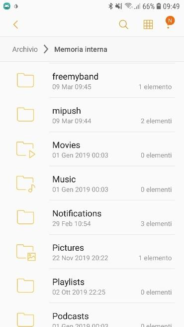

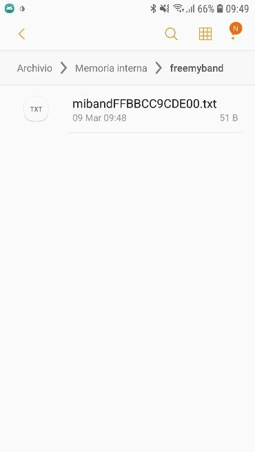

> ⚠️ Se il file non esiste, WatchDrip+ non funzionerà. Se resetti o disaccoppi la smartband/smartwatch in futuro, cancella il vecchio file e rigenera la chiave con l'app modificata.

---

## 4. Configura xDrip+

1. **Disabilita MiBand in xDrip+:** vai in **Menu → Impostazioni → Caratteristiche → Smartwatch → MiBand** e **disabilita** l'opzione **Usa MiBand** (questa è la vecchia integrazione, non serve più con WatchDrip+).

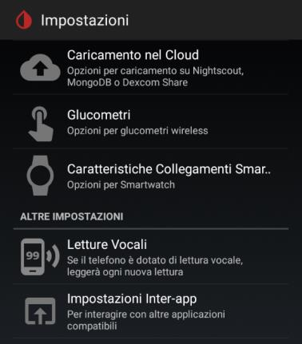

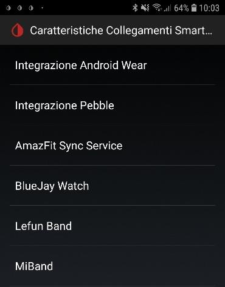

2. **Abilita l'API:** vai in **Menu → Impostazioni → Inter-app settings** e abilita **Servizio di trasmissione API** (in fondo alla pagina).

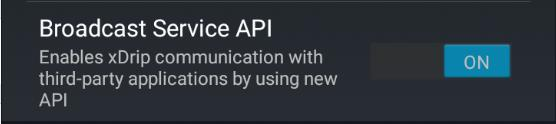

---

## 5. Installa e configura WatchDrip+

1. Scarica l'ultima versione di WatchDrip+ dal sito del progetto:
   `https://bigdigital.home.blog/2022/06/16/watchdrip-a-new-application-for-xdrip-watch-integration/#changelog`
   Cerca la sezione **Download link** per l'ultima versione.
2. Installa il file `.apk` scaricato.

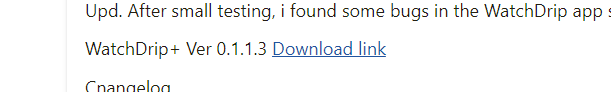

3. Apri WatchDrip+ e abilita il **servizio** quando richiesto.
4. Autorizza tutte le richieste di permessi (accesso alle notifiche, **Non disturbare**, ecc.) e poi torna nell'app.

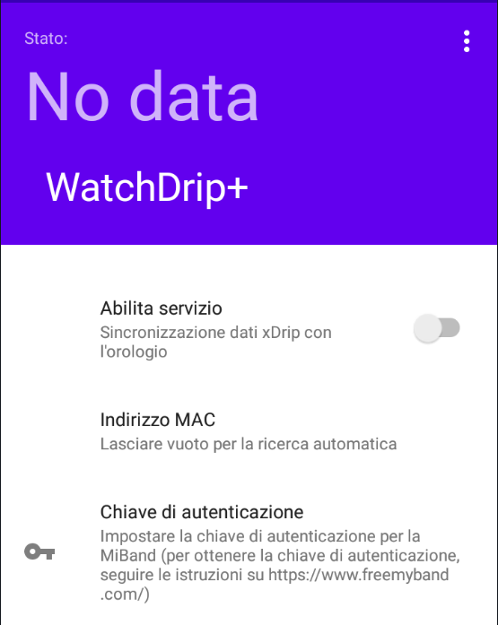

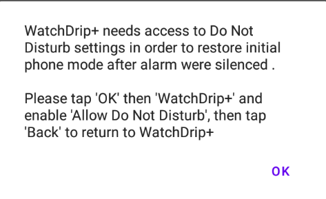

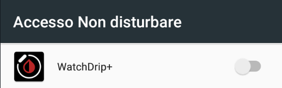

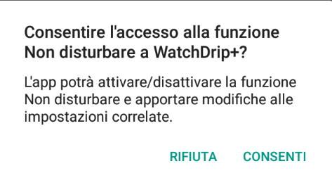

### Collegamento automatico

WatchDrip+ dovrebbe rilevare automaticamente il dispositivo con l'indirizzo MAC corretto.
- Se usi una **MiBand 2 o 3**: approva l'autenticazione direttamente sullo schermo della smartband.

### Collegamento manuale (se non trovato automaticamente)

1. Apri il file nella cartella `freemyband` (si apre anche con il browser).
2. Prendi nota dell'**indirizzo MAC** e della **chiave di autenticazione**.
3. In WatchDrip+, inserisci manualmente questi valori nel dispositivo.

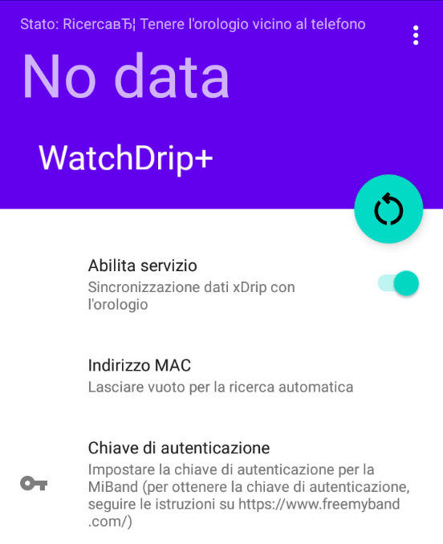

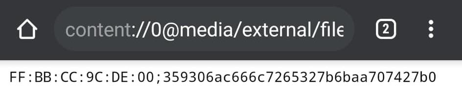

> ⚠️ Se nella cartella ci sono più file, cancellali tutti e rigenera la chiave ripartendo dal passo 3.

### Verifica il funzionamento

Una volta connesso, aspetta la prossima lettura di xDrip+: il valore dovrà comparire anche in WatchDrip+ e sullo smartband/smartwatch.

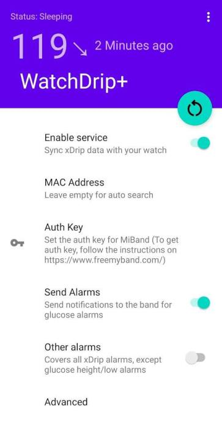

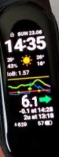

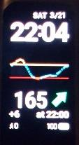

### Impostazioni consigliate in WatchDrip+

| Opzione | Impostazione |
|---|---|
| Mostra glicemia | **Abilitato** (necessario) |
| Vibra a ogni lettura | A scelta |
| Allarmi xDrip+ come notifiche | A scelta |
| Quadrante personalizzato | Solo se ne hai creato uno |
| Compatibilità Xiaomi | Abilita in caso di problemi con MiBand |
| Compatibilità Amazfit | Lascia disabilitato |

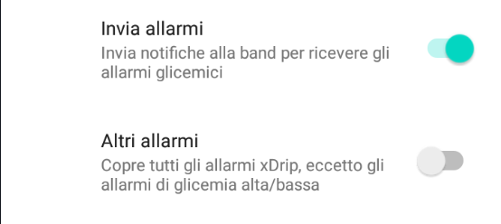

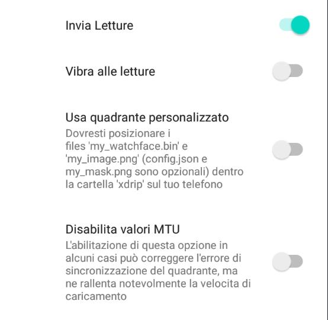

---

## 6. Reinstalla le app ufficiali (opzionale)

Puoi reinstallare MiFit o Zepp dal Play Store. **Usa esattamente lo stesso account** (email e password) dell'app modificata. Se usi un account diverso, probabilmente dovrai ricominciare dall'inizio.
