# Smartband Xiaomi e smartwatch Amazfit con xDrip tramite WatchDrip+

> ⚠️ Questa guida richiede una versione di xDrip rilasciata dopo l'11 luglio 2022.

Questa guida spiega come visualizzare la glicemia di xDrip su:
- **Xiaomi MiBand** 2, 3, 4, 5, 6 e Amazfit Band 5
- **Amazfit** GTR 42/47mm, GTR2/GTR2e, GTS2/GTS2e/GTS2 Mini, T-Rex Pro, Bip/Bip Lite/Bip S/Bip S Lite

La soluzione si chiama **WatchDrip+**, sviluppata da Artem (@bigdigital su GitHub).

**Requisiti:** telefono Android 5 o superiore con Bluetooth 4.2 (BLE). Prima di iniziare, carica completamente lo smartband/smartwatch.

## Panoramica dei passaggi

1. Installa e configura xDrip con la glicemia visibile
2. Disinstalla le app ufficiali MiFit / Zepp se presenti
3. Installa la versione modificata di MiFit o Zepp per ottenere la chiave di autenticazione
4. Configura xDrip per WatchDrip+
5. Installa e configura WatchDrip+
6. (Opzionale) Reinstalla le app ufficiali

---

## 1. Installa xDrip

Segui la [guida base di installazione](./installare-xdrip-android). **Non proseguire fino a quando non vedi la glicemia in xDrip.**

---

## 2. Rimuovi le app ufficiali

> ⚠️ Disinstallare non significa solo rimuovere l'icona: devi eliminare l'app completamente dalle impostazioni del telefono.

**Se hai MiFit installata (per Xiaomi MiBand):**
1. Nell'app MiFit, apri la schermata principale:

2. Vai in **Profilo** e tocca il tuo dispositivo (in questo esempio, Mi Smart Band 4):

Scorri fino in fondo alla pagina del dispositivo e tocca **Dissocia**:

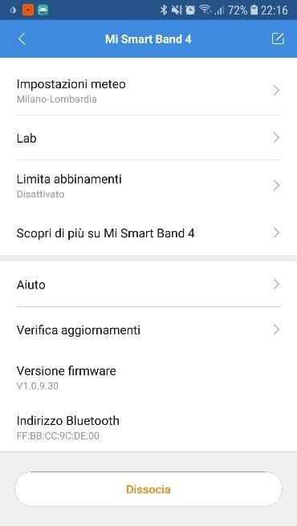

Conferma la dissociazione:

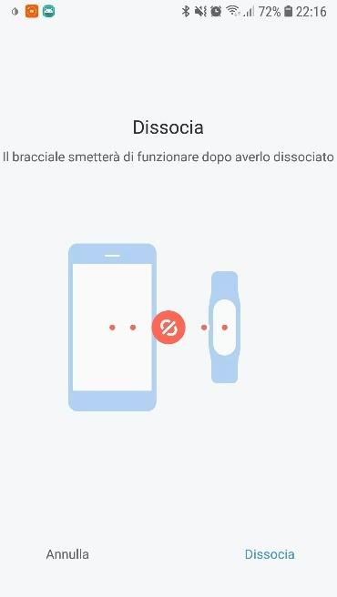

Sullo smartband comparirà di nuovo la schermata di abbinamento, a conferma che l'operazione è riuscita:

3. Vai in **Impostazioni Android → App → MiFit** e disinstalla completamente.

**Se hai Zepp installata (per Amazfit):**
1. Nell'app Zepp, apri la schermata principale:

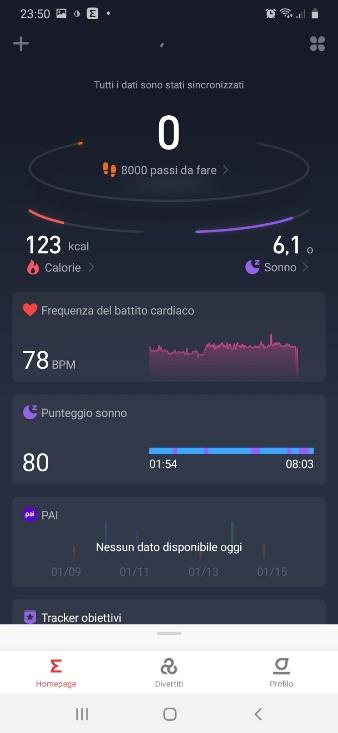

2. Vai nelle impostazioni del dispositivo (in questo esempio, Amazfit Bip Lite) e scorri fino in fondo:

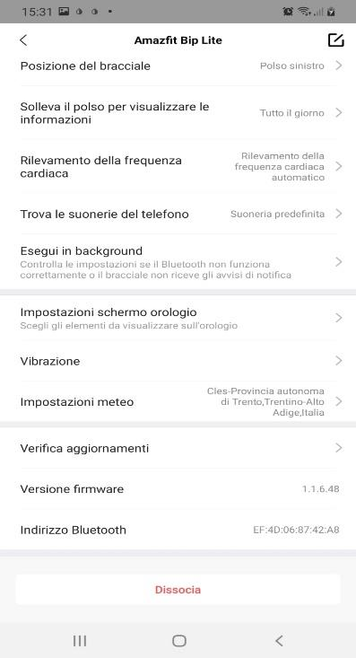

In alternativa, dalla scheda **Profilo → I miei dispositivi** puoi vedere tutti i dispositivi associati al tuo account:

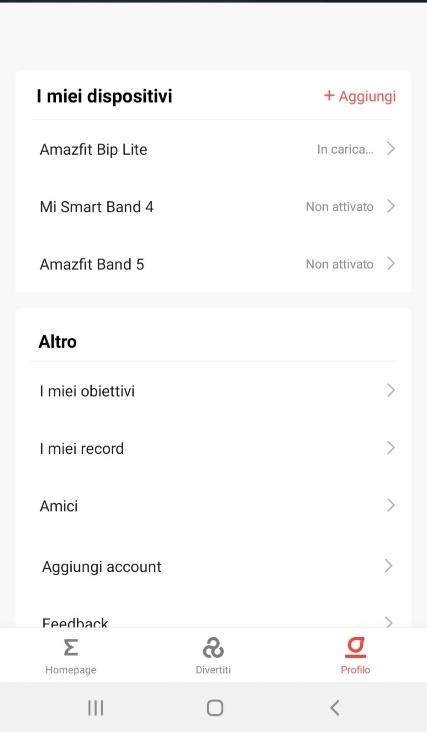

Tocca **Dissocia** e conferma:

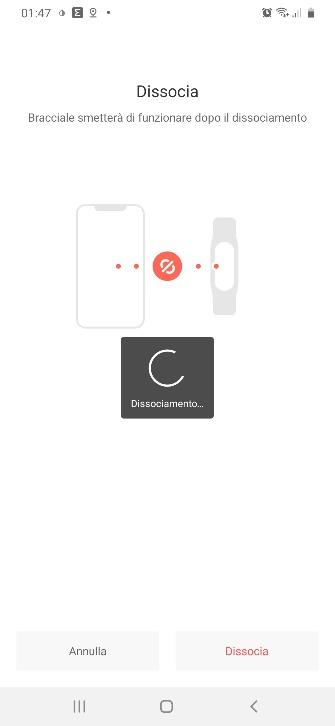

Sullo smartwatch comparirà di nuovo la richiesta di aprire l'app per abbinarlo:

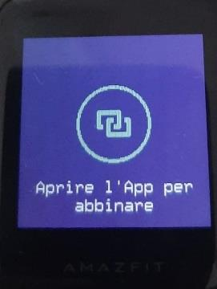

Su alcuni modelli, lo smartwatch mostra invece questa schermata di abbinamento:

2. Vai in **Impostazioni Android → App → Zepp** e disinstalla completamente.

---

## 3. Ottieni la chiave di autenticazione

### Per Xiaomi MiBand 2/3/4/5/6

1. Dal sito [freemyband.com](https://www.freemyband.com/2019/08/mi-band-4-auth-key.html), scarica l'app MiFit modificata (versione 5.3.1 è quella testata; versioni più recenti potrebbero funzionare):

Il download parte direttamente nel browser:

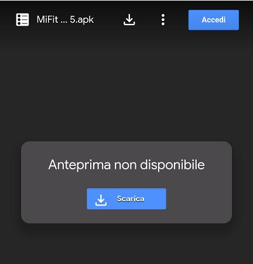

La pagina potrebbe aprirsi in una nuova scheda del browser:

2. Installala autorizzando l'installazione da sorgente sconosciuta:

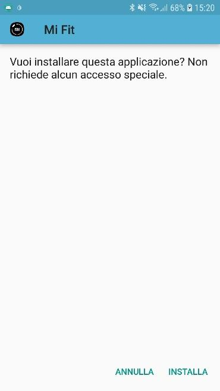

Attendi il messaggio di conferma:

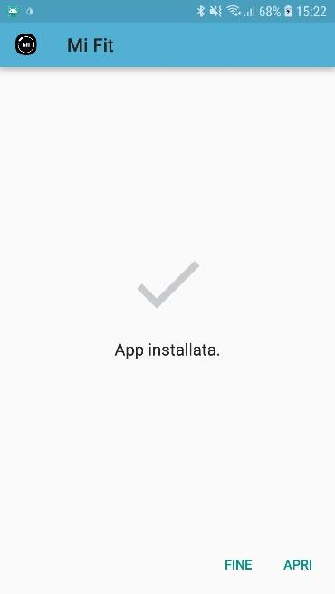

3. Apri l'app, crea un account con **email e password** (non usare Google), assicurati di dichiarare almeno 18 anni:

4. Abbina la smartband seguendo le istruzioni. La prima volta che apri l'app, ti dirà che nessun dispositivo è ancora associato:

Tocca **Bracciale** per iniziare l'abbinamento:

Conferma la raccolta dei dati richiesti dalla smartband:

Il telefono cerca la smartband nelle vicinanze:

Se stai sostituendo un dispositivo già configurato in precedenza, l'app propone di ripristinarne le impostazioni:

Sulla smartband conferma la richiesta di abbinamento toccando il segno di spunta:

5. Una volta abbinata, vai nelle impostazioni del dispositivo e cerca la voce **Visibile** (modalità rilevabile):

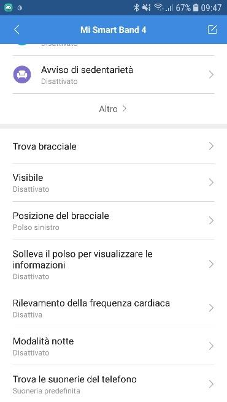

Se richiesto, accetta l'avviso sulla raccolta di passi e indirizzo Bluetooth:

Attiva la **Modalità rilevabile**. Se non trovi l'opzione, prosegui comunque:

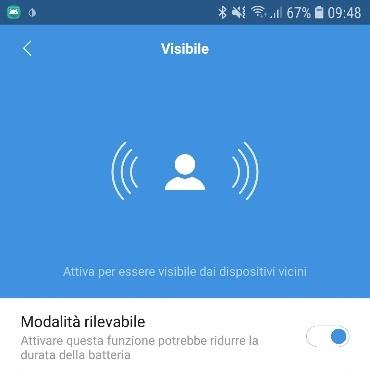

### Per smartwatch Amazfit

1. Dal sito [freemyband.com](https://www.freemyband.com/2019/08/amazfit-gtr-auth-key.html), scarica l'app Zepp modificata (versione 5.6.1 è quella testata; evita la 6.4.1 che ha dato problemi):

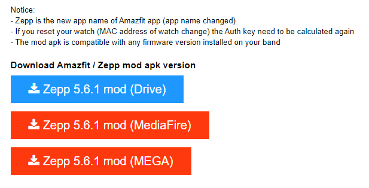

2. Installala autorizzando l'installazione da sorgente sconosciuta.
3. Apri l'app e accedi con **email e password** (non usare Google), assicurati di dichiarare almeno 18 anni:

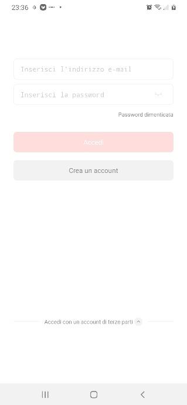

4. Nel profilo, tocca **Aggiungi dispositivo**:

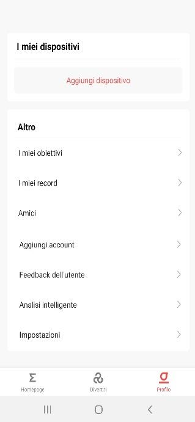

Scegli la categoria del tuo dispositivo: **Orologio** per GTR e GTS, **Bracciale** per Band 5:

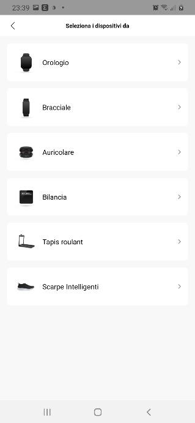

Se hai scelto Orologio, seleziona il tipo di abbinamento (con o senza codice QR):

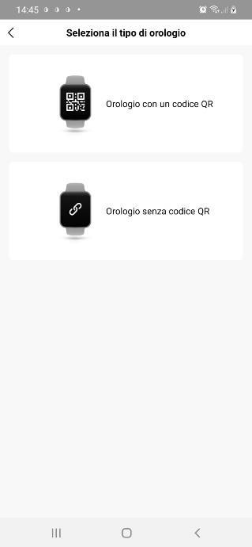

Il telefono cerca il dispositivo nelle vicinanze:

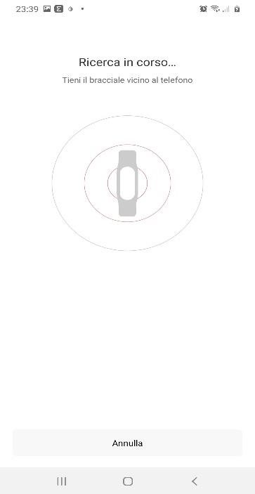

5. Sullo smartwatch comparirà la richiesta di abbinamento: conferma toccando il segno di spunta:

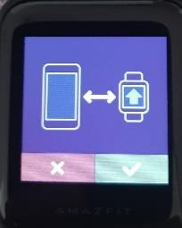

Su alcuni modelli comparirà invece questa schermata di conferma:

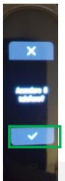

Abilita **Visibilità** se disponibile: accetta l'avviso sulla raccolta di passi e indirizzo Bluetooth...

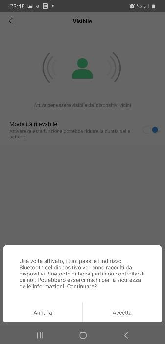

...e attiva la **Modalità rilevabile**:

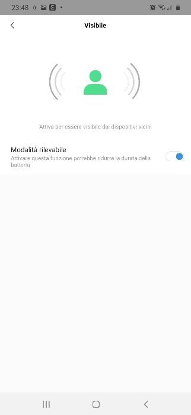

### Verifica la chiave generata

Dopo l'abbinamento, l'app modificata crea automaticamente un file di testo con la chiave di autenticazione. Cercalo nel gestore file del telefono, in **Memoria interna** o **Scheda SD**:

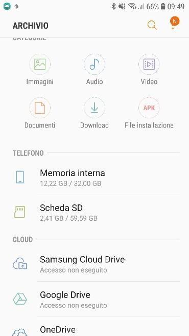

Apri la cartella **freemyband**:

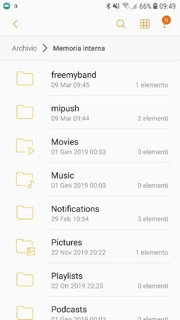

All'interno trovi il file di testo con indirizzo MAC e chiave (nel nome del file, in questo esempio `mibandFFBBCC9CDE00.txt`):

> ⚠️ Se il file non esiste, WatchDrip+ non funzionerà. Se resetti o disaccoppi la smartband/smartwatch in futuro, cancella il vecchio file e rigenera la chiave con l'app modificata.

---

## 4. Configura xDrip

1. **Disabilita MiBand in xDrip:** vai in **Menu → Impostazioni**:

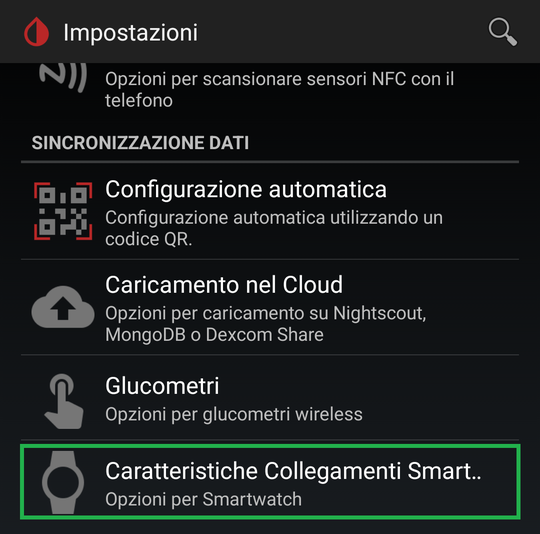

Tocca **Caratteristiche Collegamenti Smartwatch**:

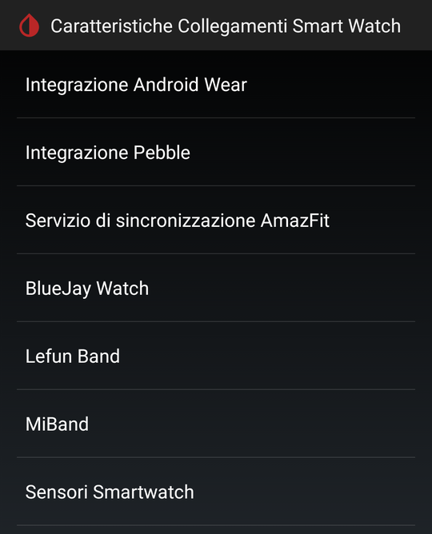

Tocca **MiBand** e **disabilita** l'opzione **Usa MiBand** (questa è la vecchia integrazione, non serve più con WatchDrip+):

2. **Abilita l'API:** vai in **Menu → Impostazioni → Inter-app settings** e abilita **Servizio di trasmissione API** (in fondo alla pagina):

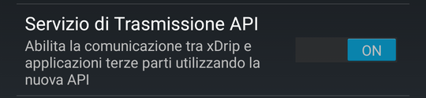

---

## 5. Installa e configura WatchDrip+

1. Scarica l'ultima versione di WatchDrip+ dal sito del progetto:
   [`https://bigdigital.home.blog/2022/06/16/watchdrip-a-new-application-for-xdrip-watch-integration/#changelog`](https://bigdigital.home.blog/2022/06/16/watchdrip-a-new-application-for-xdrip-watch-integration/#changelog)
   Cerca la sezione **Download link** per l'ultima versione:

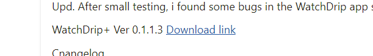

2. Installa il file `.apk` scaricato.
3. Apri WatchDrip+: la schermata principale mostra **Abilita servizio** ancora disattivato e nessun dato ricevuto:

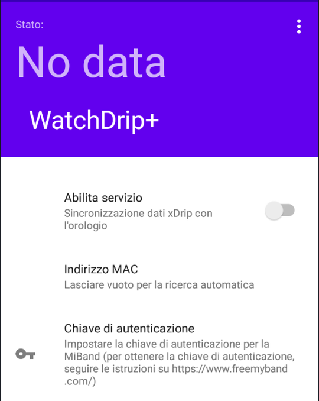

4. Attiva **Abilita servizio** e autorizza tutte le richieste di permessi che compaiono. La prima riguarda la posizione:

La seconda l'accesso a foto, contenuti multimediali e file:

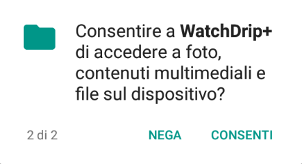

Su alcune versioni di Android compare anche una richiesta diretta di accesso alla funzione **Non disturbare**:

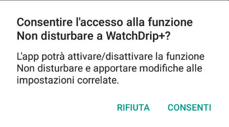

Su altre versioni, invece, l'app mostra prima queste istruzioni testuali:

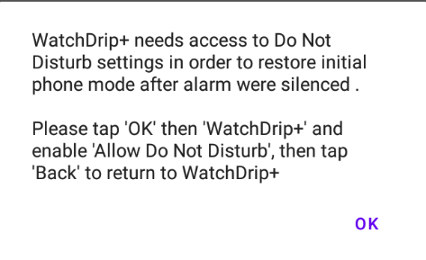

...e devi abilitare manualmente l'accesso di WatchDrip+ alla voce **Accesso Non disturbare**:

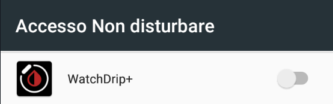

### Collegamento automatico

WatchDrip+ dovrebbe rilevare automaticamente il dispositivo con l'indirizzo MAC corretto: un messaggio confermerà l'indirizzo trovato (in questo esempio, un Mi Smart Band 6):

- Se usi una **MiBand 2 o 3**: approva l'autenticazione direttamente sullo schermo della smartband.

### Collegamento manuale (se non trovato automaticamente)

Se compare il messaggio **"Impossibile trovare l'orologio"**, inserisci l'indirizzo MAC manualmente:

1. Apri il file nella cartella `freemyband` (si apre anche con il browser): mostra l'**indirizzo MAC** e la **chiave di autenticazione** uniti da un punto e virgola.

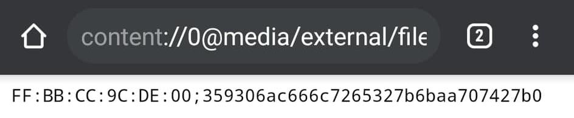

2. Prendi nota dei due valori.
3. In WatchDrip+, inserisci manualmente **indirizzo MAC** e **chiave di autenticazione** nei rispettivi campi: l'app tornerà a cercare il dispositivo.

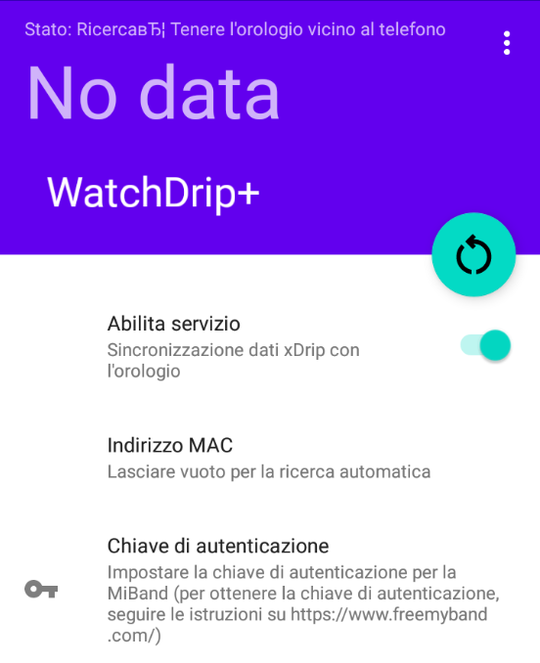

> ⚠️ Se nella cartella ci sono più file, cancellali tutti e rigenera la chiave ripartendo dal passo 3.

### Verifica il funzionamento

Se la chiave non è corretta, comparirà un messaggio di errore:

Se invece l'autenticazione riesce, vedrai una conferma con il nome del tuo dispositivo:

Una volta connesso, aspetta la prossima lettura di xDrip: il valore dovrà comparire anche nella schermata principale di WatchDrip+...

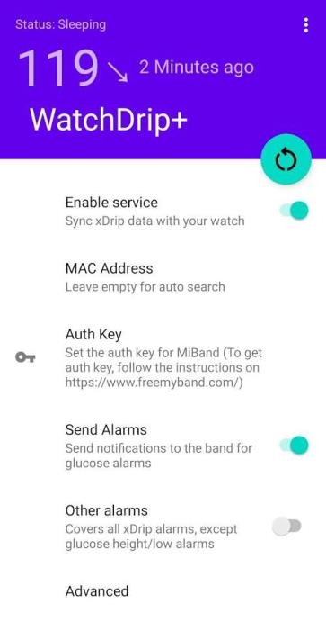

...e sul quadrante dello smartband o smartwatch, insieme ad altri dati come battito cardiaco e passi (esempio su MiBand):

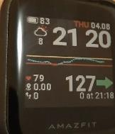

Un altro esempio di quadrante MiBand, con la freccia di tendenza e l'orario dell'ultima lettura:

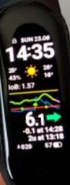

Esempio di quadrante Amazfit con meteo, battito cardiaco e glicemia:

Un ultimo esempio, con anche l'indicatore IOB (insulina a bordo) accanto alla glicemia:

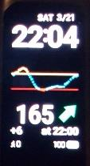

### Impostazioni consigliate in WatchDrip+

| Opzione | Impostazione |
|---|---|
| Mostra glicemia | **Abilitato** (necessario) |
| Vibra a ogni lettura | A scelta |
| Allarmi xDrip come notifiche | A scelta |
| Quadrante personalizzato | Solo se ne hai creato uno |
| Compatibilità Xiaomi | Abilita in caso di problemi con MiBand |
| Compatibilità Amazfit | Lascia disabilitato |

Le opzioni principali si trovano nella schermata iniziale di WatchDrip+ (**Invia Letture**, **Vibra alle letture**, **Usa quadrante personalizzato**):

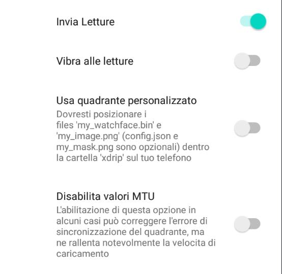

Più in basso trovi le opzioni per gli allarmi (**Invia allarmi**, **Altri allarmi**):

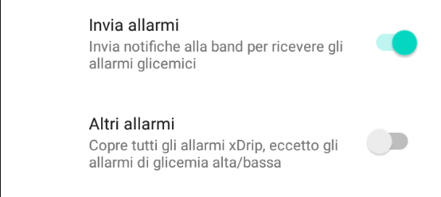

In fondo alla pagina trovi anche la sezione **Avanzate**, con opzioni aggiuntive per utenti esperti:

---

## 6. Reinstalla le app ufficiali (opzionale)

Puoi reinstallare MiFit o Zepp dal Play Store. **Usa esattamente lo stesso account** (email e password) dell'app modificata. Se usi un account diverso, probabilmente dovrai ricominciare dall'inizio.
