# xDrip+ come follower di Dexcom G5 e G6

Chi usa l'app Dexcom Follow per ricevere le letture a distanza non può impostare un quadrante su un orologio Wear OS né aggiungere un widget alla schermata del telefono. xDrip+ risolve entrambi i problemi: si affianca all'app Dexcom Follow e aggiunge le funzioni mancanti.

> ⚠️ L'utilizzo è a esclusiva responsabilità personale.

## 1. Installa xDrip+

Segui la [guida base di installazione](./installare-xdrip-android).

## 2. Configura la sorgente dati

1. Apri xDrip+ e tieni premuta la **goccia di sangue** nella schermata principale per aprire il menu della sorgente dati.
2. Seleziona **Dex Share Follower**.

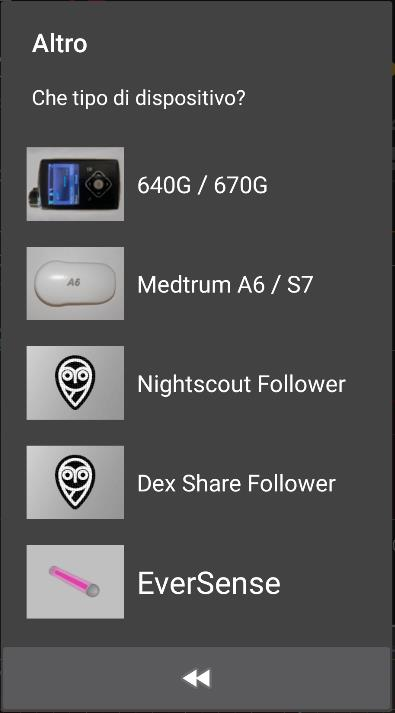

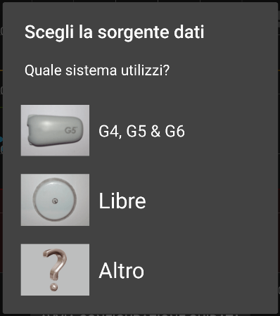

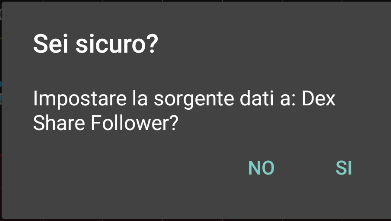

> ⚠️ **Non selezionare** Dexcom G5 o G6: quella opzione è per il collegamento diretto al sensore, non per il follower.

3. Inserisci il nome utente e la password del tuo account **Dexcom Clarity** (visita [clarity.dexcom.eu](https://clarity.dexcom.eu) se non ricordi le credenziali).

> ⚠️ Il nome utente **non è l'indirizzo email**: è il nome scelto in fase di registrazione.

> ⚠️ **Non selezionare** la casella **My account is on USA servers** se sei in Europa.

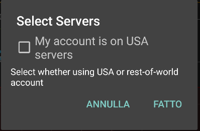

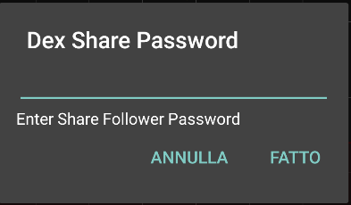

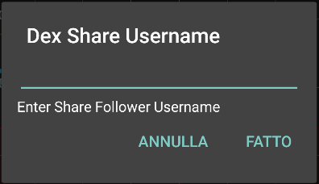

4. Se non riesci ad accedere al menu della sorgente direttamente, vai in **Menu → Impostazioni → Dati hardware di origine** e seleziona **Dex Share Follower** da lì.

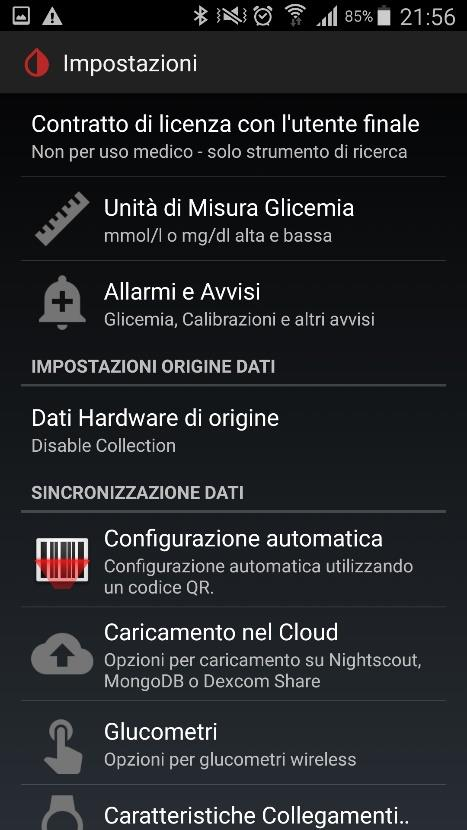

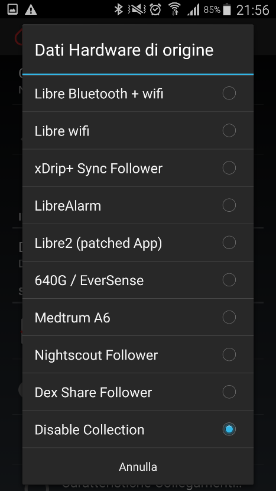

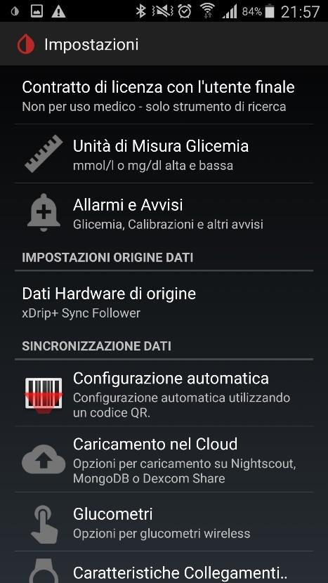

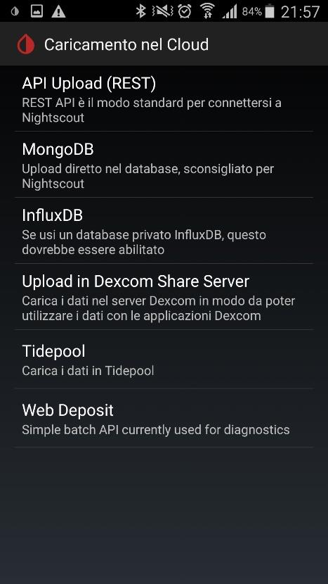

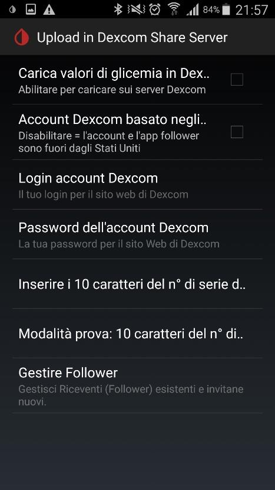

## 3. Verifica il funzionamento

Dopo qualche istante le letture di glicemia dovrebbero comparire su xDrip+. Se la schermata rimane vuota, tocca a lungo la goccia di sangue e verifica che la sorgente dati sia impostata correttamente.

## 4. Aggiungi il widget (opzionale)

xDrip+ ha un widget che mostra il valore glicemico e il grafico sia sulla schermata principale del telefono che sulla schermata di blocco.

**Esempio su Samsung Galaxy S7:**
1. Tieni premuto uno spazio vuoto nella schermata principale.
2. Seleziona **Widget** dal menu che appare.

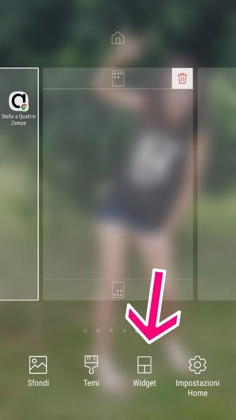

3. Cerca **xDrip** nell'elenco e selezionalo.

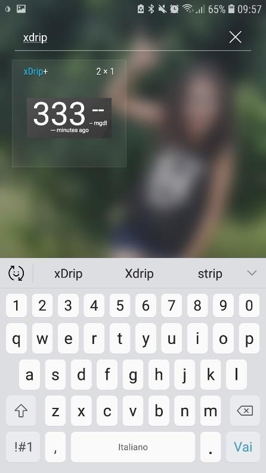

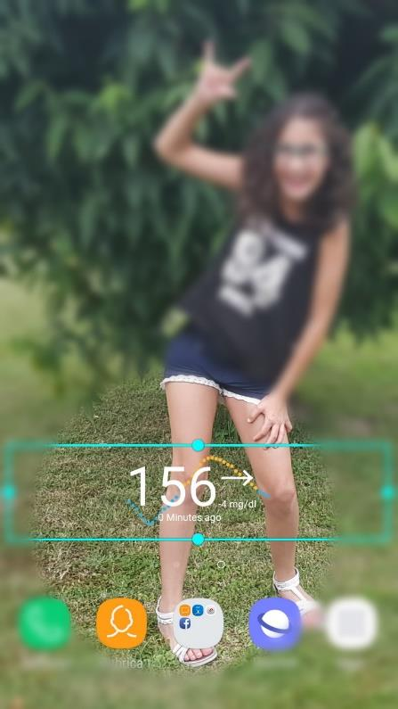

Il metodo varia da modello a modello: cerca "aggiungere widget" nelle istruzioni del tuo telefono se non trovi l'opzione.

## 5. Visualizza le glicemie sullo smartwatch (opzionale)

xDrip+ può inviare la glicemia direttamente a diversi tipi di smartwatch, sia dal telefono master che da un follower:

- **Android Wear OS:** vedi la guida specifica per il tuo smartwatch
- **Fitbit** Versa / Ionic: vedi la [guida Fitbit](../fitbit/fitbit-le-glicemie-di-dexcom-spike-xdrip-o-nightscout-su-smartwach-versa-e-ionic)
- **Samsung Watch:** cerca la guida "G-Watch per Samsung"
- **Xiaomi Mi Band / Amazfit:** vedi la [guida WatchDrip+](xdrip-e-watchdrip)
