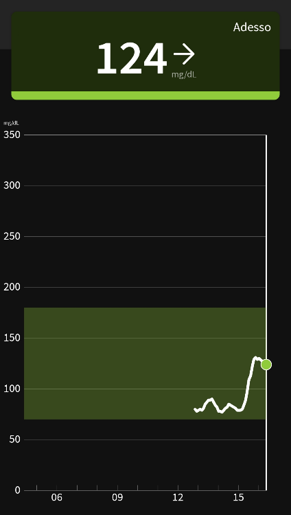
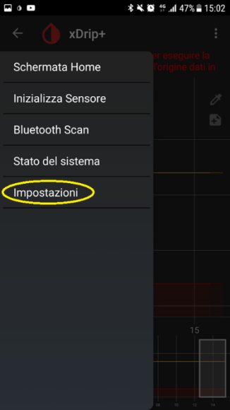
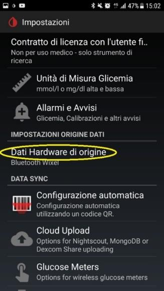
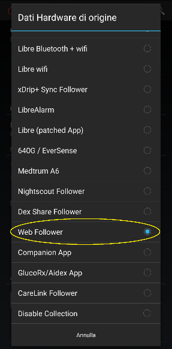
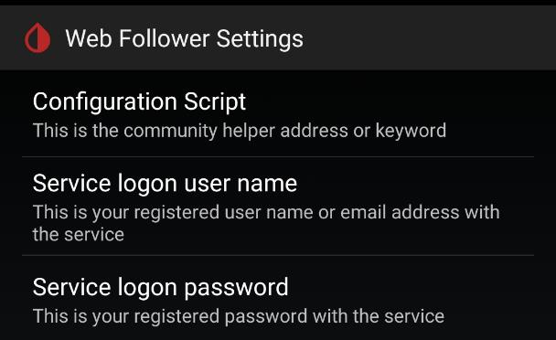
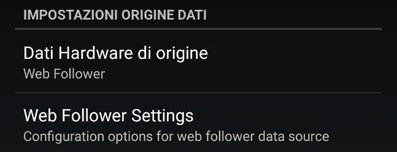
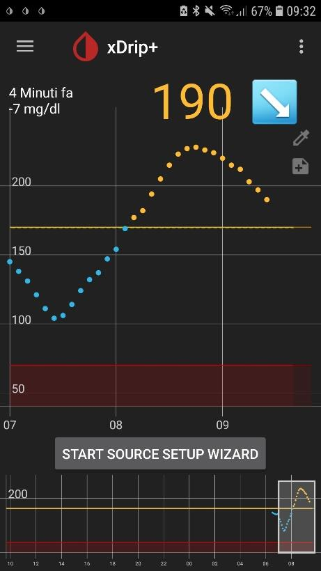

# xDrip+ follower FSL2 e 3

Le app ufficiali del FSL (FSL2 e FSL3) non permettono di impostare un quadrante su un orologio o un widget sulla schermata del telefono. xDrip+ risolve questo problema affiancandosi all'app del fornitore: riceve le letture via internet e aggiunge le funzioni mancanti.

> ⚠️ L'utilizzo è a esclusiva responsabilità personale.

## Prerequisiti

Devi già avere un **account follower FSL** attivo e funzionante:
- FSL2: crea un account follower nell'app LLink
- FSL3: segui le istruzioni del fornitore per aggiungere un follower

Assicurati che le letture arrivino correttamente nell'app del follower **prima** di proseguire. Annota l'**email** e la **password** dell'account follower: ti serviranno tra poco.

## 1. Installa xDrip+

Segui la [guida base di installazione](./installare-xdrip-android).

## 2. Configura la sorgente dati

1. Dal menu principale di xDrip+: **Menu → Impostazioni → Dati hardware di origine**.
2. Seleziona **Web Follower**.

> ⚠️ Non selezionare altre opzioni FSL: usa solo **Web Follower** per il collegamento tramite cloud.

3. Vai in **Web Follower Settings** e inserisci:
   - **Username:** l'email dell'account follower
   - **Password:** la password dell'account follower
   - Non modificare il nome dello script.

Se le credenziali del follower non funzionano, prova con quelle dell'app master del fornitore.

> ⚠️ Se non ricevi dati dopo qualche minuto, imposta la sorgente su **Disable collection** per evitare il blocco dell'account a causa di troppi tentativi falliti. Riprova più tardi.

## 3. Verifica il funzionamento

Dopo qualche istante le letture di glicemia compaiono su xDrip+. Il valore appare anche nelle notifiche del telefono, anche a schermo bloccato (se autorizzato nelle impostazioni Android).

## 4. Aggiungi il widget (opzionale)

xDrip+ ha un widget che mostra il valore glicemico e il grafico sulla schermata principale e di blocco.

**Esempio su Samsung Galaxy S7:**
1. Tieni premuto uno spazio vuoto nella schermata principale.
2. Seleziona **Widget** dal menu che appare.

3. Cerca **xDrip** e selezionalo.

Il metodo varia da modello a modello.

## 5. Visualizza le glicemie sullo smartwatch (opzionale)

xDrip+ può inviare la glicemia direttamente a diversi tipi di smartwatch:

- **Android Wear OS:** vedi la guida per il tuo orologio
- **Fitbit** Versa / Ionic: vedi la [guida Fitbit](../fitbit/fitbit-le-glicemie-di-dexcom-spike-xdrip-o-nightscout-su-smartwach-versa-e-ionic)
- **Xiaomi Mi Band / Amazfit:** vedi la [guida WatchDrip+](xdrip-e-watchdrip)
