# Usare le predizioni con xDrip+

xDrip+ include una funzione di simulazione che calcola l'evoluzione prevista della glicemia in base all'insulina attiva, ai carboidrati ingeriti e alla sensibilità individuale.

> ⚠️ **Questo sistema non è un dispositivo medico.** Non usare le predizioni per prendere decisioni terapeutiche. Consulta sempre il tuo diabetologo. L'utilizzo è a esclusiva responsabilità personale.

Per usare le predizioni è necessario conoscere:
- La **sensibilità insulinica** (ISF): di quanti mg/dL si abbassa la glicemia per 1 unità di insulina
- Il **rapporto insulina/CHO**: quanti grammi di carboidrati vengono coperti da 1 unità di insulina
- La **durata dell'insulina** (DIA)

Se non conosci questi valori o non sei abituato a calcolarli autonomamente, l'uso delle predizioni non è consigliato.

## 1. Abilita le simulazioni

Dal menu principale di xDrip+: **Menu → Impostazioni** → scorri verso il basso fino a **xDrip+ Impostazioni di Simulazione** → attiva **Abilita simulazioni**.

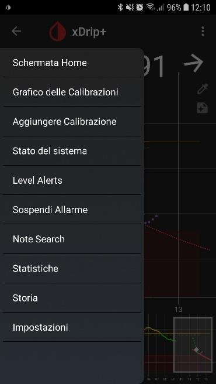

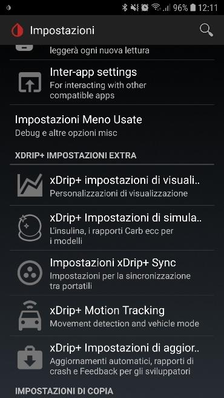


## 2. Imposta i parametri di base

| Parametro | Descrizione |
|---|---|
| **Target Glucose Default** | Il valore di glicemia usato come obiettivo per le correzioni suggerite |
| **Durata dell'insulina (DIA)** | Punto di partenza consigliato: 3 ore (poi aggiusta se necessario) |
| **Rapporto Sensibilità Fegato / Liver Maximum Impact** | Lascia i valori predefiniti — sono parametri sperimentali |

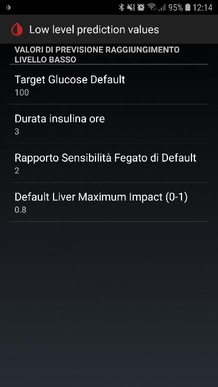

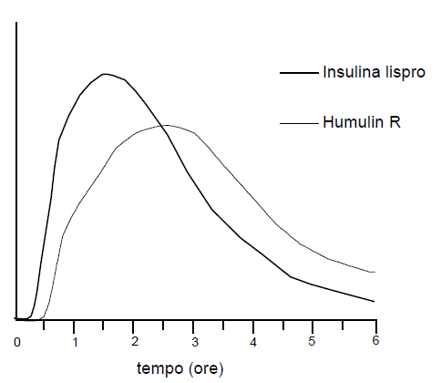

## 3. Imposta il profilo per fasce orarie

Vai in **Carb Ratio** o **Insulin Sensitivity** (portano alla stessa schermata):

1. Inserisci il **rapporto insulina/CHO** (quanti grammi di CHO coprono 1 unità) e la **sensibilità** (di quanti mg/dL scende la glicemia per 1 unità).
2. Premi **Salva**.


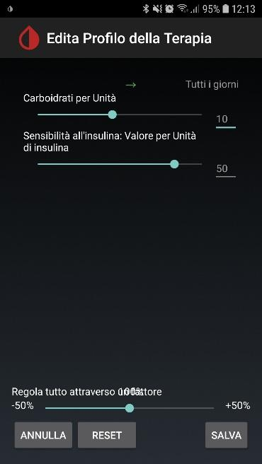

3. Se i valori cambiano durante la giornata, tieni premuto **Tutti i giorni** e scegli **Dividi questo blocco in due** per creare una nuova fascia oraria.


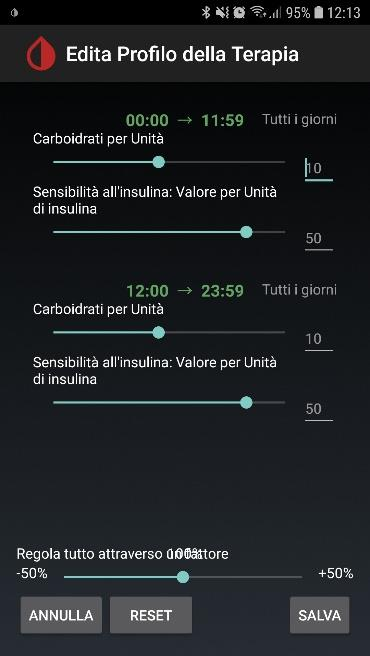


4. Per eliminare una fascia creata per errore, tieni premuto **Tutti i giorni** → **Elimina questo blocco di tempo**.

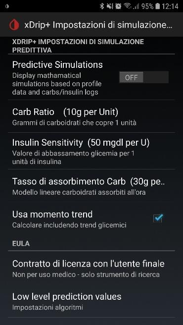

## 4. Tasso di assorbimento dei carboidrati

L'ultimo parametro è il tasso di assorbimento dei CHO all'ora. Per calcolarlo, segui il test descritto in fondo a questa pagina (adattamento del metodo di Anna Marchese).

## 5. Come usare le predizioni

Ogni volta che mangi o fai insulina:
- Tocca l'icona **posate** per inserire i carboidrati
- Tocca l'icona **siringa** per inserire le unità di insulina
- Puoi specificare un orario preciso (tasto orologio) o programmare un inserimento futuro: xDrip+ creerà un promemoria

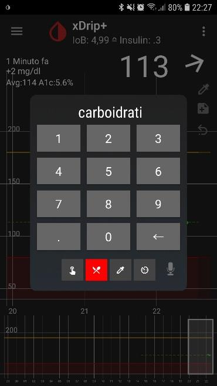

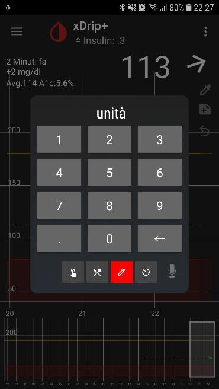

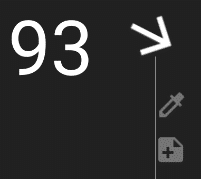

Per correggere un inserimento errato: toccalo → **Aggiungi nota** → scrivi `DELETE`.

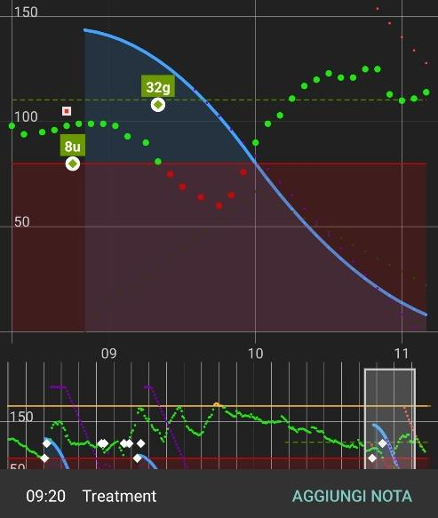

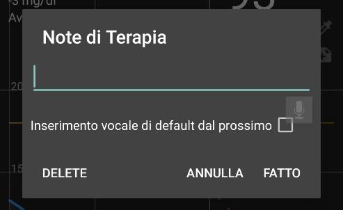

### Interpretazione delle curve

| Elemento | Significato |
|---|---|
| **Curva rossa** | Previsione glicemia senza carboidrati aggiuntivi |
| **Curva viola** | Previsione con i parametri impostati (insulina + CHO) |
| **Curva blu** | Insulina ancora attiva nel corpo |
| **IOB** | Insulina a bordo (unità ancora attive nel sangue) |

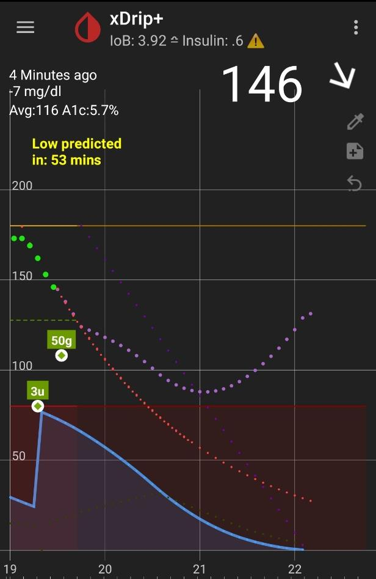

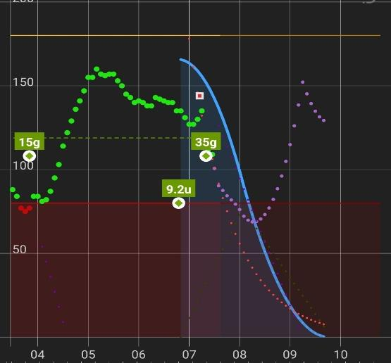

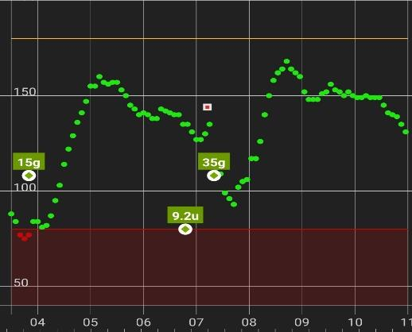

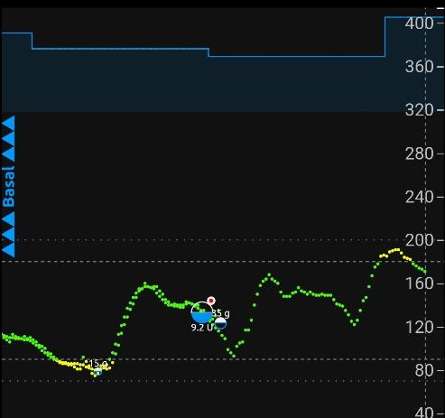

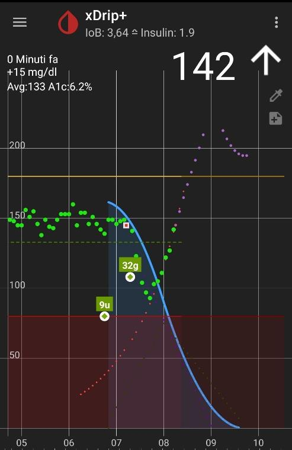

> ⚠️ Quando c'è insulina in circolo, agisci con massima cautela. **Non lanciare una nuova correzione prima che la precedente abbia fatto effetto.** Segui sempre le indicazioni del tuo diabetologo.

Le predizioni sono utili per:
- Avere un indicatore aggiuntivo sull'andamento glicemico
- Mantenere aggiornati i fattori di correzione e i rapporti UI/CHO
- Stimare quanta insulina residua e quanti CHO sono ancora presenti nel corpo
- Valutare i tempi tra bolo e pasto

---

## Appendice: Calcolare il tasso di assorbimento dei carboidrati

*Traduzione e adattamento del post su #DIYPS — a cura di Anna Marchese*

Questo test è rivolto a persone con **diabete di tipo 1** e richiede un CGM accurato.

### Prerequisiti

- Nessuna insulina attiva oltre alla basale
- Non aver mangiato di recente
- Glicemia stabile e nel range (idealmente intorno a 80 mg/dL, per avere margine di salita)
- Il test può durare fino a 2 ore

### Come eseguire il test

1. Consuma una quantità premisurata di carboidrati semplici (15–30 g), come un piccolo brick di succo di frutta, **senza proteine né grassi**.
2. Nota l'ora esatta e il valore di glicemia al momento del consumo.
3. Ogni 5 minuti annota il nuovo valore CGM.
4. Aspettati una glicemia relativamente stabile per circa 15 minuti (tempo di assorbimento iniziale), poi un aumento costante.
5. Quando la glicemia si appiattisce, fai un bolo di correzione.

### Calcolo del rapporto glicemia/CHO (BG:C)

Se non lo conosci, calcolalo così:

```
BG:C = Rapporto I:C ÷ Fattore di correzione

Esempio: I:C = 10 g/U, FC = 40 mg/dL per U → BG:C = 10 ÷ 40 = 0,25 → 1 g di CHO alza la glicemia di 4 mg/dL
```

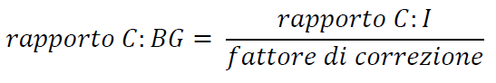

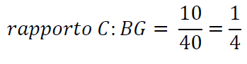

### Calcolo del tasso di assorbimento

Una volta identificato il momento in cui la glicemia inizia a salire costantemente, misura:

```
Tasso = aumento di glicemia (mg/dL) ÷ minuti trascorsi

Esempio: +60 mg/dL in 30 minuti → 2 mg/dL al minuto
Con BG:C = 4: 2 ÷ 4 = 0,5 g di CHO al minuto → 30 g/ora
```

### Calcolo dei carboidrati non assorbiti dopo un pasto

Formula semplificata:

```
CHO rimanenti = CHO totali - [(minuti trascorsi - 15 min di ritardo) × tasso g/min]
```

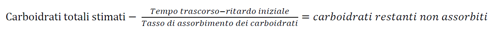

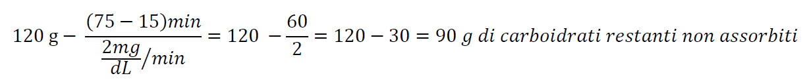

Questo valore, confrontato con l'IOB (insulina attiva), aiuta a capire se serve un bolo di correzione o una basale temporanea a zero.
