# Usare le predizioni con xDrip

xDrip include una funzione di simulazione che calcola l'evoluzione prevista della glicemia in base all'insulina attiva, ai carboidrati ingeriti e alla sensibilità individuale.


> ⚠️ **Questo sistema non è un dispositivo medico.** Non usare le predizioni per prendere decisioni terapeutiche. Consulta sempre il tuo diabetologo. L'utilizzo è a esclusiva responsabilità personale.

xDrip stesso mostra questo avviso non appena attivi le simulazioni:

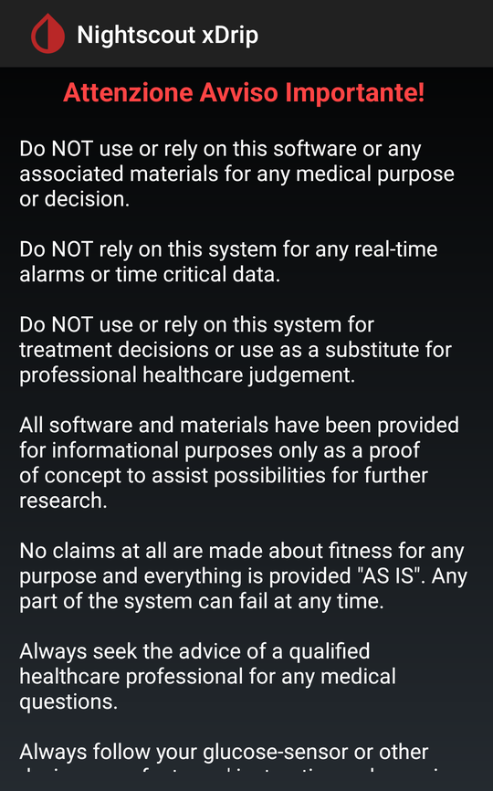

Prima di procedere devi anche accettare il contratto di licenza con l'utente finale (EULA):

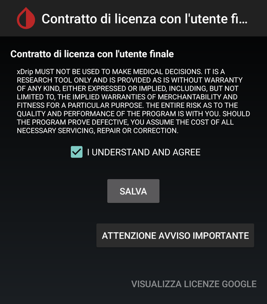

Per usare le predizioni è necessario conoscere:
- La **sensibilità insulinica** (ISF): di quanti mg/dL si abbassa la glicemia per 1 unità di insulina
- Il **rapporto insulina/CHO**: quanti grammi di carboidrati vengono coperti da 1 unità di insulina
- La **durata dell'insulina** (DIA)

Se non conosci questi valori o non sei abituato a calcolarli autonomamente, l'uso delle predizioni non è consigliato.

## 1. Abilita le simulazioni

Dal menu principale di xDrip:

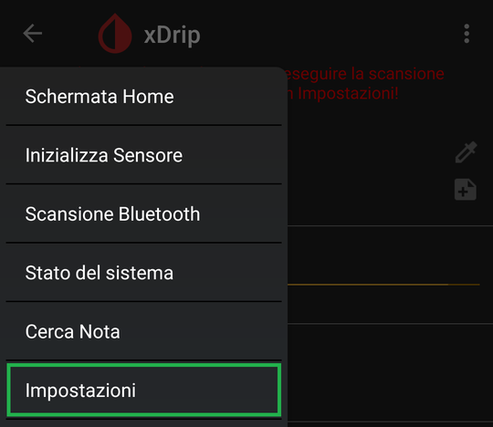

Vai in **Impostazioni** → scorri verso il basso fino alla sezione **xDrip+ Impostazioni Extra**, dove trovi la voce **xDrip+ Impostazioni di simulazione**:


Entra nella pagina e attiva **Predictive Simulations**:

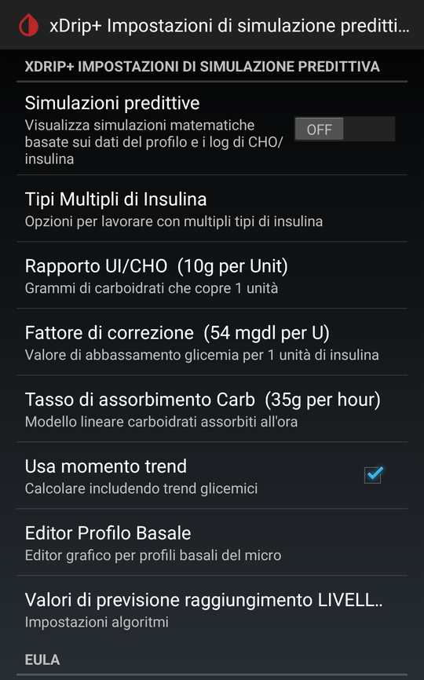

## 2. Imposta i parametri di base

| Parametro | Descrizione |
|---|---|
| **Target Glucose Default** | Il valore di glicemia usato come obiettivo per le correzioni suggerite |
| **Durata dell'insulina (DIA)** | Punto di partenza consigliato: 3 ore (poi aggiusta se necessario) |
| **Rapporto Sensibilità Fegato / Liver Maximum Impact** | Lascia i valori predefiniti — sono parametri sperimentali |

Questi parametri si trovano nella pagina **Valori di previsione raggiungimento livello basso**:

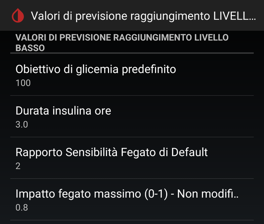

La durata dell'insulina (DIA) dipende dal tipo usato: gli analoghi rapidi (come lispro) hanno una curva d'azione più breve rispetto a un'insulina umana regolare come la Humulin R:

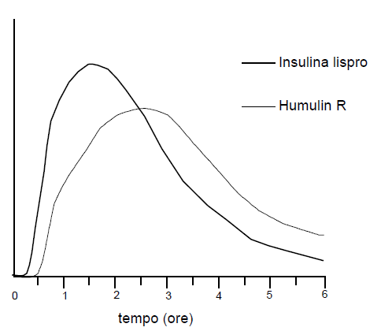

## 3. Imposta il profilo per fasce orarie

Torna nella pagina **xDrip+ Impostazioni di simulazione** e vai in **Carb Ratio** o **Insulin Sensitivity** (portano alla stessa schermata):

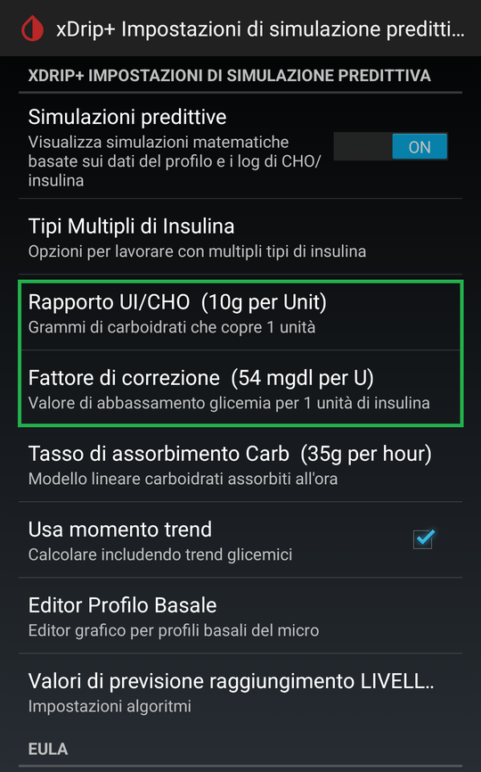

1. Inserisci il **rapporto insulina/CHO** (quanti grammi di CHO coprono 1 unità) e la **sensibilità** (di quanti mg/dL scende la glicemia per 1 unità).
2. Premi **Salva**.

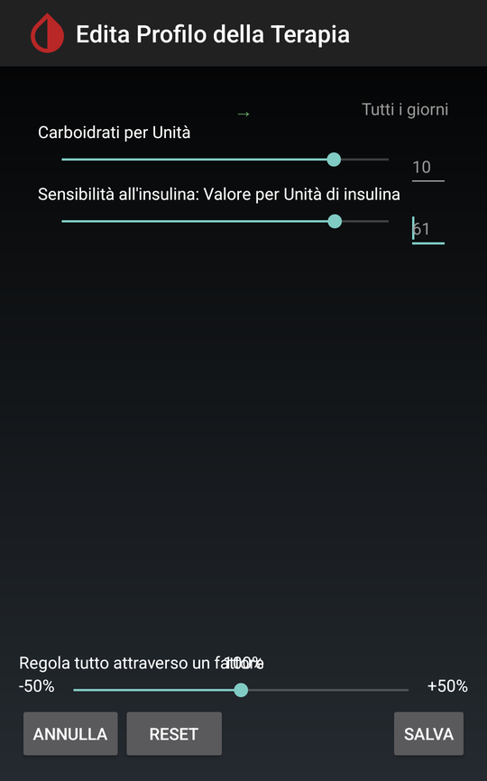

3. Se i valori cambiano durante la giornata, tieni premuto **Tutti i giorni** e scegli **Dividi questo blocco in due** per creare una nuova fascia oraria.

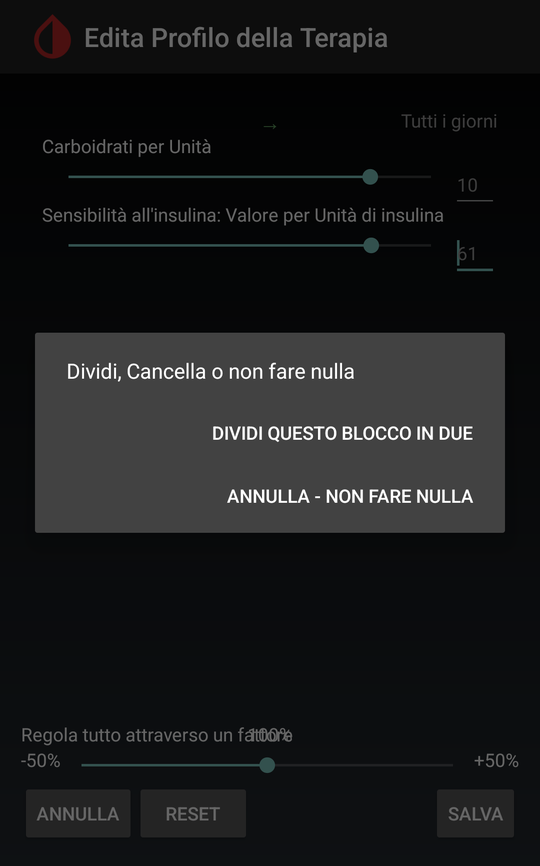

Il blocco viene diviso in due fasce orarie indipendenti, ciascuna con i propri valori di Carboidrati e Sensibilità:

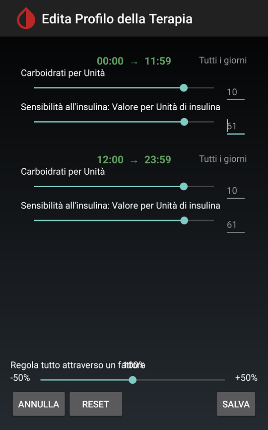

4. Per eliminare una fascia creata per errore, tieni premuto **Tutti i giorni** sul blocco da rimuovere: nel menu che compare trovi anche l'opzione **Elimina questo blocco di tempo**.

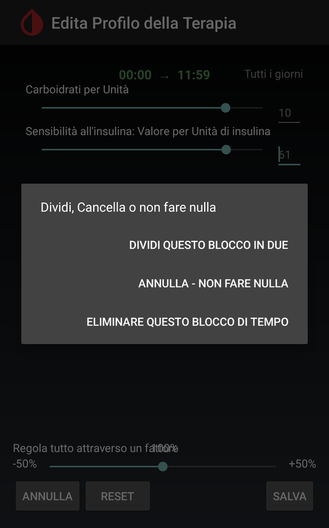

Al termine, torna alla schermata delle impostazioni di simulazione:

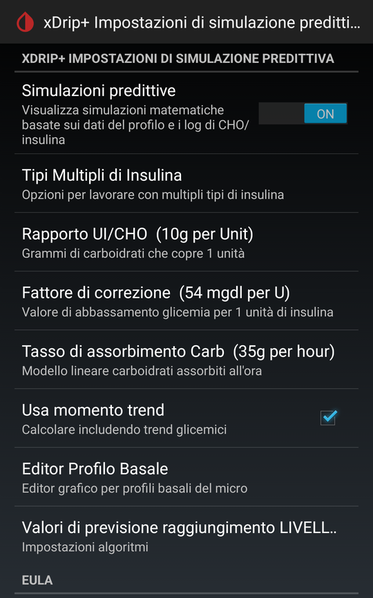

## 4. Tasso di assorbimento dei carboidrati

L'ultimo parametro è il tasso di assorbimento dei CHO all'ora. Per calcolarlo, segui il test descritto nell'appendice in fondo a questa pagina (adattamento del metodo di Anna Marchese).

## 5. Come usare le predizioni

Ogni volta che mangi o fai insulina:
- Tocca l'icona **posate** per inserire i carboidrati
- Tocca l'icona **siringa** per inserire le unità di insulina
- Puoi specificare un orario preciso (tasto orologio) o programmare un inserimento futuro: xDrip creerà un promemoria

Il tastierino per inserire i **carboidrati** (icona posate evidenziata in rosso):

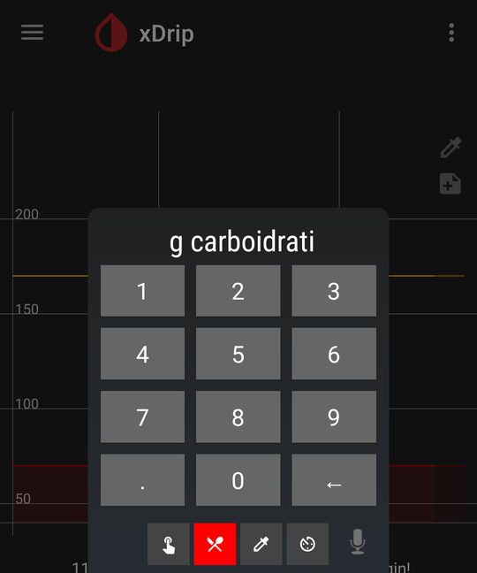

Lo stesso tastierino per le **unità** di insulina (icona siringa evidenziata):

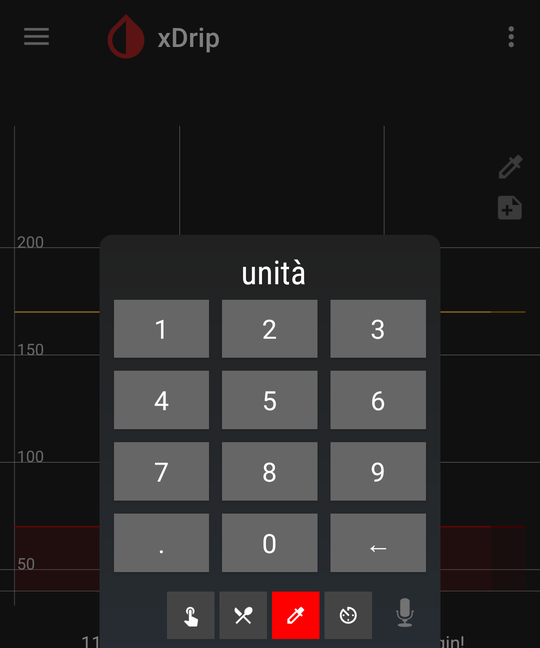

Le icone di inserimento compaiono accanto al valore corrente nella schermata principale:

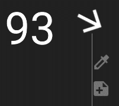

Per correggere un inserimento errato: toccalo sul grafico...

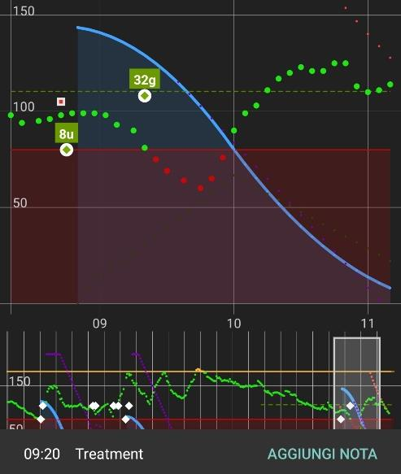

...poi **Aggiungi nota** → scrivi `DELETE`:

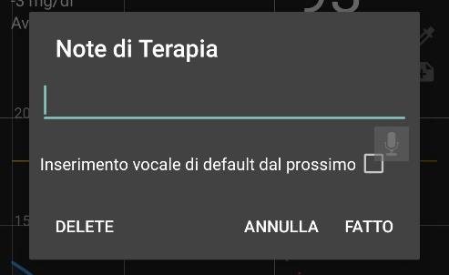

### Interpretazione delle curve

| Elemento | Significato |
|---|---|
| **Curva rossa** | Previsione glicemia senza carboidrati aggiuntivi |
| **Curva viola** | Previsione con i parametri impostati (insulina + CHO) |
| **Curva blu** | Insulina ancora attiva nel corpo |
| **IOB** | Insulina a bordo (unità ancora attive nel sangue) |

Un esempio completo, con l'avviso **Low predicted in: 53 mins** generato dalla curva rossa:

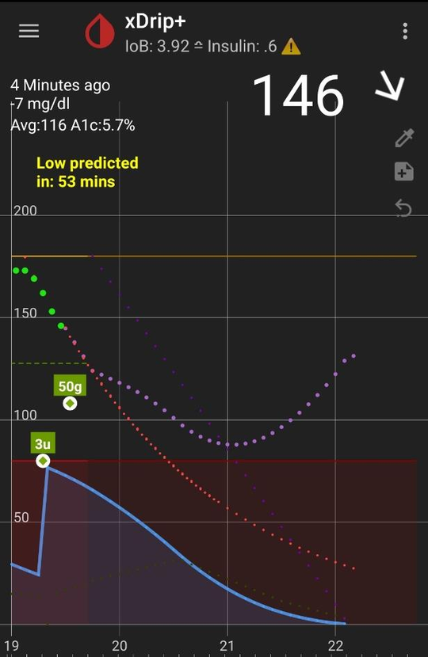

Un altro esempio: i trattamenti da 15g, 35g di carboidrati e 9,2u di insulina sono segnati sul grafico, con la curva blu che mostra l'insulina ancora attiva:

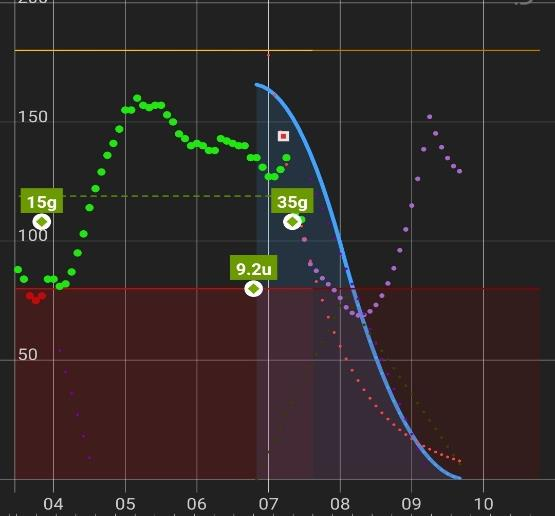

Con il passare del tempo, il grafico si aggiorna e puoi confrontare l'andamento reale (punti verdi) con quanto previsto:

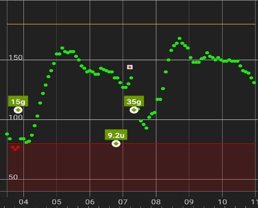

Allargando la vista puoi anche sovrapporre il grafico della basale erogata alla curva glicemica e all'IOB dello stesso periodo:

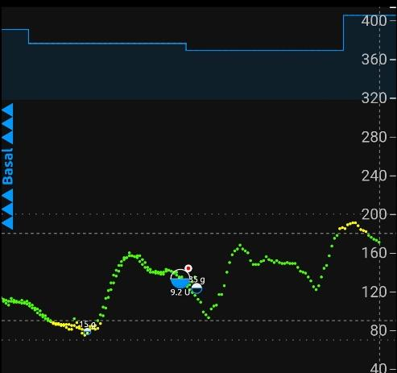

Un ultimo esempio, questa volta dalla schermata principale di xDrip, con tutti gli indicatori insieme: valore attuale, IOB, insulina attiva e curve di previsione per un trattamento da 32g e 9u:

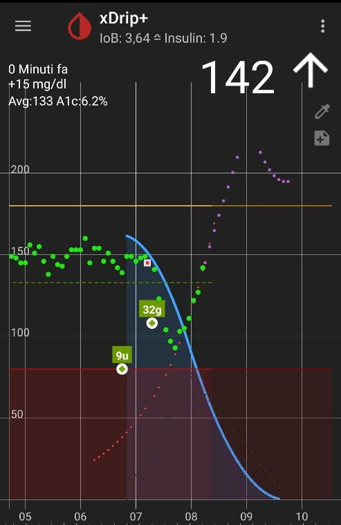

> ⚠️ Quando c'è insulina in circolo, agisci con massima cautela. **Non lanciare una nuova correzione prima che la precedente abbia fatto effetto.** Segui sempre le indicazioni del tuo diabetologo.

Le predizioni sono utili per:
- Avere un indicatore aggiuntivo sull'andamento glicemico
- Mantenere aggiornati i fattori di correzione e i rapporti UI/CHO
- Stimare quanta insulina residua e quanti CHO sono ancora presenti nel corpo
- Valutare i tempi tra bolo e pasto

---

## 6. Appendice: Calcolare il tasso di assorbimento dei carboidrati

*Traduzione e adattamento del post su #DIYPS — a cura di Anna Marchese*

Questo test è rivolto a persone con **diabete di tipo 1** e richiede un CGM accurato.

### Prerequisiti

- Nessuna insulina attiva oltre alla basale
- Non aver mangiato di recente
- Glicemia stabile e nel range (idealmente intorno a 80 mg/dL, per avere margine di salita)
- Il test può durare fino a 2 ore

### Come eseguire il test

1. Consuma una quantità premisurata di carboidrati semplici (15–30 g), come un piccolo brick di succo di frutta, **senza proteine né grassi**.
2. Nota l'ora esatta e il valore di glicemia al momento del consumo.
3. Ogni 5 minuti annota il nuovo valore CGM.
4. Aspettati una glicemia relativamente stabile per circa 15 minuti (tempo di assorbimento iniziale), poi un aumento costante.
5. Quando la glicemia si appiattisce, fai un bolo di correzione.

### Calcolo del rapporto glicemia/CHO (BG:C)

Il rapporto **BG:C** indica di quanti mg/dL sale la glicemia per 1 g di CHO. Se non lo conosci, calcolalo così:

```
BG:C = Fattore di correzione ÷ Rapporto I:C

Esempio: I:C = 10 g/U, FC = 40 mg/dL per U → BG:C = 40 ÷ 10 = 4 → 1 g di CHO alza la glicemia di 4 mg/dL
```

Il suo inverso è il rapporto **C:BG** (quanti grammi di CHO servono per alzare la glicemia di 1 mg/dL; nell'esempio, 10 ÷ 40 = `0,25`). La formula del rapporto C:BG:

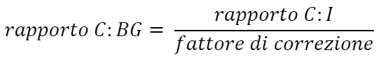

E il calcolo con i valori dell'esempio:

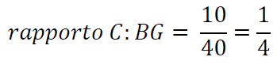

### Calcolo del tasso di assorbimento

Una volta identificato il momento in cui la glicemia inizia a salire costantemente, misura:

```
Tasso = aumento di glicemia (mg/dL) ÷ minuti trascorsi

Esempio: +60 mg/dL in 30 minuti → 2 mg/dL al minuto
Con BG:C = 4: 2 ÷ 4 = 0,5 g di CHO al minuto → 30 g/ora
```

### Calcolo dei carboidrati non assorbiti dopo un pasto

Formula semplificata:

```
CHO rimanenti = CHO totali - [(minuti trascorsi - 15 min di ritardo) × tasso g/min]
```

La formula completa:

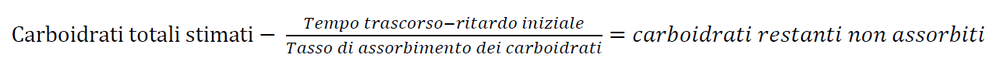

E un esempio numerico (120 g di carboidrati, 75 minuti trascorsi, tasso 2 mg/dL al minuto):

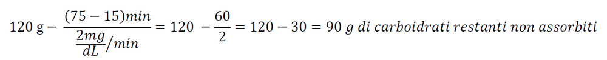

Questo valore, confrontato con l'IOB (insulina attiva), aiuta a capire se serve un bolo di correzione o una basale temporanea a zero.
