# Ricevere le letture da FSL 2 con xDrip4iOS

> ℹ️ **Nota**: L'app aggiornata del fornitore permette la lettura in continuo senza scansionare: usare xDrip4iOS solo per questo scopo non è più obbligatorio. xDrip4iOS non manda dati ai server del fornitore.

Questa guida passo passo spiega come installare l'app xDrip4iOS per leggere i dati in continuo da FSL2 (sensore glicemico) tramite iPhone.

È necessario un iPhone compatibile con l'app del fornitore (minimo iPhone 7, iOS 13.2).

> ⚠️ **Attenzione**: L'uso di questa guida potrebbe disabilitare allarmi e letture in continuo del lettore o dell'app del fornitore, forse senza possibilità di ripristinarli. Questa modalità di utilizzo del sensore non è consentita dal produttore. Potrai comunque usare l'app del fornitore o il lettore per leggere il sensore manualmente. È consigliato fare le prove con un sensore vicino alla scadenza. L'utilizzo è soggetto all'assunzione di esclusiva responsabilità personale.

## 1. Installare xDrip4iOS

Segui questa guida:

`https://www.glicemiadistanza.it/xdrip-per-iphone-le-glicemie-di-dexcom-g5-g6-e-miaomiao-lette-con-iphone/`

## 2. Disabilitare il Bluetooth per l'app del fornitore

Il sensore deve essere stato avviato (dal lettore o dall'app del fornitore) da più di un'ora. Assicurati che funzioni correttamente prima di procedere.

Nelle impostazioni di iOS, scorri fino all'app del fornitore e disabilita il **Bluetooth**. Una volta fatto, l'app del fornitore o il lettore potrebbero non essere più in grado di ricevere il segnale Bluetooth, né gli allarmi.

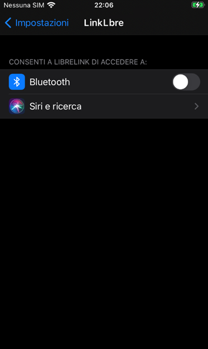

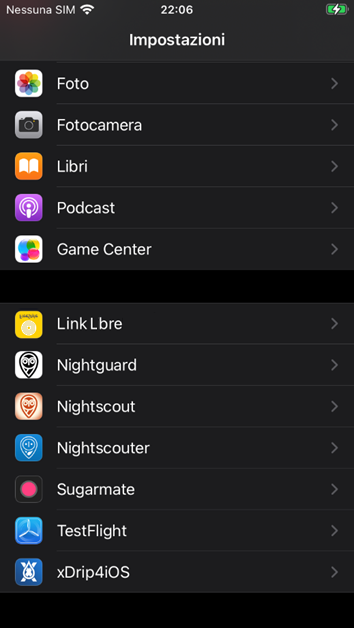

## 3. Abbinare il sensore a xDrip4iOS

1. In xDrip4iOS, apri la scheda **Bluetooth** (icona ingranaggio in basso a destra).
2. Tocca **+** (in alto a destra) e seleziona **CGM** → **OK**.
3. Scegli **Libre 2** → **OK**.

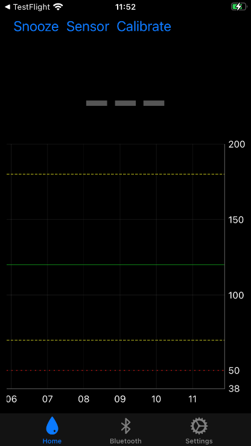

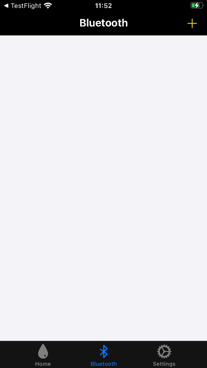

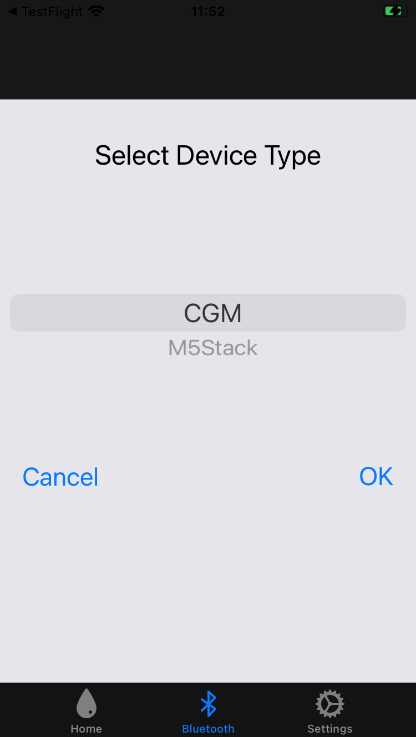

4. Tocca **Scan** (in alto a sinistra) e autorizza xDrip4iOS a usare il Bluetooth.

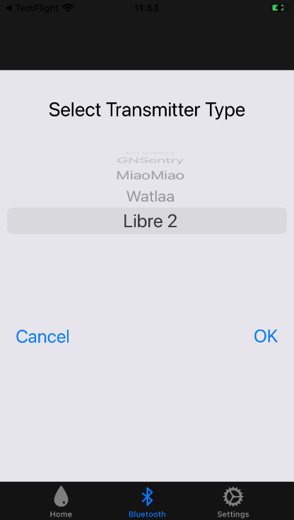

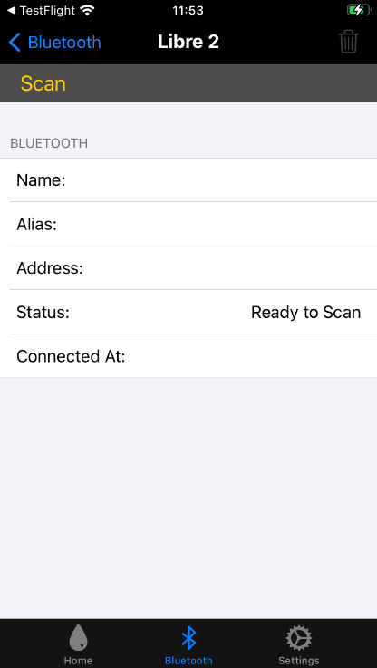

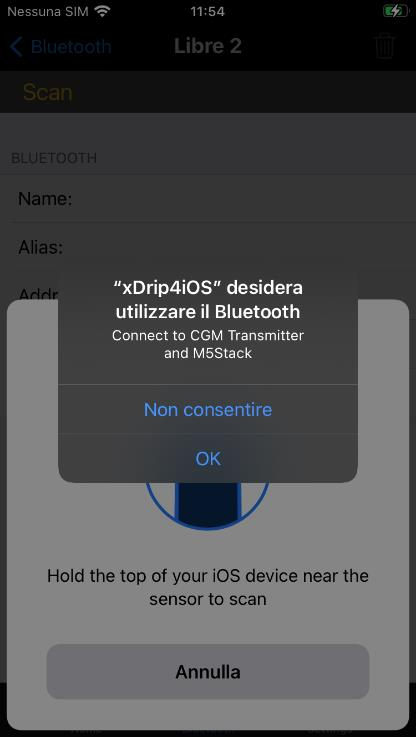
5. Scansiona il sensore con il telefono come con l'app del fornitore (avvicina la parte superiore del telefono al sensore).
6. Lascia lo schermo aperto finché non compare il messaggio **"Warning! Connected to L\*\*\*\* 2"**. Il sensore è collegato.

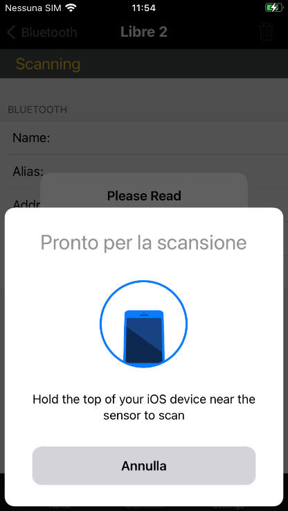

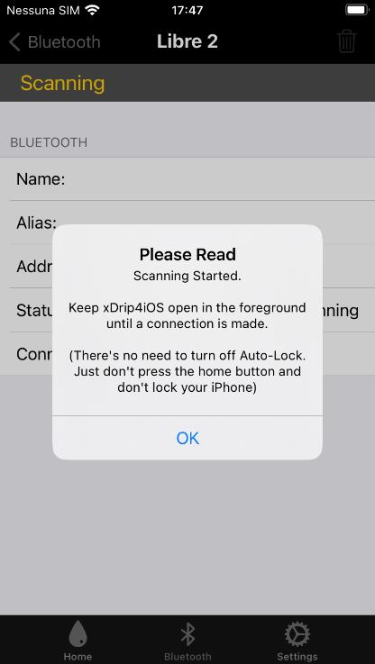

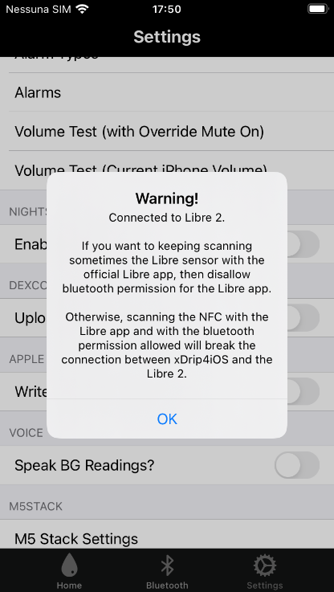

Una volta collegato, il sensore compare nella lista dei dispositivi Bluetooth. Per usare l'algoritmo nativo, abilita **Algorithm** (se presente: nelle versioni più recenti potrebbe non esserci più). Se disabilitato, dovrai calibrare. Entro pochi minuti la glicemia dovrebbe essere visibile.

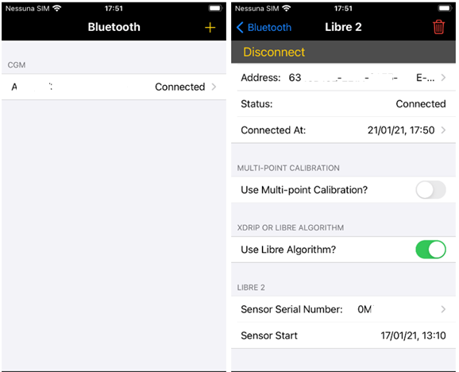

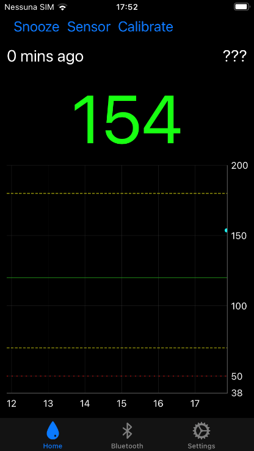

---

Se necessario, per ripristinare l'app del fornitore, elimina il FSL2 da xDrip4iOS e riabilita il Bluetooth.

Se il telefono è troppo lontano dal sensore ci saranno letture mancanti. Non possono essere recuperate con xDrip4iOS, ma sono disponibili fino a 8 ore dopo con l'app originale.

Per condividere la glicemia e usare smartwatch diversi da Apple Watch (Fitbit, Garmin, Samsung Gear), è necessario Nightscout (`https://www.glicemiadistanza.it/nightscout/`) o Gluroo (`https://www.glicemiadistanza.it/gluroo/`).

