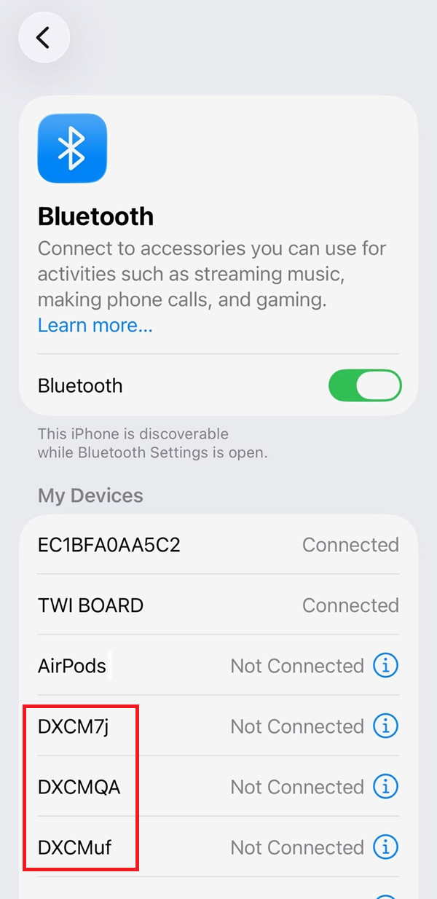
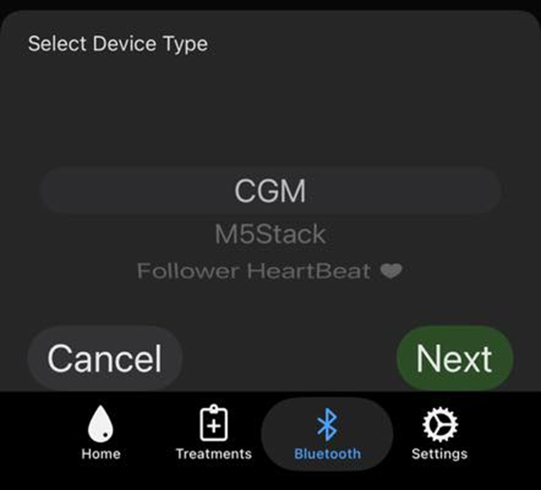
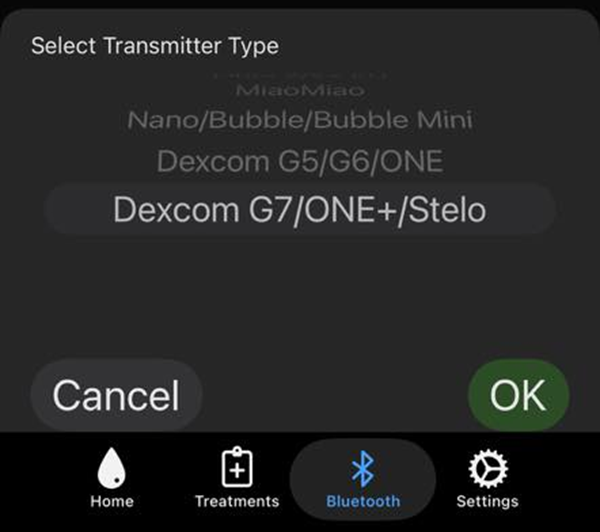
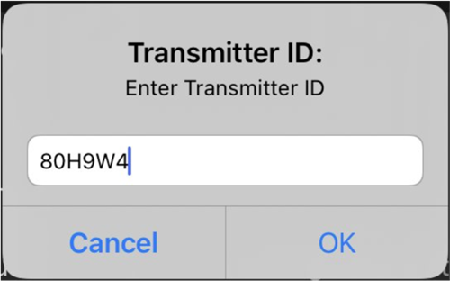
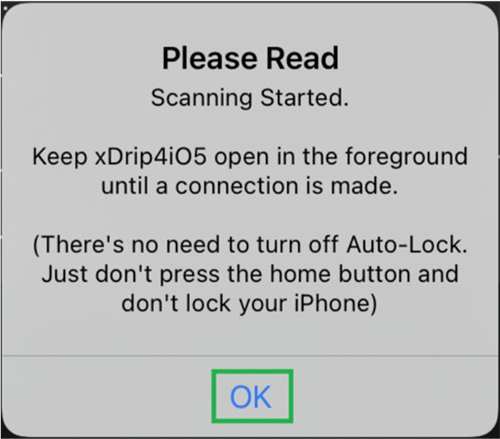
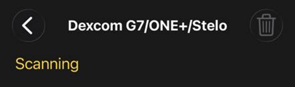
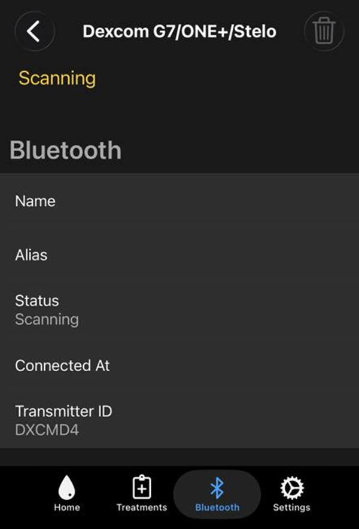
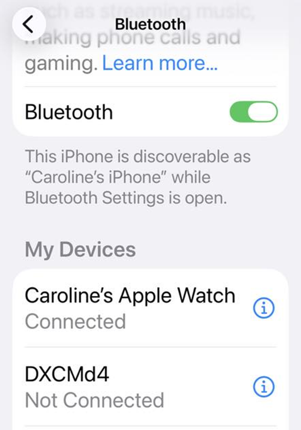
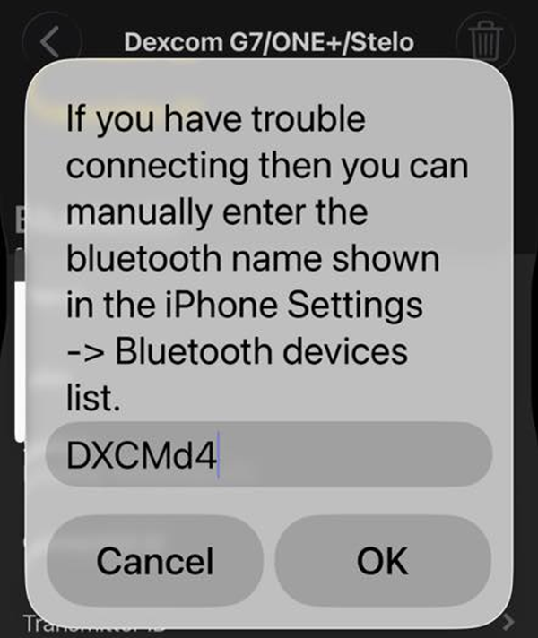
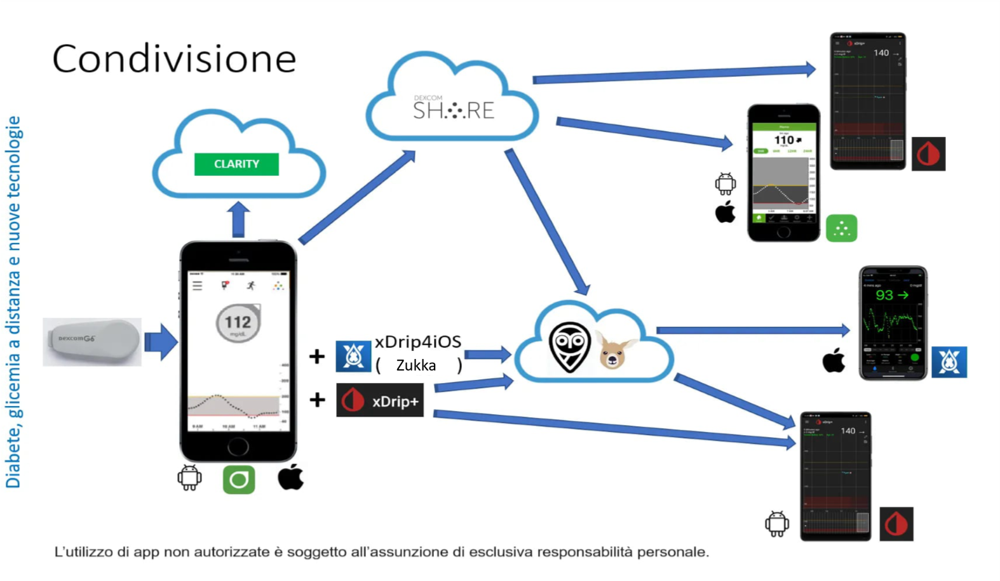

# Dex G7/ONE+/Stelo con xDrip4iOS

Una soluzione fai-da-te per visualizzare la glicemia su Apple Watch con il calendario o una complicazione.

**Il sensore deve essere stato avviato con l’app ufficiale.** Assicurati che funzioni correttamente prima di andare avanti.

## 1. Installa xDrip4iOS

L'aggiunta di xDrip4iOS sul telefonino master non comporta alcun rischio per il sensore e non impedisce il corretto funzionamento dell'app ufficiale.
Vedi come fare [qua](./installare-xdrip4ios), e torna in questa guida dopo.

## 2. Rimuovi i vecchi sensori Dex

Per evitare di collegarsi a un vecchio sensore (inesistente oppure oltre 10 giorni di età) è consigliato rimuovere i vecchi dispositivi della lista Bluetooth. Conviene prendere l'abitudine di farlo ogni cambio sensore.

Vai alle **Impostazioni** del tuo iPhone e scorri verso il basso per **Bluetooth**.

## 3. Abbina il trasmettitore

Accedi alla scheda **Bluetooth** dell’app xDrip4iOS e fai clic sul pulsante **+** per aggiungere un nuovo tipo di dispositivo.

Seleziona **CGM** e poi scegli il tuo sistema Dex (G7/ONE+/Stelo) dall'elenco.

Ti verrà richiesto di inserire l'ID del trasmettitore (ad esempio: 80H9W4), inserisci il tuo.

Una volta inserito l'ID del trasmettitore, verrà visualizzato un messaggio che ti chiede di mantenere aperto xDrip4iOS mentre viene trovato il trasmettitore e viene stabilita una connessione Bluetooth. Lascia il tuo iPhone sul tavolo e prendi un caffè. NON giocare a Roblox, guardare Netflix o ascoltare Spotify. Metti giù il telefono senza toccarlo e restagli vicino.

Quando xDrip4iOS trova il tuo trasmettitore, riceverai un messaggio che dice che è stato collegato correttamente. Fai clic su **OK**.

Una volta connesso, vedrai sempre il suo stato come Scansione poiché comunica solo per un breve periodo di tempo ogni 5 minuti.

 

Adesso che xDrip4iOS è collegato, puoi anche riabilitare il Bluetooth dell'app Dex.

 

## 4. Aiuto non lo trova!

Prima di tutto, verifica che hai disabilitato il Bluetooth dell'app Dex. Se non è disabilitato, xDrip4iOS non troverà mai il dispositivo...

Se xDrip4iOS non trova alcun dispositivo puoi inserirlo manualmente. È generalmente non necessario.

Vai nella lista dei dispositivi Bluetooth del tuo iPhone e cerca quello chiamato DXCM...

**Non provare ad abbinarlo in questa schermata**: serve solo il suo nome.

In xDrip4iOS, tocca la riga **Transmitter ID** e metti lo stesso nome (attenzione alle minuscole e maiuscole!).

 

Per condividere la glicemia con altri telefoni e utilizzare smartwatch diversi da Apple Watch (Fitbit, Garmin, Samsung Gear) serve Nightscout `https://www.glicemiadistanza.it/nightscout/` o Gluroo `https://www.glicemiadistanza.it/gluroo/`

 

La documentazione originale (link con traduttore automatico): `https://xdrip4ios-readthedocs-io.translate.goog/en/latest/connect/cgm/?_x_tr_sl=auto&_x_tr_tl=it`

**L'utilizzo è soggetto all'assunzione di esclusiva responsabilità personale.**
