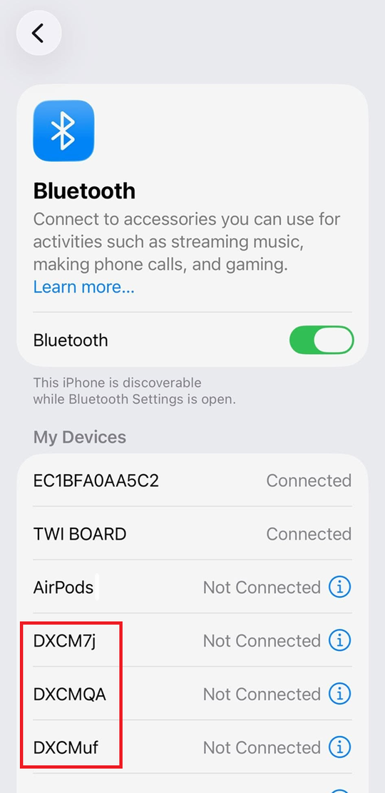
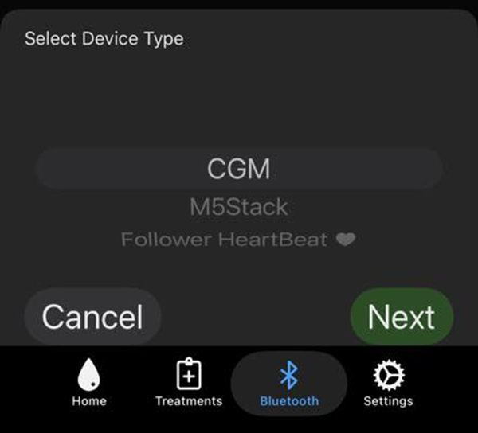
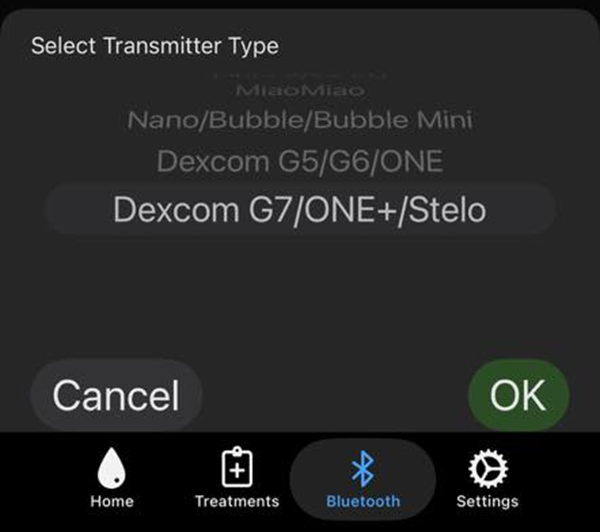
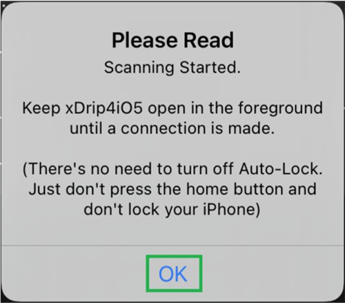
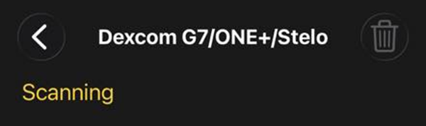
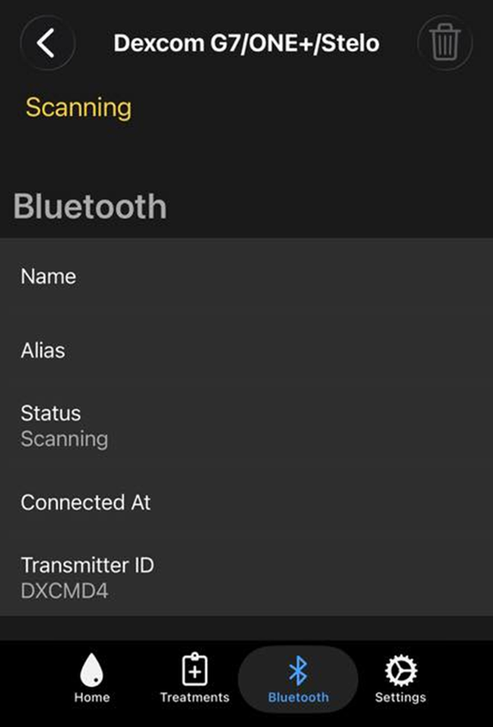
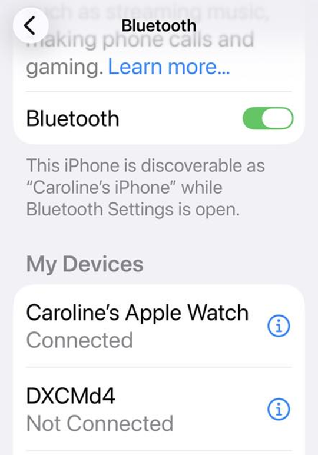
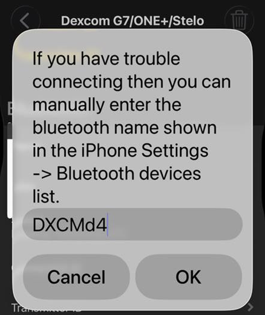
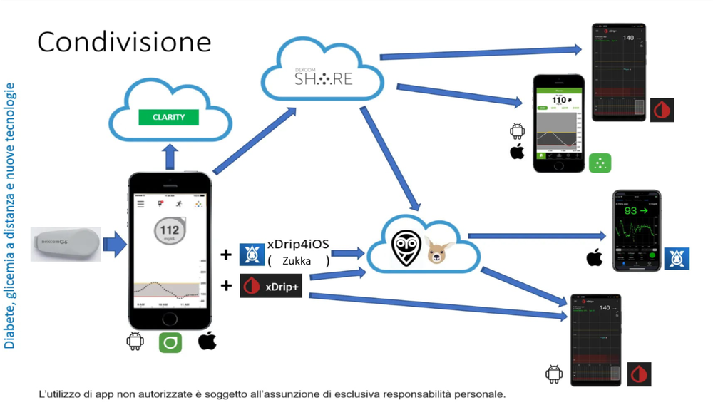

# Dex G7/ONE+/Stelo con xDrip4iOS

Una soluzione fai-da-te per visualizzare la glicemia su Apple Watch con il calendario o una complicazione.

**Il sensore deve essere stato avviato con l’app ufficiale.** Assicurati che funzioni correttamente prima di andare avanti.

## 1. Installa xDrip4iOS

L'aggiunta di xDrip4iOS sul telefonino master non comporta alcun rischio per il sensore e non impedisce il corretto funzionamento dell'app ufficiale.
Vedi come fare [qua](./installare-xdrip4ios), poi torna a questa guida.

## 2. Rimuovi i vecchi sensori Dex

**A ogni cambio sensore, prima di tutto** — cioè prima ancora di avviare il nuovo sensore con l'app ufficiale — rimuovi i vecchi sensori dalla lista Bluetooth dell'iPhone. Prendici l'abitudine: è un gesto di 10 secondi che evita quasi tutti i problemi di abbinamento.

> ℹ️ **Nota**: perché è così importante? Un G7 o ONE+ sostituito prima della scadenza dei 10 giorni + 12 ore di tolleranza **resta attivo e continua a trasmettere un valore anche staccato dal corpo**. Se rimane nella lista Bluetooth, il telefono rischia di collegarsi al sensore vecchio invece che al nuovo.

Vai nelle **Impostazioni** del tuo iPhone e scorri verso il basso fino a **Bluetooth**.

Nella lista **My Devices**, i vecchi sensori sono quelli il cui nome inizia con `DXCM`: rimuovili toccando la **i** e poi **Dissocia**:

Solo dopo questa pulizia avvia il nuovo sensore con l'app ufficiale Dex e verifica che funzioni.

## 3. Rimuovi il vecchio sensore anche da xDrip4iOS

Quando il nuovo sensore funziona nell'app ufficiale, passa a xDrip4iOS: se nella scheda **Bluetooth** di xDrip4iOS è ancora presente il sensore precedente, eliminalo con l'icona del **cestino** prima di avviare la scansione. Se non c'è nessun vecchio sensore, avvia semplicemente la scansione (sezione 4).

> ℹ️ **Nota**: a differenza del G6, il G7/ONE+ accetta più collegamenti Bluetooth contemporanei: **non serve** disabilitare il Bluetooth dell'app ufficiale Dex, che continuerà a ricevere letture e allarmi insieme a xDrip4iOS.

## 4. Abbina il trasmettitore

Accedi alla scheda **Bluetooth** dell’app xDrip4iOS e tocca il pulsante **+** per aggiungere un nuovo tipo di dispositivo.

Seleziona **CGM** e poi scegli il tuo sistema Dex (G7/ONE+/Stelo) dall'elenco.

In **Select Device Type**, seleziona **CGM** e tocca **Next**:

In **Select Transmitter Type**, scorri fino a **Dexcom G7/ONE+/Stelo** e tocca **OK**:

> ℹ️ **Nota**: con G7, ONE+ e Stelo **non serve inserire nessun ID del trasmettitore né codice del sensore**: xDrip4iOS trova il sensore da solo con la scansione.

Verrà visualizzato un messaggio che ti chiede di mantenere aperto xDrip4iOS mentre viene trovato il trasmettitore e viene stabilita una connessione Bluetooth. Lascia il tuo iPhone sul tavolo e prendi un caffè. NON giocare a Roblox, guardare Netflix o ascoltare Spotify. Metti giù il telefono senza toccarlo e restagli vicino.

L'avviso **Please Read** ricorda di tenere l'app in primo piano: tocca **OK**:

Durante la ricerca, la scheda del dispositivo mostra lo stato **Scanning**:

Quando xDrip4iOS trova il tuo trasmettitore, riceverai un messaggio che dice che è stato collegato correttamente. Tocca **OK**.

Una volta connesso, vedrai sempre il suo stato come **Scanning**, poiché comunica solo per un breve periodo di tempo ogni 5 minuti.

La scheda del dispositivo con lo stato **Scanning** e il **Transmitter ID** rilevato:

## 5. Aiuto, non lo trova!

Prima di tutto, verifica di aver fatto pulizia dei vecchi sensori, sia nel Bluetooth dell'iPhone (sezione 2) sia nella scheda Bluetooth di xDrip4iOS (sezione 3): è la causa più comune.

Se xDrip4iOS non trova comunque il dispositivo, puoi inserirlo manualmente. Generalmente non è necessario.

Vai nella lista dei dispositivi Bluetooth del tuo iPhone e cerca quello chiamato `DXCM`...

**Non provare ad abbinarlo in questa schermata**: serve solo il suo nome.

Nella lista **My Devices** delle impostazioni Bluetooth, individua il nome del sensore (nell'esempio `DXCMd4`):

In xDrip4iOS, tocca la riga **Transmitter ID** e metti lo stesso nome (attenzione alle minuscole e maiuscole!).

---

Per condividere la glicemia con altri telefoni e utilizzare smartwatch diversi da Apple Watch (Fitbit, Garmin, Samsung Gear) serve Nightscout ([`https://www.glicemiadistanza.it/nightscout/`](https://www.glicemiadistanza.it/nightscout/)) o [Gluroo](../gluroo/gluroo).

La documentazione originale (link con traduttore automatico): [`https://xdrip4ios-readthedocs-io.translate.goog/en/latest/connect/cgm/?_x_tr_sl=auto&_x_tr_tl=it`](https://xdrip4ios-readthedocs-io.translate.goog/en/latest/connect/cgm/?_x_tr_sl=auto&_x_tr_tl=it)

Lo schema delle possibilità di condivisione: dal sensore al telefono master, poi verso Clarity, Share, xDrip4iOS/xDrip e i dispositivi follower:

**L'utilizzo è soggetto all'assunzione di esclusiva responsabilità personale.**
