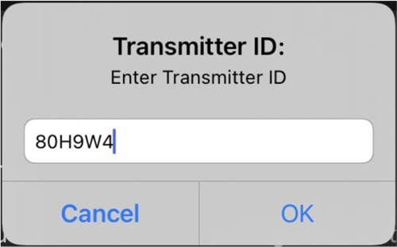

# Dex G7/ONE+/Stelo con xDrip4iOS

Una soluzione fai-da-te per visualizzare la glicemia su Apple Watch con il calendario o una complicazione.

**Il sensore deve essere stato avviato con l’app ufficiale.** Assicurati che funzioni correttamente prima di andare avanti.

## 1. Installa xDrip4iOS

L'aggiunta di xDrip4iOS sul telefonino master non comporta alcun rischio per il sensore e non impedisce il corretto funzionamento dell'app ufficiale.
Vedi come fare [qua](./installare-xdrip4ios), poi torna a questa guida.

## 2. Rimuovi i vecchi sensori Dex

Per evitare di collegarsi a un vecchio sensore (inesistente oppure oltre 10 giorni di età) è consigliato rimuovere i vecchi dispositivi dalla lista Bluetooth. Conviene prendere l'abitudine di farlo a ogni cambio sensore.

Vai nelle **Impostazioni** del tuo iPhone e scorri verso il basso fino a **Bluetooth**.

Nella lista **My Devices**, i vecchi sensori sono quelli il cui nome inizia con `DXCM`: rimuovili toccando la **i** e poi **Dissocia**:

## 3. Disabilita il Bluetooth dell'app Dex

Prima di abbinare il trasmettitore a xDrip4iOS, devi impedire all'app ufficiale Dex di occupare il collegamento Bluetooth, altrimenti xDrip4iOS non troverà mai il dispositivo.

Nelle **Impostazioni** di iOS, scorri l'elenco delle app fino a trovare quella ufficiale Dex e, nella sua pagina, disattiva l'interruttore **Bluetooth**.

> ℹ️ **Nota**: Con il Bluetooth disabilitato, l'app ufficiale non riceve le letture né gli allarmi. Potrai riabilitarlo al termine dell'abbinamento (vedi fine della sezione 4).

## 4. Abbina il trasmettitore

Accedi alla scheda **Bluetooth** dell’app xDrip4iOS e tocca il pulsante **+** per aggiungere un nuovo tipo di dispositivo.

Seleziona **CGM** e poi scegli il tuo sistema Dex (G7/ONE+/Stelo) dall'elenco.

In **Select Device Type**, seleziona **CGM** e tocca **Next**:

In **Select Transmitter Type**, scorri fino a **Dexcom G7/ONE+/Stelo** e tocca **OK**:

Ti verrà richiesto di inserire l'ID del trasmettitore (ad esempio `80H9W4`): inserisci il tuo.

Una volta inserito l'ID del trasmettitore, verrà visualizzato un messaggio che ti chiede di mantenere aperto xDrip4iOS mentre viene trovato il trasmettitore e viene stabilita una connessione Bluetooth. Lascia il tuo iPhone sul tavolo e prendi un caffè. NON giocare a Roblox, guardare Netflix o ascoltare Spotify. Metti giù il telefono senza toccarlo e restagli vicino.

L'avviso **Please Read** ricorda di tenere l'app in primo piano: tocca **OK**:

Durante la ricerca, la scheda del dispositivo mostra lo stato **Scanning**:

Quando xDrip4iOS trova il tuo trasmettitore, riceverai un messaggio che dice che è stato collegato correttamente. Tocca **OK**.

Una volta connesso, vedrai sempre il suo stato come **Scanning**, poiché comunica solo per un breve periodo di tempo ogni 5 minuti.

La scheda del dispositivo con lo stato **Scanning** e il **Transmitter ID** rilevato:

Adesso che xDrip4iOS è collegato, puoi anche riabilitare il Bluetooth dell'app Dex.

## 5. Aiuto, non lo trova!

Prima di tutto, verifica di aver disabilitato il Bluetooth dell'app Dex come spiegato nella sezione 3. Se non è disabilitato, xDrip4iOS non troverà mai il dispositivo...

Se xDrip4iOS non trova alcun dispositivo, puoi inserirlo manualmente. Generalmente non è necessario.

Vai nella lista dei dispositivi Bluetooth del tuo iPhone e cerca quello chiamato `DXCM`...

**Non provare ad abbinarlo in questa schermata**: serve solo il suo nome.

Nella lista **My Devices** delle impostazioni Bluetooth, individua il nome del sensore (nell'esempio `DXCMd4`):

In xDrip4iOS, tocca la riga **Transmitter ID** e metti lo stesso nome (attenzione alle minuscole e maiuscole!).

---

Per condividere la glicemia con altri telefoni e utilizzare smartwatch diversi da Apple Watch (Fitbit, Garmin, Samsung Gear) serve Nightscout ([`https://www.glicemiadistanza.it/nightscout/`](https://www.glicemiadistanza.it/nightscout/)) o [Gluroo](../gluroo/gluroo).

La documentazione originale (link con traduttore automatico): [`https://xdrip4ios-readthedocs-io.translate.goog/en/latest/connect/cgm/?_x_tr_sl=auto&_x_tr_tl=it`](https://xdrip4ios-readthedocs-io.translate.goog/en/latest/connect/cgm/?_x_tr_sl=auto&_x_tr_tl=it)

Lo schema delle possibilità di condivisione: dal sensore al telefono master, poi verso Clarity, Share, xDrip4iOS/xDrip e i dispositivi follower:

**L'utilizzo è soggetto all'assunzione di esclusiva responsabilità personale.**
