# Xiaomi MiBand 2, 3 e 4 con xDrip+

Questa guida spiega come visualizzare la glicemia di xDrip+ su una smartband **Xiaomi MiBand 2, 3 o 4**.

Progetto originale di Artem (GitHub: @bigdigital).

**Requisiti:** telefono Android 5 o superiore con Bluetooth 4.2 (BLE). Carica completamente la smartband prima di iniziare.

---

## 1. Installa xDrip+

Segui la [guida base di installazione](../xdrip/installare-xdrip-android). **Non proseguire fino a quando non vedi la glicemia in xDrip+.**

---

## 2. Rimuovi l'app Mi Fit (se installata)

1. Nell'app Mi Fit, **disaccoppia** la smartband.
2. Vai in **Impostazioni Android → App → Mi Fit** e disinstalla completamente (non basta rimuovere l'icona dalla schermata principale).

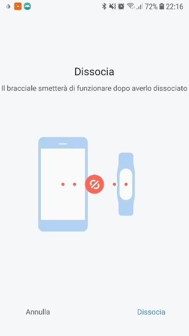

---

## 3. Installa l'app Mi Fit modificata

1. Vai su `https://www.freemyband.com/2019/08/mi-band-4-auth-key.html`

2. Scarica la versione **5.3.1** (quella testata con questa guida; puoi provare versioni più recenti a tuo rischio).
3. Se il download non parte automaticamente, tocca **Scarica**. Se non funziona, usa un'altra app come APK Installer.

4. Installa il file `.apk` autorizzando l'installazione da sorgente sconosciuta.

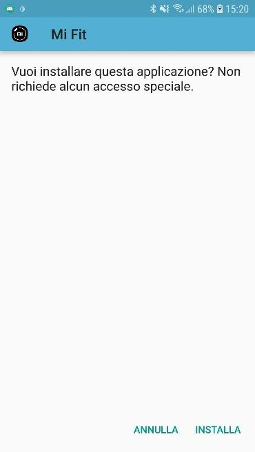

---

## 4. Ottieni la chiave di autenticazione

1. Apri l'app e crea un account con **email e password** (non usare Google).
2. Abbina la smartband e abilita **Visibilità** (modalità rilevabile) se disponibile. Se non trovi l'opzione, prosegui comunque.

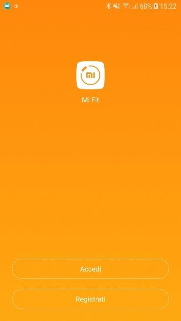

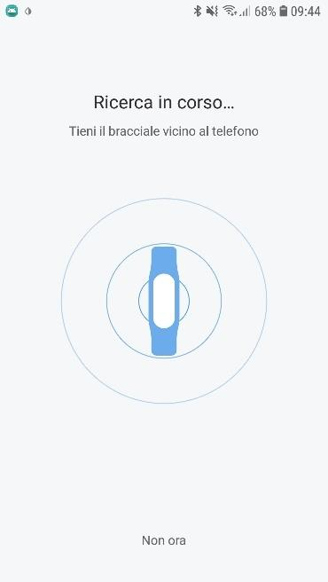

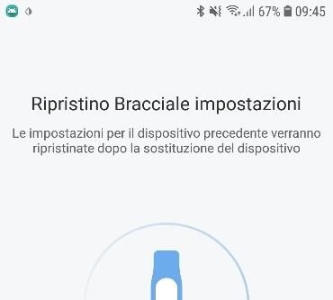

L'app modificata crea automaticamente un file di testo con le credenziali. Trovalo nella **memoria interna** o sulla **scheda SD**, nella cartella `freemyband`.

> ⚠️ **Attenzione**: Se il file non esiste, xDrip+ non riuscirà a comunicare con la smartband. Se disaccoppi o reimposti la smartband, cancella il vecchio file e rigenera le credenziali con l'app modificata.

---

## 5. Configura xDrip+ per MiBand

1. Vai in **Menu → Caratteristiche → Smartwatch → MiBand**.

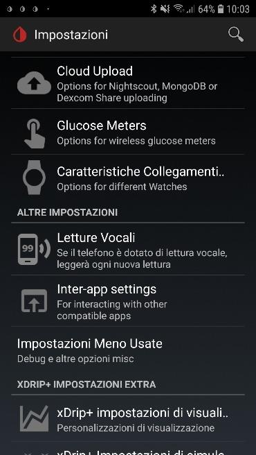

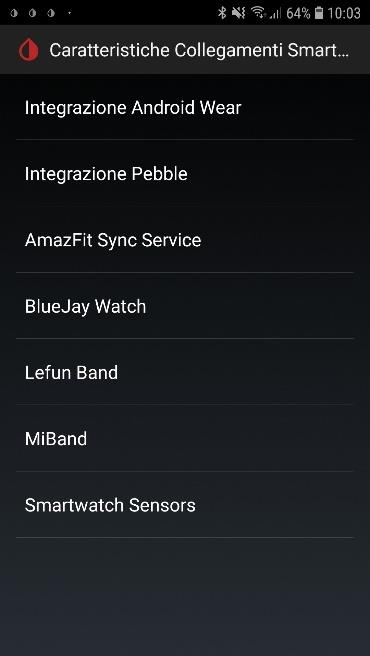

2. Autorizza l'accesso a file, geolocalizzazione e posizione.

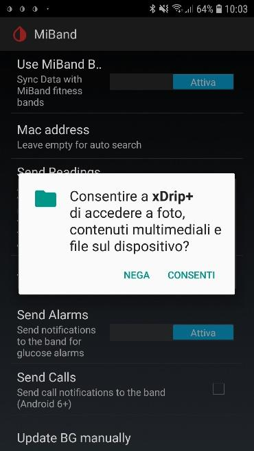

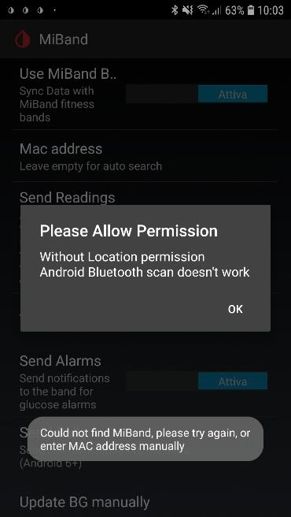

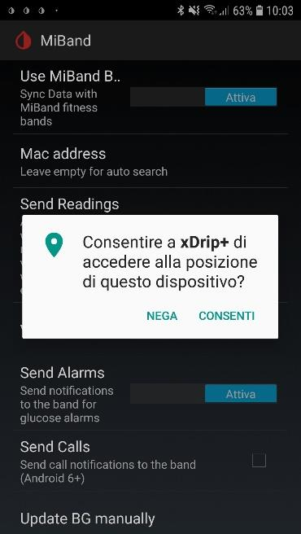

3. **Nell'ordine**, disabilita: ❶ **Letture glicemie** → ❷ **Invia letture** → ❸ **Usa MiBand**.
4. Abilita solo **Usa MiBand**.

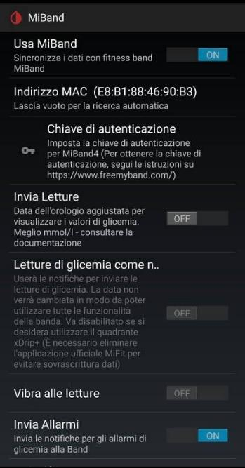

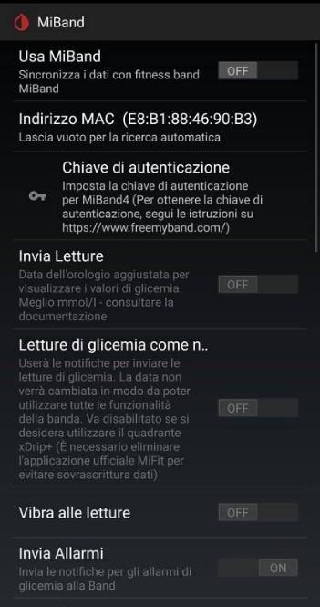

**Se l'indirizzo MAC non compare automaticamente:**
1. Apri il file nella cartella `freemyband` (si apre anche con Chrome).
2. Copia l'**indirizzo MAC** nel campo **Mac Address**.
3. Copia la **chiave di autenticazione** nel campo **Auth Key**.

Osserva lo stato in fondo alla schermata: prima comparirà "Smartband rilevata", poi "Smartband autenticata".

**Se compare "Errore di autenticazione":** torna al passo 3 e rigenera la chiave.

**Se il quadrante non appare (sequenza di ripristino):**

> ℹ️ **Nota**: Le MiBand 4 richiedono che la batteria sia sopra il 10% per mostrare il quadrante personalizzato.

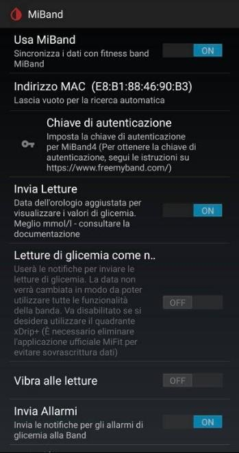

1. Disabilita MiBand in xDrip+.

2. Apri Mi Fit e scorri verso il basso per forzare la sincronizzazione.

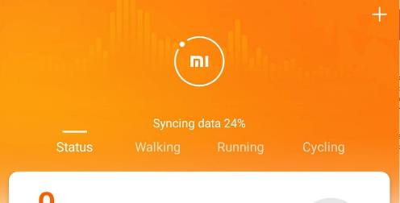

3. Riabilita MiBand in xDrip+.

4. Forza l'invio di una lettura alla smartband dal menù.

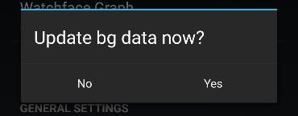

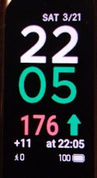

Se ancora non funziona, abilita **Disable high MTU** nelle impostazioni MiBand.

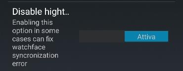

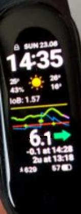

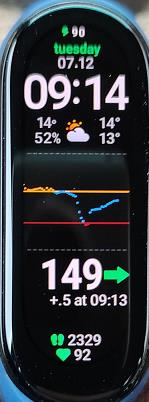

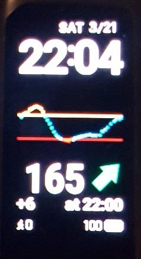

Con **Invia Allarmi** attivo, quando scatta un allarme xDrip+ riceverai una "chiamata" sulla smartband: il numero del chiamante corrisponde al valore della glicemia.

> ℹ️ **Nota**: Se hai problemi con le notifiche delle altre app, installa **Notify for Mi Band** dal Play Store e concedi le autorizzazioni richieste.

---

## 6. Reinstalla Mi Fit ufficiale (opzionale)

Installa Mi Fit dal Play Store e accedi con **le stesse credenziali** dell'app modificata. Abbina nuovamente la smartband e abilita la visibilità se disponibile.

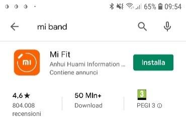

Se l'app ufficiale dà problemi, torna a quella modificata: ha le stesse funzionalità (notifiche SMS, WhatsApp, email, ecc.).
