# Xiaomi MiBand 2, 3 e 4 con xDrip

Questa guida spiega come visualizzare la glicemia di xDrip su una smartband **Xiaomi MiBand 2, 3 o 4**.

Progetto originale di Artem (GitHub: @bigdigital).

**Requisiti:** telefono Android 5 o superiore con Bluetooth 4.2 (BLE). Carica completamente la smartband prima di iniziare.

---

## 1. Installa xDrip

Segui la [guida base di installazione](../xdrip/installare-xdrip-android). **Non proseguire fino a quando non vedi la glicemia in xDrip.**

---

## 2. Rimuovi l'app Mi Fit (se installata)

1. Nell'app Mi Fit, **disaccoppia** la smartband.
2. Vai in **Impostazioni Android → App → Mi Fit** e disinstalla completamente (non basta rimuovere l'icona dalla schermata principale).

Nella scheda **Stato** di Mi Fit vedi il riepilogo del dispositivo abbinato:

Nella scheda **Profilo**, apri le impostazioni della Mi Smart Band 4:

Scorri fino in fondo alla pagina del dispositivo, dove trovi la voce **Dissocia**:

Conferma la disassociazione:

Da questo momento la smartband risulta libera e pronta per essere abbinata di nuovo:

---

## 3. Installa l'app Mi Fit modificata

1. Vai su [`https://www.freemyband.com/2019/08/mi-band-4-auth-key.html`](https://www.freemyband.com/2019/08/mi-band-4-auth-key.html)

La pagina propone il download della versione modificata di Mi Fit:

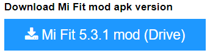

2. Scarica la versione **5.3.1** (quella testata con questa guida; puoi provare versioni più recenti a tuo rischio).
3. Se il download non parte automaticamente, tocca **Scarica**. Se non funziona, usa un'altra app come APK Installer.

Il browser mostra l'anteprima del file `.apk` da scaricare:

Le icone delle app disponibili per aprire il link (browser, Drive, ecc.):

4. Installa il file `.apk` autorizzando l'installazione da sorgente sconosciuta.

Conferma l'installazione di Mi Fit quando richiesto:

Al termine, l'app risulta installata:

---

## 4. Ottieni la chiave di autenticazione

1. Apri l'app e crea un account con **email e password** (non usare Google).
2. Abbina la smartband e abilita **Visibilità** (modalità rilevabile) se disponibile. Se non trovi l'opzione, prosegui comunque.

All'avvio ti viene chiesto di accedere o registrarti:

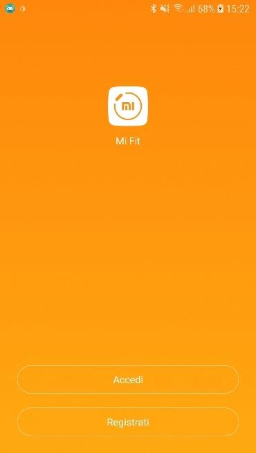

Nella schermata **Stato**, tocca per associare un nuovo dispositivo:

Scegli il tipo di dispositivo da associare, **Bracciale**:

Se il sistema chiede l'autorizzazione per procedere con l'associazione, concedila:

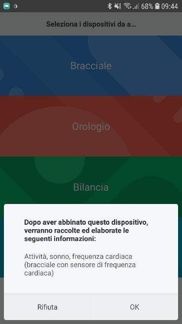

Se la smartband era già stata associata in precedenza, l'app propone di ripristinarne le impostazioni:

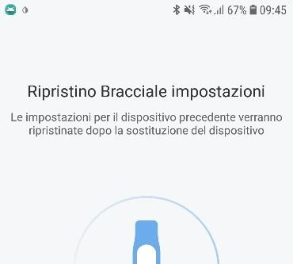

Tieni la smartband vicino al telefono mentre l'app la cerca:

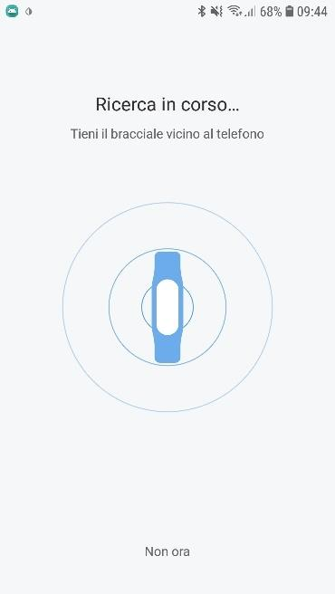

Sul display della smartband conferma l'abbinamento:

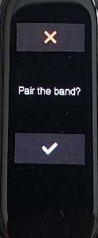

Torna nell'app e scorri le impostazioni del dispositivo appena associato:

Se richiesto, concedi l'autorizzazione per la modalità **Visibile**:

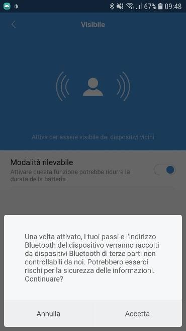

Attiva l'opzione **Visibile**:

L'app modificata crea automaticamente un file di testo con le credenziali. Trovalo nella **memoria interna** o sulla **scheda SD**, nella cartella `freemyband`.

Apri il gestore file e vai nella sezione **Archivio**:

Entra nella **memoria interna**, dove trovi la cartella `freemyband`:

Dentro la cartella trovi il file di testo con MAC e chiave di autenticazione (es. `mibandFFBBCC9CDE00.txt`):

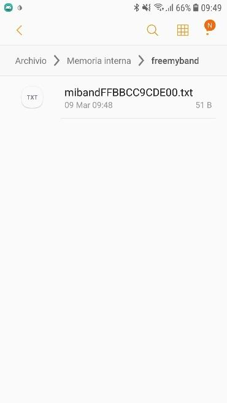

> ⚠️ **Attenzione**: Se il file non esiste, xDrip non riuscirà a comunicare con la smartband. Se disaccoppi o reimposti la smartband, cancella il vecchio file e rigenera le credenziali con l'app modificata.

---

## 5. Configura xDrip per MiBand

1. Vai in **Menu → Caratteristiche → Smartwatch → MiBand**.

Apri il menu principale di xDrip e scorri fino a **Caratteristiche**:

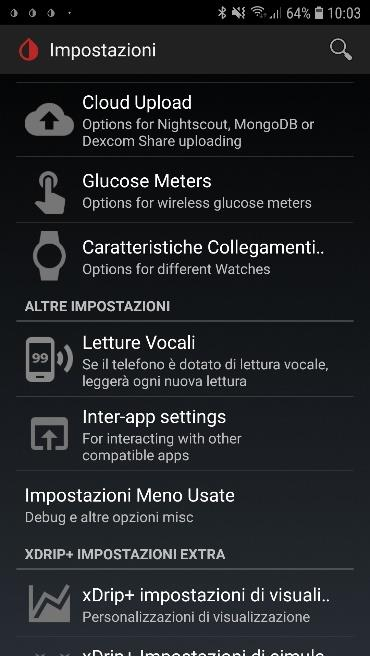

Tra i dispositivi collegabili trovi la voce **MiBand**:

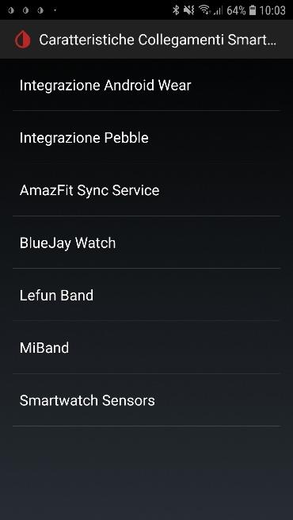

2. Autorizza l'accesso a file, geolocalizzazione e posizione.

All'apertura, xDrip chiede l'autorizzazione per accedere ai file:

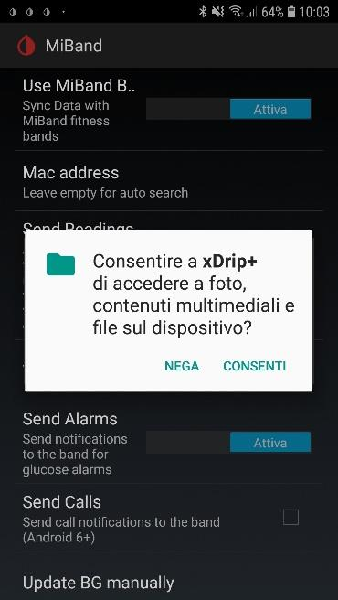

Concedi anche l'autorizzazione per la posizione, necessaria per il Bluetooth:

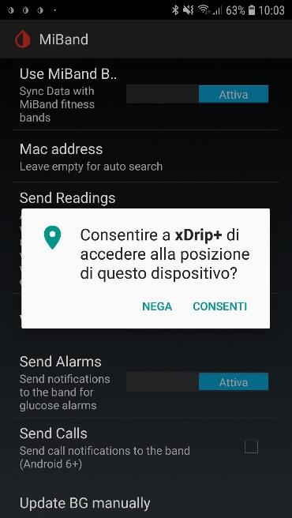

Se un'autorizzazione viene negata, comparirà un avviso e xDrip non troverà la MiBand:

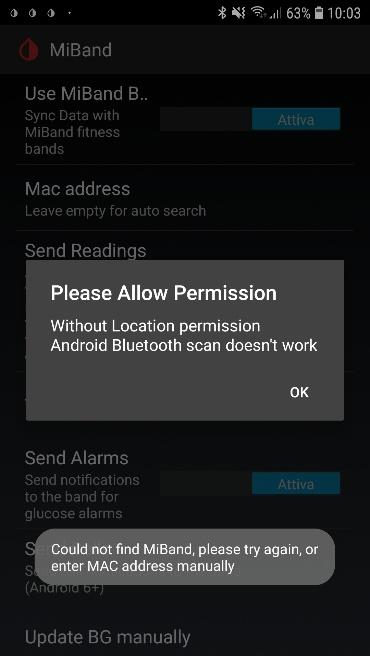

3. **Nell'ordine**, disabilita: ❶ **Letture glicemie** → ❷ **Invia letture** → ❸ **Usa MiBand**.
4. Abilita solo **Usa MiBand**.

Disattiva temporaneamente tutte le opzioni, compresa **Usa MiBand**:

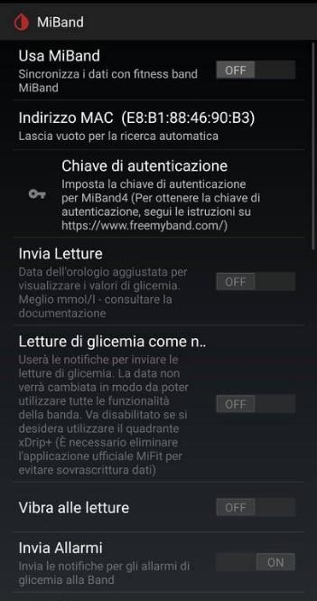

Poi riattiva solo **Usa MiBand**, lasciando le altre opzioni spente:

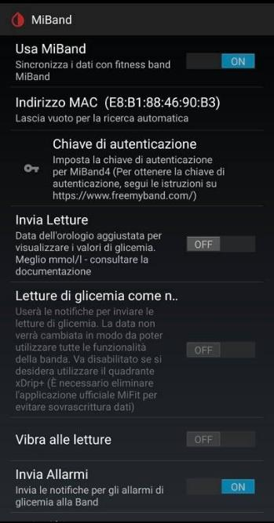

**Se l'indirizzo MAC non compare automaticamente:**
1. Apri il file nella cartella `freemyband` (si apre anche con Chrome).
2. Copia l'**indirizzo MAC** nel campo **Mac Address**.
3. Copia la **chiave di autenticazione** nel campo **Auth Key**.

Il file si apre nel browser mostrando MAC e chiave concatenati:

Incolla i due valori nei campi **Indirizzo MAC** e **Chiave di autenticazione**:

Osserva lo stato in fondo alla schermata: prima comparirà "Smartband rilevata", poi "Smartband autenticata".

xDrip avvisa che sta cercando la smartband nelle vicinanze:

Poco dopo conferma di averla trovata, con il relativo indirizzo MAC:

Infine conferma che l'autenticazione è riuscita:

Se invece la chiave non è corretta, compare un avviso di autenticazione fallita:

**Se compare "Errore di autenticazione":** torna al passo 4 e rigenera la chiave.

Ricontrolla i campi **Indirizzo MAC** e **Chiave di autenticazione** e reinseriscili:

**Se il quadrante non appare (sequenza di ripristino):**

> ℹ️ **Nota**: Le MiBand 4 richiedono che la batteria sia sopra il 10% per mostrare il quadrante personalizzato.

Verifica che la configurazione di MiBand in xDrip corrisponda a questa (Usa MiBand e Invia Letture attivi):

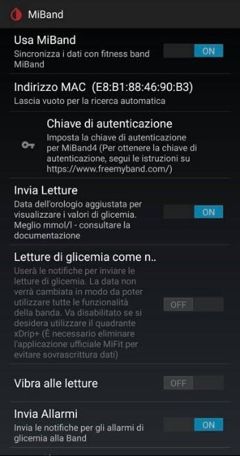

Nelle **Opzioni grafico**, controlla lo stato della casella **Abilita grafico**:

1. Disabilita MiBand in xDrip.

2. Apri Mi Fit e scorri verso il basso per forzare la sincronizzazione.

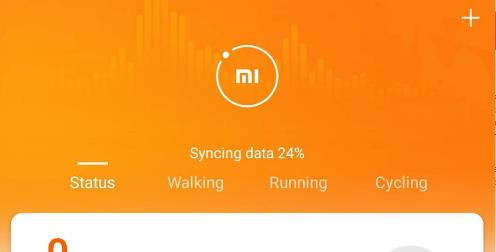

3. Riabilita MiBand in xDrip.

4. Forza l'invio di una lettura alla smartband dal menù, toccando **Aggiorna la glicemia manualmente**:

Conferma quando richiesto:

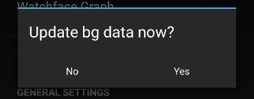

Se il quadrante non si aggiorna subito, ripeti il tocco su **Aggiorna la glicemia manualmente**:

Attendi la conferma che la sincronizzazione è andata a buon fine:

A questo punto la glicemia dovrebbe comparire sul quadrante della smartband:

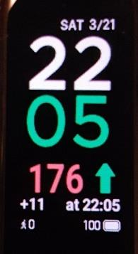

Se ancora non funziona, abilita **Disable high MTU** nelle impostazioni MiBand:

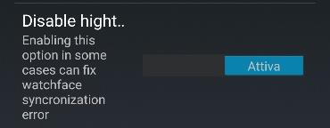

Assicurati anche che **Abilita grafico** risulti spuntata:

Alcuni esempi di quadrante funzionante, con andamento e trend della glicemia:

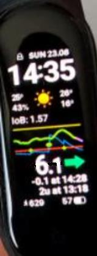

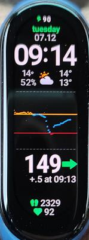

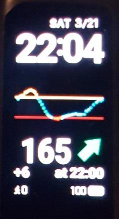

Con **Invia Allarmi** attivo, quando scatta un allarme xDrip riceverai una "chiamata" sulla smartband: il numero del chiamante corrisponde al valore della glicemia.

> ℹ️ **Nota**: Se hai problemi con le notifiche delle altre app, installa **Notify for Mi Band** dal Play Store e concedi le autorizzazioni richieste.

---

## 6. Reinstalla Mi Fit ufficiale (opzionale)

Installa Mi Fit dal Play Store e accedi con **le stesse credenziali** dell'app modificata. Abbina nuovamente la smartband e abilita la visibilità se disponibile.

Installa **Mi Fit** dal Play Store:

Apri l'app appena installata e accedi con lo stesso account usato in precedenza:

Nella schermata **Stato**, tocca per associare di nuovo la smartband:

Scegli **Bracciale** come tipo di dispositivo:

Se richiesto, concedi l'autorizzazione per procedere:

Essendo la smartband già configurata in precedenza, l'app propone di ripristinarne le impostazioni:

Tieni la smartband vicino al telefono durante la ricerca:

Conferma l'abbinamento sul display della smartband:

Rivedi le impostazioni del dispositivo ora gestito dall'app ufficiale:

Se richiesto, concedi di nuovo l'autorizzazione per la modalità **Visibile**:

E riattivala:

Se l'app ufficiale dà problemi, torna a quella modificata: ha le stesse funzionalità (notifiche SMS, WhatsApp, email, ecc.).
