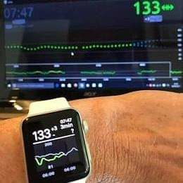

#Diabete, glicemia a distanza e nuove tecnologie

  
    

    WeAreNotWaiting
       
    

        
    Gruppo Facebook:  Diabete, glicemia a distanza e nuove tecnologie

  

[Diabete, glicemia a distanza e nuove tecnologie](https://www.facebook.com/groups/nightscout/) nasce come gruppo Facebook nell’Agosto 2017 con lo scopo di informare ed assistere le persone affette da diabete tipo 1 sulle nuove tecnologie a disposizione. In questi anni abbiamo steso e aggiornato numerose guide utili alla visione a distanza delle glicemie con i sensori attualmente in commercio in Italia, totalmente in maniera gratuita grazie al principio che ci lega da sempre, cioè quello nato dalla [Nightscout Foundation](https://www.nightscoutfoundation.org/): WeAreNotWaiting.

**L’utilizzo è soggetto all’assunzione di esclusiva responsabilità personale.**
