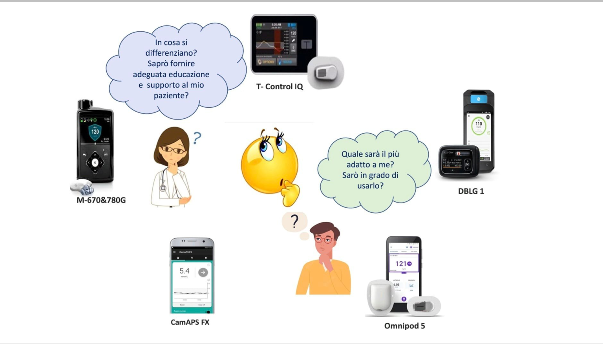
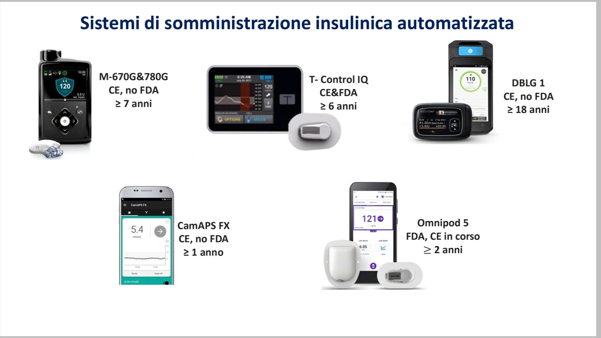
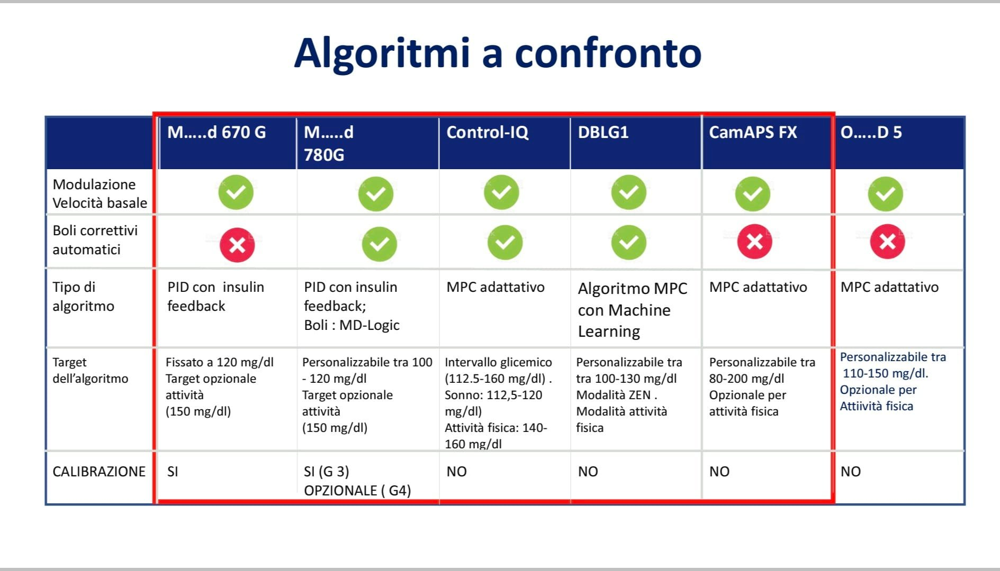
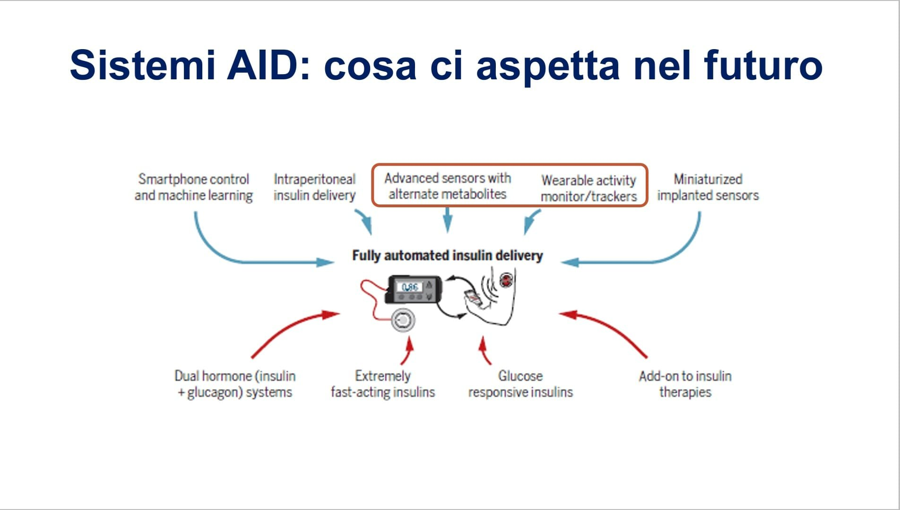

# **La scelta del microinfusore**

Un tema ricorrente, sempre più presente nei post del gruppo, è la scelta del microinfusore ⛽.

Capisco l’interesse e la richiesta di informazioni, soprattutto da parte di chi è entrato da poco in questo mondo. La mia intenzione non è certo quella di impedire queste domande, ma di far capire che si tratta di una scelta molto complessa e soggettiva, che deve tenere conto di tante variabili. Non si può “tifare” per un modello solo perché lo si usa.

Personalmente non credo che qualcuno nel gruppo possa davvero aiutare nella decisione, per diversi motivi: il tipo, le funzionalità e le caratteristiche dei microinfusori sono molto diverse tra loro.

Spesso si chiedono informazioni a chi ha usato proprio quel modello, oppure a chi ne ha provati due per fare un confronto. Ma le risposte arrivano magari da chi ha avuto il modello precedente, oppure da chi ha provato un solo microinfusore con cui si trova bene e che non cambierebbe mai.

Ancora meno senso ha chiedere in gruppi specifici come “Tandem t:slim X2 utenti” o “Medtronic 780G”, perché inevitabilmente vincerà la maggioranza.

## **La comodità è soggettiva**

La comodità è molto personale, così come la preferenza e l’accettazione del dispositivo. Ci sono persone che non accettano il catetere e preferiscono una patch pump nonostante le sue limitazioni. Le abitudini di vita influenzano spesso anche le nostre decisioni quotidiane.

Ho visto risultati migliori in persone in terapia multi-iniettiva rispetto a qualcuno con un sistema automatico. Non basta indossare un sistema di infusione dell’insulina: bisogna imparare a usarlo bene, insieme al sistema di monitoraggio della glicemia.

E anche qui si apre un mondo, perché spesso la scelta del microinfusore è vincolata dal tipo di sensore.

## **Il ruolo del paziente e del medico**

La parte seguente è già stata riportata in un altro post, ma è ancora valida: [https://www.glicemiadistanza.it/levoluzione-della-terapia-insulinica-con-microinfusore/](https://www.glicemiadistanza.it/levoluzione-della-terapia-insulinica-con-microinfusore/?utm_source=copilot.com)

Come ribadito anche dalla posizione dell’ADA, il componente più importante del sistema resta il paziente: la tecnologia scelta deve essere appropriata per la persona che si ha di fronte.

La scelta del microinfusore più evoluto non è garanzia di successo, a meno che non si realizzi la corretta integrazione non solo sensore–microinfusore, ma anche sistema–paziente.

E perché questo accada, il medico ha un ruolo chiave nell’educazione, nel training e nel monitoraggio. La parte educativa diventa cruciale per il successo terapeutico. Anche il follow‑up è fondamentale per capire se il sistema stia facendo bene il suo lavoro e se il paziente lo utilizzi secondo protocollo.

## **Sistemi ibridi: aspettative e realtà**

Abbiamo ancora un sistema “ibrido”, in cui l’intervento umano è fondamentale. Molti pazienti, e perfino tanti medici, potrebbero avere un concetto di pancreas artificiale che ancora non è realtà.

Un sistema ad ansa totalmente chiusa non c’è ancora: non esiste qualcosa che possa garantire un TIR prossimo al 100% con ipoglicemie totalmente assenti.

L’accettazione da parte del paziente di una soluzione comunque “protesica” per una patologia altrimenti invisibile, l’impegno richiesto per il cambio del set d’infusione (di solito ogni tre giorni), per l’applicazione e, laddove richiesto, per la calibrazione del sensore, per la conta dei carboidrati e per la risposta rapida ai numerosi allarmi del microinfusore, sono tutte potenziali cause di abbandono della terapia.

Bisogna quindi affrontare preventivamente tutte queste criticità, per far comprendere che solo una buona gestione della tecnologia può portare ai risultati attesi.

## **Prima di scegliere**

Parla con il tuo medico e, prima di fare una scelta definitiva, valuta un periodo di prova: solitamente i centri propongono due mesi per decidere.

Le foto sono estratte dal documento: **“Dall’automonitoraggio ai sistemi ibridi” – Daniela Bruttomesso, Azienda Ospedale Università di Padova**

